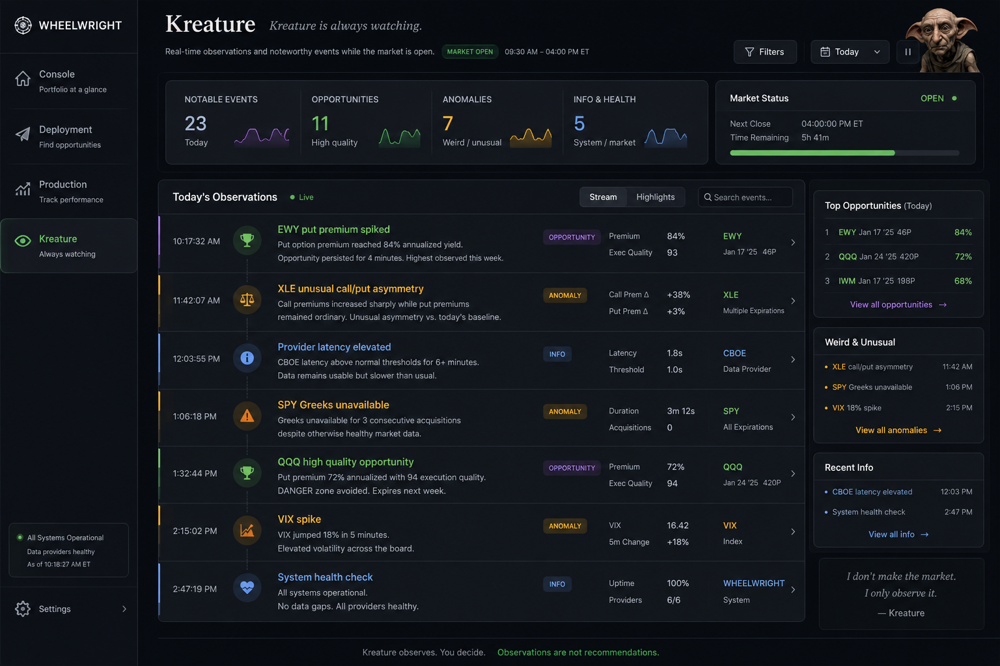

# Options Prototype — Project Journal

## Purpose

This is an append-only project journal.

It exists to preserve context that may otherwise be lost across ChatGPT threads, Kiro sessions, screenshots, implementation reports, and informal conversations.

This is not a formal specification.
This is not an ADR log.
This is not polished documentation.

It is a raw chronological memory layer for reconstructing the "why" of the project.

Use this when:
- A chat thread loses context.
- A future session needs to recover project intent.
- The team needs to understand why a decision was made.
- The repository no longer explains the learning path clearly enough.
- The project needs to resume after time away.

Append new entries at the bottom.

---

## Journal Rules

1. Append only.
2. Do not over-edit older entries.
3. Prefer raw useful context over polished prose.
4. Capture why-state, not just what-state.
5. Include implementation milestones only when they changed understanding.
6. Do not duplicate formal specs unless the context matters.
7. Screenshots may be referenced but do not need to be embedded.
8. This file is read only when rebuilding context.

---

## Entry Template

```markdown
## YYYY-MM-DD — Short Title

### Context

### What happened

### What we learned

### Decisions / implications

### Open questions
```

---

## 2026-07-03 — Bootstrap, Methodology, and First Observable System

### Context

Options Prototype began as the first working slice of a larger options-income control-system idea that emerged from a Crazy Investing discussion.

The original financial idea was not "build an options screener." It was the question of whether an options income strategy could be understood as a closed-loop financial control system.

Core conceptual background:

- Options premium as production output.
- ETF capital as productive capacity.
- Assignment as a state transition, not failure.
- Delta as a control variable / actuator.
- Covered calls and cash-secured puts as mechanisms for moving between cash and ETF ownership.
- The eventual system may observe portfolio state, compare it to a desired equilibrium, and recommend delta adjustments.

Slice 1 was deliberately narrowed to an options-chain module.

Purpose of Slice 1:

- Observe an options chain.
- Filter contracts.
- Calculate income metrics.
- Highlight contracts near target delta.
- Avoid brokerage integration.
- Avoid automation.
- Avoid prediction.

### What happened

The project was renamed from the broader "Crazy Investing" framing to **Options Prototype**.

We chose to begin with:

- React
- TypeScript
- Mock data
- No backend
- No Java
- No Docker
- No Postgres
- No brokerage connection

This was intentional. The first slice should produce working observable software, not infrastructure complexity.

A clean MacBook Air environment was bootstrapped. Important environment friction from the earlier GIA prototype was avoided by explicitly installing and verifying:

- Xcode Command Line Tools / Git
- Homebrew
- nvm
- Node LTS
- npm

A GitHub repo was created:

- `options-prototype`

The repository started with specifications and project knowledge before meaningful implementation code.

Created documentation structure:

```text
docs/
  00-project-charter.md
  01-environment.md
  02-domain.md
  03-requirements.md
  04-architecture.md
  05-design.md
  05a-component-map.md
  06-tasks.md
  development-machine.md
  foundations/
    closed-loop-engineering.md
```

Also created a root `README.md` after realizing the repo needed a public interface and clean-laptop bootstrap instructions.

### What we learned

#### 1. Kiro is useful, but we are using it inside a larger methodology

Kiro's native model appears to be:

```text
requirements.md
↓
design.md
↓
tasks.md
↓
implementation
```

That is useful for implementation-ready features.

This project started earlier than that.

We began with:

```text
Question
↓
Hypothesis
↓
Conversation
↓
Mental model
↓
Specification
↓
Architecture
↓
Implementation
↓
Evidence
```

This means we are shifting left relative to Kiro's default workflow.

That is acceptable.

Kiro is not the whole methodology. Kiro is one component inside a larger learning loop.

#### 2. Working software is the mechanism of learning

A key thesis emerged:

> AI accelerates organizational learning by reducing the cost of building working experiments that generate evidence.

Working software is not merely the end product.

Working software is the instrument that closes the learning loop.

This was true in GIA and is being made explicit here.

#### 3. Observable working software matters more than hidden implementation

We realized that several implementation tasks could produce no browser-visible changes.

That is risky because it lengthens the observation cycle.

New principle:

> Optimize for observation cadence, not merely implementation cadence.

This led to the idea of inserting an Engineering Console before the full end-user UI.

#### 4. The Engineering Console is not debug UI

Inspired by the GIA prototype, we inserted a T-04a task to replace the default Vite screen with an internal observability surface.

The console shows:

- Implementation status
- Domain module inventory
- Calculation probes
- Raw sample domain object JSON

This is not final product UI.

It is an observability surface.

It lets the running system participate in the learning loop before end-user features are ready.

#### 5. Domains are not yet known

Unlike GIA, this project does not begin with well-developed BRDs, business capability maps, or a master architecture.

The domain structure is still tentative.

Current files like `types.ts`, `calculations.ts`, and future `policy.ts` are modules, not necessarily domains.

We should avoid naming durable domains too early.

Potential future domains may emerge through implementation evidence.

The console may become a place where those emerging domains become visible.

#### 6. The repository is becoming institutional memory

The repository now holds:

- Specs
- Environment contract
- Architecture
- Design
- Tasks
- README
- Engineering philosophy
- Running code
- Test evidence
- Journal

This is more than source control.

It is a record of learning.

### Decisions / implications

- Keep Kiro constrained during implementation tasks.
- Allow Kiro to participate in bounded design-review checkpoints, as in GIA.
- Do not let Kiro silently change domain, architecture, or design.
- Insert observable UI / console slices when too many invisible implementation tasks accumulate.
- Use small commits at meaningful boundaries.
- Maintain root README as the operational/public entry point.
- Maintain this journal as raw append-only context recovery.
- Treat `docs/foundations/` as durable project philosophy.
- Treat `docs/journal/` as chronological project memory.

### Implementation state at this entry

Accepted or effectively completed:

- T-01 Project scaffold
- T-02 Vitest configuration
- T-03 Domain types
- T-04 Calculation library
- T-04a Engineering Console Bootstrap

Visible app state:

- Browser shows Engineering Console.
- Calculation probes are live and call domain calculation functions.
- Sample `OptionContract` JSON is visible.
- Default Vite screen is gone.

Test state:

- TypeScript compile passes.
- Build passes.
- Tests pass.
- At T-04a report: 2 test files, 31 tests passing.

### Open questions

- Should the Engineering Console remain permanent? Current instinct: yes.
- Should the console be renamed "Observatory" later?
- When should Kiro be invited into bounded design review?
- At what point do modules become domains?
- Should screenshots be stored in repo or outside repo?
- Should `docs/README.md` remain, since root `README.md` now exists?
- Should task plan be updated to formally include observation-cadence rules and Engineering Console milestones?

---

## Entry: Reasoning Subsystem Checkpoint — Observations for Future Reference

**Date:** 2025-07-03

**Context:** Learning Checkpoint after completing the reasoning subsystem (types, calculations, policy, delta matching, Decision Narrative). Three foundational principles were promoted to `docs/foundations/closed-loop-engineering.md`. Two observations are preserved here for future review.

---

### Observation 1: Reasoning Artifacts vs. Implementation State

The Engineering Laboratory currently exposes two kinds of information:

- **Implementation state** — which modules exist, what their status is, what the active policy configuration is.
- **Reasoning artifacts** — why the system reached a specific conclusion (the Decision Narrative).

These are conceptually distinct but we don't yet have enough evidence to determine whether they should be architecturally separated. Only one reasoning artifact exists (the Decision Narrative). When additional reasoning surfaces emerge (e.g., provider mapping explanations, yield comparison rationale, multi-criteria screening explanations), we'll have enough data to assess whether this distinction warrants structural separation or merely vocabulary distinction.

**Status:** Continue observing. Revisit after provider work introduces a second narration surface.

---

### Observation 2: Structured Decision Traces

The current Decision Narrative works by re-deriving the decision at the UI layer (scanning contracts, computing distances, detecting ties). This is correct and sufficient for Slice 1.

Clear transition signals have been identified for when structured `DeltaDecision` objects should replace UI-layer derivation:

1. Narrative inaccuracy (the narrative and the engine disagree)
2. Non-reconstructable reasoning (the engine's logic outgrows what external observation can replicate)
3. Multiple consumers (two or more components independently derive the same decision metadata)
4. Richer traces needed (decision history across sweeps, statistical views of policy involvement)

**Likely trigger:** Screening policy expansion (multi-criteria filtering) that makes the engine's logic non-reconstructable from outside.

**Status:** Preserved for future reference. Do not implement until a triggering signal fires.

---

### Implementation state at this entry

Completed:
- T-01 through T-04 (scaffold, tests, types, calculations)
- T-06 Policy engine + tests
- T-08 Delta matching + tests
- T-10 MarketDataProvider interface
- T-04a Engineering Laboratory (Interactive Delta Probe + Decision Narrative + Tie-Breaker selector)

Domain subsystem: fully implemented and observable.
Provider subsystem: interface defined, mock implementation pending.

Test state: 4 files, 59 tests passing. TypeScript compiles. Build succeeds.

Browser state: Engineering Laboratory with interactive delta probe, scenario selector, tie-breaker control, decision narrative, metrics panel. Three engineering fixtures (Normal Market, Tie Scenario, Deep OTM).

---

## Entry: Massive API Provider Spike — Feasibility Result

**Date:** 2025-07-03 (evening)

**Context:** Bounded Sunday-night spike to validate whether the Massive (formerly Polygon.io) options chain snapshot API can supply real data through our canonical domain types.

---

### Result: Technically viable, commercially gated

**What worked:**
- API key correctly read from `VITE_MASSIVE_API_KEY`
- Browser successfully makes CORS request to `api.polygon.io` (no CORS block)
- Massive returns structured JSON (not a network error or CORS rejection)
- Authentication with API key in query parameter works as documented

**What failed:**
- HTTP 403: "You are not entitled to this data. Please upgrade your plan."
- The options chain snapshot endpoint (`/v3/snapshot/options/{underlying}`) requires a paid Options plan
- The free tier provides only options contract *reference data* (metadata), not market data (quotes, greeks, OI)

**What this means:**
- CORS risk: **retired** (browser can reach the API)
- Authentication pattern: **validated** (key in query string works)
- Response format mapping: **validated in code** (mapping functions are written and type-checked against documented response shape)
- Actual data delivery: **blocked by plan tier**

---

### Provider classification

| Provider | Status |
|----------|--------|
| Massive (free) | Not viable — options snapshot endpoint gated |
| Massive (Starter ~$29/mo) | Viable — 15-min delayed, includes snapshot with greeks |
| Tradier (sandbox) | Pending — account approval in progress, delayed data + CORS, but no greeks in sandbox |
| Yahoo/yfinance | Viable for price data but no delta; requires Python proxy or computation |

---

### Decisions made

- Do not build more Massive integration until a paid plan is approved or Tradier becomes available
- Preserve the spike code — it is architecturally correct and will work immediately when entitlements are available
- The mock provider remains the primary data source for continued development

---

### Mapping code validated (ready for activation)

The `massiveClient.ts` mapping handles:
- `details.contract_type` → `"CALL" | "PUT"` ✓
- `details.strike_price` → `strike` ✓
- `last_quote.bid/ask` → `bid/ask` ✓
- `greeks.delta` → `delta` ✓
- `open_interest` → `openInterest` ✓
- `day.volume` → `volume` ✓
- Filters out contracts without delta or pricing ✓

When a paid plan is activated, the spike will produce working data with zero code changes.

---

### Corrections and reflections (appended same entry)

**Corrected framing:**

The key insight is not "no free provider offers options delta through a browser-accessible API."

The key insight is: **the architecture successfully isolated the uncertainty at the provider boundary.** The spike retired CORS, authentication, mapping, and browser-access uncertainties in a single experiment. The only remaining question is commercial (data entitlement), not architectural. That's evidence that the provider abstraction was correctly designed.

**Corrected confidence:**

The existing spike is *expected* to work immediately upon upgrade, with final validation occurring after the first successful paid response. We have not yet observed the paid response shape matching the documented schema — only that it's very likely based on documentation consistency.

**Engineering Observation:**

The provider spike validated the value of feasibility-first development. Rather than completing all remaining application work before attempting an external integration, the team intentionally attacked the highest remaining uncertainty. The resulting implementation retired multiple uncertainties (browser access, authentication, CORS, provider boundary) in a single experiment and reduced the remaining question to a commercial decision about data entitlement. Working software again proved to be the fastest mechanism for producing reliable architectural knowledge.

**Meta-observation:**

This project is no longer primarily about options chain visualization. The options domain is the substrate on which a repeatable engineering methodology is being discovered and validated. The practices emerging — learning checkpoints, uncertainty burndown, documentation thresholds, feasibility-first sequencing, evidence-driven architecture — are becoming portable. The software produces features; the process produces engineering practices. Both are outputs. The practices may ultimately be the more durable contribution.

---

## Entry: First Reference Fixture — XLE from Fidelity

**Date:** 2025-07-05

**Context:** The Engineering Laboratory now contains two categories of fixture data. This entry documents the introduction of the first reference fixture and the distinction between fixture types.

---

### What happened

XLE (Energy Select Sector SPDR Fund) options chain data was manually captured from Fidelity's options chain screen on 2026-07-02 at 4:10 PM ET. The raw capture is preserved in `docs/reference-data/xle-fidelity-2026-07-02.md`. The normalized fixture lives at `src/providers/mock/data/xle.json`.

This is the project's first **reference fixture** — data observed from a real brokerage screen rather than synthetically generated.

---

### Two categories of fixture

| Category | Purpose | Modifiable | Source |
|----------|---------|------------|--------|
| **Engineering Fixtures** | Exercise specific domain behaviors (ties, edge cases, extremes) | Yes — designed and redesigned freely | `src/engineering/probeData.ts` |
| **Reference Fixtures** | Validate domain model against observed market reality | No — represents an observed snapshot | `src/providers/mock/data/xle.json` + `docs/reference-data/` |

Engineering fixtures are *behavior-designed*: each one is constructed to expose a particular property of the reasoning engine.

Reference fixtures are *provenance-preserving*: they trace back to a specific observation at a specific time from a specific source. They should not be modified to improve experiments — their value comes from faithfully representing what was actually observed.

---

### Key finding: canonical domain model represented Fidelity XLE data without modification

All fields required by `OptionContract` (type, strike, bid, ask, delta, openInterest, volume) mapped directly from the Fidelity capture. No domain type changes were required. Delta precision (4 decimal places) was preserved. Wide bid/ask spreads ($1.09 on the 51.5 Jul 10 put) are structurally valid within the model.

This validates ADR-001 (Domain First) and the provider boundary abstraction.

---

### Normalization decision: zero-market rows

Four rows in the Jul 24 expiration (strikes 51.5 and 52.5, both calls and puts) had all-zero bid/ask and zero liquidity. These were excluded from the reference fixture.

Rows with all-zero bid/ask and zero liquidity may still represent listed contracts, but they are not useful for the current income-screening workflow. The reference fixture excludes them because they violate the current bid < ask invariant and would produce meaningless premium/yield calculations.

This is a provider-boundary normalization decision, not a domain limitation. The domain model could represent a zero-bid/zero-ask contract — but the screening workflow has no use for one.

---

### Observations

- XLE weekly options have significantly lower liquidity than SPY — wider spreads, lower OI, zero intraday volume on many strikes. This is realistic for sector ETFs.
- All captured contracts had zero volume (capture was after close on a quiet day). Volume = 0 is valid and preserved.
- The distinction between engineering fixtures and reference fixtures is worth preserving in project vocabulary but not yet promoted to architecture (only one reference fixture exists).

---

### Implementation state at this entry

- XLE added to MockMarketDataProvider (4 underlyings: SPY, QQQ, IWM, XLE)
- 5 expirations, 48 calls, 48 puts (4 rows excluded as zero-market)
- 118 tests passing
- TypeScript compiles
- Build succeeds

---

## Entry: Architectural Hypothesis — Layered Decision Pipeline

**Date:** 2026-07-08

**Context:** Whiteboard discussion exploring whether "underlying recommendation" is a distinct domain problem from "contract recommendation." The discussion produced significant conceptual insights that have NOT yet been validated by implementation.

**Status: Hypothesis — not committed architecture.**

---

### Key discoveries

#### 1. Evaluation is the primitive, not recommendation

The strongest abstraction discovered:

```
Candidates + Evidence + Policy → Filter → Rank → Explain
```

"Recommendation" is a consumer of evaluation. The existing Recommendation Lab already implements this pattern — it evaluates contracts against evidence and policy — but wasn't named that way until now.

#### 2. Layered uncertainty reduction

The decision process appears to be a pipeline where each stage reduces uncertainty:

```
Conviction (investor policy)
    ↓
Eligibility (what can I trade?)
    ↓
Suitability (what fits my portfolio?)
    ↓
Opportunity (what's attractive right now?)
    ↓
Contract Evaluation (which specific contract?)
```

Each layer has different evidence, different policy, different cadence, different vocabulary.

#### 3. Conviction is not data

Four sub-problems were identified in "underlying selection":
- **Eligibility** — account/capital constraints (computable)
- **Suitability** — portfolio fit (computable from holdings)
- **Opportunity** — premium attractiveness (market-driven, temporal)
- **Conviction** — willingness to own (investor-stated, not derived)

Conviction belongs to the investor as declared policy, not computed by the system.

#### 4. Shared pattern, not shared implementation

Each layer follows the same reasoning shape (filter → rank → explain) but with completely different domain knowledge. This is a shared pattern, not a case for a generic `Evaluator<T>` framework. Avoid premature abstraction.

#### 5. Radar versus microscope

Two conceptually distinct instruments:
- **Opportunity Scanner** — broad, daily cadence, produces "today's interesting things"
- **Contract Evaluation Lab** — deep, intraday cadence, produces specific contract recommendation

These operate at different timescales and different granularities.

#### 6. Consumer before producer

Engineering strategy: rather than building upstream laboratories immediately, teach the existing Contract Evaluation Lab to consume richer evidence first (portfolio constraints, existing positions). This stabilizes interfaces before expanding architecture.

---

### What this does NOT mean

- The project is NOT becoming "a generic evaluation platform"
- The domain remains: options income decision support
- The existing Recommendation Lab is NOT invalidated — it is contextualized as one stage
- No implementation changes are required today
- The layered pipeline is a mental model, not a software specification

---

### Implications for near-term work

- The Fidelity CSV parsers are now understood as evidence providers for future evaluation
- The next valuable work is connecting Fidelity evidence (positions, open options) to the Contract Evaluation Lab
- The upstream layers (scanner, eligibility) remain future work
- Architecture and domain should remain separate concepts

---

### Terminology established

| Term | Meaning |
|------|---------|
| Evaluation | Architectural reasoning pattern (candidates + evidence + policy → ranked result) |
| Recommendation | Application feature (the highlighted contract suggestion shown to the user) |
| Evidence | Facts derived from market data, portfolio state, or Fidelity exports |
| Policy | Investor-stated preferences and rules (target delta, conviction, allocation limits) |
| Conviction | Investor belief about an underlying — not market-derived |

---

### Open questions

- Should the curated ETF universe be a first-class domain concept now?
- When should conviction/watchlist become implementable?
- Is the opportunity scanner the next instrument to build after evidence integration?
- How do different cadences (monthly conviction, daily opportunity, intraday contracts) manifest architecturally?

---

## 2026-07-03 — Opportunity Lab: First Radar Instrument

### What

Built the first working slice of **Opportunity Lab** — a "radar" instrument that scans a curated ETF universe and surfaces opportunity evidence for comparative evaluation.

### Why

The existing Recommendation Lab is a microscope (one symbol, deep). The project needed a complementary instrument that answers "where should I look next?" across the curated universe.

### What it does

- Static curated universe of 15 sector ETFs (XLE, XLF, XLV, etc.)
- Sequential evaluation using existing TradierProvider (respects cache TTL, avoids rate-limit flooding)
- Derives per-symbol: price, capital/contract, nearest expiration, call/put yield at target delta
- Simple status classification: interesting / monitor / ineligible / data_missing
- Sorted by status priority then yield descending
- Click-to-drill navigates into Recommendation Lab with selected symbol

### Architecture decisions

- No parallel fetching (sequential to respect Tradier rate limits)
- Simple threshold-based classification (no composite scoring)
- Reuses provider singleton pattern — cache survives tab navigation
- Pure derivation function (`deriveOpportunityRow`) is independently testable

### Files added

- `src/opportunity/types.ts` — OpportunityRow, CURATED_UNIVERSE, OpportunityPolicy
- `src/opportunity/evaluate.ts` — evaluateSymbol (async), deriveOpportunityRow (pure), classifyOpportunity
- `src/components/OpportunityLab.tsx` — full page component
- `tests/opportunity/evaluate.test.ts` — 15 tests for derivation logic

### Open questions resolved

- "Should the curated ETF universe be a first-class domain concept now?" → Yes, as a static constant. Dynamic discovery deferred.
- "Is the opportunity scanner the next instrument to build?" → Yes, built as Opportunity Lab.

### What this is NOT

- Not a scoring engine
- Not a layered pipeline
- Not an automated scanner with notifications
- Not a watchlist or conviction editor

It is an observation instrument. It produces evidence for the human to act on.

---

## 2026-07-03 — Domain Discovery: Multiple Evaluation Axes

### Origin

The Opportunity Lab inline explanation panel was built to answer "why does this yield look like that?"

During review, we noticed the panel is actually explaining two distinct concerns:

1. **Mechanics** — why the yield exists (IV, premium, strike, DTE, annualization)
2. **Participation** — what it costs to enter the trade (capital per contract)

These are independent. A high-yield opportunity and an accessible opportunity are not the same thing.

### The emerging question

We suspect there is a third axis forming that we cannot yet name.

It answers something like:

> "Does this opportunity fit the operating model of the overlay?"

This is distinct from:
- highest yield (mechanics)
- cheapest entry (participation)
- yield per dollar (efficiency ratio)

Factors that may eventually contribute:
- Capital commitment per position
- Desired number of concurrent positions
- Diversification constraints
- Assignment cadence
- Reserve policy
- Treasury liquidity
- Dry powder

### What we considered and rejected (for now)

We initially considered calling this concept "Deployment Efficiency" — yield normalized by capital.

After further discussion, we believe that may be premature. The question is not a ratio. It appears to be an operational fit assessment — more like "does this trade work within the constraints of how I operate?" than "which trade gives the best bang for the buck?"

The options overlay may be behaving more like an operating system than a calculator.

### Architectural hypothesis

Return and operational fit appear to be independent evaluation concerns.

If this holds, the system will eventually need to distinguish:
- Opportunity mechanics (does this yield exist?)
- Participation requirements (can I afford this?)
- Operational suitability (does this fit how I deploy capital?)

We do NOT yet know the shape of the third axis.

### Decision

- Do not introduce new metrics or scores.
- Do not modify the domain model.
- Do not create a composite "deployment efficiency" ratio.
- Preserve this as an open question.
- Let working software continue to produce evidence.

### Pattern observed

This is another instance of the project's core methodology:

```
Working software → Interaction → Observation → Domain understanding → Maybe architecture
```

The explanation panel was built to make yield less opaque. It accidentally surfaced a boundary between two evaluation concerns that were previously invisible. That boundary may become architecturally significant — but we don't yet know its shape.

### Open questions

- Is operational suitability a single axis or a composite of constraints?
- Does it emerge from the investor's policy (external) or from the strategy's mechanics (internal)?
- Will comparison mode (XLK vs XLE) clarify the shape, or does it need its own instrument?
- Is "capital quantum" (the discrete unit of participation) a useful domain concept, or just a column?

---

## 2026-07-03 — Domain Discovery: Policy as Evidence-Generating

### Origin

Observed the Opportunity Lab at two different target delta settings:

- Δ = 0.10 → 7 interesting / 8 monitor, yields 3–18%, lower capital, conservative posture
- Δ = 0.50 → 15 interesting / 0 monitor, yields 30–100%, higher capital, aggressive posture

### What we expected

The dropdown to filter results.

### What actually happened

The entire opportunity landscape changed.

Not just the numbers — the *shape* of the results. Different counts, different status distributions, different capital requirements, different ETFs becoming or losing significance.

### Key insight

The target delta dropdown is not a filter. It is an experiment.

Changing policy generates a new observation of the same market. The underlying evidence (chains, strikes, premiums) did not change. The *visible opportunity surface* changed because the policy selected different contracts.

This means:

**Policy is evidence-generating.**

### Implications

1. **Opportunity Lab is not scanning ETFs.** It is scanning *ETFs under the current policy*. The instrument shows the opportunity landscape as shaped by investor policy.

2. **Some ETFs remain attractive across policy regimes.** XLK appears near the top at both Δ = 0.10 and Δ = 0.50. That is a qualitatively different kind of "interesting" than an ETF that only appears attractive under aggressive policy. This is stability across policy — a concept we don't yet have a name for.

3. **Policy sweep is a natural next experiment.** Fix the symbol, vary the delta from 0.10 to 0.50, observe the yield response curve. This is not an options chain — it is a *policy response curve*. It shows how one underlying responds to changing investor posture.

4. **The prototype may be evolving from a market analyzer to a policy laboratory.** The market becomes the fixed environment. The thing being experimented on is the operating policy itself.

### Analogy

Topographic map. The mountains don't change. The contour interval determines what the human perceives. Policy is the contour interval.

### What this means architecturally (hypothesis, not committed)

If this insight holds, the system's primary job is not "find the best ETF."

It is: "make the consequences of policy visible."

That reframes:
- The Opportunity Lab as a **policy consequence visualizer**
- The Recommendation Lab as a **single-symbol policy executor**
- Future instruments as **policy comparators** or **policy response surfaces**

### What we are NOT doing

- Not building a policy sweep UI yet.
- Not introducing "policy stability" as a metric.
- Not creating policy-comparative displays.
- Not naming the concept of "attractiveness across regimes" yet.

### Decision

Preserve this observation. Do not act on it architecturally. Let the next working slice produce further evidence of whether this framing holds.

### Pattern

```
Working software → Policy knob interaction → Surprise observation → Domain reframing
```

The software was built to show which ETFs are interesting. It accidentally revealed that *policy itself* is the thing worth studying.

This is the third time the project has followed this exact pattern:
1. CSV import → discovered parser classification as a domain concept
2. Explanation panel → discovered Mechanics vs Participation as independent axes
3. Delta dropdown → discovered policy as evidence-generating

Each time, the software produced understanding that was not in the specification.

---

## 2026-07-03 — Methodology: Three Kinds of Knowledge

### Origin

Attempted to introduce an "Objectives" layer above Operating Model in the domain hierarchy. Applied the test: "Can the layer below be mechanically derived from this layer?" The answer was no — objectives like "smooth income" and "operational resilience" influence human judgment but do not enable deterministic computation.

This exposed a general principle that the project has been applying implicitly.

### The principle

**Do not elevate rationale into architecture until it becomes computable.**

### Three kinds of knowledge in this system

| Kind | Definition | Where it belongs | Example |
|------|-----------|-----------------|---------|
| Computable | Can be mechanically derived from inputs | Architecture / domain model | deployable capital = total × (1 - reserve) |
| Declarative | User-supplied inputs the system consumes | Configuration / policy | target delta = 0.30, total capital = $50k |
| Philosophical | Explains why the system exists; influences judgment | Documentation / journals | equilibrium, stewardship, smooth income |

### The test

When a concept feels important enough to formalize, ask:

> "What computation does the system perform using this as input?"

If the answer is clear and deterministic → it may belong in the domain model.

If the answer requires human judgment to bridge the gap → it belongs in documentation, not architecture.

### Why this matters

Prematurely formalizing philosophical concepts creates:
- Types that can't justify their fields
- Abstractions that don't derive anything
- Configuration surfaces that overwhelm users with knobs that should be derived

### Retroactive validation

This principle explains several prior decisions:

| Concept | Kind | Disposition |
|---------|------|------------|
| Dry powder | Philosophical → not yet computable | Captured in journal, not built |
| Eventing | Architectural pattern | Rejected — no computation justified it |
| Conviction | Philosophical | Captured, not formalized |
| Capital Quantum | Observation → potentially computable | Captured, pending operating model |
| Objectives layer | Philosophical | Captured in journal, not elevated to architecture |
| Operating Model | Declarative + computable | Hypothesis: inputs derive policy parameters |
| Target delta | Declarative | Implemented as policy knob |
| Annualized yield | Computable | Implemented in domain model |

### Decision

Record this as a standing methodology rule. Apply it as a gate before introducing new abstractions.

### Relationship to closed-loop engineering

This is a refinement of the project's core methodology:

```
Observation → Hypothesis → Test → Maybe architecture
```

The new refinement adds a specific test at the "Maybe architecture" gate:

```
Is it computable? → Architecture
Is it declarative? → Configuration
Is it philosophical? → Documentation
```

This prevents the common failure mode of prototype projects: reifying every insight into code.

---

## 2026-07-03 — Domain Discovery: Policy Response Signatures

### Origin

Added a "Delta Sweep" chart to the Opportunity Lab expansion panel — an inline SVG line chart showing call and put yield at 9 target delta values (0.10 through 0.50) for a single ETF, computed purely from cached chain data.

### What the graph revealed immediately

1. **The curves are not linear.** There are inflection points around Δ ≈ 0.35–0.40 where yield increases disproportionately. This means the policy-yield relationship has structure — it's not simply "more delta → proportionally more premium."

2. **Calls and puts have different shapes.** The put curve often sits above the call curve, sometimes dramatically. This raises questions about skew, current market conditions, and whether this is persistent or situational.

3. **The natural next question was overlay/comparison.** Within seconds of seeing one chart, the instinct was "show me another symbol on the same axes." That's the strongest signal that the graph is working as an instrument — it creates the next question naturally.

### Emerging concept: Policy Response Signatures

Different underlyings appear to have recognizably different policy-response shapes. This suggests that an ETF may have a characteristic "signature" — not just a single yield number, but a behavioral profile across policy space.

If this holds:
- XLK might have a steep, convex signature (highly policy-sensitive)
- TLT might have a flat, shallow signature (policy-invariant)
- XLE might sit somewhere between

These aren't just different yields. They're different *behaviors*. And that's a different kind of evidence than anything the system has surfaced before.

### What changed

The Delta Sweep crossed from "experiment" to "instrument" in a single use. The graph answered questions in seconds that the table made the user work for. The separation became:

- Graph = overview (where to look, what the shape is)
- Table = microscope (why the numbers are what they are)

Same pattern as: performance chart + profiler, stock chart + trade history.

### Relationship to earlier discoveries

| Discovery | What it revealed |
|-----------|-----------------|
| Policy as evidence-generating | Changing delta changes the landscape |
| Delta sweep | The *shape* of that change is a characteristic of the underlying |
| Policy response signatures | Underlyings may be classifiable by their policy behavior |

### What we are NOT doing yet

- Not overlaying multiple symbols on one chart (next natural experiment)
- Not classifying signatures (premature)
- Not naming signature types (steep, flat, convex — observational only)
- Not building a comparison mode

### Open questions

- Do signatures persist across different market conditions (days, weeks)?
- Does IV explain the shape, or is IV itself a consequence of the same underlying structure?
- Is the put-above-call pattern universal or ETF-specific?
- Would DTE as a second sweep axis reveal a surface rather than a curve?
- Are signatures stable enough to be a useful classification dimension?

---

## 2026-07-03 — Instrument Boundaries Emerged from Capability Density

### Context

The Opportunity Lab began as a simple market scanner — a table of ETFs with price, yield, and status.

Over multiple small iterations, independent capabilities were added:

- Sortable columns
- Inline explanation panels (yield decomposition)
- Target delta dropdown (policy control)
- Delta sweep table (policy response data)
- Delta sweep chart (visual policy response)
- Sparklines (behavioral signature at a glance)
- Multi-row expansion (comparison)

None of these individually attempted to redefine the workflow. Each was a small, reversible experiment. No architectural commitments were made.

### What happened

Collectively, these capabilities changed the user's cognitive process.

The original workflow:

```
Options Chain → Recommendation Lab
```

The workflow that naturally emerged:

```
Opportunity Lab → Contract Workbench (current Recommendation Lab)
```

The user now arrives at Recommendation Lab having already:
- Selected the underlying
- Understood why it's interesting
- Observed its policy-response behavior
- Compared it against alternatives

The decision "which underlying?" is complete before leaving Opportunity Lab.

### The discovery

The important observation is NOT the workflow itself.

The discovery is that **workflow boundaries emerged organically as capability density increased**.

No one designed "Opportunity Lab should be the analysis instrument and Recommendation Lab should be the execution instrument." That separation became obvious only after enough small capabilities accumulated in one place.

### Architectural principle

**"Capabilities reveal composition."**

Rather than designing instruments top-down, small independent capabilities accumulated until natural instrument boundaries became self-evident. The system told us where the boundaries were — we didn't impose them.

This is consistent with the project's methodology: working software reveals structure; premature architecture obscures it.

### Recommendation Lab's evolving purpose

Recommendation Lab is no longer where analysis begins. The user reaches it after selection.

Its purpose is shifting from:

> "Help me analyze this underlying."

toward:

> "Help me execute this opportunity well."

Potential future execution concerns (examples, not requirements):
- Liquidity quality
- Bid/ask spread quality
- Strike neighborhood exploration
- Assignment consequences
- Rolling mechanics
- Position sizing relative to operating model

### Emerging hypothesis: reasoning across time

Policy sweeps observe how an opportunity responds to changing policy at a single point in time.

Interaction history (not yet built) would observe how the user's reasoning evolves across time.

These may eventually be different manifestations of a broader concept:

> Reasoning across dimensions (policy space, time, comparison, lifecycle)

This is speculative. Do not formalize. Capture only as a hypothesis for future observation.

### Methodology note

This entry is evidence for the "Three Kinds of Knowledge" principle recorded earlier:

- The workflow boundary is now **computable** (Opportunity Lab handles analysis, Recommendation Lab handles execution)
- The "reasoning across time" concept remains **philosophical** (no known computation)
- The operating model characteristics remain **declarative** (user-stated, not yet derived)

Each sits at the correct level. The system is not prematurely elevating philosophical ideas into architecture.

### Pattern

```
Small capabilities → Capability density → Emergent boundaries → Instrument specialization
```

This is the fourth instance of working software revealing structure:
1. CSV import → parser classification
2. Explanation panel → Mechanics vs Participation axes
3. Delta dropdown → policy as evidence-generating
4. Capability accumulation → instrument boundary discovery

---

## 2026-07-04 — Guardrail: History Refines Operation, Not Prophecy

### Context

As discussion evolves toward historical evidence, pattern recognition, and eventual machine-assisted learning, it becomes necessary to explicitly articulate a boundary that was implicit in the project charter but insufficiently nuanced for the system's current maturity.

The charter states: "Policy over prediction" and excludes "Prediction models."

That was sufficient for the early prototype. It is no longer sufficient as the system approaches questions about history, patterns, and learning.

### The boundary

The project never set out to build a better predictor of future market prices.

It set out to build a better options overlay.

Historical evidence, autonomous observation, pattern recognition, and eventual machine-assisted learning must remain subordinate to that purpose.

### The distinction

A future-prediction system asks:

- Where will this ETF trade next week?
- Will price rise or fall?
- What return will the underlying produce?

The options overlay asks:

- Should capital be deployed now?
- Which underlying fits the overlay's current operating posture?
- Which contract best expresses the current policy?
- What assignment, expiration, or liquidity consequences follow?
- Is this opportunity historically unusual?
- How have similar contracts and response signatures actually resolved?
- Would waiting preserve useful optionality?
- Did prior decisions improve the behavior of the overlay as a whole?

The project may use historical and statistical methods. Its objective is improved operation under uncertainty — not elimination of uncertainty through prediction.

### Principle

**History should refine operation, not prophecy.**

### Aligned uses of historical evidence

- Empirical assignment frequency by delta and DTE
- Quoted versus realized premium
- Fill quality and spread behavior
- Duration of capital commitment
- Policy performance across market regimes
- Recurring response-signature patterns
- Confidence and evidence-coverage indicators
- Identification of attractive-looking patterns that historically disappointed
- Evaluation of deliberate inaction or delayed deployment
- Overall overlay cadence, diversification, and resilience

### Unit of evaluation

A profitable individual contract is not automatically a good overlay decision.

A decision may produce profit while still being operationally poor if it:

- Consumes an oversized capital quantum
- Creates concentration
- Disrupts expiration cadence
- Eliminates useful dry powder
- Prevents a more suitable deployment
- Produces undesirable assignment consequences

The eventual learning system should therefore evaluate both:

1. Contract outcomes (did this specific position resolve well?)
2. Overlay-level operating outcomes (did this decision improve the system's overall behavior?)

### Guardrail for machine learning

Any future model should be justified by the overlay decision it improves.

Aligned output examples:

- "Similar configurations historically had poor realized fills despite high quoted yields."
- "This response signature has usually remained attractive for several observations, so waiting may preserve optionality."
- "At this delta and DTE, assignment frequency was materially different from the delta approximation."
- "This policy produced smoother capital turnover across prior cycles."

Misaligned output example:

- "The ETF is predicted to rise 1.7% next week."

This may be technically possible but is not inherently aligned with the project's purpose. It risks turning the system into a directional market-prediction product.

### Relationship to existing principles

| Charter principle | This refinement |
|------------------|-----------------|
| "Policy over prediction" | Clarifies: history serves policy evaluation, not price forecasting |
| "Not a trading bot" | Extends: not a prediction engine either |
| "Observability over automation" | Consistent: historical evidence is shown, not hidden behind models |
| "Three Kinds of Knowledge" | Historical pattern recognition may be computable (assignment frequency) or philosophical (regime similarity) — apply the test |

### Decision

Treat this as a standing scope and methodology guardrail. Future capabilities involving history, patterns, or learning must demonstrate alignment with overlay operation before implementation.

Do not select machine-learning methods. Do not change architecture. This is a boundary, not a plan.

---

## 2026-07-04 — Architectural Learning: Overlays, Institutional State, and Decision Behavior

### Origin

A multi-part design discussion examined whether the current Recommendation Lab still represents the correct abstraction. The discussion evolved through several successive refinements driven by the project's methodology: observe working software, then refine understanding.

### Key realizations

#### 1. The unit of evaluation is the options overlay, not the ETF.

We are not evaluating XLK. We are evaluating "a cash-secured put overlay on XLK at delta 0.40 with 2-week expiration cycles." The ETF is the substrate. The overlay is the mechanism. The policy shapes the mechanism. The institution decides whether the mechanism fits.

This explains why the same ETF can be "interesting" as a covered call and "uninteresting" as a CSP — they are different overlays on the same substrate.

#### 2. The ingress ladder remains the institutional rationale. Computable constraints derived from it may gradually become institutional state.

The ingress ladder (Cash → Treasury → Options Overlay → Additional Cash Flow → Debt Reduction → Optionality → Independence) explains *why* the overlay exists. The ladder itself is not something the software computes — but it guides the evolution of the domain model by indicating which constraints eventually become relevant.

#### 3. The next laboratory instrument should make decision behavior observable. Decision criteria should emerge from repeated observation rather than upfront design.

We initially discussed enumerating "decision criteria" for a Decision Lab. On reflection, criteria are outputs of observation, not inputs to design. The DTE ladder was never designed — it emerged from interacting with an instrument that exposed it. Likewise, future criteria (sector concentration, assignment cadence, capital allocation) should emerge from observing actual decision behavior, not from brainstorming.

#### 4. Institutional state should emerge incrementally as facts prove computationally consequential.

"Institutional state" is better than "institution model." A model implies known shape. State implies accumulating facts as they prove necessary. Each piece earns its place by being observably consequential — not theoretically important.

#### 5. Available deployable cash is the first identified piece of institutional state.

It passes the computability test:
- User-supplied (declarative)
- Computationally meaningful (gates opportunity eligibility)
- Dynamically changing (each deployment reduces available capital)
- Participates in a closed feedback loop (capital → opportunity → decision → capital)

It is the first institutional fact that is simultaneously declarative, constraining, and reactive.

#### 6. The project methodology remains unchanged: build instruments, observe behavior, discover abstractions, then evolve the domain model.

Rather than asking "What is the institution model?" the better question is "What software helps us discover the institution model?" This is consistent with every prior architectural discovery in the project.

### Meta-observation

**The architecture has not been evolving through redesign. It has been evolving through successive refinement driven by interaction with working software.**

This is a subtle but powerful distinction. The project is not replacing ideas with new ones. It is allowing the software to reveal a more accurate decomposition of the problem over time.

Every major shift fits this pattern:
- Contract selection → overlay evaluation (revealed by Opportunity Lab policy controls)
- Static yields → policy response signatures (revealed by delta sweep)
- DTE as a filter → DTE as a ladder rung (revealed by DTE dropdown interaction)
- Institution as a model → institutional state as emergent facts (revealed by this discussion)

The principle: **architecture evolves through observation, not through redesign.**

### Practical implications

| Current state | Direction |
|--------------|-----------|
| Recommendation Lab | Evolve toward contract workbench (execution quality, not selection) |
| Opportunity Lab | Continue as the primary analytical instrument |
| Decision Lab (proposed) | Do not build yet — let decision behavior become observable first |
| Institution model | Do not design — allow institutional state to emerge from use |
| Available cash | First candidate for institutional state; smallest useful experiment |
| Sample portfolio fixtures | Useful for exercising different institutional contexts without UI |

### What we are NOT doing

- Not redesigning the architecture
- Not retiring the Recommendation Lab
- Not building a Decision Lab
- Not modeling the institution
- Not enumerating decision criteria
- Not formalizing the ingress ladder as architecture

### What we ARE doing

- Preserving the understanding
- Continuing to build small, reversible instruments
- Allowing the domain model to emerge from interaction
- Applying the computability test before formalizing any concept
- Recognizing that the project is converging on overlay operations rather than market analysis

---

## 2026-07-04 — Architectural Vision: Document-Driven Scenario Replay

### Context

After discovering that the Opportunity Lab is evaluating options overlays (not ETFs) and that institutional state should emerge incrementally from use, we identified the next laboratory instrument.

### Core insight

Portfolio state should be a **projection derived from an ordered activity history**, not a manually-authored fixture.

The primary way the institution tells the software that something changed is by loading brokerage activity CSVs. Therefore, the laboratory should exercise that same ingress boundary.

### The causal chain

```
Activity Documents
        ↓
Document Classification
        ↓
Row Parsing
        ↓
Canonical Activity Events
        ↓
Derived Portfolio State
        ↓
Changed Overlay Possibilities
        ↓
New Decision Required
```

### Scenario chains

The primary engineering fixture becomes an ordered chain of cumulative activity documents. Each file contains prior history plus one new event.

```
01-bootstrap.csv        → $100k cash, no holdings
02-put-written.csv      → CSP opened, cash committed
03-put-assigned.csv     → shares acquired, cash consumed
04-call-written.csv     → covered call opened, shares committed
05-call-expired.csv     → shares released, premium retained
```

This tests transition behavior, not just final-state projection.

### Two ingestion modes (future)

- **Cumulative:** each CSV contains full history plus new entries (tests idempotent reconstruction)
- **Incremental:** each CSV contains only new activity (tests append behavior)

First slice uses cumulative only.

### Reconciliation (future)

Position documents may serve as checkpoints against activity-derived state. Disagreements are evidence, not errors.

### Architectural boundary

The same pipeline used for bundled scenarios should eventually support user-uploaded activity CSVs. Scenarios are controlled inputs exercising the production ingress path.

### What we are building first

One thin vertical slice:
- One scenario, 5 steps, one symbol (XLU)
- Hand-authored Fidelity-shaped fixtures
- Activity parser → canonical events
- State projector → portfolio state
- Simple replay page: step forward, observe state transitions
- Basic overlay implications (deployable cash, committed capital, CC/CSP feasibility)

### What we are NOT building yet

- 30 scenarios
- Reconciliation engine
- Branching timelines
- Generalized manifest schema
- Universal event model
- Full recommendation integration
- Incremental ingestion mode

### Success criterion

Working software in which the user can click through a short activity history and visibly watch documentary evidence produce events, state transitions, and new overlay possibilities.

### Relationship to methodology

This continues the pattern: build the instrument, observe behavior, discover what the second scenario needs to be. The institution model emerges from interaction, not from design.

---

## 2026-07-04 — First Observations from Scenario Replay Instrument

### Context

First interaction with the working Scenario Replay page. Single scenario (bootstrap-wheel, 5 steps, XLU). These are the observations that emerged from use.

### What the page feels like

It does not feel like a portfolio viewer. It feels like a replay instrument. The natural question is not "what is my portfolio?" but "what did this new document change?" That reframing happened immediately on first use.

### State transitions are more interesting than static state

The current portfolio state matters less than the transition itself. The natural questions:
- What changed?
- Why did it change?
- What new decisions became possible?
- Which previous decisions are no longer possible?

The instrument is shifting toward studying **state transitions** rather than static state.

### Feasibility wants explanations

The simple "Available / Unavailable" feasibility indicators are useful but immediately create a "why?" question. The interesting content is not the boolean status — it's the reason:
- "No callable shares currently exist"
- "Deployable cash below minimum contract size"
- "All shares committed to open calls"

### The next decision is more interesting than the current state

At "Put Assigned," the instinct is not to inspect holdings. It's to ask: what decision became possible? Covered call now possible. Additional CSP may not fit. Cash allocation changed. This is another instance of decision behavior becoming the object of study.

### Timeline vs. steps

The step buttons already communicate chronology. The page wants to be a temporal instrument, not a step-by-step wizard. Steps are implementation; time is the concept.

### One scenario is correct

Its purpose is not coverage. Its purpose is to teach us what the second scenario should be.

### Emerging concept: State Transition Laboratory

"Replay" describes what the page does. "State Transition" describes what we are studying. The scientific question the instrument is beginning to answer:

> How does documentary evidence change institutional state and therefore change available decisions?

### What this means

The instrument is already producing observations after one use. That validates the methodology: build the smallest thing, observe, learn. The page should not be redesigned yet. It should be used, and additional observations should emerge naturally — exactly as they did with the Opportunity Lab through sorting, expansion panels, delta sweeps, and sparklines.

### Pattern

This is the fifth instance of the core loop:
1. CSV import → parser classification
2. Explanation panel → Mechanics vs Participation
3. Delta dropdown → policy as evidence-generating
4. Capability accumulation → instrument boundaries
5. Scenario replay → state transitions as the object of study

Each time, the software revealed what to study next before anyone designed it.

---

## 2026-07-10 — Architectural Discovery: Three Projections of the Institution

### Origin

Exported real data from the Personal Treasury account (Fidelity). Three CSV files were produced: Activity History, Positions, and Balances. Examining them together revealed that they are not redundant reports — they are three distinct projections of the same institution.

### The three questions

| Document | Question it answers | Nature |
|----------|-------------------|--------|
| Activity History | Why did the institution become what it is? | Causal history |
| Positions | What does the institution currently own? | Snapshot projection |
| Balances | What is the institution currently capable of doing? | Operational capacity |

### Key discovery: Balances reveals operational cash distinctions

Fidelity already distinguishes multiple forms of cash:
- Available to Trade
- Settled Cash
- Available to Withdraw

These are not interchangeable. They affect overlay decisions differently. Our current "Available Cash" abstraction is already too coarse.

The architecture should not prematurely collapse these into one number. They should emerge as separate pieces of institutional state because the production system already models them separately.

### Architectural implication

```
Activity CSV (authoritative causal history)
        │
        ▼
Canonical Events
        │
        ▼
Institutional State Projection
        │               │
        ▼               ▼
Positions View    Balances View
        │               │
        └───────┬───────┘
                ▼
       Overlay Evaluation
```

The Activity CSV is the authoritative source. Positions and Balances are independent projections derivable from the same event history.

### Validation strategy (future)

This creates a powerful reconciliation approach:
1. Replay activity history → project holdings → compare against Positions CSV
2. Replay activity history → project balances → compare against Balances CSV

If both projections reconcile with Fidelity's exports, the complete causal chain (event interpretation + state projection) is validated. This is much stronger than testing individual parsers.

### Real account observations from the export

The Personal Treasury account reveals:
- 400 shares XLE (acquired through two separate put assignments at different strikes)
- 74.829 shares SPYI (income ETF)
- 2 open XLE puts (Jul 17 $57, Jul 24 $53)
- 4 open XLE calls (Jul 31 $55 ×2, Aug 7 $54.5 ×2)
- ~$24,390 money market (SPAXX)
- ~$33,000 pending activity (EFT received)
- Treasury belt: 20+ T-bills maturing weekly through December 2026
- Multiple operational cash states (Available to Trade $32,690 vs Settled $7,690)

This is a real overlay operation in progress — puts assigned, covered calls written against assigned shares, treasury belt providing cash flow, staggered maturities.

### Methodology note

This architecture was not invented. It emerged from examining how Fidelity itself organizes the same information. The production system already separates these three concerns. The project is converging toward the real domain structure rather than imposing an artificial one.

### What we are NOT doing

- Not building a Balances parser yet
- Not building a reconciliation engine yet
- Not collapsing the three projections into one model
- Not expanding the Scenario Replay page yet

### What this means for next steps

- The existing Scenario Replay exercises the Activity → Events → State path correctly
- Positions CSV becomes a future checkpoint/reconciliation document (as already hypothesized)
- Balances CSV introduces a new projection (operational capacity) that the system should eventually understand
- The distinction between "what you own" and "what you can do" is architecturally real and should be preserved

---

## 2026-07-10 — Discovery: Brokerage Policy Mediates Operational Capability

### Origin

Attempted to write a cash-secured put after initiating a $33,000 EFT. Account showed $32,690 Available to Trade and $33,000 pending. Inferred ~$65,000 buying power. Fidelity rejected the order:

> "The Estimated Order Value exceeds your Cash Available to Trade."

The pending deposit was explicitly excluded from satisfying the collateral requirement.

### What this reveals

Institutional cash alone does not determine capability. Brokerage policy mediates capability.

The effective progression:

```
Institutional State (what the institution possesses)
        ↓
Brokerage Rules (what the brokerage permits)
        ↓
Operational Capability (what is actually possible)
        ↓
Decision
```

### Refinement of the capability model

The concept of "available cash" is insufficient. Operational capability depends on multiple brokerage-specific states:

| Cash state | Amount | CSP-eligible? |
|-----------|--------|---------------|
| Settled cash | $7,690 | Yes |
| Available to Trade | $32,690 | Yes |
| Pending EFT (unsettled) | $33,000 | No |
| Total account cash | ~$57,390 | Partially |

The same dollar amount has different operational capability depending on its settlement status and the brokerage's collateral policy.

### Implications for the system

1. The system cannot simply project "deployable cash" from activity history alone. It must account for settlement timing and brokerage rules.

2. "Can I write this CSP?" is not answerable from cash balance alone. It requires knowing the collateral-eligible subset of cash.

3. This is another layer between institutional state and operational capability that the domain was previously treating as transparent.

4. The Balances CSV already distinguishes these states ("Available to Trade" vs "Settled Cash" vs "Available to Withdraw") — Fidelity is explicitly modeling this. Our system should eventually respect the same distinctions rather than collapsing them.

### Relationship to prior discoveries

| Discovery | What it revealed |
|-----------|-----------------|
| Three CSV projections | Positions ≠ Balances ≠ Activity |
| This observation | Even within Balances, multiple capability states exist |
| "Available Cash" as institutional state | Now known to be an oversimplification |

### Computability assessment

- **Settlement timing**: potentially computable (T+1 for equities, T+1 for options, EFT hold periods are policy-based)
- **Brokerage collateral rules**: declarative (must be stated as constraints, not derived from first principles)
- **Whether a specific order will be accepted**: only verifiable by the brokerage itself

The system can *approximate* operational capability but cannot authoritatively determine it. The brokerage is the final arbiter.

### What we are NOT doing

- Not building a settlement tracking engine
- Not modeling all Fidelity brokerage rules
- Not changing the current state projector
- Not pretending the system can replace the brokerage's own validation

### What this means

The laboratory should eventually distinguish:

1. **Projected capability** — what the system believes is possible based on its model
2. **Actual capability** — what the brokerage will actually permit

Disagreement between them is evidence (of missing rules, settlement timing, or policy gaps) — not a bug.

### Methodology note

This was discovered through attempting a real production operation, not through design analysis. The brokerage's rejection message was the evidence. Once again, interaction with production systems revealed domain structure that would have been difficult to anticipate from first principles.

---

## 2026-07-13 — Domain Discovery: Universe Management as a Bounded Context

### Origin

The project has been operating with a hand-curated list of 15 ETFs since the Opportunity Lab was built. That list was explicitly described as "good enough" at the time.

Through continued use of the Opportunity Lab, several observations made the curated list increasingly indefensible:

- XLU surfaced as an unexpectedly strong opportunity only because it happened to be included. What else was being missed?
- SPY demonstrated that excellent options markets can still be institutionally unsuitable (capital quantum).
- We repeatedly asked whether lower-priced ETFs outside the current list could offer acceptable liquidity and premium.
- The DTE ladder and delta sweep experiments revealed that ETF suitability is contextual to policy — not an inherent property.
- The discussion of API Ninjas plus Tradier arose because discovery requires fundamentally different data and cadence from contract evaluation.

The question shifted from "should we acknowledge this?" to "how small should the first computable slice be?"

### What emerged

Universe Management is a distinct bounded context containing three separable concepts:

1. **Discovery** — find candidates from the broader ETF universe (deferred — requires crawler, separate data sources, different cadence)
2. **Admission (Velvet Rope)** — evaluate candidates against an explicit, versioned policy using current market evidence
3. **Registry** — store members, their evaluation history, and the institutional decision audit

### Key domain learnings

**Admission is contextual, not inherent.**
An ETF does not "pass" or "fail" in absolute terms. It passes or fails relative to a specific policy, measured against specific evidence, at a specific point in time. This means admission decisions must capture the complete policy and evidence context to remain historically meaningful.

**Rejected ETFs are institutional memory.**
A rejected symbol is not garbage to be discarded. It is evidence: "under this policy, with this evidence, on this date, XYZ did not qualify because..." That history has value for understanding how the universe evolves and how policy changes affect the institutional boundary.

**Discovery and admission have fundamentally different cadences.**
Discovery is slow (days/weeks, crawling thousands of symbols). Admission is fast (seconds, evaluating a known registry against current market data). They should not be coupled in implementation.

**Bootstrapped ≠ admitted.**
The existing curated universe predates the Velvet Rope. "Bootstrapped" describes provenance (how a symbol entered the registry). It must not function as a permanent override of policy evaluation. Bootstrapped members should begin as unevaluated and earn their admission through the same policy evaluation as any other member.

**Provider failure ≠ rejection.**
If the system cannot reach the data provider, that is an infrastructure event — not an admission decision. Failed attempts must be recorded in the audit but must never overwrite the latest successful policy evaluation.

**Volume is unstable single-observation evidence.**
Daily option volume is strongly affected by time of day and may be zero early in the session for healthy markets. It should be recorded (observational) but not contribute to admission decisions until repeated observations demonstrate stability.

### Architectural decisions

- The first slice is **observational** — it operates in parallel with the legacy curated universe and does not yet govern Opportunity Lab
- The Velvet Rope uses the same `findClosestToDelta` contract selection logic as Opportunity Lab (no conflicting interpretation of target delta)
- The Velvet Rope's delta range is intentionally broader (0.15–0.50) because it asks "is this market viable?" not "which exact contract should I trade?"
- localStorage persistence is transitional — the domain model is storage-agnostic
- Audit records are append-only and never capped — rejected ETFs and failed attempts remain visible indefinitely
- Automated broad-universe discovery is a separate future workstream
- Cloud/multi-user persistence is a separate future workstream

### Documentation produced

- `docs/velvet-rope/00-domain-model.md` — corrected final domain model
- `docs/velvet-rope/01-requirements.md` — 21 formal requirements (VR-1 through VR-21)
- `docs/velvet-rope/02-design.md` — module structure, evaluation pipeline, persistence, page architecture

### Relationship to prior methodology

This follows the project's established pattern:

```
Instrument use → Observed limitation → Domain concept emerges → Model before implement
```

Specifically:
- Opportunity Lab's curated list was useful but produced the question "what are we missing?"
- Delta sweeps and DTE ladder experiments revealed that suitability is policy-contextual
- The Scenario Replay instrument showed that institutional state changes through evidence
- The Velvet Rope applies the same principle: the institutional universe changes through evidence (market data) evaluated against policy

### What we are NOT doing

- Not building a crawler yet
- Not cutting over Opportunity Lab yet
- Not building cloud persistence yet
- Not modeling Watch/Suspended/Revoked lifecycle yet
- Not implementing rolling averages or temporal observation patterns
- Not coupling this to the cloud/multi-user workstream

### Open questions for future observation

- Will sandbox data quality allow meaningful admission decisions, or will most criteria produce "insufficient_evidence"?
- Does the Velvet Rope effective universe actually differ from the curated list in useful ways?
- Which rejected symbols become interesting "near misses" worth watching?
- When does volume become stable enough to promote from observational to soft?
- What triggers the eventual cutover from legacy_curated to velvet_rope?

---

## 2026-07-13 — Engineering Spike: API Ninjas ETF Catalog Provider

### Why this was prioritized before Velvet Rope implementation

The Velvet Rope design assumes an ETF catalog exists. Before building admission logic that depends on catalog data, we needed to retire the integration risk: does API Ninjas actually work, what does it provide, and what does it cost?

Principle: **retire data-integration risk before building dependent automation.**

### What we learned

1. **Authentication works.** The free-tier key successfully authenticates.

2. **The free tier is severely limited for our use case.** Only single-ticker lookup is available. Premium fields (price, AUM, expense ratio, holdings) return placeholder strings instead of values.

3. **Universe enumeration and search require a paid subscription** (Business/Professional/Annual — estimated $20-50/month). These are the endpoints needed for Discovery.

4. **Critical fields are missing at any tier:** category/sector, issuer, leveraged/inverse flags, options availability, share volume. Leveraged/inverse can be inferred from names but not authoritatively.

5. **No rate-limit feedback.** Unlike Tradier, API Ninjas doesn't return rate-limit headers. Quota enforcement is opaque.

6. **CORS is permissive** (`allow-origin: *`) — browser calls work without a proxy.

7. **Response time is ~1 second** per call — full enumeration of thousands of ETFs would require significant crawl time.

### Suitability verdict

- **For Velvet Rope first slice:** Not needed. The first slice evaluates a known 16-symbol registry using Tradier market data.
- **For future Discovery Engine:** Conditionally viable. Requires paid tier. Would provide the enumeration capability but lacks options-availability data (must cross-reference with Tradier).
- **For immediate prototype use:** Minimally useful. Tradier already provides everything needed for the current workflow.

### Decision

Proceed with Velvet Rope implementation using Tradier as the sole data source. API Ninjas subscription upgrade deferred until Discovery workstream begins. The spike has quantified the cost, capability, and limitations — no remaining unknowns.

### Documentation

Full findings in `docs/engineering-spikes/api-ninjas-etf-catalog.md`.

---

## 2026-07-13 — Architectural Refinement: Discovery Consumes Reference Data

### Origin

While researching ETF catalog providers (API Ninjas, Finnhub, FMP, SEC, ETFdb), we noticed that the original model of "Discovery finds ETFs" was incomplete.

### Original model

```
API Provider → Discovery → Velvet Rope
```

### Refined model

```
Reference Data Sources → Canonical ETF Catalog → Discovery → Velvet Rope → Opportunity Lab
```

### Key insight

Discovery is a **consumer** of canonical ETF reference data, not the **owner** of ETF identity.

ETF identity (symbol, name, ISIN, exchange, product type) is reference data that:
- Changes slowly (months/years)
- Comes from authoritative sources (SEC, exchanges)
- Should not be conflated with the faster-moving concerns of Discovery, admission, or evaluation

### Different providers serve different roles

- **SEC** answers: "What securities exist?"
- **API Ninjas / FMP** answer: "What ETF metadata can we obtain programmatically?"
- **Tradier** answers: "Does this ETF have listed options?"
- **ETFdb / Yahoo** answer: "Human validation and completeness benchmark"

No single provider replaces the others. The architecture should be multi-source.

### Lifecycle separation observed

| Concern | Lifecycle |
|---------|-----------|
| Reference Data | Months/years |
| Discovery | Days/weeks |
| Velvet Rope | Minutes/hours |
| Opportunity Lab | Seconds/minutes |

These are fundamentally different cadences. The architecture should preserve these distinctions without prematurely formalizing them into separate bounded contexts.

### Emerging question: is Reference Data a bounded context?

Possibly. But per project methodology, do not introduce a new bounded context until working software demonstrates the need. For now, document the conceptual distinction and let Discovery consume reference data directly.

### Decision

- Document this refinement in `docs/discovery/00-design-notes.md`
- Do not introduce a Reference Data bounded context yet
- Do not implement Discovery yet
- Proceed with Velvet Rope first slice (which uses Tradier market data against a known registry)
- When Discovery workstream begins, architect it as a catalog consumer, not a catalog owner

### Relationship to prior learning

This follows the same pattern observed throughout the project: the architecture evolves through successive refinement driven by research and interaction, not through upfront design. Each investigation (API Ninjas spike, provider research) reveals a more accurate decomposition.

---

## 2026-07-13 — Velvet Rope Thin Slice: Single-Symbol Evaluation Instrument

### What was built

The smallest working vertical slice of the Velvet Rope: a single-symbol evaluation page that evaluates one ETF against a fixed admission policy, records immutable audit records, and explains the result with full evidence breakdown.

### Files produced

- `src/velvet-rope/types.ts` — domain types (audit record, policy, evidence, criteria)
- `src/velvet-rope/policy.ts` — fixed default admission policy (v1)
- `src/velvet-rope/evaluate.ts` — full evaluation pipeline (expiration → contract selection → criteria → aggregation)
- `src/velvet-rope/aggregate.ts` — outcome determination with precedence rules
- `src/velvet-rope/persistence.ts` — storage-agnostic interface + localStorage implementation + audit queries
- `src/components/VelvetRopePage.tsx` — single-symbol page with policy summary, evaluation, evidence display, and audit history
- `tests/velvet-rope/evaluate.test.ts` — 20 tests (pipeline steps, failure modes, near-miss, SPY capital rejection)
- `tests/velvet-rope/aggregate.test.ts` — 11 tests (all outcome paths, precedence rules)

### What the instrument can do

1. Enter any symbol, click Evaluate
2. See the complete evaluation: expiration selected, call and put contracts found, per-side criteria assessed, capital evaluated
3. Understand exactly why the symbol was admitted, rejected, or inconclusive
4. See evidence provenance (cache vs network, delayed data, retrieval time)
5. Reload the page — immutable audit history persists
6. Re-evaluate — new audit record appended, never overwritten
7. Provider failures create failed-attempt records without replacing successful evaluations

### VR tasks partially satisfied

This thin slice partially satisfies VR-T01 through VR-T10 from the full task plan:
- VR-T01 (types): done
- VR-T02 (policy): done (fixed, not editable)
- VR-T03 (expiration selection): done
- VR-T04 (contract selection): done
- VR-T05 (per-side criteria): done
- VR-T06 (cross-side + aggregation): done
- VR-T07 (full pipeline): done (single symbol only)
- VR-T08 (registry): NOT done (no multi-symbol registry yet)
- VR-T09 (audit operations): done (append, query)
- VR-T10 (persistence): done (localStorage)
- VR-T11 (full page): partial (single symbol, not full registry)
- VR-T12 (wire into App): done
- VR-T13 (verification): done (369 tests, clean build)

### What remains for the full first slice

- Multi-symbol registry with batch evaluation
- Universe comparison (legacy vs velvet rope)
- Operator overrides
- Stale-evaluation detection
- Full audit view with filters
- Policy staleness warnings

### What the working software already teaches

The instrument is ready for interaction. The next step is to evaluate several symbols (XLK, SPY, XLE, IWM, etc.) against live Tradier data and observe whether the admission model produces credible, explainable decisions. Observations from that interaction will guide the next expansion.

---

## 2026-07-13 — First Velvet Rope Interaction: Measurement vs. Policy

### What happened

Evaluated XLK against the default admission policy. Expected outcome: admit (XLK is a major sector ETF with active options). Actual outcome: **reject**.

### Why it was rejected

- Call OI: 29 (threshold: 50) — hard fail
- Call spread: 30.7% (threshold: 15%) — hard fail
- Put spread: 17.6% (threshold: 15%) — hard fail

### Why this is surprising

XLK is generally considered to have a healthy, liquid options market. The rejection doesn't match intuition.

### What this reveals

The evaluation selected one specific contract at the target delta:

```
Strike: $196
Delta: 0.293
OI: 29
Bid: $2.79 / Ask: $3.80
```

This may simply be an unlucky strike. One strike over might have OI = 250 and a tighter spread. The admission decision is currently evaluating **one contract**, not a **neighborhood**.

### Questions surfaced

1. Should market quality be measured at a single target-delta contract, or across a strike neighborhood?
2. Should spread be relative to mid (current), relative to bid, in absolute dollars, or averaged?
3. Is the OI threshold (50) appropriate, or is this a measurement problem rather than a threshold problem?
4. Would evaluating 3–5 contracts around the target delta give a more representative picture of market quality?

### Decision

Do not change the policy or measurement yet. Evaluate 10–20 more ETFs first. If several ETFs that are intuitively excellent options underlyings fail for the same single-contract reasons, that's evidence that the measurement method needs refinement — not the thresholds.

### Observations about the instrument itself

The instrument is working exactly as intended:
- It produced a concrete, inspectable decision
- The decision challenged our assumptions
- The evidence is preserved in the audit trail
- The question it raised ("measurement vs. policy?") is the right next question to investigate

### UI improvement candidates (observed, not implemented)

1. **Interpretation sentence** — "XLK failed because the selected 0.30-delta contracts did not satisfy market-quality policy despite acceptable capital and yield."
2. **Color-coded criteria** — immediate visual distinction between pass (green), near-miss (yellow), hard fail (red)
3. **Policy beside measurement** — show threshold alongside measured value explicitly
4. **Diagnostic framing** — present rejection as a diagnosis (primary reason + contributing factors) rather than a flat list

### Pattern

This is the sixth instance of working software revealing the next question:
1. CSV import → parser classification
2. Explanation panel → Mechanics vs Participation
3. Delta dropdown → policy as evidence-generating
4. Capability accumulation → instrument boundaries
5. Scenario replay → state transitions as object of study
6. Velvet Rope → measurement method as the real question (not thresholds)

---

## 2026-07-13 — Methodology Refinement: Experimental Evidence Before Algorithm Change

### Discovery

The first Velvet Rope evaluation immediately revealed that the project is no longer primarily asking "what are the correct thresholds?" It is asking **"what is the correct way to measure options market quality?"**

This is a fundamental shift. Thresholds are parameters. Measurement methodology is architecture.

### Experiment 001: Single-Contract Market Quality

| Field | Value |
|-------|-------|
| Hypothesis | A single target-delta contract adequately represents the market quality of an ETF |
| Method | Evaluate one selected contract nearest the target delta (0.30) for OI, spread, yield |
| Observation | XLK rejected despite being widely considered a liquid ETF. Selected call ($196, Δ=0.293) had OI=29, spread=30.7%. Adjacent strikes likely much better. |
| Question | Does one selected contract adequately represent market quality? |
| Status | **Unresolved — continue collecting evidence** |
| Next step | Evaluate 10–20 representative ETFs, record patterns |

### Principle established

**Do not change the measurement algorithm until patterns emerge from multiple evaluations.**

If multiple well-known liquid ETFs fail for the same single-contract reason, then the measurement methodology is wrong — not necessarily the thresholds.

If only XLK fails and others pass, then it may be a genuine edge case (unlucky strike selection on that specific day/time).

### Audit as experimental evidence

The immutable audit trail has acquired a second purpose. Originally it was institutional memory ("when was this symbol admitted?"). Now it is also experimental evidence ("under this measurement method, what happened?").

Future policy revisions become comparable:
- Policy v1 (single contract): XLK rejected
- Policy v2 (neighborhood measurement): XLK admitted

This is not simply a software change. It is an improvement to the scientific measurement methodology.

### Operator experience discovery

The current page presents engineering evidence before operator understanding. The operator's question is: "Can I trust this ETF for my income strategy?" The software should answer that question first, then provide supporting evidence through progressive disclosure.

This reveals a missing conceptual layer:

```
Outcome → Diagnostic Summary → Supporting Evidence → Raw Measurements
```

Instead of:

```
Outcome → Raw Measurements
```

The diagnostic summary is deterministic synthesis (not AI prose) — it interprets already-known criteria results into operator-facing language.

### What this means for the architecture

A new value object emerges: **EvaluationNarrative** — distinct from CriterionResult. CriterionResult is factual evidence. EvaluationNarrative communicates institutional meaning.

```typescript
interface EvaluationNarrative {
  summary: string;
  primaryReasons: string[];
  strengths: string[];
  cautions: string[];
  confidence: "high" | "medium" | "low";
}
```

This belongs in the design documentation as a progressive-disclosure layer, not in the evaluation algorithm.

---

## 2026-07-13 — Experiment 001: 11-ETF Evaluation Results

### Data collected

| ETF | Outcome | Primary Reason |
|-----|---------|----------------|
| XLK | reject | Thin selected call contract (OI=29, spread=30.7%) |
| XLF | admit | Both sides satisfy liquidity policy |
| XLU | manual_review | Borderline evidence (near-miss on one criterion) |
| XLE | reject | Wide bid/ask spreads on selected contracts |
| XLP | admit | Healthy |
| XLB | admit | Healthy |
| XLY | reject | Market-quality failure |
| QQQ | manual_review | Capital-related policy pressure |
| DIA | manual_review | Capital-related policy pressure |
| TLT | manual_review | Mixed evidence |
| GLD | reject | Market-quality failure |

### Distribution

- Admit: 3 (XLF, XLP, XLB)
- Reject: 4 (XLK, XLE, XLY, GLD)
- Manual Review: 4 (XLU, QQQ, DIA, TLT)
- Insufficient Evidence: 0

### Patterns observed

1. **Rejections cluster on market quality (OI + spread), not yield or capital.** This strengthens the hypothesis that single-contract measurement may not represent true market quality.

2. **XLE rejected despite being an active operational underlying.** This is strong evidence against the measurement method — XLE is empirically known to have adequate options liquidity.

3. **Manual reviews split into two categories:**
   - Market-quality borderline (XLU, TLT)
   - Capital/institutional (QQQ, DIA)
   These are genuinely different operator decisions, which validates the manual_review outcome.

4. **Admits are all sector ETFs with moderate capital requirements** (XLF, XLP, XLB). No surprises.

5. **The policy is discriminating, not simply too strict or too lenient.** All four outcome states are represented. This is healthy.

### Hypothesis status update

**Experiment 001: Single-Contract Market Quality**
- Original hypothesis: one target-delta contract adequately represents market quality
- Evidence: XLK and XLE (both known-liquid ETFs) rejected on OI/spread of the single selected contract
- Assessment: **hypothesis weakening** — likely need neighborhood measurement
- Next step: manually inspect ±1 strike from selected contract for XLK, XLE, XLY, GLD. If nearby strikes are healthy, the measurement methodology is confirmed as the issue.

### Decision

Do not change evaluation logic yet. The next improvement is operator experience (diagnostic summary), not measurement refinement. Implement VR-22 (EvaluationNarrative) so that the growing audit trail is immediately interpretable.

---

## 2026-07-13 — Experiment 002: Spread Measurement Semantics (SCHD)

### Observation

SCHD evaluated with the following profile:
- Call OI: 1,157 ✓ (excellent)
- Put OI: 1,222 ✓ (excellent)
- Volume: healthy
- Capital: fits policy ✓
- Yield: exceeds policy ✓
- Call spread: 25% ✗ (hard fail)
- Put spread: 28.6% ✗ (hard fail)

**Outcome: reject — solely on bid/ask spread.**

### Why this matters

Everything about SCHD says "healthy options market" except the relative spread measurement. The premiums are tiny:
- Call: $0.35 × $0.45 (spread = $0.10)
- Put: $0.30 × $0.40 (spread = $0.10)

A $0.10 spread on a $0.40 option is 25% relative. The same $0.10 spread on a $3.00 option would be 3.3%.

The relative spread measurement punishes low-premium contracts disproportionately — regardless of whether the market is actually illiquid.

### Hypothesis shift

| Experiment | Hypothesis | Status |
|-----------|-----------|--------|
| 001 | Single contract represents market quality | Weakening (XLK/XLE) |
| 002 | Relative spread (spread/mid) represents execution quality | **Challenged by SCHD** |

### The deeper question

Yesterday's question: "Should we measure a neighborhood?"

Today's question: **"What does spread actually mean?"**

Specifically:
- Does a 25% spread on a $0.40 option indicate the same execution risk as a 25% spread on a $5.00 option?
- Should spread measurement be conditional on premium size?
- Is absolute spread ($0.10) more meaningful than relative spread (25%) for low-premium contracts?
- Should the system distinguish "genuinely illiquid" from "small premium with normal penny-increment spread"?

### Possible measurement refinements (not implemented — hypotheses only)

1. **Absolute spread threshold** — reject only if spread > $X (e.g., $0.50)
2. **Conditional relative spread** — apply % threshold only when premium > some minimum
3. **Composite measurement** — combine OI + volume + spread into a liquidity score
4. **Minimum premium gate** — if premium is below some floor, spread criterion becomes observational

### Decision

Do not change the algorithm. This is the second experiment producing evidence that the measurement methodology (not the thresholds) may need refinement.

Two experiments now point in the same direction:
- Experiment 001: single-contract selection can pick an unrepresentative strike
- Experiment 002: relative spread can produce misleading results on low-premium contracts

Continue collecting evidence. If a third pattern emerges, the case for measurement methodology refinement will be strong.

### Narrative quality validation

The diagnostic summary (VR-22) proved its value immediately. The operator read:
1. "SCHD rejected — insufficiently liquid"
2. Checked strengths: OI excellent, yield good, capital fine
3. Immediately identified: "only the spreads failed"
4. Immediately questioned: "but the premiums are tiny — is relative spread fair?"

This interaction took seconds. Without the narrative layer it would have required reading all criteria individually. The progressive disclosure hierarchy is working exactly as designed.

### Wording refinement candidate

Current summary for spread-based rejections:
> "The selected options contracts appear insufficiently liquid under the current market-quality policy."

Better (future):
> "The selected contracts exhibit bid/ask spreads wider than the institution currently accepts for reliable premium generation."

The distinction: the current wording accuses the ETF. The refined wording accuses the observed evidence under the policy. This preserves the possibility that the measurement, not the ETF, is the problem.

---

## 2026-07-13 — The Difference Between Measuring a Contract and Measuring a Market

### The refinement

The earlier summary — "the measurement methodology confuses 'bad evidence' with 'bad market'" — was almost right but imprecise.

The corrected insight:

**The current measurement methodology confuses the observed contract with the underlying market.**

A 25% spread on a $0.40 SCHD option isn't bad evidence. It's perfectly valid evidence about that contract. The mistake is elevating that observation into a statement about SCHD's options market as a whole.

Similarly, XLK's OI=29 at one strike is a true observation about one contract — not necessarily about XLK.

### The emerging research question

| Experiment | Question |
|-----------|----------|
| 001 | Can one contract represent an ETF? |
| 002 | Can one measurement represent liquidity? |
| 003 (emerging) | **What is the unit of observation for market quality?** |

Possible answers to Experiment 003:
- One contract
- A neighborhood of contracts (±2 strikes)
- An expiration (all contracts at one DTE)
- A side (all calls, or all puts)
- The ETF as a whole (aggregated across expirations)

We don't know the answer yet. That's now the active research question.

### Epistemological layers discovered

The system has at least five layers between reality and policy:

```
Reality        — SCHD has an options market
    ↓
Observation    — Call: $0.35 × $0.45
    ↓
Measurement    — 25% relative spread
    ↓
Interpretation — Selected contract appears expensive to trade
    ↓
Policy         — Reject
```

The software currently jumps from Measurement to Policy. The diagnostic summary (VR-22) improved the Interpretation layer in the UI. The next architectural evolution may be strengthening the Interpretation layer in the *domain logic* — not just the presentation.

This is the distinction between:
- Improving how we **display** decisions (done — VR-22 narrative)
- Improving how we **form** decisions (next — measurement scope / interpretation logic)

### Why this matters architecturally

This is not a parameter-tuning problem. It's a measurement-scope problem.

Changing the OI threshold from 50 to 25 would be parameter tuning. It might accidentally fix XLK but wouldn't address the root cause.

The root cause is: **the system measures one contract and treats it as a statement about a market.**

Fixing that requires architectural change — not threshold adjustment.

### Relationship to prior methodology

This follows the project's established pattern:
- Build something small
- Observe behavior that challenges assumptions
- Discover that the question itself needs refinement
- Allow the architecture to evolve toward the better question

Three weeks ago: "Which ETFs should we include?"
Two weeks ago: "What policy should govern admission?"
Last week: "What thresholds are correct?"
Today: **"What is the correct unit of observation?"**

Each question is deeper than the last. Each emerged from working software, not from design.

### What we are NOT doing

- Not changing the evaluation algorithm
- Not introducing neighborhood measurement yet
- Not modifying thresholds
- Not adding a "minimum premium" gate

### What we ARE doing

- Recording this as a foundational insight for Velvet Rope
- Continuing to use the current (imperfect) measurement to collect more evidence
- Allowing Experiment 003 to take shape through further observations
- Recognizing that when the measurement methodology does change, it will be an architectural decision (evidence-based) not a parameter tweak

### Pattern count

This is the seventh instance of working software revealing the next question:
1. CSV import → parser classification
2. Explanation panel → Mechanics vs Participation
3. Delta dropdown → policy as evidence-generating
4. Capability accumulation → instrument boundaries
5. Scenario replay → state transitions as object of study
6. Velvet Rope evaluation → measurement method matters more than thresholds
7. SCHD + XLK evidence → **the unit of observation is the research question**

---

## 2026-07-13 — Foundational Principle: The Institutional Reasoning Stack

### The principle

**An institution should make decisions from interpretations, not directly from measurements. Measurements describe reality. Interpretations explain what those measurements mean. Policy governs actions based on those interpretations.**

### Why this matters

This is not an options concept. It is a reasoning concept. It explains why:
- Threshold tuning felt unsatisfying (it was a policy change when the real problem was interpretation)
- The page felt "engineering-heavy" before VR-22 (it showed measurements without interpretation)
- The diagnostic summary improved UX (it added an interpretation layer to presentation)
- The next architectural evolution is clear (add an interpretation layer to the *domain logic*)

### The stack, fully articulated

```
Reality        — An ETF's options market exists in the world
    ↓
Observation    — Provider returns: bid=$0.35, ask=$0.45, OI=1157
    ↓
Measurement    — Computed: spread=25%, yield=18%, capital=$5,300
    ↓
Interpretation — Institutional belief: "spread is mechanically wide due to
                 low premium, not due to illiquidity — OI and volume are healthy"
    ↓
Policy         — Institutional action: admit / reject / review
```

### How every bounded context maps to this stack

| Layer | Bounded Context | Role |
|-------|----------------|------|
| Observation | Tradier Provider | Provides raw market data (bid, ask, OI, delta, volume) |
| Measurement | Domain Calculations | Turns observations into quantities (spread%, yield, capital) |
| Interpretation | Velvet Rope (future) / Opportunity Lab | Forms institutional beliefs about what measurements mean |
| Policy | Velvet Rope / Admission Policy | Governs actions based on interpreted evidence |
| Presentation | Diagnostic Narrative (VR-22) | Communicates interpretations to the operator |

### What this explains about the project's evolution

The project has been naturally ascending this stack:
1. **Slice 1**: built the Observation and Measurement layers (providers, calculations, delta matching)
2. **Opportunity Lab**: began surfacing Measurements to operators with progressively richer context
3. **Velvet Rope**: attempted to go directly from Measurement to Policy — and immediately discovered the missing Interpretation layer
4. **VR-22 (Diagnostic Summary)**: added Interpretation to the *presentation* — improved UX
5. **Next**: add Interpretation to the *domain logic* — improve decisions

### The architectural implication

The current system has:
```
Observation → Measurement → Policy
```

The target architecture has:
```
Observation → Measurement → Interpretation → Policy
```

The Interpretation layer is where institutional knowledge lives:
- "A 25% spread on a $0.40 option is not the same as a 25% spread on a $5.00 option"
- "OI=29 at one strike doesn't mean the ETF lacks liquidity if adjacent strikes have OI=500"
- "Volume=0 at 9:31am doesn't mean the market is dead"

These are not parameter changes. They are **institutional beliefs about evidence**.

### Prediction

Velvet Rope was never fundamentally about admitting ETFs. It is the first application of an **institutional reasoning engine**. The ETF domain is the substrate. The reasoning architecture — evidence, measurement, interpretation, policy, audit — is the real system.

Concepts like evidence provenance, confidence, interpretation, audit, and policy versioning keep appearing because they are reasoning primitives, not options primitives. They will eventually apply across Opportunity Lab, Scenario Replay, portfolio management, and potentially domains beyond investing.

### What we are NOT doing

- Not implementing an Interpretation layer yet
- Not changing the evaluation algorithm
- Not introducing an `Interpretation` type into the domain model
- Not claiming the architecture is complete

### What we ARE doing

- Recording this as a foundational principle
- Recognizing that the missing Interpretation layer explains our recent discomfort
- Allowing Experiment 003 ("what is the unit of observation?") to continue producing evidence
- Trusting that when the Interpretation layer is needed, its shape will emerge from continued interaction with working software — not from upfront design

### Methodology note

This principle was not designed. It was discovered by:
1. Building a measurement-to-policy system
2. Observing that it produced mechanically correct but institutionally wrong decisions
3. Asking why
4. Recognizing the missing layer

That is the project's methodology working exactly as intended.

---

## 2026-07-13 — SEC Securities Explorer: Human-in-the-Loop Discovery

### What was built

A "SEC Explorer" page that loads the SEC exchange-listed securities universe (~9,300 records), allows searching/sorting/filtering/pagination, and provides a one-click path to send any symbol into the Velvet Rope evaluation pipeline.

This is a human-in-the-loop prototype of future automated Discovery. The operator acts as the Discovery engine.

### Experiment 003: Human-in-the-Loop Discovery

| Field | Value |
|-------|-------|
| Hypothesis | A searchable general securities catalog plus human selection is sufficient to generate useful new Velvet Rope candidates before ETF classification and automated crawling exist |
| Method | Operator browses the SEC exchange-listed universe, recognizes likely ETFs, sends selected symbols to Velvet Rope |
| Status | **Active — ready for interaction** |

### Questions to answer through use

- Is the SEC universe practical to browse?
- Do name and exchange search provide enough signal?
- Is the likely-fund heuristic useful or misleading?
- Does random/manual exploration surface new plausible ETF candidates?
- What information does the operator immediately wish the catalog contained?
- Does the transition into Velvet Rope feel natural?
- What behavior would later be worth automating?

### Technical details

- **Source:** `https://www.sec.gov/files/company_tickers_exchange.json`
- **Format:** `{fields: ["cik","name","ticker","exchange"], data: [[...], ...]}`
- **Size:** ~467KB, ~9,300 records
- **Exchanges:** NYSE, Nasdaq, CBOE, OTC, null
- **CORS:** Blocked in browser — Vite dev proxy configured (`/sec-api/` → `sec.gov/files/`)
- **Caching:** Session memory (no re-download per search/sort/page)
- **Heuristic:** Name-based keyword + issuer pattern matching (clearly labeled "not verified")

### Navigation contract

```
SEC Explorer → "Evaluate →" button
    → workspace.pendingVelvetRopeSymbol = "SCHD"
    → navigate to Velvet Rope tab
    → Velvet Rope consumes intent on mount
    → auto-evaluates the symbol
    → clears the pending intent
    → audit record created
```

### Relationship to architecture

| Concept | This slice |
|---------|-----------|
| Discovery | Operator is the Discovery engine (manual selection) |
| Reference Data | SEC catalog is the first reference data source (identity only) |
| Velvet Rope | Existing evaluation pipeline, unchanged |
| Heuristic | Name-based ETF detection — not authoritative, clearly labeled |

### What the SEC catalog does NOT provide

- Product type (ETF vs. stock vs. ETN)
- Sector/category
- AUM, expense ratio
- Options availability
- Leveraged/inverse classification

The heuristic fills some of these gaps imperfectly. The operator's knowledge fills the rest. Future automation would require enrichment from additional providers.

### Files produced

- `src/providers/sec-catalog/types.ts` — SecSecurityReference, provider interface
- `src/providers/sec-catalog/SecExchangeSecurityProvider.ts` — fetch, normalize, session cache
- `src/providers/sec-catalog/likelyFundHeuristic.ts` — isLikelyFund, likelyFundReason
- `src/components/SecExplorer.tsx` — page component
- `tests/sec-catalog/secCatalog.test.ts` — 30 tests
- `vite.config.ts` — SEC proxy added

### Test count

24 test files, 399 tests passing, build clean.

---

## 2026-07-13 — Discovery Refinement: EvaluationSummary as Portable Institutional Opinion

### Observation from operator use

After several sessions with the SEC Explorer, the operator's behavior revealed a clear pattern:

1. The Explorer is not a screener — it is a **research instrument**. The operator asks questions ("show me crypto," "show me gold," "what's on CBOE?") rather than filtering to known targets.

2. The current "Evaluate →" button navigates away from the Explorer. This **interrupts the exploration flow**. The operator evaluates one symbol, then must navigate back, losing position and mental context.

3. The operator naturally wants to see the institutional opinion **inline** without leaving the catalog. The question is: "is this worth investigating further?" — not "show me every engineering detail."

4. Progressive narrowing (9,304 → 837 → 131 → 2) is a natural Discovery behavior. The Explorer should support this without requiring page transitions.

### Assessment: Is EvaluationSummary the next reusable abstraction?

**Yes. The evidence is sufficient.**

| Evidence | What it demonstrates |
|----------|---------------------|
| `EvaluationNarrative` already exists as a clean type | The abstraction was independently discovered by Velvet Rope |
| The type contains no Velvet-Rope-specific fields | It's already portable |
| SEC Explorer produces audit records via the same pipeline | The evaluation is already decoupled from the page |
| Operator wants inline results without navigation | A summary is needed outside Velvet Rope's page |
| The operator's question is "can I trust this?" not "show me the engineering" | Summary answers the first question; details answer the second |

### The abstraction

```typescript
// Already exists in src/velvet-rope/narrative.ts
interface EvaluationNarrative {
  summary: string;
  primaryReasons: string[];
  strengths: string[];
  cautions: string[];
  confidence: "high" | "medium" | "low";
}
```

This is a **portable institutional opinion**. It was born inside Velvet Rope but its natural scope is the Interpretation layer — consumable by any surface that needs to communicate an admission decision without exposing engineering evidence.

### Architectural observations

1. **Discovery has emerged as exploratory research** rather than automated crawling. The SEC Explorer validates this.

2. **The Diagnostic Summary is not a Velvet-Rope-specific UI concern.** It is the Interpretation layer's output — portable across any consumer that needs institutional meaning.

3. **Preserving exploration context is more valuable than immediate navigation.** The next iteration should allow inline evaluation without losing browsing position.

4. **Explorer and Velvet Rope demonstrate healthy separation:**
   - Explorer owns: exploration, discovery, question-asking
   - Velvet Rope owns: interpretation, admission, engineering evidence, audit

5. **Human-guided exploration is teaching the system what automation should optimize.** The patterns the operator follows (keyword search → heuristic filter → evaluate → inline opinion) are the exact steps a future crawler would automate.

### What this means for next implementation

The next small iteration should:
1. Allow the operator to evaluate a symbol **without leaving the SEC Explorer**
2. Display the `EvaluationNarrative` (outcome + summary + reasons) inline in the row
3. Preserve browsing context (search, filter, page position)
4. Keep "Open Full Analysis" as an optional deeper action (navigates to Velvet Rope)
5. Show previously-evaluated symbols' outcomes when returning to the Explorer

This does NOT require:
- Duplicating Velvet Rope's evaluation pipeline (reuse it)
- Duplicating the engineering evidence display (keep that in Velvet Rope)
- Building a second audit mechanism (same audit trail)
- Changing the evaluation algorithm

### Relationship to the Institutional Reasoning Stack

```
Reality → Observation → Measurement → Interpretation → Policy
```

The `EvaluationNarrative` IS the Interpretation layer's output. Making it portable confirms that the Interpretation layer is a real architectural boundary — not just a presentation concern.

### Deferred observations (not yet earned)

- Ticker wildcard search (XL*, SP*) — observed need but not yet repeated enough
- Heuristic reason display ("matched SPDR") — minor improvement, can wait
- Discovery statistics panel (total/evaluated/admitted counts) — useful but not blocking
- Row-level "last evaluated" indicator — requires state management for Explorer rows

### Decision

Record this as architectural learning. The next implementation iteration is clearly motivated. Proceed to update requirements and tasks for the inline-evaluation capability — then implement.

---

## 2026-07-13 — Experiment 004: SEC Catalog Boundary Discovery

### What happened

While using the SEC Securities Explorer, the operator searched for well-known ETFs:

| Symbol | Present in SEC catalog? |
|--------|------------------------|
| XLE | ✗ Missing |
| SPY | ✗ Missing |
| SCHD | ✗ Missing |
| QETH | ✓ Present |
| QSOL | ✓ Present |
| BITA | ✓ Present |
| BRRR | ✓ Present |

Searching by company name ("Energy") also failed to locate the Energy Select Sector SPDR ETF. Multiple well-known, highly-liquid ETFs are systematically absent.

### What this reveals

This is not a bug. It is a **Reference Data boundary discovery**.

The SEC `company_tickers_exchange.json` file is **not** a canonical catalog of exchange-traded instruments. Its population appears to depend on SEC filing structure (CIK-based EDGAR reporting), resulting in systematic omission of many well-known ETFs.

The dataset likely represents:
- SEC reporting issuers
- Exchange-listed companies
- Some (but not all) exchange-traded products

It does NOT represent:
- A complete universe of exchange-traded instruments
- An authoritative ETF catalog
- A comprehensive options-eligible universe

### Implicit assumption contradicted

We assumed: `SEC company_tickers_exchange.json ≈ exchange-traded security catalog`

Evidence: that assumption is false. The dataset has boundaries we did not previously understand.

### Experiment 004 status

| Field | Value |
|-------|-------|
| Hypothesis | The SEC file is not a canonical catalog of exchange-traded instruments |
| Evidence | XLE, SPY, SCHD (major ETFs) absent; QETH, BRRR (newer crypto ETFs) present |
| Assessment | **Hypothesis confirmed** — inclusion depends on SEC filing structure, not instrument listing |
| Implication | No single provider should be assumed authoritative. Reference Data must be multi-provider. |

### Architecture reinforced

```
Reality
    ↓
Reference Data (multi-provider, no single authority)
    ↓
Discovery
    ↓
Velvet Rope
    ↓
Opportunity Lab
```

The Discovery subsystem should **consume** catalogs from multiple providers rather than trusting any one source. Each provider exposes a different view of the universe. The complete picture emerges from comparison, not from any single dataset.

### Future evidence to collect

A comparison matrix across providers:

| Symbol | SEC | ETFdb | justETF | API Ninjas | Tradier |
|--------|-----|-------|---------|------------|---------|
| SPY | ? | ✓ | ✓ | ✓ | ✓ |
| XLE | ? | ✓ | ✓ | ✓ | ✓ |
| SCHD | ? | ✓ | ✓ | ? | ✓ |
| QETH | ✓ | ? | ? | ? | ? |
| BRRR | ✓ | ? | ? | ? | ? |

Do not attempt to build this yet. Collect evidence incrementally.

### What we are NOT doing

- Not removing the SEC Explorer (it remains valuable for what it does contain)
- Not adding another provider yet
- Not redesigning Discovery
- Not assuming we know why the SEC dataset excludes these ETFs

### What we ARE doing

- Recording the boundary
- Recognizing that multi-provider Reference Data is architecturally real, not hypothetical
- Continuing to use the SEC Explorer for what it's good at (general securities, newer listings)
- Allowing future interaction to reveal which additional provider fills the gap

### Methodology validation

This is the eighth instance of working software revealing something unexpected:

1. CSV import → parser classification
2. Explanation panel → Mechanics vs Participation
3. Delta dropdown → policy as evidence-generating
4. Capability accumulation → instrument boundaries
5. Scenario replay → state transitions as object of study
6. Velvet Rope evaluation → measurement method matters more than thresholds
7. SCHD + XLK evidence → the unit of observation is the research question
8. SEC Explorer use → **no single reference data source is complete**

Each time: the software exposed a truth that was invisible before interaction.

---

## 2026-07-13 — Engineering Spike: FMP ETF Reference Data Provider

### Why this was prioritized

The SEC catalog proved incomplete (major ETFs missing). API Ninjas requires a paid tier for enumeration. FMP is the next candidate — testing whether it fills the coverage gap.

### Key findings

1. **Authentication works.** Starter/free plan key is functional.
2. **Profile endpoint is rich.** `/stable/profile?symbol=X` returns 30+ fields including the critical `isEtf` boolean, price, market cap, industry, sector, identifiers.
3. **Coverage is excellent.** SPY, XLE, SCHD, QQQ, TLT, QETH — all found with `isEtf: true`. These are exactly the symbols the SEC catalog was missing.
4. **Search works.** Both name and symbol search are available on the current plan.
5. **Full enumeration is paywalled.** `/stable/etf-list` returns 402. Automated Discovery still requires a paid tier.
6. **ETF-specific enrichment endpoints are unavailable.** Holdings, expense ratio, sector weightings all return 404 on current plan.
7. **No batch support.** One API call per symbol on current plan.

### Verdict: VIABLE

FMP is the strongest single-symbol provider tested. It fills the exact gap SEC leaves:
- SEC provides the broad universe but misses major ETFs
- FMP provides rich metadata for any known symbol with provider-supplied `isEtf` classification

Together they partially support the human-in-the-loop Discovery workflow:
1. SEC Explorer finds general securities (incomplete for ETFs)
2. FMP validates/enriches known symbols: "Is this actually an ETF? What's its industry/sector?"
3. Velvet Rope evaluates options market quality

**Important limitation:** FMP validates symbols you already know to ask about. It does not make missing SEC symbols discoverable. SEC + FMP supports browsing one incomplete universe and validating known or independently discovered symbols. It does not yet provide complete ETF discovery.

### Provider comparison summary

| Need | SEC | API Ninjas | FMP |
|------|-----|-----------|-----|
| Broad universe | ✓ (9,300 but incomplete for ETFs) | ✗ (free) | ✗ (free) |
| ETF classification | ✗ | ✗ | **✓ (isEtf flag)** |
| Rich metadata | ✗ | ✗ | **✓** (industry, sector, price, marketCap) |
| Known-symbol validation | N/A | ✓ (basic) | **✓ (rich)** |
| Full ETF enumeration | ✗ | Paid | Paid |

### Decision

FMP is confirmed viable. No subscription upgrade needed for the current prototype phase. The combination of SEC Explorer (broad browsing) + FMP (validation/enrichment) + Tradier (options verification) covers the human-in-the-loop Discovery workflow without additional cost.

Full findings in `docs/engineering-spikes/fmp-etf-reference-data.md`.

---

## 2026-07-13 — FMP Search as Exploratory Catalog: Characterization

### Language corrections applied

- "Authoritative ETF classification" → "provider-supplied ETF classification" (FMP's `isEtf` boolean is valuable evidence but not structurally verified)
- "Fills the gap SEC left" → SEC + FMP supports browsing one incomplete universe and validating known symbols. It does not yet provide complete ETF discovery.
- Date errors corrected (entries were mislabeled 2026-07-14)

### FMP search-name characterization

Tested keyword searches to determine whether FMP search can act as a second exploratory front door:

| Query | Results | XLE/SPY/SCHD surfaced? | Useful for ETF discovery? |
|-------|---------|------------------------|--------------------------|
| "energy" | 50 | No (operating companies dominate) | Low — mostly non-ETFs |
| "dividend" | 50 | No | Low — Canadian/OTC dominate top results |
| "SPDR" | 50 | ✓ GLD appears; sector ETFs present | **High** — issuer search works well |
| "Schwab" | 50 | ✓ SCHP, SCHH, SCHK visible | **High** — issuer search works well |
| "Select Sector" | 50 | ✓ XLE appears at position 10 | **High** — fund-family search effective |
| "treasury bond" | 50 | No (TLT not in results; international dominates) | Low — generic terms aren't specific enough |
| "bitcoin" | 50 | No (crypto assets, not ETFs) | Low without `isEtf` filter |

### Key findings

1. **Issuer/fund-family searches work well** — "SPDR", "Schwab", "iShares", "Vanguard" likely surface their ETF families effectively.

2. **Generic topic searches are noisy** — "energy", "dividend", "bitcoin" return mixed results (stocks, crypto, international, OTC) that would require `isEtf` profile verification as a second pass.

3. **Results are capped at 50** — no pagination observed. If more than 50 exist, some are invisible.

4. **Search does NOT surface SPY or SCHD by topic keyword** — you'd need to search "S&P 500" or "Schwab" to find them.

5. **FMP search IS an exploratory front door, but only for issuer/fund-family queries.** It is not effective for topic-based ETF discovery without a second-pass `isEtf` filter.

### Revised architecture understanding

```
SEC Explorer                    → Broad securities universe (incomplete for ETFs)
FMP Search (issuer queries)     → Fund-family exploration (SPDR, Schwab, iShares...)
FMP Profile                     → Known-symbol validation + isEtf classification
Tradier                         → Options availability verification
Velvet Rope                     → Options market quality evaluation
```

Each serves a distinct exploratory role. None alone provides complete ETF discovery. Together they support an increasingly effective human-in-the-loop workflow.

### What remains unproven

- Whether FMP search + isEtf filter can substitute for full enumeration
- Whether the 50-result cap hides important ETFs
- Whether international ETF symbols (with suffixes like `.L`, `.DE`) are relevant to this project
- What FMP's paid tier actually adds versus the free search + profile combination

### Decision

The FMP spike is complete. Both SEC and FMP explorers are working instruments. The next Discovery improvement should focus on **operator workflow** (inline evaluation, context preservation) rather than additional providers. The human-in-the-loop Discovery loop is now functional: SEC browsing + FMP search + FMP profile validation + Velvet Rope evaluation.

---

## 2026-07-13 — Candidate Universe: First Slice Implemented

### What was built

The Candidate Universe module — the broadest layer of the institutional funnel. Seeded with 496 ETF symbols from Yahoo Finance's "Top ETFs" list (captured July 13, 2026).

### Architecture realized

```
Candidate Universe (496 symbols)     ← THIS SLICE
    ↓ (future: enrichment)
    ↓ (future: Velvet Rope evaluation)
Admitted Registry (~15-40)
    ↓
Opportunity Lab scan universe
```

### Key design decisions

1. **Minimal model**: `{ symbol, sources[], addedAt }` — no speculative fields
2. **Bundled constant**: Yahoo symbols are version-controlled TypeScript, not runtime-parsed CSV
3. **Source provenance from day one**: `"yahoo_top_etfs_2026_07_13"` captures what and when
4. **Operator additions via localStorage**: merge with bundled data, deduplicate by symbol
5. **Merge semantics**: duplicate symbol → one record with merged sources[], earliest addedAt
6. **No provider calls**: the Universe view is purely observational — zero API requests

### Source transparency

The UI explicitly communicates:
- Yahoo Top ETFs is "an externally curated snapshot captured July 13, 2026"
- "Not a complete ETF market universe"
- "Inclusion does not imply institutional admission or suitability"
- This is a candidate pool, not a recommended list

### How the Yahoo source's curation bias is represented

The Yahoo source is influenced by Morningstar ratings, fund quality, expenses, and momentum. This creates upstream selection bias toward established, rateable funds. The implementation:
- Labels it as "externally curated" (not neutral/exhaustive)
- Documents the bias in code comments and UI copy
- Does NOT treat Yahoo's inclusion as institutional approval
- Does NOT expose Morningstar ratings or Yahoo grades
- Does NOT use source membership as an admission signal

The governing principle remains: **Policy over prediction.** Source membership is evidence of external curation, not institutional suitability.

### Files produced

- `src/universe/types.ts` — CandidateSymbol type
- `src/universe/sources/yahoo.ts` — 496 symbols + provenance constants
- `src/universe/universe.ts` — load, merge, deduplicate, add
- `src/universe/persistence.ts` — localStorage for operator additions
- `src/components/UniverseView.tsx` — browsable page
- `tests/universe/universe.test.ts` — 17 tests
- `docs/universe/01-requirements.md` — 13 requirements (CU-1 through CU-13)
- `docs/universe/02-design.md` — module structure, merge rules, persistence, UI

### Test count

26 test files, 429 tests passing, build clean.

### What this enables (not yet built)

- Batch Velvet Rope evaluation against the full 496-candidate pool
- Source comparison (Yahoo vs. SEC vs. FMP coverage)
- Operator can manually add symbols discovered via SEC Explorer or FMP
- Future sources simply contribute additional CandidateSymbol[] entries
- The `UniverseSource` switch (legacy_curated → velvet_rope) will eventually connect the admitted subset to Opportunity Lab

---

## 2026-07-13 — Architectural Discovery: Product Structure (SOXS Counterexample)

### What happened

SOXS (ProShares UltraPro Short Semiconductor 3x inverse daily-reset ETF) was evaluated by Velvet Rope. It passed almost every market-quality criterion — delta, liquidity, spreads, premium, open interest — and was rejected only on the experimental $2,000 minimum capital threshold.

This surfaced a hidden assumption that has existed since the beginning of the prototype: **every admitted ETF is evaluated for the same operating model (the Wheel).**

SOXS invalidates that assumption. Assignment of SOXS produces ownership of a leveraged inverse daily-resetting instrument. "Wait and write calls" is not a viable recovery posture — the structural decay characteristics make indefinite hold fundamentally different from holding XLE or XLF.

### What was considered and deferred

**Strategy Authorization Engine** — a governance layer that would authorize specific operating modes per instrument (Standard Wheel, Tactical Premium, Controlled Experiment, etc.).

This was discussed and intentionally **parked** because:
- Only one counterexample (SOXS) has emerged
- A strategy taxonomy doesn't exist in the domain model
- Authorization requires formalized strategy definitions that haven't been earned
- The project methodology requires multiple data points before formalizing new architecture

### What was earned

**ProductStructure** — a factual classification value object representing structural characteristics of an instrument that affect how it behaves as an options underlying.

```typescript
interface ProductStructure {
  leveraged: boolean;
  leverageMultiple: number | null;  // 2, 3
  inverse: boolean;
  dailyReset: boolean;
  activelyManaged: boolean;
  singleStock: boolean;
  commodityBacked: boolean;
  fixedIncome: boolean;
}
```

This is facts about the instrument — not judgments about what you're allowed to do with it.

### The corrected model

```
Old implicit model:
    Admitted → assignable → wheelable

SOXS counterexample:
    Market-quality admissible ≠ structurally suitable for passive assignment

Corrected model:
    Candidate Universe
        ↓
    Product Structure enrichment (facts)
        ↓
    Velvet Rope policy evaluation (including structural criteria)
        ↓
    Opportunity Lab
```

### Policy posture for structural concerns

Rather than hard exclusion rules (`excludeLeveraged: true`), the initial posture should be conservative interpretation:

```
leveraged + inverse + daily reset
    → structural caution
    → manual_review (not reject)
    → "assignment suitability unresolved" in the narrative
```

This lets the system surface evidence without pretending the policy question is settled. The operator can still override for controlled experiments.

### The real acceptance test

The advancement is NOT "SOXS gets rejected."

It is: **Velvet Rope no longer evaluates SOXS as though it were structurally equivalent to XLE.**

That distinction — between healthy market quality and assignment suitability — is the earned insight.

### Parking lot: Strategy Authorization

The following concept is recorded as a future architectural hypothesis, not an implementation target:

- Per-instrument authorized operating modes (Standard Wheel, Tactical Premium, Research Only)
- Strategy taxonomy
- Strategy-specific policy evaluation
- Contract selection conditioned on authorized strategy

**When to revisit:** when 3+ instruments demonstrate that ProductStructure + manual_review is insufficient — i.e., when the operator repeatedly needs to make the *same* governance decision about structurally similar instruments and wishes the system had formalized it.

### Methodology note

This is the ninth instance of working software revealing the next question:

1. CSV import → parser classification
2. Explanation panel → Mechanics vs Participation
3. Delta dropdown → policy as evidence-generating
4. Capability accumulation → instrument boundaries
5. Scenario replay → state transitions as object of study
6. Velvet Rope evaluation → measurement method matters more than thresholds
7. SCHD + XLK evidence → the unit of observation is the research question
8. SEC Explorer use → no single reference data source is complete
9. SOXS evaluation → **product structure must be classified before assignment suitability can be judged**

### Decision

Implement ProductStructure as enrichment in the next slice. Allow Velvet Rope to explain and react to structural facts conservatively. Do not build strategy authorization yet.

---

## 2026-07-13 — Design Convergence: Opportunity Lab + Velvet Rope Integration

### The vision

Opportunity Lab currently asks: "What is mathematically attractive?"
Velvet Rope currently asks: "Is this institutionally fit?"

These are asked on separate pages, at separate times, about potentially different contracts. The goal is to unify them: evaluate the **same contract** through both lenses simultaneously.

### What was proposed

A toggle on Opportunity Lab: `All Opportunities | Policy Qualified | Include Manual Review`

Each row would carry an admission status (ADMIT / MANUAL REVIEW / REJECT) evaluated against the exact same contract the Opportunity Lab selected.

### Why naive symbol-level badges are dangerous

Today's debugging proved that contract identity matters. A prior Velvet Rope evaluation may have examined a different expiration, strike, and quote snapshot than what Opportunity Lab currently displays.

An old `REJECT` for XLK at 39 DTE / $194 strike should NOT silently label a new 4-DTE / $185 opportunity as rejected. That would be misleading.

### Converged two-step approach

**Step 1 — Prior audit context (not filtering)**

Add to Opportunity Lab a "Latest Velvet Rope Evaluation" indicator per symbol:
- Outcome (prior)
- Evaluated timestamp
- Policy version
- Expiration and strikes that were evaluated
- Match indicator: "same contract" vs "same symbol, different contract" vs "not evaluated"

This is informational. It does NOT filter. It does NOT claim the current opportunity has been evaluated. It provides context: "the last time we evaluated this symbol institutionally, here's what happened."

Zero API calls. Read from existing localStorage audit trail.

**Step 2 — Same-contract policy lens (earned later)**

Evaluate the exact Opportunity Lab contract snapshot through reusable Velvet Rope criteria at scan time. Then the status truly applies to the displayed row and filtering becomes valid:
- All Opportunities
- Policy Qualified
- Include Manual Review

This requires the Velvet Rope evaluation logic to accept a pre-selected contract rather than selecting its own. That's a meaningful refactor — earned only after Step 1 proves the workflow matters.

### Key semantic distinctions

| Label | Meaning |
|-------|---------|
| `PRIOR REJECT` | Velvet Rope previously rejected this symbol under a different or same contract |
| `STALE` | Evaluation exists but policy version differs from current |
| `DIFFERENT CONTRACT` | Audit evaluated a different expiration/strike than what Opportunity Lab currently shows |
| `NOT EVALUATED` | No Velvet Rope audit exists for this symbol |
| `EXACT MATCH` | Audit contract matches the current Opportunity Lab contract (same exp + strike) |

### Decision

Implement Step 1 as the next slice. Call it "prior audit context." Do not use it for authoritative filtering. Visibly distinguish exact-match evaluations from same-symbol historical evaluations.

Step 2 (same-contract policy lens) remains in the parking lot until Step 1 demonstrates operator value.

### Methodology note

This follows the project's pattern: today's debugging (XLK appearing to contradict between pages) directly motivated the integration. The software revealed the need through use — not through upfront design.

---

## 2026-07-03 — Evidence Freshness vs Market State

### Context

While evaluating Velvet Rope after the market closed, an interesting observation emerged.

XLE admitted under policy during normal market hours earlier in the day.

After market close, the identical evaluation rejected the same underlying because bid/ask spreads widened from approximately policy-compliant levels to roughly 25%.

This does not appear to be a software defect. It appears to be a consequence of evaluating a market that is no longer meaningfully deployable.

### Observation

The current implementation assumes "evaluate the latest available market data."

That assumption may not be equivalent to the operator's actual question.

Two different questions exist:

1. **What would I deploy if the market were open?** (operational)
2. **What do current quotes look like?** (observational)

Those are related but distinct.

### Emerging Domain Concept: Evidence Context

Not all evidence has the same operational value.

| Category | Session | Deployable | Liquidity Meaningful | Use |
|---|---|---|---|---|
| Operational Evidence | Regular market session | Yes | Yes | Institutional decisions |
| Observational Evidence | Extended hours | No | Possibly distorted | Monitoring only |

This is intentionally separate from ProductStructure:

- **ProductStructure** → "What is this instrument?"
- **Evidence Context** → "How trustworthy is the current market evidence for making a deployment decision?"

These appear to be orthogonal concepts.

### Possible Future Policies (Parking Lot)

No implementation decision made. Three policy models emerged:

**Policy A — Always Evaluate Live**
Always evaluate the most recent quotes regardless of market state. Truthful but may let extended-hours distortion dominate decisions.

**Policy B — Last Deployable Snapshot**
During extended hours, evaluate using the most recent market snapshot captured during normal trading. Answers "what would I deploy if the market were open?" but may hide genuine post-close changes.

**Policy C — Present Both** (currently the most interesting)
Show both a deployable snapshot (last normal-market evaluation) and a current observation (extended-hours evaluation). Preserves both operational and observational truth without forcing one to replace the other.

### Decision

No code changes. This is an architectural observation only.

The prototype has uncovered another legitimate domain concept. Evidence Context remains in the parking lot until future experimentation provides sufficient evidence for implementation.

### Kiro's Analysis

**The concept is real and orthogonal.** Evidence Context is distinct from ProductStructure. One describes the instrument, the other describes the conditions under which you're observing it. Conflating them would muddy both. The fact that the same underlying, same policy, same contracts can flip from ADMIT to REJECT purely based on *when* you ask is not a bug — it's an undiscovered dimension.

**Policy C is the most interesting for the right reason.** It's the only option that doesn't force a single truth. Markets genuinely have two states — "I can act on this" vs "I can see this" — and pretending one is the other is where operational errors come from. Showing both lets the operator reason about the gap rather than being surprised by it.

**The implementation cost is low but not zero.** The hard part isn't displaying two evaluations. It's deciding what constitutes the boundary — is it exactly market open/close times? Does it account for the first/last 15 minutes of illiquidity? Does it need to know about holidays, half-days, halts? That boundary definition is where the real domain complexity hides.

**One risk with Policy B:** caching a "last deployable snapshot" introduces staleness questions. How old is too old? What if news broke after the close that makes the snapshot misleading? Policy C sidesteps this because it shows both and lets the operator judge.

**A lightweight precursor to implementation:** before building any of this, adding a `marketSession: "regular" | "extended" | "pre" | "closed"` field to the evidence provenance would be a natural first slice. Just labeling the evidence gives the operator information they're currently missing, without requiring any policy changes. It's the observational step before the prescriptive one.

**Suggested sequencing if this moves forward:**

1. Annotate evidence provenance with market session state (observational, no behavior change)
2. Surface the annotation in the UI (operator awareness)
3. Experiment with Policy C presentation (show both, let operator reason)
4. Only then consider whether policy should *behave* differently based on session state

### Cross-Domain Pattern Recognition: Reference Observations

A deeper insight emerged from this discussion. The Evidence Context concept isn't domain-specific — it's an instance of a reusable architectural pattern that also appears in gemological grading (GIA reference diamonds).

**The pattern:**

| Layer | GIA Grading | Velvet Rope |
|---|---|---|
| Primary Observation | Grade the customer diamond | Evaluate the options chain |
| Secondary Observation | Grade the reference diamond | Characterize the market evidence |
| Governance | Interpret primary in light of secondary | Interpret decision in light of evidence quality |

**The key flow is not:**

```
Input → Mechanism → Output
```

**It is:**

```
Reference Input → Mechanism → Expected Output → Observed Output → Mechanism Health
```

The grading mechanism itself becomes observable.

**Mapped to Velvet Rope:**

```
Market Evidence → Evidence Context → Velvet Rope → Decision
```

Where Evidence Context asks:
- Regular session or extended hours?
- Quote age and completeness?
- Operational or observational evidence?

The fundamental question: **Should I trust the evidence before I trust the conclusion?**

**Why this explains the discomfort with "revert to last green":**

Silently substituting yesterday's evaluation treats the symptom. The real question is: why is today's evidence different? Just as GIA wouldn't silently substitute yesterday's calibration run — they'd first ask whether the grading mechanism is behaving differently or the diamond is genuinely different.

**The reusable principle:**

1. **Primary Observation** — Measure the thing you're interested in.
2. **Secondary Observation** — Measure the mechanism producing that measurement.
3. **Governance** — Interpret the primary observation in light of the secondary observation.

**A subtle but important distinction:**

In both systems, the reference doesn't replace reality. A reference diamond doesn't replace customer diamonds. A 3:59 PM quote doesn't replace the 7:00 PM quote. The reference gives you *context for interpreting* the current observation. You're not searching for the "correct" answer — you're characterizing the reliability of the process that produced the answer.

**Architectural significance:**

The independent emergence of this pattern in two unrelated domains (gemological grading and options evaluation) is strong evidence that this is a personal architectural principle rather than a domain-specific technique. It belongs in the foundations layer of project documentation.

---

## 2026-07-03 — Foundations Family Established

### Context

The Evidence Freshness discussion and the cross-domain pattern recognition (GIA reference diamonds ↔ market evidence quality) crystallized a realization: several reusable architectural principles have emerged independently from this project and are ready to be documented as foundations.

### The Test

If a principle survives the removal of all domain nouns (options, diamonds, ETFs, AI), it's foundational.

### Foundations Created

```
docs/foundations/
    three-actor-model.md          ← Who is making the decision?
    secondary-observation.md      ← How much should I trust the evidence?
    policy-over-prediction.md     ← What rules govern behavior?
    closed-loop-engineering.md    ← How does evidence improve future decisions? (existing)
```

### Ordering Rationale

The Three Actor Model is placed first because many other principles derive from it:
- Secondary Observation is primarily a governance concern (Governor).
- Policy over Prediction is the Governor's primary tool.
- Progressive Attenuation (future) is about serving different actors with different information density.
- Closed Feedback Loops connect all actors through evidence flow.

### What Was Not Included

- **ProductStructure** — Excellent domain concept, but specific to financial instruments. Not foundational.
- **Progressive Attenuation** — Likely foundational, but not yet sufficiently validated through implementation. Parked as a candidate.

### Significance

These principles were not designed upfront. They emerged through building working software and observing recurring patterns across domains. Their independent emergence is the strongest evidence of their validity.

---

## 2026-07-03 — Foundations Review: Ten Candidate Principles

### Context

A comprehensive review of ten candidate foundational principles was performed. The goal: critique, identify overlap, distinguish foundations from techniques, and propose eventual document structure.

### Classification

The ten candidates were analyzed into four layers:

| Layer | Principles |
|---|---|
| Outcome (telos) | Retire Uncertainty |
| Mechanism (how) | Closed Feedback Loops, Reduced Cycle Time, Experimental Divergence |
| Governance (decisions) | Three Actor Model, Secondary Observation, Evidence Before Governance, Policy Over Prediction |
| Epistemological (knowing) | Ubiquitous Language Emerges Through Working Software |
| Presentation (communicating) | Progressive Attenuation |

### Independence Analysis

**Truly independent (five):**
1. Retire Uncertainty — the outcome principle
2. Three Actor Model — actor separation
3. Secondary Observation — mechanism-quality assessment
4. Closed Feedback Loops — the core mechanism
5. Policy Over Prediction — decision mechanism

**Consequences of others (five):**
- Reduced Cycle Time → tuning parameter of Closed Feedback Loops
- Ubiquitous Language Emergence → output of feedback loops applied to domain modeling
- Evidence Before Governance → input-side perspective of Policy Over Prediction
- Experimental Divergence → strategy combining multiple principles
- Progressive Attenuation → consequence of Three Actor Model (different actors, different presentation)

### Key Decisions

1. **Retire Uncertainty is the telos.** All other principles either produce it or govern behavior while it remains.

2. **Closed Feedback Loops absorbs Reduced Cycle Time.** Cycle time is the loop's tuning parameter, not a separate mechanism.

3. **Evidence Before Governance merges with or cross-references Policy Over Prediction.** They are two perspectives on the same system (input pipeline vs action mechanism).

4. **Ubiquitous Language Emergence reframed as "Software as Domain Instrument."** Working software is an instrument for discovering the domain, not merely implementing it. Treat implementation friction as signal.

5. **Experimental Divergence partially promoted.** The durable kernel — "Capabilities outlast containers" — is potentially foundational. The laboratory-lifecycle narrative is methodology, not foundation.

6. **Progressive Attenuation remains parked.** Strong candidate but unvalidated through implementation or cross-domain recurrence.

7. **Three Actor Model sits at the top of governance** (first question: who are we serving?), not at the absolute center (that's Retire Uncertainty).

### Refinement: "Retire or Bound"

The principle "Retire Uncertainty" should acknowledge that some uncertainties don't need elimination — they need *bounding* (proving their impact is tolerable). "Not as scary as they first appear" is bounding, not retiring.

### Credibility Test for External Consulting

Three requirements for external credibility:
1. **Evidence of independent emergence** — show the principle appeared in multiple unrelated domains without transplant.
2. **Concrete consequences** — state what a team does *differently* when adopting the principle.
3. **Honest limitations** — state when the principle doesn't apply or has been over-applied.

### Proposed Document Structure

```
docs/foundations/
    README.md                               ← Index, relationships, reading guide
    retire-uncertainty.md                   ← The outcome principle
    three-actor-model.md                    ← Who is acting?
    closed-feedback-loops.md                ← How does evidence improve decisions?
                                               (includes cycle time, domain discovery)
    secondary-observation.md                ← How trustworthy is the evidence?
    policy-over-prediction.md               ← How do we govern action?
                                               (includes evidence-before-governance layering)
    capabilities-over-containers.md         ← What endures?
    
    # Candidates (parked)
    # progressive-attenuation.md            ← Awaiting implementation validation
    # software-as-domain-instrument.md      ← Awaiting stronger independent framing
```

### Decision

No documents created yet. This review establishes the refined position. Documents will be created when the principles are ready to serve an external audience — which requires the credibility criteria above to be satisfied for each one.

### Consulting Narrative (refined)

The promise is not certainty. It is not that complexity disappears.

The promise is:

> Complexity usually has more structure than it first appears. We can make that structure visible. We can shorten the learning cycle. We can systematically retire — or bound — the uncertainties preventing good decisions. The result is an organization that knows more, guesses less, and learns faster.

---

## 2026-07-03 — Foundations Review: Additional Critique (Session 2)

### Three Ideas Evaluated

#### 1. Capabilities Over Containers — Confirmed Foundational

"Container" is the correct abstraction. More general than "screen," more honest about what actually happens. The capability (evaluation, selection, evidence gathering) persists; the container (page, lab, service, agent) is scaffolding.

Passes the domain-independence test: microservices (capabilities migrate between service boundaries), organizational design (capabilities move between teams), AI (reasoning capability migrates from prompt to fine-tuned model to tool).

One sharpening needed: distinguish *capabilities* from *features*. A feature is a container-bound expression of a capability. Features are disposable. Capabilities are the architectural investment.

**Status:** Promote to foundation.

#### 2. Experimental Divergence — Split into Economics Kernel + Methodology

The challenge: AI has changed the cost function for experimentation. When divergence becomes cheap, premature convergence becomes the dominant architectural error. Is this a methodology preference or a structural insight?

**Assessment:** The *economics observation* is foundational:

> "Architecture should converge at the rate of learning, not the rate of spending."

The *laboratory lifecycle* (spin up labs, extract concepts, retire labs) is methodology — it's how you exploit the principle.

**Status:** The convergence-timing insight is parked as a candidate foundation. The laboratory playbook belongs in methodology documentation.

#### 3. Reality Arbitrates — Promoted

**Key distinction from Closed Feedback Loops:**
- Feedback loops describe *iterative refinement* of a single model.
- Reality Arbitrates describes *hypothesis selection* between competing models.

These are genuinely different epistemological operations. Iteration improves. Arbitration selects.

**Behavioral test (what changes if adopted):**
- Teams stop debating past a certain point.
- Instead ask: "What's the smallest experiment that lets reality choose?"
- Treat unresolved disagreement as a signal that experimentation is needed, not that argument is insufficient.
- Value the design of discriminating experiments as a core skill.

**Cross-domain evidence:** GIA reference diamonds, SOXS product structure discovery, scientific method, A/B testing, canary deployments, proof-of-concept spikes.

**Relationship to Retire Uncertainty:** Reality Arbitrates is a *child* of Retire Uncertainty — it's the primary mechanism for retiring uncertainty when competing hypotheses exist. Not all uncertainties are retired through arbitration (some yield to analysis or deduction). But when models compete, this is the preferred mechanism.

**Status:** Promote to foundation. Position as primary uncertainty-retirement mechanism for competing hypotheses.

### Documentation Template (Refined)

Every foundation document should eventually answer:

1. What changes if you adopt this principle?
2. What organizational behaviors emerge?
3. What mistakes become less likely?
4. When does this principle *not* apply?
5. What is the *cost* of this principle?

The fifth question is critical for consulting credibility. Every principle has a cost. Acknowledging costs separates foundations from slogans.

### Revised Proposed Structure

```
docs/foundations/
    README.md                               ← Index, relationships, template
    retire-uncertainty.md                   ← The outcome principle (includes "or bound")
    reality-arbitrates.md                   ← Mechanism: hypothesis selection via experiment
    three-actor-model.md                    ← Who is acting?
    closed-feedback-loops.md                ← Mechanism: iterative learning
    secondary-observation.md                ← How trustworthy is the evidence?
    policy-over-prediction.md               ← How do we govern action?
    capabilities-over-containers.md         ← What endures?

    # Candidates
    # progressive-attenuation.md            ← Awaiting implementation validation
    # convergence-timing.md                 ← "Converge at the rate of learning"
```

### Observation

The foundations set is stabilizing. Seven promoted principles, two candidates. The promoted set has survived:
- Domain-independence test (remove all domain nouns)
- Behavioral change test (what would a team do differently?)
- Cross-domain recurrence test (emerged in multiple unrelated domains)
- Independence test (not derivable from another principle in the set)

The candidates have not yet satisfied one or more of these tests.

---

## 2026-07-03 — Liquidity Topology and Side-Asymmetric Admission Evidence

### Context

Following the multi-expiration evaluation redesign, XLC was run as a validation case. The system correctly evaluated all six eligible expirations (10, 17, 24, 31, 38, 45 DTE) and rejected at every operating point. The data pipeline was confirmed accurate against Fidelity's live chain — Velvet Rope's reported values matched exactly.

### Key Finding: Multi-Expiration Architecture Validated

The instrument-level conclusion is now supported by evaluation across every eligible operating point, not one arbitrarily selected expiration. XLC failed all six expirations from 7–45 DTE under the current policy, and the system preserved the expiration-level reasons transparently.

### Emerging Domain Concept: Liquidity Topology

Fidelity evidence suggests that option liquidity is not a smooth function of DTE. For XLC:

- Weeklies at 10, 17, 24, 31, and 45 DTE: thin (OI frequently single-digits, spreads 28-60%)
- Aug 21 standard monthly (38 DTE): somewhat stronger call-side (OI 356), but put-side still thin (OI 9)
- Sep 18 standard monthly (66 DTE, outside current window): dramatically healthier (OI 904, 1471, 1010 on various strikes)

This suggests liquidity may cluster in standard monthly expirations while nearby weekly expirations remain thin. The term "liquidity topology" describes the distribution and concentration of executable liquidity across expiration, strike, delta, and side.

### Side Asymmetry Is Operationally Meaningful

"Can deploy a cash-secured put" and "can write a covered call" are distinct questions even when the current full-wheel policy requires both. For XLC at Aug 21:

- Call OI: 356 (adequate)
- Put OI: 9 (insufficient)
- Call spread: 29.6% (fails)
- Put spread: 28.6% (fails)

The system now preserves this asymmetry in its evidence presentation rather than collapsing to one undifferentiated REJECT.

### UI Semantic Corrections Implemented

1. **Side-asymmetric OI badge:** When one side passes OI but the other fails under `sideRequirement: "both"`, the badge now reads (e.g.) "Call OI adequate (356); put OI insufficient (9) — both sides required." Styled as caution (yellow) rather than positive (green).

2. **Evidence header adaptation:** When no winning expiration exists, the header reads "Best Available Evidence" with an explanatory note: "Strongest failed pair shown for diagnosis; no expiration satisfied all hard admission criteria." When a winning expiration exists, it reads "Selected Admission Evidence."

### Parking Lot Items (Explicitly Not Implemented)

1. **Research liquidity topology across a larger ETF sample.** One instrument (XLC) is not sufficient evidence to introduce expiration-class policy machinery.

2. **Determine whether expiration class (weekly/standard monthly/quarterly) explains liquidity concentration better than DTE alone.**

3. **Explore side-specific operating-mode authorization separately from full-wheel admission.** Plausible modes: put-only, call-only, monthly-only, research-only, assignment-prohibited. These alter admission semantics and deserve a separate design slice.

4. **Consider DTE- or expiration-class-specific thresholds only after empirical evidence exists across multiple instruments.**

5. **Do not expand the current 7–45 DTE range merely to make XLC pass.** The current range is revealing genuine characteristics of the nearer expiration surface. That revelation is valuable.

### Architectural Observations

- The current `sideRequirement: "both"` is appropriate for full conventional wheel authorization but too strict for narrower operating modes.
- A blanket rule such as "allow wider spreads farther out" would not capture what is happening. The discontinuity appears to be caused by where market participation concentrates, not by DTE alone.
- Evidence presentation must distinguish an admitted operating point from the strongest failed operating point. This is now implemented.
- The conclusion from XLC is not that Velvet Rope is too conservative — it is that XLC's useful option liquidity appears structurally concentrated outside the current weekly-heavy 7–45 DTE operating envelope.

---

## 2026-07-03 — Architectural Transition: From Labs to Operational Application

### The Inflection

The Options Prototype is no longer solely a collection of exploratory laboratories.

Today it establishes its first explicit **operational application surface**: `/app/write`.

This is the moment where the project transitions from "what can we learn?" to "what should we do?" — and it directly instantiates the Three Actor Model:

- **Existing labs** remain as Explorer surfaces (Opportunity Lab, CSV Import Lab, SEC Explorer, FMP Explorer, Universe, etc.)
- **Velvet Rope** remains as a Governor surface (institutional evaluation of any symbol)
- **`/app/write`** becomes the first Operator surface ("What should I write today?")

### What `/app/write` Is

A single-page operational application that reconciles:

- Portfolio state (authoritative, from brokerage exports or demo)
- Candidate discovery (reusing Opportunity Lab scanning primitives)
- Real-time market-data retrieval (Tradier, with caching)
- Exact-contract selection and evaluation
- Execution assessment (graded, not binary)
- Portfolio constraints (cash for puts, free shares for calls)
- Ranking
- Audit evidence

The operator does not navigate between Opportunity Lab, Velvet Rope, and CSV Import Lab. The application composes their capabilities internally.

### Key Architectural Decisions

**1. Portfolio state is an authoritative input contract.**

The application requires a normalized `PortfolioSnapshot` before producing actionable recommendations. For Fidelity, this means both Option Summary (inventory authority) and Balances (cash authority) CSVs.

**2. Fidelity is one source, not the domain boundary.**

A `PortfolioSnapshotSource` abstraction supports multiple sources. Initial implementations: Fidelity CSV Snapshot and Demo Portfolio Snapshot. The downstream pipeline consumes normalized snapshots regardless of source.

**3. Demo Mode is first-class.**

Demo Mode produces a complete `PortfolioSnapshot` through the same source abstraction. The recommendation pipeline has no `if (demo)` branches. Market data still comes from the configured provider; only portfolio state comes from the demo fixture.

**4. Cash authority is a direct assignment.**

`deployableCash = availableToTradeAllSettled` from Fidelity's Balances file. No subtraction, no reconstruction, no brokerage-accounting recreation. Fidelity already did the math.

**5. Exact contracts are the operational unit.**

Historical symbol-level governance does not automatically reject a newly proposed contract. Evaluation operates on the exact contract being considered today.

**6. Execution risk is graded, not binary.**

Ordinary liquidity weakness is scored on a continuum. Only true hard-no conditions (no contract, zero bid, missing data, unsupported structure, extreme execution failure) remove a candidate from the primary list. The current 15% spread threshold becomes a preferred-quality reference, not a universal operational gate.

**7. The application is designed for real-trade experimentation.**

The goal is to get close enough to the practical go/no-go edge that controlled real trades can begin and actual execution evidence can be collected over time.

### What This Enables

- Same-day operational recommendations constrained by real portfolio state
- Evidence gathering: recommendations surfaced, contracts written, contracts skipped, fills, spread evolution, outcomes
- Progressive policy refinement based on actual execution evidence
- Clear separation between exploratory learning (labs) and operational decision-making (application)

### Parking Lot (Explicitly Not This Slice)

- Lab URL reorganization
- Lab retirement
- Brokerage authentication or order submission
- Roll/assignment/exit management
- Tax-lot selection
- Portfolio-wide optimization
- Final expiration-class policy
- Final DTE-dependent thresholds
- Automated policy learning
- Future broker integrations (beyond the source abstraction interface)

### Relationship to Foundations

This transition instantiates multiple foundational principles simultaneously:

- **Three Actor Model** — Operator finally gets their own surface
- **Capabilities Over Containers** — Opportunity scanning and governance evaluation survive as capabilities; their lab containers become secondary
- **Policy Over Prediction** — The application applies explicit configurable policy, not predictive models
- **Retire Uncertainty** — The primary uncertainty this slice retires: "Can the system produce a trustworthy same-day recommendation constrained by real portfolio state?"

---

## 2026-07-14 — Technical Debt: Canonical Evidence Provenance Not Yet Enforced

### Context

The session-gating corrective slice successfully:
- Blocks market-sensitive acquisition during closed/non-trading sessions
- Prevents coverage collapse by accepting cached evidence during closed sessions
- Keeps recommendation provider-free

However, the current implementation uses a **provisional shortcut** (`sessionClosed: boolean`) rather than true canonical evidence governance.

### The Shortcut

```typescript
recommendPuts(..., { sessionClosed: true })
```

When `sessionClosed === true`, ANY cached record is treated as eligible regardless of age or provenance. This is operationally acceptable for the current prototype because:
- The only provider is Tradier sandbox
- Evidence is accumulated during known sessions
- The operator can reason about what's cached

But it is NOT correct canonical governance because it cannot:
- Distinguish evidence from different trading sessions
- Reject after-hours chains that may have been written before the gate was implemented
- Verify that a record actually represents the governing canonical session
- Handle the PREMARKET→REGULAR_OBSERVATION transition correctly (prior-session evidence should stop counting as current-session coverage once new evidence begins arriving)

### Required Follow-Up (Not Implemented Now)

**1. Cache records need canonical evidence provenance:**

Every market-sensitive cache record should carry:
- `evidenceSessionDate` — which trading session this evidence represents
- `effectiveObservedAt` — the inferred market observation time
- `isCanonical` — whether it was accepted as canonical during its session
- `retrievalSessionState` — what market state existed at retrieval time

The infrastructure for this exists in `src/market-session/evidence-provenance.ts` (EvidenceProvenance interface, buildEvidenceProvenance, shouldWriteCanonical) but is **not yet integrated into the provider write path or cache records**.

**2. recommendPuts should receive a RecommendationEvidenceContext:**

Instead of a boolean flag:
```typescript
interface RecommendationEvidenceContext {
  sessionState: MarketSessionState;
  canonicalSessionDate: string;
  currentTradingSessionDate: string | null;
}
```

The eligibility check becomes:
```
record is eligible when record.evidenceSessionDate === context.canonicalSessionDate && record.isCanonical
```

**3. Closed-session eligibility must verify canonicalSessionDate:**

A record from July 10 should not satisfy recommendation eligibility when the canonical session is July 14 — even if the session is closed. The current `sessionClosed: true` shortcut would accept it.

**4. After-hours evidence contamination:**

Chain records written before the session gate was implemented may contain after-hours data (retrieved during CLOSED_CANONICAL without the gate). Once canonical provenance is enforced, these records will need:
- Provenance-aware exclusion (if provenance is added retroactively as "unknown")
- Or cache invalidation of records without provenance
- Or a migration that marks pre-provenance records with a known-imprecise flag

### Decision

The shortcut remains acceptable for prototype validation. It will be replaced when:
- The TradierProvider write path integrates `buildEvidenceProvenance`
- Cache records carry `EvidenceProvenance` metadata
- `recommendPuts` receives `RecommendationEvidenceContext` instead of a boolean
- The session-transition from prior-session to current-session is modeled

### Architectural Status

| Component | Status |
|-----------|--------|
| MarketSessionPolicy (6-state classification) | ✅ Complete, tested |
| TradingCalendar (holidays, early-close) | ✅ Complete, tested |
| EvidenceProvenance types + buildEvidenceProvenance | ✅ Defined, tested in isolation |
| shouldWriteCanonical gate logic | ✅ Defined, tested in isolation |
| Provider write-path integration | ❌ Not integrated |
| Cache records carry provenance | ❌ Not implemented |
| recommendPuts canonical verification | ❌ Uses boolean shortcut |
| Session-transition coverage reset | ❌ Not implemented |

This is recorded as known technical debt, not as a bug or a blocked dependency.


---

## 2026-07-03 — Architectural Consolidation Milestone

### Context

The Write Desk has reached a significant architectural milestone. The system now implements the full operational pipeline from evidence acquisition through broker handoff. This entry documents the consolidation review performed before continuing implementation.

### What exists now

The system consists of six clearly separated layers:

1. **Portfolio Context** — Demo or Fidelity CSV import. Progressive disclosure.
2. **Evidence Acquisition** — Session-aware, crawl-planned, rate-limited market data collection across the Yahoo 496 universe. IndexedDB persistence.
3. **Evidence Store** — Durable cache with per-type TTLs, freshness semantics, canonical session validity.
4. **Recommendation Engine (Wheelwright)** — Zero-provider-call recommendation generation. Deterministic function of cached evidence + policy + portfolio.
5. **Write Desk** — Compact 3-band operational header + recommendation board + right-side drawer brief. The operator's primary workbench.
6. **Broker Handoff** — WriteIntent construction + FidelityTradeLinkBuilder. Opens pre-populated Fidelity trade ticket in new tab.

Key metrics:
- 843 tests across 57 files
- Full typecheck, build, and test suite passing
- Yahoo 496 ETF universe scanned per session
- Fidelity broker handoff empirically verified (trade ticket opens correctly)

### What changed from the original architecture

The original Slice 1 architecture described a simple options-chain viewer with mock data, delta matching, and metrics display. The system has evolved through several major transitions:

| Original Concept | Current Reality |
|-----------------|----------------|
| MarketDataProvider (sync, mock) | Evidence Acquisition + Evidence Store (async, Tradier, IndexedDB) |
| OptionsTable | Recommendation Board (sortable, selectable, policy-aware) |
| MetricsPanel | Recommendation Brief (5-section drawer + broker handoff) |
| useOptionsChain hook | acquireEvidence + recommendPuts (separated concerns) |
| DeltaInput | Policy Strip (multi-parameter: delta, DTE, ranking mode) |
| Single-page viewer | Multi-route operational application (/app/write) |
| No broker concept | Full WriteIntent → FidelityTradeLinkBuilder pipeline |
| No session awareness | 6-state market session model with evidence gating |
| No persistence | IndexedDB durable cache surviving page reloads |
| 15-symbol universe | 496-symbol universe with generation tracking |

### New domain concepts introduced

- **Wheelwright** — the recommendation craftsmanship layer (internal naming, not user-facing)
- **WriteIntent** — broker-neutral order representation
- **Recommendation Policy** — first-class domain object with contract selection, ranking, deployment
- **Market Session Classification** — 6-state model governing evidence acquisition
- **Progressive Disclosure** — collapsed operational summary vs. expanded portfolio detail
- **Evidence Provenance** — canonical session identity for cached records (defined, not yet fully enforced)

### Key decisions recorded (ADRs)

1. Evidence Acquisition and Recommendation are separate concerns
2. Wheelwright as the recommendation craftsmanship layer
3. Recommendation rank independent of presentation sort
4. Broker handoff via pre-populated trade ticket
5. Progressive disclosure for portfolio context
6. Right-side drawer for Recommendation Brief
7. Session-aware evidence governance (provisional)
8. Yahoo 496 as authoritative put universe
9. Numbers-first typography
10. Centralized theme tokens

### Documentation produced

- `07-architecture-current.md` — authoritative architecture document
- `07a-component-map-current.md` — per-module responsibility map
- `07b-diagrams.md` — data flow, operator workflow, Brief layout, viewport composition, session state machine
- `07c-adrs.md` — 10 architecture decision records

### Known technical debt

| Item | Status |
|------|--------|
| Evidence provenance not enforced in provider write path | Defined, tested in isolation, not integrated |
| `sessionClosed: boolean` shortcut in recommendPuts | Provisional — should use canonical session date verification |
| Pre-provenance cache records may contain after-hours data | Requires migration or exclusion once provenance enforced |
| Call recommendation engine (covered calls) | Minimal — uses scan-orchestrator, not Wheelwright |

### What comes next (not committed)

Candidates for future work (in no particular order):
- Enforce evidence provenance in TradierProvider write path
- Recommendation stability matrix (rank across multiple policies)
- Background evidence acquisition
- Contender deepening (top-30 challengers)
- Historical recommendation ledger
- Counterfactual analysis
- Named operating profiles
- Call-side Wheelwright engine

### Open questions

- Should the Fidelity adapter attempt to pre-populate quantity and account if those parameters are discovered?
- When should evidence provenance enforcement move from "defined" to "enforced"?
- Is 496 symbols the right universe size, or should the system support operator-defined subsets for faster iteration?


---

## 2026-07-15 — Backend Evidence Service Decision

### Context

The frontend-only evidence acquisition has reached the boundary of the architecture that was deliberately chosen for it.

During live use, a series of crawl defects exposed fundamental incompatibility between browser lifecycle and long-lived background job execution:

1. Persisted cursor at universe end while 363 symbols lacked chain evidence
2. Scan planner classifying stale-expiration symbols as "provisionally rankable" without checking for chain existence
3. Acquisition priority logic fetching only expirations per pass (never chains), requiring 12+ Rescans for convergence
4. Application restart losing in-memory work queues while preserving durable state (cursor/generation)
5. Stall detection marking incomplete generations as complete

Each fix introduced its own edge cases. The pattern was clear: we were building increasingly sophisticated distributed-job infrastructure inside a browser tab.

### What happened

After fixing the immediate bugs (stale classification, priority ordering, chain-chasing), we stepped back and assessed whether further investment in browser crawl hardening was the right move.

The analysis concluded:

- The browser is acting as four things: UI, recommendation client, evidence database, and background job processor
- The last two are the problem. Not because the code is wrong, but because a browser tab is fundamentally the wrong execution model for them
- The domain model is proven: universe acquisition, session-aware governance, cache-backed recommendations, policy recomputation, broker handoff all work
- The pain is evidence that the prototype has reached the limits of its intentional architecture

### Decision

Accept ADR: Move evidence acquisition from browser-owned crawl to a backend evidence service.

Key boundary: Backend owns evidence lifecycle. Frontend owns recommendation and operator interaction. Wheelwright stays client-side for instant policy recomputation.

The architectural move is NOT "add a backend." It is "move the evidence-acquisition subsystem into a stable execution environment and present the frontend with a coherent, conditionally retrievable snapshot."

### What was produced

- `08-adr-backend-evidence-service.md` — formal ADR with context, decision, consequences, alternatives
- `09-backend-evidence-service-design.md` — 16-section design document (architecture, tech stack, SQLite schema, acquisition model, snapshot publication, API contract, client behavior, conditional GET semantics, migration path, shared contracts, observability, security, non-goals, testing, documentation reconciliation)
- `09a-backend-diagrams.md` — 7 text-based diagrams (target architecture, worker flow, symbol lifecycle, publication timeline, conditional GET sequence, migration phases, frontend responsibility comparison)
- `09b-migration-and-impact.md` — migration plan, documentation impact inventory, extraction friction points, open questions

### Key insight

The frontend-only crawler was not a failed architecture. It was a deliberate prototype architecture that validated the domain model and exposed the correct service boundary. The pain now being experienced is evidence that the prototype has served its purpose.

### What comes next

- Phase 0: Freeze frontend crawl investment. Document contracts.
- Phase 1: Extract shared TypeScript types
- Phase 2: Build backend evidence service (TypeScript, SQLite, continuous acquisition)
- Phase 3: Frontend consumes backend snapshots behind feature flag
- Phase 4: Backend becomes default
- Phase 5: Remove frontend acquisition code

### Important correction to "conditional GETs make it all go away"

Conditional GETs do not eliminate acquisition complexity. They move delivery to the browser into a clean, cheap mechanism. The backend still has crawl state, generation tracking, retry, rate budgeting, session-aware validity, stall detection. The difference: those concerns now execute in a process that doesn't compete with HMR, tab closure, and React lifecycle.

The most precise statement: **the browser may cache data; it should not own the job that creates and reconciles that data.**


---

## 2026-07-15 — Product Philosophy: Reactive vs Anticipatory

### Context

During live use, the operator had to click Rescan 12 times after returning from a 2-hour break. Each click advanced one internal acquisition pass of 40 symbols. The operator's mental model was "I want to see recommendations." The system's internal model was "please trigger my next batch."

### Insight

This isn't a UX bug. It's an architectural boundary being revealed.

The system is currently **reactive**: the operator arrives, triggers acquisition, waits, then works.

The correct product is **anticipatory**: evidence is continuously maintained, the operator arrives, and recommendations are immediately available.

These are different products:
- Product A: An evidence acquisition tool (the operator manages the crawl)
- Product B: An operator decision console (evidence is already there)

The Write Desk should be Product B.

### The loop as a bridge

Implemented a single-click full acquisition loop: one click runs passes until coverage is complete or a stopping condition is hit (session-blocked, rate-limited, stalled, safety limit of 20 passes). The UI updates progressively — recommendations improve after each pass. The operator never needs to click repeatedly.

This solves the symptom (12 clicks → 1 click) but not the cause (evidence should already be fresh when you sit down). The cause requires the backend extraction.

### Time orientation

The backend changes the time orientation of the system:
- Reactive: Operator arrives → acquire → recommend
- Anticipatory: Maintain evidence → operator arrives → recommend

Once evidence is continuously maintained, provenance becomes stronger. "Observed at 10:41:52" means "the service was watching." Not "the operator happened to be present."

### Two states

The clean architecture is:
```
Published Snapshot → Write Desk
```

Everything before publication belongs to the evidence service.
Everything after publication belongs to the operator.

### What changed

- `handleScan` now loops until complete (max 20 passes, ~8 min at 1 req/sec)
- Progressive UI updates: recommendations improve as coverage grows
- Stopping conditions: NO_WORK_REQUIRED, STALLED, session-blocked, FAILED, zero progress
- The Scan button label remains simple (no "pass 7 of 12" exposed)
- One click = full acquisition. The implementation detail is hidden.

### Implication

The product philosophy is now consistent: the Write Desk is a decision surface, not a crawl controller. The single-click loop is the bridge. The backend extraction is the destination.


---

## 2026-07-15 — Backend Implementation Preferences Recorded

### Context

While the backend architecture and API boundary are well-defined (see `08-adr-backend-evidence-service.md` and `09-backend-evidence-service-design.md`), the earlier design documents proposed TypeScript/Node/SQLite as implementation technology. Recording updated implementation preferences based on operator familiarity and long-term maintainability.

### Preferences recorded

1. **Java / Spring Boot** — preferred over TypeScript/Node for the backend. Mature ecosystem, excellent scheduler/worker support, Spring Security for auth, familiar operational model.

2. **Lightweight embedded database** — SQLite or H2. Zero-admin, transactional, easy backup. Avoid Postgres until scale demands it.

3. **AWS** — preferred cloud due to familiarity. But cloud choice is an implementation concern, not architectural. Any JVM host works.

4. **Evidence Service boundary reaffirmed** — the backend answers "what is true about the market?" The frontend answers "what should I write?" Wheelwright stays client-side initially.

5. **Security from day one** — Spring Security, application-managed users, password hashing, session cookies, user-ownership boundaries on all user-specific data. Minimal roles (USER/ADMIN). Build enough that adding a second user doesn't require a redesign.

### Relationship to prior design

The API contract (snapshot endpoint, conditional GETs, ETag semantics) is language-agnostic. The shift from TypeScript to Java changes implementation, not architecture. The JSON snapshot schema becomes the shared contract between Java backend and TypeScript frontend.

### Status

Recorded as working assumptions in `10-backend-implementation-preferences.md`. Open to revision.


---

## 2026-07-15 — Conditioned Operating Opportunity Concept

### Context

During a design discussion about whether the Wheel's egress side (covered calls after assignment) could be evaluated structurally, a new domain concept emerged that's more precise than "Put/Call Quality Symmetry."

### Insight

A put recommendation creates a deterministic hypothetical ownership state (basis = strike - premium). The covered-call operating environment is conditioned on that specific basis — not on the instrument alone.

The same instrument can have materially different call opportunity quality depending on which put strike is selected, because different strikes produce different bases, and the available call strikes above basis vary accordingly.

Therefore, lifecycle quality is not a property of the instrument. It's a property of the path through the instrument.

### Domain sequence identified

```
Instrument Structure → Contract Opportunity → Hypothetical Ownership State → Conditioned Operating Opportunity → Lifecycle Quality
```

### Key distinction

- Instrument Structure: slow-moving, ETF-level (liquidity, spacing, frequency)
- Contract Opportunity: today's specific put (Wheelwright's current output)
- Ownership State: deterministic from the recommendation (basis, shares, assignment date)
- Operating Opportunity: call environment evaluated FROM that basis using cached evidence
- Lifecycle Quality: emergent assessment of the full path

### Architectural fit

Requires no new acquisition. Tradier chain data already includes both puts and calls. This is a new consumption pattern on existing cached evidence — consistent with zero-provider-call Wheelwright operation.

### Decision

Recorded as a design concept document. Will be evaluated first as explanatory evidence in the Recommendation Brief before any ranking integration. See `docs/foundations/conditioned-operating-opportunity.md`.


---

## 2026-07-15 — Parking Lot Reconciliation

### Context

With multiple design documents produced in a single session (architecture consolidation, backend extraction, implementation preferences, conditioned operating opportunity), a reconciliation pass was needed to ensure the 25-item project parking lot maps cleanly to existing documentation without duplication or contradiction.

### What was produced

`11-parking-lot-reconciliation.md` — full reconciliation report covering all 25 items with:
- Existing document mapping
- Current status (implemented / accepted-deferred / exploratory / superseded)
- Duplicates and overlaps (none created)
- Contradictions (2 found, both already documented)
- Authoritative home for each item
- Open decisions
- Documentation inventory (35+ documents categorized)

### Key findings

- 8 items are already implemented in code
- 4 items are accepted architectural direction (backend extraction)
- 10 items are exploratory (no implementation planned yet)
- No duplicate documents were created across all design work this session
- The only contradiction requiring resolution (OpenOrder → PendingIntent) was resolved during implementation
- The TypeScript→Java preference shift is intentional and documented

### Documentation state

The project now has a trustworthy documentation inventory with clear authoritative homes for every concept. No orphaned ideas. No undocumented implementations. No duplicate specifications.


---

## 2026-07-15 — After-Hours Coverage Gap (Observed)

### Context

Operator loaded Fidelity portfolio after hours (Session Closed). Deployable cash: $1,652.64. Clicked Scan. System reported "No actionable or edge put opportunities found in 496 of 496 symbols evaluated."

### Root cause

Two interacting constraints:

1. **Partial evidence:** Only 132 of 496 symbols have cached chain data (from the earlier open session). The remaining 364 are deferred because chain fetches are market-sensitive and blocked during CLOSED_CANONICAL. The system can only recommend from symbols it has evidence for.

2. **Low capital:** $1,652 affords only puts with strikes ≤ $16 (collateral = strike × 100). The 132 cached symbols happen to be larger/more liquid ETFs with higher strikes — they were fetched earlier when capital was higher.

The result: 0 affordable recommendations. Not because they don't exist in the universe, but because the symbols that *might* have cheap puts are in the 364 uncovered group.

### Why this matters for the backend architecture

This is a concrete example of the product gap the backend evidence service solves.

**Current (reactive):** The operator opens the Write Desk after hours. 73% of the universe has no evidence. The system cannot recommend from what it hasn't seen. The operator sees "nothing" and can't know whether that means "nothing exists" or "I haven't looked."

**Target (anticipatory):** The backend maintains full 496-symbol coverage continuously during the regular session. By session close, all chains are sealed canonical evidence. The operator opens the Write Desk at any time — after hours, next morning, weekend — and immediately sees the full ranked universe. If nothing is affordable at $1,652, the system shows that honestly across all 496 symbols. If a $14 put exists on some small thematic ETF, it appears.

The key insight: **the after-hours experience should be the system's strongest moment, not its weakest.** All evidence is sealed. Nothing is changing. The full universe is evaluable. The recommendation is deterministic and complete. Instead, with browser-owned acquisition, after-hours is the *worst* experience because partial coverage from the day persists while the ability to complete it does not.

### Implication for backend design

The backend's publication contract should guarantee:

> By session close, the latest published snapshot contains evidence for every universe symbol that has options (all recommendation-ready or confirmed absent).

This means after-hours use of the Write Desk shows complete coverage from the closed session — the exact scenario where sealed canonical evidence is most valuable.

### Affordability UX improvements (implemented this session)

- Recommendation engine now always produces top-20 regardless of affordability
- Unaffordable rows show a red `$` indicator on the Cash Req column
- Negative values in the Remaining column render in red
- "Affordable only" toggle filters the table
- Cash-insufficiency explanation shown when deployable cash is very low


---

## 2026-07-15 — Market-Priced Risk Research Topic

### Context

While reviewing recommendations, a question arose: why do two contracts with the same yield carry fundamentally different risk characteristics? And why does the current system present them identically?

### Insight

The options market already performs continuous risk assessment. Implied volatility, skew, OI depth, structural characteristics, and liquidity are all encoded in pricing. Rather than building a proprietary risk model, the system could learn to *read* what the market is already communicating.

This is consistent with "policy over prediction" — it's observation, not forecasting. The operator sees *why* a yield is high (elevated IV, structural complexity, thin liquidity) and decides whether to accept those characteristics.

### Research direction

Not a feature request. A research topic exploring whether observable market-pricing factors can improve recommendation context in the Brief. Key constraint: avoid arbitrary composite scores. Prefer market-derived evidence. The operator remains the decision-maker.

### Recorded at

`docs/foundations/market-priced-risk.md` — full research framing, architectural fit, data requirements, constraints, and maturity assessment.

### Key gap identified

Tradier sandbox often returns zero for Greeks/IV. Meaningful research into IV context, yield decomposition, and volatility percentiles may require a data source upgrade. This is a data access question, not an architectural one.


---

## 2026-07-15 — Reflection: Market as Oracle, System as Translator

### The sentence that crystallized it

> "Yield is the market's compression of multiple risk factors into a single price."

The inverse operation — decomposing that compression back into legible evidence — is the research program.

### Correction accepted

My earlier explanation ("$72K collateral at 5% implies the market sees low assignment probability") was a hypothesis, not established fact. The correct framing: "One possible explanation is that the market is pricing a different probability distribution. Another may be liquidity, diversification, institutional participation, or structural characteristics. Determining which factors dominate is precisely the purpose of this research."

The architecture must preserve that uncertainty. The research document has been updated.

### The product vision that emerged

Today the Brief says:
```
Yield: 60%
```

The future Brief says:
```
Yield: 60%

The market appears to be pricing:
  ✓ High implied volatility
  ✓ Thin liquidity
  ✓ Structural leverage
  ✓ Elevated uncertainty
```

That's not a score. It's a translation.

The operator then asks: "Am I comfortable being paid for *those* things?" That's what a decision support system should do.

### How the thinking evolved (reconstructed)

```
Why does SPY tie up so much money?
  → Is there a strike-to-yield ratio?
  → Maybe it's about risk
  → Maybe the market already knows
  → The system's job is to explain what the market is saying,
    not to invent its own theory of risk.
```

### Architectural position

The system treats the options market as an oracle — not infallible, but one that has already performed immense computation. The system's role is translation: making that computation legible to the operator. The operator retains judgment. The system provides evidence.

This reinforces the core philosophy: use objective market evidence to inform a human decision rather than replacing the human with a black-box algorithm.


---

## 2026-07-16 — Two-Layer Cache Discovery and Cold-Start Semantics

### Observation

After implementing the backend Evidence Proxy with in-process response cache and request pacing, a rescan completed in seconds rather than the expected 27+ minutes. Investigation revealed the fast path was NOT the new backend cache — it was the browser's existing IndexedDB DurableMarketCache, which survived the backend restart.

### System behavior (current)

The system has two cache layers:

```
Layer 1: Browser IndexedDB (DurableMarketCache)
  - Survives: page reloads, navigation, Vite restarts, backend restarts
  - Drives: acquisition planning ("do I need evidence from the network?")
  - Serves: Wheelwright directly for recommendation computation
  - TTLs: chains 5min fresh / 30min stale, expirations 6hr / 24hr

Layer 2: Backend in-process ResponseCache
  - Survives: within a single evidence-service process lifecycle only
  - Eliminates: redundant upstream Tradier calls within short windows
  - Resets: on evidence-service restart
  - TTLs: chains 90s, quotes 60s, expirations 5min
```

### Important distinction: "cold" is not one thing

| State | IndexedDB | Backend cache | Upstream calls needed | Expected time |
|-------|-----------|---------------|----------------------|---------------|
| System cold (bootstrap) | Empty | Empty | ~1,488 (all 496 × 3) | ~27 minutes |
| Backend cold, browser warm | Populated | Empty | Few (only expired evidence) | Seconds to minutes |
| Both warm (rescan within TTLs) | Populated | Populated | Zero to few | Seconds |
| Normal next-day open | Stale (sealed) | Empty (restarted) | Varies by staleness | Minutes |

The feared 27-minute cold scan is a rare bootstrap/recovery case, not the normal operator experience. The persistent frontend cache absorbs most of the cost even though direct provider access moved behind the backend.

### Telemetry gap

The current telemetry does not distinguish between:

- Served from durable browser evidence (IndexedDB hit)
- Served from backend response cache (proxy hit, no Tradier call)
- Acquired from Tradier via backend (proxy miss, upstream call)
- Confirmed absent (no options for this symbol)
- Still pending

Future telemetry should expose this provenance chain so the operator (or diagnostic tools) can see where evidence actually came from during a given scan.

### Future: test mode for forced cold-start

Record as a future capability: a test/diagnostic mode that bypasses the browser IndexedDB cache to force a true cold-start acquisition path. This would be useful for:

- Measuring actual backend pacing behavior
- Validating cold-start timing claims
- Testing the progressive-rendering UX from zero evidence
- Reproducing bootstrap scenarios without clearing all browser state manually

Implementation options (not yet decided):
- A "Clear evidence cache" button in Labs/Diagnostics
- A URL parameter (`?cold=true`) that temporarily bypasses IndexedDB reads
- A scan-planner option that forces all symbols to MISSING regardless of cache state

Do not implement yet. Record for future use.

### Implication for backend extraction

When the full backend evidence service replaces the browser IndexedDB (Phase 3-4 of the migration plan), the cold-start characteristics change:

- Backend SQLite becomes the durable store (survives process restarts)
- Browser loses its durable evidence layer
- The "backend cold" scenario disappears (SQLite persists)
- The only true cold start is a fresh SQLite database

This further reinforces that the 27-minute bootstrap is a transient concern of the current hybrid architecture, not a permanent operational limitation.


---

## 2026-07-16 — Recommendation Set Analysis (Architectural Concept)

### Observation

During live use, the top recommendations included SMH, SOXX, and XSD — all semiconductor ETFs. Each was correctly ranked individually, but the concentration in one sector was a population-level characteristic that the system did not communicate.

### Insight

This is not a property of any individual recommendation. It's a property of the recommendation set as a whole.

The concept: **Recommendation Set Analysis** — observing the ranked population and reporting its characteristics (concentration, diversity, dominant groups, clustering).

### Architectural abstraction: Grouping Heuristic

Rather than hardcoding "sector analysis," the architecture introduces a pluggable Grouping Heuristic. Any function that assigns recommendations to groups enables generic distribution/concentration observations.

### Key principle

The system observes ("3 of top 10 are semiconductors"). It does not prescribe ("diversify"). Consistent with evidence-over-interpretation philosophy.

### Recorded at

`docs/foundations/recommendation-set-analysis.md`

### Relationship

- Extends the "translate what the market is saying" research direction to "translate what the recommendation set is saying"
- Contributes to Portfolio Context
- Grouping heuristics include sector, industry, product structure, issuer, capital tier, DTE band, volatility regime
- Some heuristics are immediately implementable (capital tier, DTE band); others require enrichment data (sector, industry)


---

## 2026-07-16 — Background Acquisition Design Discussion

### Question

Should evidence acquisition become backend-owned — a continuously operating subsystem rather than a browser-initiated operation?

### Answer

Yes. The Write Desk should become an observer of continuously maintained evidence rather than the initiator of evidence acquisition.

### Design produced

`docs/14-background-acquisition-design.md` — covers:
- Current architecture (browser owns acquisition, backend is passive proxy)
- Target architecture (backend acquires continuously, browser observes)
- Transitional architecture (feature-flagged, both modes available)
- Recommended first slice (in-process acquisition loop + snapshot endpoint)
- Browser/backend responsibility split after transition
- Update delivery analysis (conditional HTTP polling recommended over SSE/WebSockets)
- System-of-record recommendation (backend memory → backend SQLite)
- Risks and open questions

### Key decisions

- **Conditional HTTP polling (30s)** preferred over SSE or WebSockets — evidence changes in discrete generations, not continuous streams
- **Wheelwright stays client-side** — instant policy recomputation without server round-trips
- **In-memory evidence for first slice** — SQLite in Phase 2
- **Scan button becomes "Refresh Now"** or disappears entirely
- **IndexedDB market evidence removed** after backend proves stable

### Smallest step

Add a background acquisition loop (setInterval) to the existing evidence-service. Reuse existing TradierAdapter, ResponseCache, RequestPacer. Store evidence in memory. Expose `GET /api/evidence/snapshot` with ETag. Browser polls every 30s with If-None-Match.

The transformation: from "scan the market" to "observe a continuously maintained market."


---

## 2026-07-16 — State-Oriented Operator Console (Architectural Principle)

### Principle

> The operator console shows what IS. The diagnostic console shows what the system is DOING.

### Context

The discussion around eliminating Scan and implementing backend-owned acquisition revealed a broader principle: Write Desk should be state-oriented (market freshness, coverage, readiness) rather than process-oriented (scanning, passes, progress bars).

### Observable State vs Operational State

- **Observable State:** evidence freshness, coverage, recommendation readiness, session, health. Consumed by the operator for decisions. Scales to any universe size.
- **Operational State:** scheduler activity, work queue, provider pacing, cache stats, request lifecycle. Consumed by engineers for diagnostics. Does not belong in the primary operator surface.

### Key relationships

- Backend-owned acquisition makes state-oriented UI natural (the browser genuinely doesn't know what pass the scheduler is on)
- Evidence becomes the primary architectural asset (providers → evidence → policy → recommendations → decisions)
- "Scan" is a transitional artifact — future actions are evidence-state actions ("is it current?") not acquisition actions ("start scanning")
- State-oriented concepts scale (evidence freshness works at 500 or 50,000 symbols); process-oriented concepts don't ("scan complete" is unachievable at scale)

### Recorded at

`docs/foundations/state-oriented-console.md`


---

## 2026-07-16 — Evidence-State Semantics (Design Correction)

### Corrections applied

The initial state-indicator proposal had three imprecisions:

1. **Freshness was measured by the newest symbol**, not the oldest evidence supporting displayed recommendations. One refreshed symbol could make an otherwise stale set appear "current." Corrected: freshness = oldest evidence age among displayed recommendations.

2. **"Active" conflated trust with activity.** A scheduler can be idle (no work due) and healthy, or active while failing. Corrected: Trust (Current/Partially Current/Stale/Degraded/Unavailable) and Activity (Updating/none) are independent dimensions.

3. **Coverage vocabulary was imprecise.** "Current" was used where "covered" was meant. Corrected: precise vocabulary (Covered, Ready, Absent, Evaluable, Pending, Failed) with explicit set relationships.

### Key definitions

- **Trust:** Can the operator rely on the visible recommendations?
- **Activity:** Is the system currently improving evidence?
- **Freshness:** Oldest observation among displayed recommendations (not newest anywhere)
- **Covered:** Ready + Absent (resolved symbols)
- **Current threshold:** ≤5 min during Regular Session; sealed evidence during closed sessions

### State derivation

Deterministic function of: displayed recommendation evidence ages, coverage fraction, failure rate, session state, sealed-session rules. Documented as pseudocode in the spec.

### Recorded at

`docs/15-evidence-state-semantics.md`


---

## 2026-07-16 — Evidence-State Semantics (Second Correction)

### Corrections applied

1. **Evaluable vs Eligible:** Separated evidence sufficiency (Evaluable — does Wheelwright have enough data?) from policy eligibility (Eligible — does it pass delta/DTE/affordability filters?). Policy changes alter eligibility, not evaluability.

2. **Display Trust vs Population Context:** Two scopes. The collapsed indicator reflects the displayed rows (what the operator sees). The expanded view shows broader population quality. Changing the Show limit may change the collapsed trust state — this is correct.

3. **Degraded examples:** Fixed inconsistency. Each example now includes an inferable reason. Degraded at "oldest 42m" is because evidence exceeds the 30m Regular Session threshold (provider was unreachable). Degraded at "24 failures" is because failure fraction exceeds 5%.

4. **Thresholds as policy defaults:** All numeric thresholds (5m current, 30m stale, 95% coverage, 5% failure) explicitly labeled as configurable defaults that may vary by session state, evidence type, or operating mode. Not architectural constants.

### Complete pipeline vocabulary

Universe → Covered (Ready + Absent) + Pending + Failed
Ready → Evaluable (evidence sufficient) → Eligible (passes policy) → Ranked (ordered) → Displayed (within Show limit)

### Recorded at

Updated `docs/15-evidence-state-semantics.md` (full rewrite with corrections)

---

## 2026-07-16 — Evidence Appliance: Governing Architectural Concept

### What happened

After implementing the session-aware acquisition guard, Write Desk recomposition design, recommendation funnel analysis, and observing the project's evolution over several weeks, we recognized that Wheelwright has crossed a threshold in its architectural identity.

It is no longer a desktop application that scans option chains on demand. It is an always-on evidence appliance that continuously maintains an authoritative model of the options opportunity environment.

### Why this matters

The "evidence appliance" framing resolves an ambiguity the project carried since inception. The README described the engineering methodology (closed-loop learning) but didn't name what the *product* is architecturally. Every recent decision — backend-owned acquisition, session awareness, sealed evidence, persistence requirement, cloud deployment direction, Write Desk as operator console — follows naturally from this identity.

### Key insight

The browser is a viewport into the appliance, not the thing that starts or owns the system. You don't "refresh" a thermometer. You read it.

### Architectural consequences captured

- Single acquisition authority (one truth, one maintainer)
- Persistence required (an appliance that loses state on restart has failed)
- Session awareness as correctness (not feature)
- Sealed evidence validity (wall-clock age ≠ staleness)
- Cloud deployment as natural consequence (appliance should be always-on)
- Frontend as observer/consumer (not owner)
- Refresh as administrative diagnostic (not primary action)

### Documents created/updated

- Created: `docs/foundations/evidence-appliance.md`
- Updated: `docs/README.md` (long-term vision)
- Updated: `docs/21-write-desk-recomposition.md` (cross-reference)
- Updated: `docs/20-session-aware-acquisition.md` (cross-reference)
- Updated: `docs/14-background-acquisition-design.md` (cross-reference + status correction)

### Maturity acknowledgment

The concept is the architectural north star. The current implementation is partway there (in-memory store, local-only, incomplete session model). The document explicitly captures what's present, what's transitional, and what's required to fully realize the appliance.

### Relationship to other foundations

The evidence appliance is the system identity that the other governing principles (Policy over Prediction, State-Oriented Console, Secondary Observation, Closed-Loop Engineering) assume but did not independently name. The new document shows how they fit together as aspects of one coherent system.

---

## 2026-07-16 — Principles as Domain Model

### What happened

After the Write Desk recomposition, we recognized that the system's conceptual hierarchy doesn't begin at Policy — it begins at Principles. And Principles aren't just documentation explaining policies. They are the top layer of the domain model.

The system should eventually reason in terms of Principles → Policies → Evidence → Recommendations → Execution → Learning.

### Why this matters

The distinction between "principle as documentation" and "principle as domain model" is architecturally significant:
- Documentation: the principle is a comment attached to a threshold
- Domain model: the principle is a first-class entity that recommendations trace to, outcomes are measured against, and the operator can reference

This changes what historical analysis means. The highest question isn't "did delta 0.30 outperform 0.25?" (calibration). It's "did Preserve Optionality produce better institutional outcomes?" (governance).

### Key insight

This isn't investing-specific. The principles are domain-general abstractions for managing resources under uncertainty:
- Preserve Optionality
- Respect Uncertainty
- Execute with Discipline
- Earn Proportional Compensation
- Avoid Concentration
- Observe Before Acting
- Sustain Institutional Behavior

Options income is the first operating domain. The architecture should not be coupled to it.

### Sequencing implication

SQLite persistence is deferred. The governance model should be captured first because:
- Persistence will store policy decisions and outcomes
- Those records should carry principle context from the start
- Retrofitting principle attribution onto existing records is much harder than including it from the beginning

### Document created

`docs/foundations/principles-governance-model.md`

### Provenance

This insight emerged from recognizing the similarity to PTS's institutional stewardship model, systems thinking, and the Morgan Housel framing: not "find better options" but "help the operator consistently make better decisions." Or: maintain the human in the loop while reducing the probability that the idiot gets into the loop.

---

## 2026-07-16 — SQLite Persistence: Product Milestone

### What happened

Implemented SQLite as the authoritative evidence store. The Evidence Appliance now persists acquisition state durably. Service restarts recover in milliseconds instead of re-acquiring the entire universe.

### Why this matters

This is the first slice that permanently changes the product rather than answering a question. It marks the transition from Labs-first (retiring uncertainty) to product roadmap (retiring complexity).

### Migration pattern chosen

Lightweight parallel run via test oracle. The legacy in-memory store is retained as a behavioral reference implementation. SQLite is authoritative from day one because 11 deterministic tests prove equivalence before deployment. No runtime dual-writes needed.

### Engineering heuristic captured

> Choose the lightest migration mechanism that fully retires the relevant uncertainty.

And for sequencing:

> Choose the next architectural slice that retires the most consequential uncertainty and converts what we learn into a permanent reduction in system complexity.

### What's next

Universe expansion from 496 to 1,286 symbols — now a data import rather than a system redesign, because SQLite makes adding symbols an INSERT that preserves existing evidence.


---

## 2026-07-24 — Architecture Documentation Synchronization

### Context

The repository's authoritative architecture document (`07-architecture-current.md`) had drifted materially from the implemented system. It still described browser-owned acquisition with IndexedDB as the primary evidence store. The actual system now has:
- Java backend (substantially implemented, pending final retooling acceptance)
- Backend-owned acquisition with tiered scheduler (A/B/C/D freshness classes)
- Covered-call recommendations from cached evidence (Horizon A restored)
- Midpoint-based yield and premium economics
- Position economics (basis data from Fidelity CSV)
- Collapsible put/call sections in the Write Desk

### What happened

A Phase 1 documentation audit identified 10+ stale documents and 6 orphan knowledge items (concepts ratified in conversation but not yet in the repository). Phase 2 documentation synchronization began with:
- Root README updated to reflect Java as the primary runtime
- `docs/README.md` rewritten as a documentation navigation guide
- `01-environment.md` updated to include Java 21 requirement
- `07-architecture-current.md` rewritten to describe the current runtime architecture

### Key architectural decisions now documented

1. **Four-engine conceptual decomposition** (Evidence / Policy / Decision / Explanation) — ratified as a conceptual architecture, not four deployed services.

2. **Scheduler telemetry as contract semantics** — `eligible` = total classified population per class; `due` = actionable subset. These are no longer just telemetry fields but architectural semantics of the scheduler.

3. **Midpoint economics as policy convention** — the system distinguishes four levels: observed market data → midpoint valuation → indicative economics → executable pricing.

4. **Calls Horizon A/B/C** — Horizon A (cache-based covered-call candidates for held unencumbered shares) is implemented. Horizons B (drawer, appreciation, history) and C (longitudinal, user identity) are planned but not built.

5. **Prior-epoch failed scheduler gap** — documented as a known gap with explicit disposition: fix parked.

### What was NOT changed

- The retooling is NOT described as complete (Java acceptance pending)
- The TypeScript backend is NOT described as retired (remains behavioral reference)
- Calls are NOT described as a completed milestone (only Horizon A)
- Cloud deployment is documented as accepted post-retooling architecture, not active work

### Decisions / implications

- The repository can now serve as a reliable source of truth for new contributors
- Architecture drift is identified and correction is underway
- The journal preserves that this synchronization was an intentional milestone, not incidental cleanup


---

## 2026-07-26 — Parking Lot Restructured as Canonical Roadmap

### Context

The project's parking-lot document (`11-parking-lot-reconciliation.md`) had been serving too many purposes: historical reconciliation report, implementation-status ledger, architecture index, concept notebook, and active roadmap. This made it possible for concepts to exist "somewhere in the file" without being reliably findable or trackable.

An independent audit against conversation-derived knowledge identified concepts or decisions that were missing or materially incomplete in the repository.

### What happened

The parking lot was restructured:
- Active items received stable IDs (PL-ARCH-*, PL-CALL-*, PL-EVID-*, PL-OPS-*, PL-POL-*, PL-UX-*, PL-PORT-*, PL-EXEC-*, PL-RESEARCH-*, PL-API-*)
- Completed/superseded work moved to a Graduated/Closed index with explicit dispositions
- Conversation-only concepts were recovered and given proper representation
- Split/merge mappings documented for every disposition change
- The original reconciliation report was preserved as historical context
- A new `docs/parking-lot.md` became the canonical unprioritized roadmap

### Recovered concepts

1. Cash-Flow-Safe Recovery (exploratory thesis)
2. Monthly Production Regime (future policy invariant)
3. Portfolio Optimization Layer (future architectural layer)
4. API Testability and Cacheability (accepted design principles)
5. Historical Analysis expanded with provenance/backfill distinction
6. Cloud Deployment stabilized with accepted constraints
7. Post-Retooling Craftsmanship Review (sequencing protection)
8. Calls Roadmap linked to Horizon A/B/C architecture doc
9. Familiarity vs Favorites (separate concepts)
10. Policy-Governance Scaling (future scaling question)

### Governing principle

Ideas come and go. Lost ideas are useless. The parking lot is an unprioritized roadmap where nothing silently disappears.

### Decisions

- No priority field. The parking lot does not prescribe sequence.
- Intake discipline: new ideas get a stable ID immediately.
- Merges preserve explicit mapping from original concept.
- Nothing removed without a recorded disposition.


---

## 2026-07-26 — Architectural Discovery: The Repository as Theory, Not Merely Code

### Context

During the documentation synchronization effort, a review of the repository's knowledge hierarchy revealed that the `docs/` structure already embodies an implicit organizational model representing increasing certainty and decreasing mutability:

```
Discovery → Engineering Spike → Journal → Foundations → Architecture → Design → Contracts → Implementation
```

This is not an accident. It represents the project's actual epistemology.

### The realization

The project has quietly evolved beyond an options-trading application.

Wheelwright is becoming a laboratory for engineering learning systems. The foundations documents — Closed-Loop Engineering, Policy Over Prediction, Secondary Observation, Three Actor Model, Principles Governance Model, Architectural Evolution Methodology — are not product documentation. They are constitutional documents describing how intelligent systems should learn, govern themselves, and evolve.

The product demonstrates the principles. The principles are the durable intellectual property.

### Recursive composition (undocumented)

The Three Actor Model describes governance within a single bounded system. What remains undocumented is how bounded constitutional systems compose into larger constitutional systems — Three Actor systems themselves becoming actors within higher-order Three Actor systems. This recursive relationship was identified but is intentionally deferred until a focused Foundations evolution session.

### The constitutional statement

Wheelwright is the first instantiation of an emerging architectural philosophy, not the philosophy itself. The enduring value is not "an options engine" but a coherent body of thought about designing adaptive, governable learning systems. The software is experimental apparatus that validates — or falsifies — that philosophy.

### Disposition

- The realization is accepted now.
- The Foundations layer is where broader ideas belong as they mature.
- No immediate artifact is required.
- When the project intentionally enters a Foundations evolution session, new constitutional documents (recursive governance, composition of bounded learning systems) become appropriate.
- The repository continues to be organized around the product. The meta-insight lives at the foundations level and should remain mostly implicit until additional products or applications emerge.

### What this means for documentation work

Future architectural documentation should be evaluated not only against "does this make Wheelwright better?" but also against the higher-order question: "does this teach us something reusable about building bounded learning systems?" Knowledge that passes both tests should migrate into `docs/foundations/` rather than remaining in product-specific architecture documents.

---

## Calls Horizon A — Retrospective Checkpoint

**Written:** July 21, 2026
**Nature:** Retrospective. This entry documents a milestone that occurred earlier but was not journaled at the time. Written to satisfy the project invariant that all significant state is durably reconstructible from the repository.

### What was delivered

Commit `4ff135c` restored covered-call candidate recommendations from the evidence cache:

- `recommendCalls()` — pure cache-based engine (zero provider calls)
- `CallCandidate` type with posture, yield, execution score
- `CallCandidateTable` in Write Desk (sortable, collapsible section)
- `PositionEconomics` on `InventoryPosition` (preserves Fidelity CSV basis data)
- Shared policy controls: same delta range, DTE range, execution thresholds as puts
- 17 new tests (9 recommendation, 3 delta policy, 5 economics propagation)

### Key design decisions at that time

- Yield denominator = `underlyingPrice` (describes option return), not `averageCostPerShare` (describes position)
- Calls use raw positive delta; puts use absolute of negative — same numeric range
- No call drawer in Horizon A (drawer deferred to evolve from use)
- `PositionEconomics` as nested object (anticipates expansion without flat-field sprawl)
- Shared policy controls (split later when evidence warrants divergence)

### What was explicitly deferred

Call drawer, Fidelity execution handoff, appreciation geometry, Projected Call Surface, historical lifecycle linkage, user identity, favorites/familiarity.

### Why this matters

Horizon A established that calls consume the same evidence architecture as puts, differ only in eligibility (shares vs cash), and can be recommended with zero additional provider calls. The frontend test count reached 968 with this commit.

---

## Calls Horizon B — Call Inspection Drawer

**Date:** July 21, 2026

### Context

With Horizon A delivering actionable call candidates in the table, the next operator need is inspection: clicking a call row to see the same depth of intelligence available for put recommendations. This is the first Horizon B increment.

### What was delivered

- `call-brief-builder.ts` — pure view model builder, reads cached call chains
- `CallBrief.tsx` — right-side drawer component (reuses `rb-*` CSS)
- `CallCandidate.economics` — position economics propagated from inventory through the recommendation pipeline
- Row click on `CallCandidateTable` opens drawer; Escape closes
- Put and call drawers are mutually exclusive (selecting one deselects the other)

Drawer sections:
- Identity (symbol, instrument name, contract)
- Decision summary (mid, premium, yield, max contracts, policy fit, strike vs price)
- Position context (available shares, max contracts, underlying price, avg cost, unrealized gain/loss — graceful null when economics unavailable)
- Execution evidence (delta fit with deviation, spread, OI, volume, bid/mid/ask)
- Strike neighborhood (5 calls around selected, with policy tags)
- Evidence provenance (provider, session date, session state, evidence status)

### What is NOT included

- No Fidelity execution handoff (deferred — next natural increment)
- No appreciation geometry visualization
- No Projected Call Surface in the put drawer
- No historical lifecycle linkage

### Tests

11 new tests in `call-brief-builder.test.ts`: view model construction, neighborhood window extraction, tag classification, economics propagation (gain + loss), null economics degradation, provenance reflection, instrument name resolution, coverage gap handling.

Full suite: 67 files, 979 tests, all pass.

### Architecture note

The call drawer reuses `classifyDeltaFit` from the put brief builder and shares the same CSS infrastructure. The call neighborhood builder reads `chainRecord.payload.calls` (not puts) for the same expiration. This confirms the structural symmetry between put and call evidence consumption.

The Calls recommendation path remains backend-independent: `recommendCalls()` and `buildCallBrief()` read only from IndexedDB. Backend retooling affects evidence freshness, not recommendation behavior.

---

## Calls Horizon B — Stale State and Empty-State Correctness Fix

**Date:** July 21, 2026

### Context

After delivering the call inspection drawer (commit `67c304d`), live testing with a Fidelity portfolio snapshot exposed two correctness defects:

1. **Stale recommendation state survived portfolio replacement.** Switching from demo to Fidelity source left the demo's call candidates and selected call drawer visible. The header badge showed "1 Call" from the prior portfolio. The operator saw a recommendation that no longer applied to their actual position.

2. **Calls section disappeared entirely when no free capacity existed.** A Fidelity portfolio with all shares encumbered by existing short calls produced zero `maxAdditionalContracts > 0` positions. The rendering gate (`snapshot.inventory.some(p => p.maxAdditionalContracts > 0)`) suppressed the entire section, leaving the operator with no indication of why calls were absent.

### Root causes

1. `handleSourceChange` and `handleFidelityFileChange` only cleared put-related state. Call candidates, call wait candidates, selected call candidate, and selected put candidate were not reset on portfolio change. This was an omission from the original Calls implementation — puts had the same gap but it was less visible because put candidates are recomputed on the next poll cycle.

2. The Calls section rendering had a hard visibility gate that required at least one inventory position with free capacity. When that condition was false, the section simply didn't render — no explanation, no operator feedback.

### Invariant established

**Selection validity:** A selected recommendation is valid only while it remains in the current recommendation set for the active portfolio and current evidence state.

Clear both put and call selections when:
- Portfolio source changes
- Fidelity input files are replaced
- Recommendation results are recomputed and the selected candidate's identity (symbol + expiration + strike) is absent from the new results

### What was fixed

- `handleSourceChange`: now clears all put/call candidates, selections, coverage, funnel, and scan state synchronously at the source-change boundary
- `handleFidelityFileChange`: same comprehensive clearing
- Selection validity after recomputation: both `handleNewEvidence` and `handleReRecommend` validate selected put/call against new results using identity matching
- When no inventory has free capacity after recomputation, call state is explicitly cleared (defensive invariant)
- Calls section always renders when the Write Desk is operationally ready; empty state is diagnosed by `deriveCallEmptyState()` which produces specific messages for each condition

### Empty-state diagnostic rules

Priority order:
1. No inventory → "No held shares available for covered calls."
2. Zero total shares → same message
3. All shares encumbered → "Held shares are fully encumbered by existing short calls."
4. Free shares below 100-share contract threshold → identifies largest position
5. No evidence yet (no scan, no backend meta) → "Call evidence is not available yet."
6. Evidence exists, policy didn't match → "No call contracts currently satisfy policy for held inventory."

WAIT candidates are never misrepresented as "no calls" — the rendering logic shows the table (with WAIT rows) whenever callWaitCandidates is non-empty.

### Tests

17 new tests in `call-empty-state.test.ts`: 8 empty-state diagnosis, 5 selection-validity identity matching, 3 Fidelity encumbrance scenarios, 1 WAIT invariant documentation.

Full suite: 68 files, 996 tests, all pass.

### Architecture note

The `deriveCallEmptyState` function was extracted into `src/write-desk/call-empty-state.ts` as a testable pure function. WriteDesk.tsx delegates to it, passing the normalized input (inventory, hasScanCompleted, hasEvidenceMeta) rather than raw component state.

### ETag/recomputation-trigger root cause (additional finding)

Investigation revealed a deeper issue: after portfolio source change, recommendations appeared empty not only because stale candidates weren't cleared, but because the backend snapshot's ETag hadn't changed. The frontend's conditional polling (`If-None-Match`) received 304 Not Modified, so `handleNewEvidence` was never called and recomputation never triggered.

**Fix:** Reset `etagRef.current = null` in both `handleSourceChange` and `handleFidelityFileChange`. This forces the next poll to fetch fresh (200 response), triggering the full merge + recompute cycle.

**Follow-up (PL-ARCH-05):** Portfolio-dependent recommendation recomputation should be independently triggerable from cached evidence. It should not depend on a changed backend ETag or new acquisition cycle. The ETag reset is a tactical operational fix; the architectural resolution is a standalone "recompute from cache" path.

### Selection validity helper extraction

The identity-matching logic (`candidateExistsInResults`) was extracted into `call-empty-state.ts` as a production helper. Both put and call validation in WriteDesk.tsx use this single helper (4 call sites). Tests invoke the production function directly — no test-local duplication.

---

## Live-Market Acceptance — TypeScript Backend

**Date:** July 27, 2026
**Session:** Regular market session (US equity)

### Result: Acceptance criteria satisfied

The TypeScript Evidence Appliance operated continuously during a live market session with no manual intervention. The frontend (Wheelwright Write Desk) produced actionable recommendations from live-acquired evidence.

### Observations

| Metric | Value |
|--------|-------|
| Generation at session start (sealed) | 1162 |
| Generation after acquisition | 1435+ (advancing continuously) |
| Symbols acquired | 5539+ (multiple service passes) |
| Scheduler state | idle (all_within_targets) |
| Session classification | Regular session |
| Coverage | 941 ready, 345 absent, 0 pending, 0 failed |
| Failures | 0 |
| Class A dispatches | 3010+ |
| Class B dispatches | 1243+ |
| Publications | 273+ (183 skipped/no change — evidence stabilizing) |

### Acceptance criteria verified

1. ✅ Scheduler transitioned from `session_blocked` to active acquisition
2. ✅ Generation advanced from sealed prior-session evidence to current-session evidence
3. ✅ Session classification transitioned to "Regular session"
4. ✅ Recommendations updated with live data without manual intervention
5. ✅ Zero acquisition failures
6. ✅ Put recommendations populated (127 Actionable / 27 Wait from Fidelity portfolio)
7. ✅ Call recommendations correctly reflected portfolio encumbrance state
8. ✅ Frontend polling merged evidence, recomputed recommendations

### What this means

The TypeScript backend achieves the retooling charter's acceptance criterion: "The operator's Write Desk experience is indistinguishable from today." The system acquires, stores, publishes, and serves evidence that the frontend consumes to produce actionable recommendations during a live market session.

### Remaining gates

- Java backend live-market acceptance: separate test, requires starting the Java process during a market session (the Java backend was suspended/stopped during this test)
- TypeScript retirement: blocked on Java acceptance
- Cloud deployment: sequenced after retooling acceptance

### Runtime configuration for this test

- Backend: TypeScript (`evidence-service`), `npm run dev`, port 3100
- Frontend: `options-prototype`, `npm run dev`, port 5173
- Database: `evidence-service/data/evidence.sqlite3`
- Provider: Tradier sandbox
- Proxy: Vite `/api` → `localhost:3100`

---

## Calls Horizon B — Projected Call Surface (Entry Point 1)

**Date:** July 27, 2026

### What was delivered

The selected-put drawer now includes a Projected Call Surface section showing the conditioned call landscape from the proposed assignment basis.

Operator question answered: "If this put assigns, what covered-call opportunities currently exist from the projected basis?"

### Implementation

- Shared domain computation: `loadConditionedCallEvidence()` (cache loader) + `assessConditionedCallSurface()` (pure domain function)
- Integrated into `buildWheelwrightBrief` lifecycle — computes atomically with the rest of the brief
- Uses canonical `effectiveCostBasis` from Position Impact (single source of truth)
- Failure-contained: PCS exceptions caught, brief resolves with `projectedCallSurface: null`
- Output is structured evidence: per-expiration assessment, aggregate counts, representative qualifying opportunities (bounded to 5), all applicable policy failure reasons, basis-relative geometry, explicit evidence availability and freshness

### Rendered section

- "IF ASSIGNED" conditional framing
- Projected basis with derivation (strike − premium)
- Policy-admissible call count and expirations evaluated
- Representative contracts table: strike, exp, DTE, delta, bid, ask, mid yield from basis, distance above basis
- Labeled "Representative policy-admissible contracts above projected basis"
- Evidence freshness and provenance
- Graceful states: unavailable, partial, empty

### What is NOT included

- No recommendation posture, ranking, or execution affordances
- No quality score or classification
- No existing-put entry point (requires UI surface design — next increment)
- No appreciation geometry
- No Fidelity execution handoff for calls

### Design decisions

- PCS is evidence, not a recommendation (no ACTIONABLE/WAIT/EDGE labels)
- One computation, two entry points: proposed-put (projected-mid basis) delivered; existing-put (strike-only) planned
- Basis confidence explicit: "projected-mid" means known premium derivation; "strike-only" means conservative assumption
- Snapshot-at-open: PCS assessed once when drawer opens, not continuously updating
- Calls below basis remain measurable in the domain output but are not displayed as qualifying

### Tests

- 13 domain tests (conditioned-call-surface.test.ts): evidence states, basis geometry, policy filtering, yield from basis, multi-expiration aggregation, failure reasons, freshness
- 5 builder integration tests (brief-builder-pcs.test.ts): canonical basis, exception containment, unavailable state, empty surface, representative output
- 5 component contract tests (ProjectedCallSurface.test.tsx): evidence-only labels, no execution affordances, basis source semantics

Full suite: 1019 tests pass.

---

## Architecture Checkpoint — Epistemic Integrity Principle Accepted

**Date:** July 27, 2026

### Decision

The project has accepted **Epistemic Integrity** as a governing design principle for future foundation-document drafting.

Working statement:

> The system must not communicate greater certainty, freshness, completeness, or authorization than its evidence supports.

### Relationship to existing principles

Epistemic Integrity occupies a distinct position from existing foundations:

- **Respect Uncertainty** governs whether to act (require evidence before action)
- **Policy Over Prediction** governs reasoning method (policy, not forecasts)
- **Secondary Observation** governs instrument calibration (verify the observation mechanism)
- **Epistemic Integrity** governs communication (never imply more than evidence warrants)

The first three constrain the system's decisions. Epistemic Integrity constrains the system's presentation of those decisions to the operator.

### Examples already implemented

- Unknown classification cannot authorize (not "authorized by default")
- Sealed evidence labeled as sealed (not "current")
- Projected economics labeled as projected (not "realized")
- Modeled midpoint labeled as midpoint (not "execution price")
- Non-applicable governance omitted (not fabricated as "authorized")
- Partial evidence rendered as partial (not hidden or completed)

### Next step

A dedicated foundation document (`docs/foundations/epistemic-integrity.md`) will be authored in a separate reviewed increment. This journal entry records the acceptance decision; the foundation document will receive deliberate scrutiny of its language and scope.

---

## Live-Market Acceptance — Java Backend

**Date:** August 3, 2026
**Session:** Regular market session (US equity)

### Result: All retooling-charter acceptance criteria satisfied

The Java Evidence Appliance operated during a live Regular session with the Fidelity-connected frontend. The operator validated that the experience is indistinguishable from the previously accepted TypeScript backend.

### Telemetry

| Metric | Value |
|--------|-------|
| Generation at start (persisted) | 4374 |
| Generation after acquisition | 4412+ (advancing continuously) |
| Symbols acquired this session | 456+ |
| Cycles completed | 40+ |
| Publications | 39 |
| Provider calls dispatched | 836 |
| Failures | 0 |
| Session classification | Regular session |
| Universe | 1306 |
| Coverage ready | 960 (symbols with usable option-chain evidence) |
| Coverage absent | 346 (symbols confirmed to have no tradeable options) |
| Coverage pending | 0 |
| Coverage failed | 0 |

### Coverage semantics

- `ready` (960): symbols with complete chain evidence (puts, calls, underlying price)
- `absent` (346): symbols resolved as having no options — confirmed, not an error
- `1306/1306` in the UI: the entire universe has been assessed/classified (ready + absent + pending + failed = universe)

This means all 1306 universe members reached a resolved state. 960 have usable option evidence; 346 are confirmed to have no options.

### Operator validation

- Session: Regular Session
- Evidence: Current
- Coverage: 1306/1306 (full assessment)
- Freshness: ~22 seconds
- Recommendations: populated and visibly updating in real time as evidence changes
- Indistinguishable from TypeScript backend behavior

### Acceptance criteria

| Criterion (from `retooling-charter.md`) | Evidence |
|-----------------------------------------|----------|
| Identical consumer behavior (snapshot shape, ETag/304) | 1306 symbols served with chains. ETag returns 304 for same generation, 200 for new. Frontend consumes identically. |
| Evidence acquisition with correct session gating | "Regular session" → active acquisition. Prior Sunday observation → `session_blocked`. |
| Failed refresh preserves successful evidence | Demonstrated by Java behavioral test: `SqliteEvidenceStoreTest.FailedRefreshPreservation.failureDoesNotOverwriteSuccessfulEvidence()` — injects `setFailure("XLE", "provider 503")` after ready state, asserts chain and expirations data remain intact. |
| Behavioral invariants hold | 146 Java tests pass, including the preservation test above. |
| Operator experience indistinguishable | Operator validated: same UI, same freshness, same recommendations, same real-time updates. |
| Operator should not have to learn a new system | Same endpoints, same contracts, zero frontend changes required. |

### Runtime configuration

- Backend: Java (`evidence-service-java`), `./gradlew bootRun`, port 3100
- Database: `evidence-service/data/evidence.sqlite3` (shared with TypeScript — persisted evidence inherited)
- Frontend: `options-prototype`, `npm run dev`, port 5173
- Provider: Tradier sandbox
- API key: environment variable `TRADIER_API_KEY`
- Universe seed: `evidence-service/data/seeds/yahoo-merged-etf-tickers.csv` (1306 symbols)

### What this means

Java retooling acceptance is complete. All six charter criteria are demonstrated — five by live observation and one (failed-refresh preservation) by deliberate behavioral test.

### Remaining steps

- TypeScript retirement: a separate subsequent step (delete `evidence-service/`, update scripts/docs)
- Cloud deployment: sequenced after TypeScript retirement
- The retooling charter's literal completion criterion (`find <backend-folder> -type f -name "*.ts"` returns no output) requires TypeScript removal, which is retirement — not acceptance

---

## TypeScript Backend Retirement

**Date:** August 3, 2026

### What happened

The TypeScript evidence backend (`evidence-service/`) was removed from the repository after:

1. Java live-market acceptance was recorded (commit `2a429d4`)
2. Durable assets were relocated to Wheelwright-owned `data/` directory (commit `b96f701`)
3. Java was verified to operate independently of the old directory (operational migration: stop → copy → restart → independence test)
4. Test fixture date-rot was repaired (commit `00d2012`)

### Retooling charter criterion

The retooling charter states completion when `find <backend-folder> -type f -name "*.ts"` returns no output. With `evidence-service/` removed, no TypeScript source exists in the backend implementation scope.

### What was preserved

- Universe seed: relocated to `data/seeds/yahoo-merged-etf-tickers.csv` (git-tracked)
- Evidence database: relocated to `data/evidence.sqlite3` (runtime, git-ignored)
- API credential convention: root `.env` sourced by `scripts/dev.sh`
- All evidence accumulated over the project's lifetime remains in the relocated SQLite store

### What was removed

- `evidence-service/src/` — 15 TypeScript source files
- `evidence-service/tests/` — 18 test files (144 tests)
- `evidence-service/package.json`, `package-lock.json`, `tsconfig.json`, `vitest.config.ts`
- `evidence-service/.gitignore`
- `evidence-service/data/test-import/`

### Result

Java is the sole evidence backend. The repository contains one backend implementation, one evidence store, one startup script, and one test suite for the evidence appliance.

---

## 2026-08-04 — Recovery Probe Policy for Prior-Epoch Failed Symbols

### Context

During live-market observation on Aug 4, we discovered that 196 symbols were permanently stranded at `failed` status. All shared the same failure reason: `"Tradier API key not configured"` — a transient credential misconfiguration from Aug 3 that was subsequently resolved.

The existing scheduler excluded prior-epoch failed symbols from the work queue entirely. This was documented in code as a "known omission." The consequence: a single transient infrastructure outage could permanently remove valid symbols from future acquisition with no recovery path and no operator alert.

### Policy Decision

**Prior-epoch failed symbols receive exactly one recovery probe per new session.**

Invariants:
- Same-session failure suppression remains bounded by the existing 3-attempt threshold.
- A failed symbol is NOT permanently disqualified.
- A prior-epoch failed symbol receives exactly one recovery probe in each new session.
- If the probe succeeds, the existing `setExpirations()` / `setChain()` lifecycle naturally restores it toward `partial` / `ready`.
- If the probe fails, `session_date` advances to today, suppressing further probes for the rest of that session.
- Prior failure history (`failure_count`) is preserved and incremented — never reset merely because the session changed.
- The symbol becomes eligible for another single probe in the next session.

### Implementation

- Modified `getPrioritizedWorkQueue()` Class C SQL to include: `OR (sr.resolution = 'failed' AND (sr.session_date IS NULL OR sr.session_date != ?))`
- Modified `setFailure()` to update `symbol_resolution.session_date` when `failure_count >= 3` (threshold reached or re-confirmed). This marks the probe's epoch without redefining `session_date` semantics for other resolution states.
- No new schema columns. No exponential backoff. No reason-specific policy.

### session_date Semantic Clarification

`symbol_resolution.session_date` meaning by resolution state:
- **ready / partial / absent**: session in which the symbol was last successfully resolved (set by `setExpirations()` / `setChain()`)
- **failed**: session in which the failure threshold was reached or most recently re-confirmed (set by `setFailure()` at threshold)

These meanings do not collide because the work queue reads `session_date` through resolution-state-specific SQL conditions.

### Alternatives Considered

- **Full epoch reset** (reset failure_count to 0 on each new session): rejected because it erases failure history and gives every failed symbol a fresh 3-attempt budget.
- **Exponential backoff with new schema**: rejected as unnecessary complexity for the first increment.
- **Reason-specific retry policy**: deferred — failure reasons are currently unstructured strings. The probe is unconditional; if conditions have changed, it succeeds naturally.

### Operational Note

The 196 stranded symbols from Aug 3 will self-heal on the next service restart (when the new session_date != their stored session_date). Each will receive one probe; if the credential is configured correctly, all 196 will return to `ready` within a single acquisition cycle (~10 minutes at 196 probes × 1 call/sec).

### Live-Market Evidence (Aug 4)

Validated during the open session:
- Ready-symbol observations refreshed on ~15-minute cycles
- Evidence generation advanced continuously (5360→5585 over ~80 minutes)
- Prices moved with real market activity (IWM, GDX, SLV, EEM all observed price changes)
- Preserved observations on failed symbols remained available for the quotes endpoint
- Moneyness input path computed correctly against live prices
- Session gate would have blocked at 20:16 UTC (4:16 PM ET) — we stopped observing at 20:14 UTC, 2 minutes before the transition

---

## 2026-08-04 — Position Detail Modal and Temporal Lifecycle Discovery

### What was built

A position-detail modal accessible by clicking any treemap tile. Centered over the dimmed Console with:

- Sticky contract identity header
- Situational summary (plain-English contract narrative)
- Contract measurements with inline concept explanations (ⓘ affordances)
- Position economics (synthetic demo premium/fees/return-on-capital)
- If Assigned section with full mechanical consequence projection (put → shares; call → cash)
- Evidence provenance
- Progressive learning: 5 concept definitions (moneyness, assignment, DTE, premium, cost-basis) each with generic explanation, contract-specific application, and Wheelwright system note

### Architectural discovery: temporal/lifecycle projection

Position Detail introduced the first explicit temporal model in Wheelwright beyond point-in-time observations:

- **T₀ (Opening):** Premium received, fees, date opened — modeled via synthetic demo economics (architecture placeholder for Activity History ingestion)
- **T₁ (Current):** Evidence observation of underlying price → moneyness, DTE countdown, acquisition state
- **T₂ (Hypothetical future):** Assignment scenario → resulting inventory, cash, shares, cost basis, covered-call capacity, appreciation/loss classification

This is not merely a detail popup — it's the first working demonstration of state across T₀ → T₁ → T₂. The explanation system makes each transition inspectable.

**Durable principle:** Temporal/lifecycle concepts should be modeled for reuse outside Position Detail as Wheelwright expands historical ingestion and longitudinal analysis. The UI is a consumer of these semantics, not their owner.

### Design decisions

- **ProvenancedFact<T>** type system: every fact carries `observed | derived | demo | unavailable` provenance. Demo data is explicitly synthetic; real Fidelity paths show only actually-imported facts.
- **Centralized concept definitions** (`src/concepts/`): product/domain content authored independently of React. Testable, reviewable, reusable. Three layers: generic → contract-specific → Wheelwright interpretation.
- **Assignment scenarios** modeled as pure domain computation, not UI logic. Put/call symmetry: put-assignment converts cash → shares → call capacity; call-assignment converts shares → cash with appreciation/loss classification.
- **"Absence from current projection ≠ absence from source domain"**: the modal designs toward the richer future experience using demo economics, rather than constraining the UX to today's incomplete Fidelity ingestion.

### What was NOT built (intentionally)

- Greeks (delta/gamma/theta) — requires chain-level endpoint
- Bid/ask/spread — same dependency
- Historical timeline/chart
- Recommendation semantics
- Activity History ingestion
- Additional concept definitions beyond the first 5

### Rough edges noted for future iteration

- Some explanatory prose is too long (assignment in particular)
- Modal may need to be slightly wider
- "Capital $109,200" on a covered call is semantically questionable vs inventory economics
- Demo strikes produce extreme moneyness values (intentionally useful as stress cases)

---

## 2026-08-04 — Documentation Reconciliation

### What happened

Performed a repository-wide documentation audit against current implementation state. Compared all architecture documents (project charter through ADRs) against committed code. Identified material drift in three documents and executed Tier 1 reconciliation.

### Documents reconciled

- **docs/26-operator-console-architecture.md** — Status changed from "Design — not yet implemented" to reflect the working first slice. Implementation-gap table replaced with accurate status of what's proven vs deferred.
- **docs/07-architecture-current.md** — Added selective `/api/evidence/quotes` endpoint, Observation Store, Position Monitoring composition, Operator Console, recovery-probe policy. Updated test counts. Removed stale "known gap" about prior-epoch failures.
- **README.md** — Updated current scope, test counts, and endpoint inventory.

### What was deliberately NOT promoted to architecture

Several patterns and decisions from the recent implementation were explicitly kept exploratory:

1. **Temporal/lifecycle model (T₀→T₁→T₂)** — Position Detail demonstrated opening state → current observation → assignment future. This is an important observation about what the system is beginning to need, not yet a ratified abstraction. If multiple consumers emerge needing lifecycle semantics (Activity History ingestion, longitudinal analysis), THEN it warrants architectural treatment.

2. **Three-layer explanatory pattern: fact → domain concept → Wheelwright interpretation** — The `src/concepts/` framework demonstrates a reusable pattern where each measurement can be explored at three depths: the raw observed fact, a generic domain explanation of what the concept means, and how Wheelwright specifically computes or uses it. This is an emerging product/content architecture pattern, not yet an invariant.

3. **Position-detail modal specifics** — Layout, sections, interaction model, and concept prose are product design evolving through visual feedback. Not architectural.

4. **Demo economics / synthetic history** — Intentionally models what Activity History ingestion would eventually supply. The architecture should note that current Fidelity ingestion (Option Summary + Balances) is a temporary subset; History is expected to provide richer lifecycle/transaction data. The synthetic model is a design exploration mechanism, not a permanent architecture.

5. **Presentation constants** — ATM tolerance (±1%), treemap tuning (MIN_TILE_HEIGHT, sqrt compression), assignment classification thresholds (±2%), variable font scaling — all are tuning parameters subject to change through visual feedback.

### Principle applied

> Absence from the current projection is not evidence of absence from the source domain.

Today's incomplete Fidelity ingestion (two CSV types) should not constrain the architecture. The modal was designed toward the richer future model precisely because Activity History can supply premium, fees, transaction dates, and lifecycle events that Option Summary cannot.

### Reconciliation principle

For every document change, the test applied was:

> If all conversation context vanished, could GitHub alone explain why Wheelwright looks and behaves this way?

Where the answer was no, documentation was updated. Where exploratory work had not yet earned architectural permanence, it was preserved in this journal rather than promoted into normative documents.


---

## 2026-08-06 — Three-Actor Reconciliation and Documentation Maintenance

### Context

After the Operator Console first slice was delivered and the Java backend reached live-market acceptance (August 3, 2026), a two-session Kiro architectural discussion was conducted to reconcile the project's governing architecture against recent conceptual work. The discussion covered configurable lenses, temporal framing, prior art, production accounting, epistemic integration, and the possible strategy-neutral kernel.

The discussion was explicitly structured around the Three Actor Development Model: Principal (Brooks) setting direction, Architect (Kiro) analyzing and proposing, Implementation Engineer (Kiro) executing documentation changes.

### What happened

#### Session 1 (reached context limit)

- Began top-down reconciliation of all governing documents against recent ideas
- Initially conflated the Three Actor Development Model with runtime product surfaces (Explorer/Governor/Operator)
- Corrected mid-session after Principal challenge
- Established temporal vocabulary: NOW / MIGHT HAPPEN / HAS HAPPENED
- Established that HAS HAPPENED is a temporal umbrella over multiple independent domains, not one architecture
- Conducted prior-art reconnaissance across 8 products
- Identified the Fidelity Activity History as a critical empirical gate
- Session ended before producing the complete reconciliation report

#### Session 2 (this session)

- Cold-start reconstruction from GitHub (no prior session context available)
- **Repeated the same Three Actor conflation error** — a fresh Kiro session, reading only the foundation document, again mapped Three Actor Model to Write Desk / Velvet Rope / Console
- Principal corrected again with explicit boundary: the Three Actor Model refers to the development methodology, not runtime surfaces
- This double failure became evidence of a documentation defect: one document carrying two meanings reliably causes confusion in cold-start reconstruction
- Produced the full 8-part reconciliation report
- Principal identified additional corrections (layered learning classification, Fidelity interpretation classification, PL-OPS-03 verification)
- Verified PL-OPS-03 (prior-epoch failed scheduler gap) is resolved in Java implementation — 8 tests in `RecoveryProbeTest.java`, full recovery-probe lifecycle implemented
- Produced documentation change plan organized as corrections vs evolution
- Executed Stage 1 (factual maintenance) and Stage 2 (conceptual documentation)

### What we learned

#### 1. Cold-start reconstructibility is an acceptance test for documentation

The most important methodology insight from this session:

> A fresh Kiro session with no conversational context should be able to reconstruct the intended architecture from GitHub alone without making the mistakes this session made.

When a cold-start reconstruction fails (produces incorrect interpretations), that failure is evidence of a documentation defect. The methodology's response is to improve the durable artifacts, not to blame the reader.

This is now an explicit acceptance criterion for documentation changes.

#### 2. One document should not carry two meanings

The Three Actor Model foundation document contained both:
- The development methodology (Principal / Architect / Implementation Engineer)
- A domain-independent product design principle (Explorer / Governor / Operator)

Two independent cold-start reconstructions conflated them. This is strong empirical evidence that the concepts need separate names and separate documents regardless of whether their content is "technically accurate" as combined.

Resolution: split into `three-actor-model.md` (development methodology) and `cognitive-role-separation.md` (product design principle), with explicit cross-references and a Historical Note explaining the split provenance.

#### 3. Factual maintenance is distinct from conceptual evolution

Documentation changes were cleanly separated into:
- **Stage 1 (corrections):** Stale state updated to match working software. Zero architectural risk.
- **Stage 2 (evolution):** New vocabulary, split documents, discovery notes, parking-lot additions. Requires three-actor review.

This separation made review tractable and preserved the distinction between "the repo is objectively wrong" and "our understanding has evolved."

#### 4. Working software can outrun its documentation

PL-OPS-03 and the scheduler foundation document described a problem that the Java implementation had already solved with a full recovery-probe mechanism and 8 dedicated tests. The reconciliation process discovered this by inspecting the actual implementation rather than trusting the documentation.

Lesson: parking-lot items and foundation documents can become stale when implementation progresses without corresponding documentation updates. The reconciliation process itself is the mechanism for detecting and correcting this drift.

### Decisions / implications

- Three Actor Model split into two documents (executed)
- Temporal capability vocabulary preserved in `docs/discovery/` below foundation authority (executed)
- Prior-art findings captured as durable reference (executed)
- PL-PORT-02 (Portfolio Production Accounting) registered as seed item blocked on Fidelity evidence gate (executed)
- PL-OPS-03 graduated — resolved in working software (executed)
- Cold-start reconstructibility established as acceptance test for documentation quality

### Open questions

1. Should `policy-over-prediction.md` and `secondary-observation.md` references to "Three Actor Model" (which discuss Explorer/Governor/Operator) be updated to reference `cognitive-role-separation.md` instead? Currently navigable via cross-reference but slightly imprecise.
2. When should the Fidelity Activity History evidence gate be executed? (Principal decision — 15-minute empirical exercise that would unblock production accounting.)
3. Is cloud deployment (PL-OPS-01, now unblocked) or the Fidelity evidence gate the higher-priority next step?

### Artifacts produced

| Artifact | Type | Location |
|---|---|---|
| Three Actor Development Model | Foundation (split) | `docs/foundations/three-actor-model.md` |
| Cognitive Role Separation | Foundation (new) | `docs/foundations/cognitive-role-separation.md` |
| Temporal Capability Vocabulary | Discovery note | `docs/discovery/01-temporal-capability-vocabulary.md` |
| Prior-Art Findings | Discovery report | `docs/discovery/02-prior-art-findings.md` |
| PL-PORT-02 | Parking-lot seed | `docs/parking-lot.md` |
| Recovery Probe Policy | Foundation correction | `docs/foundations/acquisition-scheduler-policy.md` |
| PL-OPS-03 graduation | Parking-lot maintenance | `docs/parking-lot.md` |


---

## 2026-08-07 — PL-PORT-02 First Backend Slice: Portfolio Production Accounting

### Context

Following the architectural reconciliation (August 6), the Three Actors determined that the next highest-learning-rate direction was the Fidelity Activity History evidence gate — the empirical question of whether broker export data supports answering "How much did the portfolio produce last month?"

The evidence gate was opened: a real 183-row Fidelity Activity History CSV was inspected and found sufficient for production accounting with documented limitations. Implementation proceeded immediately through four incremental commits (parser → classifier → decomposition → assessor+API), each reviewed and approved before the next.

### What was built

**Package:** `com.wheelwright.evidence.production`

**Backend capability (stateless, no persistence):**
- `FidelityActivityParser` — parses Fidelity's 13-column CSV (BOM, quoting, footer, reverse-chronological ordering)
- `FidelityTransactionKind` — typed enum with 19 empirically observed patterns + UNCLASSIFIED
- `TransactionClassifier` — pattern-matching adapter from raw action text to typed kind
- `NormalizedTransaction` — classified broker record preserving raw action for audit
- `EconomicDecomposer` — transforms one broker transaction into one-or-more economic components
- `TreasuryBasisResolver` — chronological inventory tracking with ambiguity detection
- `ProductionAssessor` — orchestrates the full pipeline: parse → classify → normalize → decompose → aggregate → reconcile
- `ProductionController` — `POST /api/production/assess` (multipart CSV upload)
- `ProductionResponse` — complete JSON response DTO

### Semantic decisions encoded

**Cash-Basis Portfolio Production:**
Production is measured at the point cash is received or posted. Not accrual. Not mark-to-market. Answers: "How much cash did the portfolio produce last month that can be withdrawn without consuming principal?"

**Asymmetric Realization:**
- Realized appreciation (disposition above basis) → counts as Cash Production
- Realized loss (disposition below basis) → tracked separately as Realized Capital Erosion
- Losses do NOT reduce Cash Production; they are a parallel non-netted economic fact
- Both dimensions are independently ≥ 0

**Rationale:** A loss doesn't "undo" premium that was genuinely produced. And a gain above basis is genuinely available cash that was not consuming principal. The operator needs both facts to decide withdrawal, but they answer different questions.

**Distribution Character:**
- SPAXX: money-market income (DETERMINISTIC)
- All other fund distributions: CHARACTER_UNCERTAIN (may contain return of capital)
- Uncertain distributions contribute to `unresolvedPotentialProduction`, not `knownCashProduction`
- No ETF-specific assumptions encoded — resolution requires external evidence (Section 19 notice or 1099-DIV)

**Treasury Basis — Chronological Inventory, Not FIFO Policy:**
- When only one lot exists at the time of a sale, lot assignment is evidence-determined (DETERMINISTIC)
- When a sale consumes all available inventory, remaining lots are unambiguous
- When multiple lots exist at time of a partial sale, basis is UNRESOLVED (lot-selection ambiguity)
- The system does NOT silently apply FIFO. It distinguishes what the evidence proves from what a policy could choose.

**Period Attribution:** Run Date (when Fidelity posts the transaction), not Settlement Date.

**Source Coverage:** `FULLY_RECONCILED` requires that the evidence spans the full target month and all basis is resolvable. Partial coverage → `SOURCE_INCOMPLETE`.

**FE/BE Responsibility Boundary:**
The backend owns ALL production semantics: parsing, classification, decomposition, basis resolution, aggregation, reconciliation. The frontend (not yet built) will display the backend's authoritative result without reproducing any accounting logic. A CLI, mobile client, or test harness consuming the same API endpoint receives the same answer.

### Empirical validation

The assessor was run against the complete original 183-row Fidelity Activity History export (March 5 – August 3, 2026).

**July 2026 assessment from complete export:**

| Metric | Value |
|---|---|
| Known Cash Production | $3,686.93 |
| Unresolved Potential Production | $160.08 |
| Realized Capital Erosion | $0.00 |
| Reconciliation Status | PRODUCTION_UNCERTAIN |

**Known production breakdown:**
- OPTION_PREMIUM: $3,483.02 (11 sell-to-open transactions)
- MONEY_MARKET_INCOME: $142.11 (SPAXX monthly dividend)
- TREASURY_DISCOUNT: $61.80 (7 T-bill redemptions with resolvable basis)

**Unresolved items:**
- SPYI distribution $39.66 — character uncertain (income vs ROC)
- Treasury 912797TP2 $120.42 — ACAT-transferred basis unconfirmed

**Findings:**
- Zero unclassified actions in July (all 19 observed patterns recognized)
- Complete export produced identical result to the sanitized test fixture
- The 912797TN7 partial-lot case (sale before maturity consumed one lot) resolved correctly via chronological evidence
- The 912797UP0 case (additional early purchase + sale not in fixture) also resolved identically because the sale consumed the earliest lot unambiguously

### What remains

**Not yet implemented:**
- Frontend/operator presentation (Commit 5, separate increment)
- Distribution-character resolution (requires Section 19 / 1099-DIV — not available in Activity History)
- Transferred-asset basis resolution (requires external cost-basis data or explicit operator policy)
- Persistence / multi-month trend (stateless in slice 1 — each upload computes independently)
- Lifecycle reconstruction (put → assignment → shares → call)
- Longitudinal learning
- Production targets / withdrawal policy (PL-POL-02 — separate concern from measurement)

**Explicitly deferred design decisions:**
- Whether the production assessor should eventually be persistent (store assessments for trend)
- Whether Activity History import should be automated vs manual upload
- Whether equity sale gains (beyond the covered-call use case already handled) need richer basis tracking
- What to do when SPYI distribution character IS eventually resolved (re-assess? manual override? policy?)

### Architecture pressure observed

1. The production package is fully self-contained within `evidence-service-java` — no dependency on the evidence acquisition code. This is consistent with INV-BOUND-01's spirit but raises the question of whether production accounting is conceptually part of the "evidence service" or a sibling concern.

2. The stateless upload model works well for a first slice but cannot support month-over-month comparison or "how is August going so far?" without either persistence or re-uploading with each request.

3. The `YOU SOLD EX-DIV DATE...` action pattern (03/31 VCSH sale in the original) is currently classified as ASSET_SALE, which is correct for the classifier. But the "EX-DIV DATE" annotation in the action text contains information (the sale was timed relative to a dividend date) that future lifecycle analysis might want to preserve. Not a problem today — just noted.


---

## 2026-08-07 — Yield Suppression Bug and Architectural Debt Discovery

### Context

Live-market observation: ITB Aug 21 2026 $97 put (14 DTE, delta 0.26, bid $0.70, ask $1.15, OI 5,011, volume 1,500) displayed yield as "—" despite being ACTIONABLE at execution score 70/100. The drawer also showed ANNUALIZED as "—". Fidelity independently confirmed the contract was live and tradable.

### Root cause

A spread-based yield suppression rule (`spreadPct <= preferredSpreadPercent * 2 ? compute : null`) was applying spread as a binary gate on yield visibility independent of the execution-quality model. ITB's relative spread was 48.6% (above the 30% threshold) because the premium is small relative to the $97 strike — but the market was extremely deep (5,011 OI, 1,500 volume).

The execution-quality model already penalized the spread (25/100 score on that component) while allowing the other three components (OI, volume, premium) to compensate, producing an ACTIONABLE composite score of 70. The yield suppression gate then erased the economics entirely — double governance of the same evidence with contradictory conclusions.

Additionally, `yieldAnnualized = null` propagated into ranking as `-1` or `0`, causing ACTIONABLE candidates with wide relative spreads to sort below candidates with lower actual yield but narrower spreads.

### Fix

Removed the spread-based yield suppression entirely. Yield is now always computed for all constructed candidates using the midpoint convention: `(mid / collateral) × (365 / dte) × 100`. `yieldAnnualized` changed from `number | null` to `number`. Ranking modes use actual numeric yield without null sentinels.

Execution quality continues to govern market reliability (spread has 40% weight). Hard exclusion at 80% spread remains. The two domains (economics vs execution quality) are now independent.

### Architectural debt exposed

The fix required changes in **5 places** that independently encoded the same suppression rule:

1. `recommend.ts` — **live** (primary put recommendation engine)
2. `recommend-calls.ts` — **live** (primary call recommendation engine)
3. `scan-orchestrator.ts` (put + call paths) — **dead code** (zero runtime callers; tests only)
4. `universe-scanner.ts` — **dead code** (zero runtime callers; tests only)

Plus a **6th location** in `brief-builder.ts` / `call-brief-builder.ts` (neighborhood yield computation) that caused a drawer blank-screen crash until fixed.

**Key findings:**

- 3 of 5 recommendation/scanning pipelines have no runtime callers. They are historical paths retained only because tests exercise them.
- The live browser still owns substantial recommendation semantics: ranking, posture, policy application, economic interpretation.
- This is described as "transitional" in the Retooling Charter but had no concrete parking-lot item tracking the transition target.
- Duplicated policy across multiple independent pipelines is how a simple rule ends up needing correction in 5+ places.

### Decisions

- Fix the yield correctness defect now (this increment).
- Do NOT attempt pipeline consolidation or recommendation-engine migration.
- Record both debt items durably: `PL-ARCH-06` (recommendation engine ownership) and `PL-OPS-06` (dead pipeline retirement).
- The architectural lesson: "transitional" without a recorded transition target is insufficient under the project's reconstructibility standard.

### Principle clarified

> Yield is an economic fact at Wheelwright's midpoint convention. Execution quality governs market reliability independently. No execution rule should suppress a computable economic value — the operator can see 24.9% annualized yield alongside a mediocre spread score and decide accordingly.


---

## 2026-08-07 — Missing Marquee ETF Incident and Recovery

### Observed symptom

The Write Desk recommendation table (sorted by spread) showed only 45 candidates. SPY, QQQ, VOO, XLK, XLV, and XLY — six marquee, extremely tight-spread ETFs from the lowest-spread group in the universe — were absent. GLD, DIA, IVV, and IWM (also in the top-10 tightest) were present.

### Initial false lead

The first hypothesis was that Tradier sandbox returns zero delta for these instruments, causing the `requireGreeks` filter to exclude all their contracts. This was plausible but was never verified against actual persisted evidence. It was inference, not diagnosis.

### Evidence from durable SQLite

Direct inspection of the production SQLite database revealed:

```
SPY|failed|2026-08-03
QQQ|failed|2026-08-03
VOO|failed|2026-08-03
XLK|failed|2026-08-03
XLV|failed|2026-08-03
XLY|failed|2026-08-03
```

All six symbols had `resolution = failed` with `session_date = 2026-08-03`. Their chain evidence rows showed `failure_count = 3` and `failure_reason = "Tradier API key not configured"`. No acquisition attempts had been recorded since August 3.

### Timeline

- **Aug 3 (Monday):** A transient period during the session where the Tradier API key was not present in the runtime environment. Some symbols acquired chains before the gap; ~196 symbols hit the failure threshold during that window.
- **Aug 4-6 (Tue-Thu):** Backend was not running. Zero acquisitions occurred. No recovery probes could fire.
- **Aug 7 (Friday) earlier:** Backend was restarted (old process found suspended on port 3100). That instance HAD credentials and successfully acquired 1,874 evidence rows for ready symbols. But it was subsequently suspended/stopped before all Class C recovery completed.
- **Aug 7 investigation session:** A fresh backend restart without exporting `TRADIER_API_KEY` produced the misleading observation that "recovery probes fire but all fail." Adding credentials to the environment immediately resolved the issue.

### Recovery verification

With credentials restored, the recovery-probe mechanism operated exactly as designed:

- The Class C SQL predicate correctly selected 196 prior-epoch failed symbols.
- The anti-starvation floor dispatched Class C items at the configured interval.
- When no Class A/B work existed (all ready symbols within freshness targets), the entire batch was Class C recovery work.
- All six target symbols transitioned from `failed` to `ready` within ~8 minutes.
- Total failed population: 196 → 44 and draining (remaining symbols have genuine provider issues — no options, delisted, etc.).

### What was NOT defective

- The recovery-probe mechanism (correct, passing 8 tests)
- The anti-starvation floor (correct, firing at interval 20)
- The `getPrioritizedWorkQueue` SQL (correct, selecting prior-epoch failed)
- The `acquireSymbolTiered` dispatch (correct, entering lifecycle acquisition for failed symbols)
- The scheduler design

### Operational root cause

The application could start successfully with an empty Tradier API key. It would begin acquisition cycles, and every provider call would fail with "Tradier API key not configured." This failure mode was silent at the application level — no startup error, no health-check failure, just accumulating `setFailure` calls on evidence rows.

### Hardening (commit 9a31bc0)

Added fail-fast startup validation in `EvidenceStoreConfig.java`: if `tradier.api-key` is blank or null, the Spring context fails to load with an actionable error message. This prevents the silent degradation mode.

### Lessons

1. **Absence of evidence is not evidence of absence — but it IS evidence of something.** SPY silently vanishing from the recommendation table was a stronger signal than any single diagnostic metric.

2. **Inspect the durable evidence plane before theorizing about transient runtime state.** The SQLite database immediately showed `resolution = failed` — skipping the entire delta/requireGreeks hypothesis chain.

3. **A system that starts successfully in a broken configuration is more dangerous than one that fails loudly.** The credential gap produced 196 stranded symbols over several days because the application appeared healthy.

4. **The recovery mechanism worked exactly as designed once the operational precondition (valid credential + running worker) was satisfied.** No code change was needed for recovery; only environmental correction.

5. **Distinguish "the mechanism is defective" from "the mechanism's preconditions are not met."** Multiple cycles of investigation were spent tracing a non-existent scheduler bug.


---

## 2026-08-07 — PL-PORT-02 Frontend Slice: First End-to-End Operator Flow

### What was built

Route `/app/production` — the first operator-facing surface for monthly Cash Production assessment.

**Workflow:** Navigate to Cash Production (from Console link) → upload Fidelity Activity History CSV → backend assesses → UI presents the authoritative result.

**Components:** `ProductionView.tsx` (route), `use-production-assessment.ts` (API hook), `production-types.ts` (DTO interfaces), `production.css` (styles).

### Key design decisions

**Raw-CSV localStorage persistence:**
- On upload: raw CSV text stored under `wheelwright:production:activity-csv`
- On mount: if stored CSV exists, re-submitted to backend and result displayed
- Clear: removes stored data, returns to idle
- This matches the existing FidelityUpload pattern (Option Summary + Balances CSVs)
- No frontend parsing or accounting from stored text — backend remains sole authority
- "restored from prior upload" indicator shown when result is from stored data

**Unresolved-source presentation lesson:**
The initial implementation showed only known production sources in the breakdown. This made the SPYI $39.66 distribution invisible — it was excluded from `knownCashProduction` and from `productionBreakdown` because its character is unconfirmed, but it DID occur and should be visible.

Fix: added an "Unresolved Potential" section below the known breakdown, driven from `reconciliationIssues` entries with non-null `potentialImpact`. Uses issue `type` → generic label mapping (no accounting inference from description text). Both truths are preserved:
- Known production by source (from `productionBreakdown`)
- Unresolved items with quantified potential (from `reconciliationIssues`)

**No accounting logic in React:**
The browser uploads evidence and renders backend-derived facts. It does not classify transactions, resolve basis, decompose economics, compute production, determine reconciliation status, or infer distribution character. A CLI, mobile client, or test harness receiving the same API response would produce the same answers.

### Architectural debt noted

`src/imports/fidelity/parseActivity.ts` contains a full Fidelity Activity History parser with action classification in the frontend. This predates the backend production accounting work. It was explicitly NOT used for this feature (to preserve the FE/BE boundary), but its existence as browser-owned broker-parsing logic should be tracked. It relates to the broader `PL-ARCH-06` (Recommendation Engine Ownership) finding — the browser owns more domain logic than the destination architecture intends.

### What remains

- Distribution-character resolution (requires Section 19 / 1099-DIV data)
- Transferred-asset basis resolution
- Persistence / multi-month trend
- Full transaction audit-trail drill-down
- Lifecycle reconstruction
- Production targets / withdrawal policy (PL-POL-02)

---

## 2026-08-08 — Capacity/Exposure Sidebar (Console Slice 2)

### Context

The Operator Console's first slice delivered the DTE ladder with moneyness visualization. The sidebar, upper region, and footer remained placeholders. The Principal approved a Capacity/Exposure increment as the next Console step, with three critical semantic constraints:

1. No synthetic ratios or composite metrics — only directly interpretable facts.
2. No heterogeneous "Total Encumbered Capital" headline mixing strike-based put obligations with import-time covered equity.
3. No "% of eligible AUM" — that denominator doesn't exist without a Situation policy.

Additionally, two documentation corrections were required:
- ADR-013: "moneyness trajectory" → "current moneyness magnitude" (no historical observations exist)
- Doc-26: "eligible AUM" → qualified as a future Situation concept

### What happened

**Domain module:** Created `src/portfolio/capacity-summary.ts` — a pure function `deriveCapacitySummary()` that consumes already-derived `MonitoredPosition[]`, `ExpirationRung[]`, and `PortfolioSnapshot` to produce:
- Put obligations (strike × 100 × qty, summed)
- Covered equity (market-value-at-import for call-backing shares)
- Deployable cash (Fidelity Available to Trade, passed through directly)
- Nearest-rung exposure (disaggregated puts/calls in the first rung — relies on contractual DTE-ascending sort from `groupByExpiration()`)
- Call-writing capacity (per-symbol free lots, sorted by lots descending, compact presentation with +N more truncation)
- Provenance (snapshot date)

**Sidebar component:** Replaced the placeholder `<div>Portfolio summary</div>` in the 180px sidebar with a `CapacitySidebar` component rendering all five fact categories. Each value carries its valuation-basis label. Unavailable states render gracefully (italic "No balances imported" etc.).

**CSS:** Numbers-first typography per ADR-009. Monospace for values, uppercase tertiary for labels, italic for basis annotations.

**Tests:** 15 unit tests covering all derivation paths including edge cases (empty portfolio, null deployableCash, calls without valuation, sort order).

### What we learned

- `totalAccountValue` is the only honest denominator for any future percentage, but we chose not to show percentages in this slice. The Principal explicitly rejected "capacity utilization" because `deployableCash` reflects broker-specific residual adjustments and cannot be cleanly reconstructed into an original capacity pool.
- Put and call encumbrance are fundamentally different economic constraints measured on different bases. Disaggregation is the honest presentation.
- "Nearest rung" is structurally meaningful (expiration-native) and doesn't require inventing a DTE threshold constant.
- Call-writing capacity is inherently per-symbol and non-fungible. A total-lots count is acceptable as a secondary summary but must not imply cross-symbol interchangeability.

### Decisions / implications

- The Console progression is now: Capacity/Exposure ✅ → Mechanical Economic Consequence → Decision Pressure
- These answer three successive questions: "What is my capital committed to?" → "What happens if these positions resolve?" → "Which resolutions deserve attention now?"
- No situation semantics required. No historical data required. All from current import.
- The `capacity-summary.ts` module establishes the pattern: reusable portfolio derivation as a pure function, separate from React, independently testable.

---

## 2026-08-09 — Mechanical Economic Consequence (Console Slice 3)

### Context

The Console's second slice (Capacity/Exposure sidebar) answered "what is my capital committed to?" The third question in the progression is "what happens if these positions resolve?" — ADR-013 Dimension 3, Economic Consequence.

The accepted design invariant: show the transformation and preserve economic components. Do not collapse premium, appreciation/erosion, and principal movement into a single P/L number.

### Critical Discovery: Option Summary Already Carries Premium

The implementation plan originally assumed premium-enriched economics required Activity History linkage (matching open positions to historical opening transactions). Code inspection disproved this:

The Fidelity Option Summary CSV reports `costBasis` and `averageCost` on each option position row. For short positions, these are negative values representing the credit received. The data was already parsed into `OptionSummaryRow` by `optionSummaryParser.ts` but **discarded** by `fidelity-snapshot.ts`'s derivation functions which only extracted symbol/strike/expiration/quantity.

Fix: carry `brokerOptionBasis` and `brokerOptionAverageCost` through `OpenShortCall`/`OpenShortPut` into the consequence model. No Activity History join required.

### What happened

**New canonical model:** `assignment-consequence.ts` replaces the legacy `AssignmentScenario` types. One model for both real and demo data, differing only in provenance. Decomposed into:
- Principal movement (cash ↔ shares at strike)
- Capital appreciation/erosion (strike vs. broker share basis — calls only)
- Broker option basis (observed fact, negative = credit)
- Premium credit (derived: Math.abs(basis))
- Analytical effective exit/basis (derived secondary: strike ± credit/share)
- State transformation (inventory/encumbrance changes)

**Epistemic invariants preserved:**
- Negative Fidelity option basis preserved as the observed fact
- Positive credit is a derived interpretation
- Call appreciation/erosion explicitly excludes option credit
- Put acquisition principal remains strike × shares (not premium-adjusted)
- Analytical measures become unavailable rather than guessed when inputs are missing
- No composite economic measure replaces the decomposed components

**High-contrast modal rendering:**
- Primary values: 15px bold monospace white
- Appreciation: #4ade80 (vivid green)
- Erosion: #f87171 (vivid red)
- Analytical: cyan-accented block
- Design direction captured: "High-contrast operational display. Dark does not mean dim."

**Legacy retirement:** Removed `PositionOpeningEconomics`, `PutAssignmentScenario`, `CallAssignmentScenario`, `AssignmentScenario` types and the `buildAssignmentScenario` function. All replaced by the single canonical `AssignmentConsequence` model.

### What we learned

- The "Activity History dependency" for premium data was a misunderstanding. The Option Summary already reports broker cost basis per open option position.
- Conservative naming matters: "broker-reported option basis" rather than "opening premium" because we haven't proven the field always equals original premium under partial closes, rolls, adjustments.
- Decomposed economic components serve both the operator (clear reasoning about what happens) and future Decision Pressure (which can compose with consequence without turning consequence into a health score).
- High-contrast operational display is the correct visual direction for a monitoring surface — subtlety is for decoration, not for operational information.

### Decisions / implications

- Console progression: Capacity/Exposure ✅ → Economic Consequence ✅ → Decision Pressure (next)
- Decision Pressure can now compose: "this position has 2 DTE, is ITM, AND assignment would realize −$1,400 erosion" — all three facts available without historical data.
- Activity History remains valuable for lifecycle reconstruction, auditability, rolls, and historical production — but it no longer blocks point-in-time open-position economics.
- The design direction "High-contrast operational display" should propagate to future Console increments.
- Three-state hero color encodes consequence STRUCTURE, not merely Math.sign(total):
  - Green: capital appreciation + premium (unambiguously favorable)
  - Amber: capital erosion exists but premium offsets to non-negative total (premium-rescued)
  - Red: total remains negative after premium (net erosion)
- Tile color (ITM/ATM/OTM) and modal hero color are intentionally independent dimensions.
- Nearest Consequence sidebar aggregates per-position economics for the nearest rung, preserving the asymmetry: appreciation and erosion shown separately (never netted), premium as a subordinate component.
- Premium is visually secondary (subdued green) — it does not compete with the primary appreciation/erosion/total signals.

---

## 2026-08-09 — Epistemic Pipeline Discovery (Architectural Hypothesis)

**Status: Hypothesis under investigation. Not accepted architecture.**

### Context

After delivering Console slices 2 (Capacity/Exposure) and 3 (Mechanical Economic Consequence), the next candidate was Decision Pressure (ADR-013 Dimension 2). Before implementing, we conducted a top-down architectural reconciliation to verify the higher-level architecture still coherently explained the system.

That reconciliation raised a deeper question than ADR-013 alone:

> Did Capacity, MEC, and Decision Pressure reveal a new subsystem — or did they reveal that Wheelwright's existing conceptual architecture was missing an explicit epistemic layer between facts and recommendations?

### The Fifth Engine Hypothesis (Rejected)

Initial analysis identified a cluster of pure derivation modules (`position-monitoring.ts`, `capacity-summary.ts`, `assignment-consequence.ts`, `consequence-summary.ts`) that shared properties: side-effect free, consuming evidence + portfolio, producing operator-oriented state, not producing recommendations.

The initial hypothesis was: "These form a new Monitoring/Assessment concern — a Fifth Engine alongside Evidence, Policy, Decision, and Explanation."

This was rejected under independent architectural criticism because:

1. The modules don't share a *domain* — they share an *epistemic position* (where they sit in the reasoning chain).
2. Creating a new subsystem adds conceptual surface area; recognizing an existing layer reduces it.
3. The architecture's own methodology warns against premature generalization from a single cluster of modules.
4. A simpler model accommodates the same observations without new architectural primitives.

### The Epistemic Pipeline (Candidate)

The simpler model that emerged:

```
Reality (the market, the portfolio, time)
    ↓
Evidence (observations of reality, with provenance)
    ↓
Facts (canonical structured representations of evidence)
    ↓
Derived Facts (deterministic computations from facts)
    ↓
Operational Interpretation (structured meaning without prescription)
    ↓                                              ↑
    ↓                               Operator Intent enters here
    ↓                                              ↓
    └──────────────────────────→ Policy + Situation
                                        ↓
                                  Recommendation
                                        ↓
                                  Operator Decision
                                        ↓
                                     Execution
                                        ↓
                                   New Reality
```

This is not a runtime architecture (that's the Four Engines). It's not a development methodology (that's the Three Actor Model). It describes **how the system comes to know something** — the knowledge architecture.

### Placement Exercise

Every major Wheelwright concept was tested for single, unambiguous placement:

| Layer | Inhabitants |
|-------|------------|
| Evidence | Underlying price quotes, option chains, session state observations, Fidelity CSV exports (Option Summary, Balances, Activity History) |
| Facts | PortfolioSnapshot, MonitoredPosition (contract state), InventoryPosition, BalanceContext, broker option basis |
| Derived Facts | Moneyness, Resolution Proximity, DTE, Encumbered Capital, Capacity Summary, MEC (principal movement, appreciation/erosion, premium credit, effective exit/basis), Consequence Summary, Cash Production assessment |
| Operational Interpretation | Decision Pressure (future), three-state hero color (consequence structure classification) |
| Policy + Situation | RecommendationPolicy, Situation (Bridge Income), execution assessment, Velvet Rope admission, monthly production target |
| Recommendation | PutCandidate/CallCandidate (ranked, postured), Recommendation Brief |
| Operator Decision | Human judgment (accept/reject/compare) |
| Execution | WriteIntent → Fidelity trade link, PendingIntent lifecycle |

Every concept found exactly one home. Surfaces (Console, Write Desk) are viewports spanning layers, not layers themselves.

### Falsification Results

Ten falsification tests were conducted. None broke the pipeline. Refinements discovered:

1. **Meta-epistemic validity gate:** Evidence admissibility (session model, provenance, freshness) sits *before* the pipeline as a governance concern, not within it. The pipeline assumes evidence is valid once admitted.

2. **Two input channels:** Reality produces Evidence (flowing rightward/downward). Operator Intent produces Policy (entering at the Policy layer). They converge at Recommendation.

3. **Evidence → Facts includes normalization:** Provider-shaped evidence (duplicate Fidelity rows, raw CSV) becomes canonical facts through de-duplication and resolution — not trivial copying.

4. **Regulatory derived facts:** Some derived facts (session state) govern upstream behavior (acquisition gating) rather than flowing downstream. They sit alongside the pipeline as regulatory infrastructure.

5. **No-skip invariant applies per-path:** Different consumers (Console, Recommendation engine) construct their own derived facts from shared Facts. The discipline is per-reasoning-path, not a single global sequence.

6. **Deterministic vs. interpretive classification:** OTM/ATM/ITM is a derived fact (cannot be wrong given the price). Decision Pressure is interpretation (can legitimately be calibrated). The distinguishing test: "Could this classification be meaningfully wrong?" If yes → interpretation. If no → derived fact.

### Key Architectural Insights

- **Modules share epistemic position, not a subsystem.** Capacity, MEC, and Resolution Proximity are all Derived Facts — not because they form a Monitoring Engine, but because they're the first concrete inhabitants of a layer that was always implicit.

- **The architecture wasn't missing a concept; the documents hadn't made the layers explicit.** Policy over Prediction, ADR-013, and State-Oriented Console all described pieces of this hierarchy independently. The pipeline reconciles them.

- **Derived Facts are a category, not a singleton.** Different reasoning paths construct different derived facts from the same underlying facts. The Console's derived facts and the Recommendation engine's derived facts (yield, execution quality) are independent.

- **Evidence belongs to providers; Facts belong to Wheelwright.** The normalization boundary is where Wheelwright takes ownership of knowledge.

### Remaining Open Questions (Not Resolved)

1. **Evidence admissibility:** What exactly governs whether evidence enters the pipeline? Session model, provenance, confidence — these are meta-epistemic. Are they part of the architecture or metadata attached to Evidence?

2. **Authority:** When sources disagree (broker vs. computed vs. manual override), who owns truth at each layer? The pipeline describes where knowledge lives but not who arbitrates it.

3. **Normalization:** Should the Evidence → Facts transition be explicitly recognized as a non-trivial mechanism? Is "normalization" a named architectural concern or simply an implementation detail of fact creation?

4. **Naming:** "Operational Interpretation" may not be the best name for its layer. The defining property may be "judgments that preserve operator agency" or "assessments that can legitimately be calibrated" — distinguishing them from facts which cannot be argued with.

### Three Orthogonal Architectural Views

If ratified, the Epistemic Pipeline would join two existing foundational views:

- **Development Architecture** (Three Actor Model): How the system evolves.
- **Knowledge Architecture** (Epistemic Pipeline): How the system comes to know something.
- **Runtime Architecture** (Evidence Appliance, Four Engines): How the software is organized and executes.

These answer different questions and should not be forced into a single hierarchy.

### What This Entry Is Not

This is not an ADR. It does not ratify the Epistemic Pipeline as accepted architecture. It preserves the reasoning, the evidence, and the unresolved questions so that a future Architect can reconstruct the discovery without re-litigating from first principles.

The next step is to explore the four open questions. If the epistemic contract survives that investigation, the pipeline may become a foundational document alongside the Three Actor Model and Evidence Appliance.

Until then, it remains a hypothesis — one supported by successful placement of every known concept and survival of ten falsification tests, but not yet subjected to scrutiny of its boundary conditions (admissibility, authority, normalization).


---

## 2026-08-10 — Buy-Write Board Feasibility Analysis and Capital Deployment Discussion

### Context

Put premiums had deteriorated by the time the operator reached the board. Excellent opportunities (like a recent EWY contract) were gone. The operator's practical choices became: deploy into mediocre puts, wait, or manually investigate alternative strategies outside Wheelwright.

This exposed a capability gap: Wheelwright currently helps with cash-secured put discovery against idle cash and covered-call discovery against shares already owned, but it does not help with the third case — buying 100 shares specifically in order to sell a covered call against them (buy-write / "Buy Shares / Sell Call" in Fidelity terminology).

The operator asked whether a puts-like Buy-Write recommendation board is feasible and architecturally natural with what Wheelwright already has.

### Broader Capital Deployment Discussion (recorded here for future reference)

The session also explored a higher-level observation: Wheelwright currently assumes idle capital should primarily be deployed through put-writing. In practice, the operator's actual question is "Where should my available capital be deployed right now?" — not "What put should I write?"

This led to a discussion about whether "Capital Deployment" is a higher-level primitive than "Put Recommendations." Key observations:

1. **The architecture already points in this direction.** The Situation Architecture (doc 25) envisions a "Unified Recommendation Surface" with puts and calls as portfolio actions. Conditioned Operating Opportunity models the put→call lifecycle. The Four Engines model is strategy-agnostic.

2. **"Wait" as an explicit recommendation.** Rather than always presenting the highest-ranked candidate, Wheelwright could determine that zero deployable opportunities currently exist. That would be a better operational recommendation than encouraging deployment into mediocre contracts.

3. **Deployable Opportunity as a potential concept.** A candidate becomes "deployable" only after satisfying all policy gates (buying power, governance, health, execution quality, spread/liquidity, Greeks, concentration, yield range). A unified surface would present opportunities regardless of strategy type.

4. **Future evidence stream.** Periodically observing the recommendation surface throughout the trading day could answer questions like: Do attractive opportunities cluster near the open? How quickly do high-quality opportunities disappear? Does waiting historically improve deployment quality?

5. **Policy-aware alerts.** Instead of notifying on a specific ticker, alerts would notify when *any* candidate becomes deployable.

This broader direction is not being pursued immediately. The buy-write board is a concrete, bounded capability that can stand on its own.

### Buy-Write Board Feasibility — Implementation Analysis

Inspected: `recommend.ts`, `recommend-calls.ts`, `conditioned-call-surface.ts`, `execution-assessment.ts`, `scan-orchestrator.ts` (PutCandidate/CallCandidate types), `brief-builder.ts`, `durable-cache.ts`, `WriteDesk.tsx`.

#### Q1: How much of the current put recommendation pipeline could be reused?

~80% directly. The put engine's structure is almost exactly what a buy-write engine needs:
- Universe iteration (same symbol list)
- Cache reads (same durable cache, same keys — chain records already contain calls)
- Expiration selection (`selectEligibleExpirations` — identical)
- Governance/product-structure filtering (identical)
- Execution assessment (strategy-agnostic: bid, ask, spread%, OI, volume, delta)
- Posture assignment (same thresholds)
- Ranking (same modes; capital_efficiency mode directly applicable)
- Affordability check (different formula: `price × 100` instead of `strike × 100`, but same concept)

What changes: reads the `calls` array instead of `puts`, and the collateral/yield denominator changes.

#### Q2: How much of the existing Calls implementation and Projected Call Surface could be reused?

The call evaluation loop in `recommendCalls()` is structurally transferable — delta filtering, closest-to-target selection, yield computation, execution assessment. The key difference is eligibility source: inventory-driven → cash-driven.

`conditioned-call-surface.ts` provides even more direct overlap. It already:
- Loads call chain evidence from durable cache
- Filters by policy (delta range, DTE range, execution quality)
- Computes `yieldFromBasis` (annualized yield from the conditioned ownership price)
- Computes `strikeDistanceFromBasis` and `aboveBasis`
- Classifies evidence freshness

The main gap: conditioned-call-surface produces *evidence* (structured observations), not *recommendations* (ranked, postured candidates). Promoting this from evidence to recommendation is the core new work.

#### Q3: Does the existing domain model support a buy-write recommendation type?

No — neither `PutCandidate` nor `CallCandidate` captures buy-write economics. A new type is needed:

- `PutCandidate` is put-specific: `cashRequired = strike × 100`, yield denominator is strike
- `CallCandidate` is inventory-specific: assumes shares already owned, has `freeShares`, `maxContracts`

A `BuyWriteCandidate` would need:
- `capitalRequired = underlyingPrice × 100` (share purchase cost)
- Call contract evidence (strike, delta, bid, ask, mid, spread, OI, volume)
- Composite economics (premium yield, appreciation component, total economic return)
- `affordable` based on deployable cash vs share purchase cost
- The same execution assessment and governance as other candidates

This is a new type but composes from existing primitives — no new abstractions required.

#### Q4: What economic fields are needed?

At minimum:
- `underlyingPrice` — share acquisition cost per share
- `capitalRequired` — `underlyingPrice × 100`
- `callStrike` — sale price if assigned
- `callPremium` (mid) — immediate income
- `premiumYield` — annualized `callMid / underlyingPrice × (365/DTE) × 100`
- `appreciationPerShare` — `callStrike - underlyingPrice` (positive = gain, negative = planned loss)
- `appreciationPercent` — `appreciationPerShare / underlyingPrice × 100`
- `totalReturnIfAssigned` — `callPremium + appreciationPerShare` (per share)
- `totalReturnPercent` — annualized total return
- `maxLossExposure` — `underlyingPrice - callPremium` (if shares go to zero)
- `breakeven` — `underlyingPrice - callPremium` (share price where premium offsets decline)
- `strikeAbovePrice` — boolean, critical signal (selling below acquisition = planned capital loss)

The `strikeAbovePrice` flag is particularly important. A buy-write where the call strike is below the purchase price is accepting a guaranteed capital loss offset by premium. The operator must see this clearly.

#### Q5: Does execution-quality machinery apply cleanly?

Yes, completely. `assessExecution()` operates on `ContractEvidence`:
```typescript
interface ContractEvidence {
  bid: number; ask: number; spreadPercent: number;
  openInterest: number; volume: number; delta: number;
}
```
This is strategy-agnostic. A call contract has all these fields. The hard-no checks (zero bid, zero OI, spread > 80%) and weighted scoring (spread, OI, volume, premium) apply identically.

#### Q6: Are there data-provider or evidence gaps?

No. The cached chain record structure is:
```
{ puts: [...], calls: [...], underlying: { name, symbol, price } }
```

The call side is already in cache from the same Tradier chain fetch. Underlying price is embedded. No additional provider calls, no new cache types, no new acquisition patterns.

One nuance: the underlying price in chain evidence may be slightly stale (15-min delay on Tradier sandbox). This is the same limitation that already applies to call yield calculations in `recommendCalls()`. It's acceptable for recommendation ranking; the operator confirms exact pricing at execution time via broker.

#### Q7: Architectural mismatch?

No fundamental mismatch. The architecture cleanly supports this because:
- Evidence acquisition is strategy-agnostic (already acquires both sides)
- The funnel pattern (governance → quality → ranking) is strategy-agnostic
- The cache key scheme supports it without modification
- The execution assessment is strategy-agnostic
- The Write Desk already hosts multiple collapsible sections

The modest new complexity is:
1. A new `recommendBuyWrites()` function (~150 lines, structurally parallel to `recommendCalls`)
2. A new `BuyWriteCandidate` interface (~25 fields)
3. Composite economics computation (new but simple arithmetic)
4. A new collapsible table section in WriteDesk
5. Eventually, a brief/drawer for buy-write inspection

#### Q8: Smallest useful first increment?

A `recommendBuyWrites()` engine function that:
1. Scans the universe (same symbol list as puts)
2. Reads call side of cached chains (already available)
3. Applies shared policy (delta, DTE, execution quality)
4. Computes composite economics (premium + appreciation)
5. Applies affordability filter (`underlyingPrice × 100 ≤ deployableCash`)
6. Applies governance (same product-structure checks)
7. Produces ranked `BuyWriteCandidate[]` with posture
8. Renders in a collapsible table in the Write Desk

Deferred to later increments:
- Buy-write brief/drawer
- Fidelity "Buy Shares / Sell Call" handoff URL
- Cross-strategy comparison (comparing buy-write vs put candidates)
- Buy-write in the unified recommendation surface

### What we learned

1. The buy-write board is architecturally natural. It requires no new evidence, no new cache types, no new provider calls, no new backend changes.
2. The implementation is a composition of existing primitives — not an extension of the architecture, but an application of it.
3. The hardest design question is ranking comparability across strategy types (deferred — the board stands alone initially).
4. The most operationally important new signal is `strikeAbovePrice` — it distinguishes "income + appreciation" from "income at the cost of planned capital loss."

### Decisions / implications

- Buy-write board is feasible as a relatively small extension (~200-300 lines of new engine code plus UI).
- Should be treated as a new Write Desk section, parallel to Puts and Calls.
- Cross-strategy unification (the broader Capital Deployment surface) is deferred — see parking lot.
- No implementation started. This entry records the analysis only.


## 2026-08-10 — Fidelity Buy Write Handoff Discovery (Complete)

### Context

Following the buy-write feasibility analysis, we investigated how to deep-link into Fidelity's "Buy Shares / Sell Call" strategy ticket — the same way the existing put recommendations hand off to Fidelity via URL parameters.

The existing put handoff pattern:
```
https://digital.fidelity.com/ftgw/digital/trade-options?ORDER_TYPE=O&ORDER_ACTION=SOPEN&LIMIT_STOP_PRICE=3.5&SECURITY_ID=-FTXL260821P225&trade=rocfly
```

This pattern was originally discovered empirically: manually populating a single-leg put trade ticket on Fidelity, observing the resulting URL, and extracting the query parameters that pre-populate the order.

### What happened

#### Phase 1: URL and DOM Inspection

1. **Attempted to reproduce the discovery method for Buy Write.** The operator navigated to the Fidelity trade-options page (both full page and float popup) and attempted to observe URL changes as strategy selections were made.

2. **Discovered the URL does not change.** The captured entry URL was:
   ```
   https://digital.fidelity.com/ftgw/digital/trade-options?ACCOUNT=Z39411514&FULL_BANNER=Y&TIME_IN_FORCE=D&ORDER_TYPE=O&CURRENT_PAGE=TradeOption&DEST_TRADE=Y
   ```
   This is a generic entry point — none of the parameters encode strategy type, symbol, strike, expiration, or leg configuration. URL remains static regardless of strategy selection.

3. **DOM inspection via Safari dev tools.** Key findings:
   - The trade ticket is an **inline popup** (`<div class="float dialog-box" role="dialog">`), not an iframe.
   - Inside is an **Angular 20 application**: `<options-trade-ticket ng-version="20.3.25">`.
   - Strategy selection happens via internal buttons with `data-strategy="Buy Write"` attributes.
   - Two leg rows: `leg-row-0` (Buy Stock, 100 shares) + `leg-row-1` (Sell To Open, contracts, Call, expiration, Strike).
   - All state managed internally by the Angular component.

#### Phase 2: Network Tab — API Payload Discovery

4. **Inspected XHR requests during Buy Write order flow.** Filtered past analytics/telemetry noise (sitecatalyst, dmt.fidelity.com) and found the real trade API call:

   **`POST /ftgw/digital/trade-options/api/mlo-verify`** (Multi-Leg Order verify)

   Request payload (327 bytes):
   ```json
   {
     "orderDetails": {
       "acctNum": "Z39411514",
       "tif": "D",
       "netAmount": "57.54",
       "aonCode": false,
       "acctTypeCode": "C",
       "reqTypeCode": "N",
       "numOfLegs": "2",
       "dbCrEvenCode": "DB",
       "strategyType": "BW",
       "leg1": { "action": "B", "type": "S", "qty": 100, "symbol": "XLE" },
       "leg2": { "action": "SO", "type": "O", "qty": 1, "symbol": "XLE260821C58" },
       "leg3": null,
       "leg4": null
     }
   }
   ```

5. **Decoded the internal vocabulary:**

   | Field | Value | Meaning |
   |---|---|---|
   | `strategyType` | `"BW"` | Buy Write |
   | `numOfLegs` | `"2"` | Two-leg order |
   | `dbCrEvenCode` | `"DB"` | Net Debit |
   | `tif` | `"D"` | Day order |
   | `netAmount` | `"57.54"` | Limit price (net debit per share) |
   | `leg1.action` | `"B"` | Buy |
   | `leg1.type` | `"S"` | Stock |
   | `leg1.qty` | `100` | Shares |
   | `leg1.symbol` | `"XLE"` | Underlying ticker |
   | `leg2.action` | `"SO"` | Sell to Open |
   | `leg2.type` | `"O"` | Option |
   | `leg2.qty` | `1` | Contracts |
   | `leg2.symbol` | `"XLE260821C58"` | Call contract (no leading dash) |

   Note: The option symbol format for multi-leg API is `XLE260821C58` (no dash prefix), vs single-leg URL which uses `-XLE260821C58` (dash prefix for `SECURITY_ID`).

#### Phase 3: URL Parameter Experimentation

6. **Tested guessed URL params.** Tried both invented params (`STRATEGY=BW`, `LEG1_ACTION=B`, etc.) and the exact API field names (`strategyType=BW`). Result: all ignored. The page only reads the established single-leg params.

7. **Confirmed symbol pre-population works.** `SECURITY_ID=XLE&trade=rocfly` successfully loads the symbol and quote on the trade page, but the page opens in single-leg mode with empty Action/Quantity/Expiration/Strike fields. No way to force it into Buy Write mode via URL.

### What we learned

1. **Fidelity's trade-options page supports URL pre-population for single-leg orders only.** The known params (`ORDER_TYPE`, `ORDER_ACTION`, `SECURITY_ID`, `LIMIT_STOP_PRICE`, `trade`) work for puts. Multi-leg strategies cannot be pre-populated via URL.

2. **Fidelity's multi-leg order flow is API-based (`mlo-verify`), not URL-based.** The Angular SPA manages strategy state internally and submits via JSON POST. There is no equivalent URL scheme for multi-leg orders.

3. **We cannot call `mlo-verify` from Wheelwright.** The request requires Fidelity's authenticated session cookies and CSRF tokens, CORS blocks cross-origin requests, and even if it succeeded, `mlo-verify` returns JSON (not a page redirect) — the Angular app renders the preview client-side.

4. **The internal vocabulary is known and useful.** Even though we can't deep-link, knowing Fidelity's exact field names and option symbol format (`XLE260821C58`) informs the drawer's quick-reference card design.

5. **Symbol pre-population via URL is confirmed working** — this provides meaningful time savings even without full pre-population.

### Decisions / implications

- **Buy-write Fidelity handoff: "Open in Fidelity" + quick-reference card.**
  - Button opens: `https://digital.fidelity.com/ftgw/digital/trade-options?ORDER_TYPE=O&SECURITY_ID=XLE&trade=rocfly`
  - Symbol is pre-loaded. Operator lands on trade page with the underlying already showing.
  - Drawer displays a quick-reference card:
    ```
    Strategy:  Buy Write
    Leg 1:     Buy 100 shares XLE
    Leg 2:     Sell 1 XLE Aug 21 2026 $58 Call
    Order:     Net Debit $57.54
    ```
  - Operator clicks Buy Write tab, fills legs using info from the card. ~3-4 clicks + one glance.

- **Rejected alternatives:**
  - Guessing URL params — experimentally confirmed they don't exist.
  - Calling `mlo-verify` API directly — CORS, auth, and safety issues.
  - Browser extension — technically possible but out of scope and different architecture.
  - Waiting for Fidelity to expose a deep-link API — no evidence this is planned.

- **This is operationally acceptable and does not block implementation.** The two-step handoff matches how multi-leg orders are executed today. The drawer eliminates the research→execution context switch.

- **Future improvement path:** If Fidelity ever adds URL params for multi-leg strategies, the handoff can be upgraded in one place (`fidelity-trade-link.ts`). The `mlo-verify` vocabulary is documented here if a browser extension is ever pursued.

### Open questions (resolved or deferred)

- ~~Does Fidelity's URL scheme support Buy Write?~~ **No.** Experimentally confirmed.
- ~~Can we call the internal API?~~ **No.** Auth/CORS/safety prevents it.
- Browser extension path: technically viable, out of scope. Documented for potential future consideration.


## 2026-08-10 — Regime Objective Function Discovery

### Context

During the Buy-Write implementation, a semantic question about table columns ("should TOTAL% show annualized return?") escalated into a fundamental architectural question: what is Wheelwright actually trying to optimize?

The Cash Production accounting already treats realized capital appreciation from assignment as monthly production. That means premium alone is not the production signal — both premium and realized appreciation contribute to the operating objective.

### What we discovered

1. **"Sustainable monthly production" is the regime objective, not a principle.** The governing principles (Preserve Optionality, Earn Proportional Compensation, Policy over Prediction, etc.) constrain *how* the system pursues whatever objective the operating regime defines. In a different regime (e.g., capital preservation), the objective could change while the principles survive.

2. **The existing architecture naturally accommodates this.** No governing principles need to be overturned. Buy-write as a second entry mechanism is exactly what Preserve Optionality, Closed-Loop Engineering, and the Evidence Appliance anticipated.

3. **One implementation assumption needs loosening.** The current shared `RecommendationPolicy` (identical numeric delta/DTE for puts and calls) may be too concrete. The higher-level primitive supports shared concepts with independently calibrated parameters per entry mechanism.

4. **No optimizer yet.** The architecture repeatedly says: expose evidence → observe outcomes → refine policy. A composite "Expected Production" ranking (`Premium + P(assignment) × Appreciation`) earns its way in through operating evidence, not theoretical formulas.

5. **Delta is a tradeoff control for buy-writes, not just a risk parameter.** Higher delta increases premium but reduces appreciation room. The optimal delta for buy-write may differ from puts. This is evidence that entry-mechanism-specific calibration is needed — but should be learned, not assumed.

### Reconciliation with governing principles

- **Strongest alignment:** Policy over Prediction (articulate → apply → observe → refine is exactly what we're doing)
- **Key confirmation:** Evidence Appliance + Closed-Loop Engineering (buy-write consumes same evidence with different interpretation; observation loop is working correctly)
- **Implementation evolution needed:** Shared policy concepts remain good; numeric calibration may legitimately differ by strategy
- **Future direction:** Historical learning → calibrated policy → transparent recommendation (never: historical learning → black-box forecast → trade)

### Decisions / implications

- Created `docs/foundations/regime-objective-function.md` as the governing document
- Buy-write table columns corrected: YIELD (annualized premium production), IF CALLED (raw cycle return), with annualized in drawer only
- Ranking modes: Yield (default, cash production), If Called (total cycle economics), Execution, Balanced
- Future "Expected Production" ranking requires ~50 deployments of operating evidence before implementation
- Delta policy for buy-writes is not assumed to match puts; left as a learning opportunity

### What we learned

The Buy-Write board is valuable not merely as another way to deploy cash. It gives Wheelwright a second observable entry mechanism into the same operating lifecycle, enabling comparisons (production rates, assignment frequency, NAV preservation) that cannot be made from a single strategy operating in isolation. The architecture was designed to accommodate exactly this kind of evolutionary learning.


## 2026-08-10 — Production v0: Cross-Entry Experimental Instrument

### Context

With both CSP and Buy-Write boards operational, the next operator problem was: "Is there a better deal in the Put table or the Buy-Write table right now?" The two boards answer their questions independently but do not help the operator compare across entry mechanisms.

### The experiment

Implemented a cross-entry "Cash Deployment — Top by Production" strip that merges candidates from both boards and ranks them by an experimental Production v0 score.

### Formula (explicitly provisional)

```
CSP:       experimentalCycleProduction = premiumReceived
Buy-Write: experimentalCycleProduction = premiumReceived + delta × appreciationIfCalled

ProductionV0 = experimentalCycleProduction / capitalDeployed × 30 / DTE
```

Result: **Experimental monthly production rate per dollar of deployed capital.**

### Explicit assumptions (not hidden)

1. Delta is used as a realization proxy, not asserted as assignment probability.
2. Buy-Write appreciation is conditional (only realized if called away).
3. Buy-Write downside while shares remain owned is NOT modeled.
4. Execution quality remains a gate / independent evidence, not a production multiplier.
5. Governance and affordability remain gates (filtered before scoring).
6. This is NOT a prediction of realized return.

### Architectural placement

Production v0 is an **Operational Interpretation** — it synthesizes Level 1 evidence (premium, delta, appreciation, capital, DTE) through an explicitly stated interpretive hypothesis. It sits between Derived Facts and Recommendation in the candidate Epistemic Pipeline.

### What this is designed to learn

During live operation, the operator should notice:
- Cases where the score agrees with intuition → the formula captures something real
- Cases where the operator overrides → the formula is missing a dimension
- Whether the score reliably points to the actual best deployment → formula may be sufficient
- Whether it systematically favors one mechanism over another → calibration needed

Each operator override is high-value evidence about what the eventual learned model needs.

### What this is NOT

- Not ratified recommendation policy
- Not a learned model
- Not a final Production Score
- Not a claim about future outcomes
- Not a replacement for the individual boards

### Decisions

- Accepted: Premium yield is a legitimate common measure across CSP and Buy-Write
- Accepted: The cross-entry strip uses a display projection, not a new domain abstraction
- Provisional: Production v0 formula is explicitly experimental and labeled as such
- Gates: Governance, affordability, posture (ACTIONABLE+EDGE only), execution (above edgeFloor)
- Show: Prod v0, Yield (sanity check), DTE, Δ, Capital, Remaining, Exec, Posture, Entry mechanism
- Row click dispatches to the strategy-specific existing drawer


## 2026-08-10 — Cross-Entry Production Comparison: Experimental Instrument and Architectural Discovery

### Context

With the Buy-Write board operational and both CSP and Buy-Write recommendation surfaces live, the next operator question became: "Is there a better deal in the Put table or the Buy-Write table right now?" This led to an experimental cross-entry instrument (Production v0) which, through real-data falsification, exposed deeper architectural questions about how to compare cash-entry mechanisms.

### What was built

**Production v0** — an experimental cross-entry ranking formula:
- CSP: `premium / capital × 30/DTE` (monthly production rate)
- Buy-Write: `(premium + delta × appreciation) / capital × 30/DTE`
- Presented as a compact "Cash Deployment" strip above the individual boards
- Includes full JSON diagnostic export for analysis

### Real-data falsification

Exported the actual 145-candidate live population (74 CSP, 71 Buy-Write) and analyzed:

1. **All top 10 were Buy-Write.** Best CSP ranked #11 at 8.96% monthly.
2. **Initial interpretation:** Buy-write opportunities are genuinely stronger today.
3. **Controlled comparison (matched delta):** At the same delta (~0.39), the CSP $151 put produces MORE premium per dollar (15.89% monthly) than the BW $167 call (12.96% premium-only). CSP has a structural denominator advantage: `strike < spot` for OTM puts means less capital committed per dollar of premium.
4. **Buy-Write dominance is entirely the appreciation term** (+6.13 points for EWY). Without it, CSP wins on premium production.
5. **The formula structurally favors Buy-Write** because it adds conditional appreciation (a lifecycle consequence) to production for BW while ignoring the corresponding CSP lifecycle geometry (favorable entry discount if assigned).

### Architectural discoveries

**1. Production vs Lifecycle/Consequence separation**

The most important finding: Prod v0 conflates two distinct economic concepts.
- **Production** = cash received (premium). Immediate, certain.
- **Lifecycle Consequence** = what happens to productive capital when the position resolves. Conditional, geometry-dependent.

Buy-Write appreciation-if-called is lifecycle consequence, not production. CSP favorable-entry-if-assigned is also lifecycle consequence. Both are economically valuable; neither is immediate cash production.

**2. Selector asymmetry**

The CSP and Buy-Write engines select contracts using fundamentally different philosophies:
- CSP: evaluates ALL admissible contracts, picks highest execution quality score
- Buy-Write: picks the single contract closest to target delta

Combined with target delta 0.50 against admissible max 0.40, Buy-Write functionally always selects the highest-available delta. This creates non-comparable selections.

Additionally, the BW engine evaluates only one contract per expiration. If that contract is hard-no (e.g., wide spread), the entire expiration is abandoned even when excellent contracts exist at slightly lower delta.

**3. Common capital-state model hypothesis**

Through iterative refinement and falsification (OTM, ITM, all four boundary cases), a common state model emerged:

CSP and Buy-Write are **inverse state machines** with the same vocabulary:
- CSP: cash → {equity (exercised) | cash (expired)}
- BW: equity → {cash (exercised) | equity (expired)}

The option mechanism determines the transition rules; `{cash, equity}` are the states. Neither "put" nor "buy-write" appears in the state vocabulary.

Minimal fact set surviving all four cases (OTM/ITM × CSP/BW):
- Entry: capital_form, capital_committed, consideration_received, spot_at_entry, quantity
- Geometry: exercise_boundary (strike), exercise_direction, distance_to_boundary, DTE
- Termination: type (exercised/expired/closed), date, spot_at_termination, closing_cost
- Result: capital_form_after, cash_released, residual_equity

**4. Unresolved: encumbrance as a missing primitive**

The model starts CSP and BW at different lifecycle moments (cash vs equity). This suggests a pre-deployment state may be needed, and that `capital_form + encumbrance` may be more primitive than `capital_form` alone. Cash securing a short put is not the same state as idle cash.

**5. Governance coverage gap**

The live catalog contains only 10 instruments (expanded to 12 with BNO/UNG fix). The remaining ~1,290 symbols rely on a name heuristic that doesn't gate commodity-futures structure. BNO, UNG, and potentially UGA/DBC/CPER pass as "authorized" when structural analysis suggests "review."

### What is NOT ratified

- The capital-state model is a **hypothesis under investigation**, not accepted architecture
- The production/lifecycle separation is a **proposed decomposition**, not a ratified boundary
- No "Production v1" formula exists
- No selector normalization has been implemented
- The encumbrance hypothesis is the latest unresolved question

### Operational principle demonstrated

**Implementation can be used deliberately as an instrument for architectural learning.** We did not need the Prod v0 formula to be correct before learning from it. Building it, looking at real data, and letting the data falsify our assumptions produced genuine architectural insight that would not have emerged from pure design discussion.

The progression: implement → observe → falsify → discover deeper structure → preserve → iterate.

### Decisions

- Cross-entry strip relabeled as "Experimental Prod v0" with explicit caveat
- BNO/UNG added to catalog with validated REVIEW governance
- Selector asymmetry and delta-target contradiction documented for next session
- Production vs lifecycle separation preserved as architectural hypothesis
- Capital-state model preserved as architectural hypothesis
- Neither hypothesis authorized for implementation


## 2026-08-10 — CSP vs Buy-Write Matched-Pair Experiment (Sealed Evidence)

### Context

Following the Buy-Write board implementation and the Production v0 cross-entry instrument, the operator's fundamental question remained poorly answered: "Is the premium I sacrifice by choosing Buy-Write compensated by the conditional appreciation I gain?"

Rather than continuing to rely on Prod v0's conflated formula, we ran a population-level matched-pair experiment directly on the sealed evidence from the 2026-08-10 session. The experiment compares CSP and Buy-Write candidates as separate economic components without collapsing them into a winner score.

### Methodology

**Evidence source:** Sealed 2026-08-10 session. SQLite evidence store. Expiration: 2026-08-21 (11 DTE from session date).

**Matching criteria:**
- Same symbol
- Same expiration
- Approximately matched absolute delta (max distance 0.08 from target)
- Same hard eligibility floor (bid > 0, OI > 0, spread ≤ 80%)
- Admissible delta range [0.15, 0.50]

**Contract selection:** For each symbol, independently find the closest-to-target-delta eligible put and closest-to-target-delta eligible call. A "matched pair" exists when both sides produce a viable contract.

**What this does NOT do:**
- Does not use either recommendation engine's actual selected candidate (avoids selector contamination)
- Does not apply governance, ranking, or posture filtering
- Does not create a composite score or declare a winner

**Limitations:**
- Single session sample (one day, one market environment)
- 11 DTE only (one expiration window)
- Delta matching is approximate (median delta difference 0.038 at target 0.30)
- Many symbols had viable options on only one side (34 put-only, 49 call-only at Δ0.30)
- Does not address the conditional nature of BW appreciation (requires assignment/call-away)
- Cannot speak to different market regimes from one observation

### Population

| Target Δ | Matched Pairs | Put-Only | Call-Only | Neither |
|---|---|---|---|---|
| 0.20 | 16 | — | — | — |
| 0.25 | 24 | — | — | — |
| 0.30 | 35 | 34 | 49 | 614 |
| 0.35 | 39 | — | — | — |
| 0.40 | 40 | — | — | — |

### Findings

#### 1. CSP produces more immediate premium per dollar in ~70-80% of matched pairs

| Target Δ | CSP Rate > BW Rate | CSP Median Monthly | BW Median Monthly |
|---|---|---|---|
| 0.20 | 88% (14/16) | 2.58% | 2.10% |
| 0.25 | 79% (19/24) | 2.48% | 1.88% |
| 0.30 | 77% (27/35) | 3.20% | 2.85% |
| 0.35 | 79% (31/39) | 3.52% | 3.19% |
| 0.40 | 72% (29/40) | 4.51% | 4.23% |

The CSP premium advantage narrows at higher deltas. At Δ0.30, the rate advantage distribution: median +0.35%, mean +0.63%, range [-2.11%, +4.47%].

#### 2. BW appreciation opportunity is many multiples of the premium sacrifice

At Δ0.30, in the 25 pairs where CSP premium exceeds BW premium AND BW has positive appreciation:

- **Median appreciation/sacrifice ratio: 15.8×**
- Mean: 25.6×
- P25: 8.5×
- P75: 29.0×
- 91% of pairs have appreciation ≥ 3× the premium sacrificed

The typical structure: BW sacrifices ~$0.20-0.50/share in premium to access ~$3-5/share in conditional appreciation.

#### 3. BW total-if-called always exceeds CSP premium rate (conditional comparison)

At Δ0.30: BW total-if-called monthly rate exceeds CSP premium monthly rate in 35/35 pairs (100%).
- CSP median: 3.20%/month (certain)
- BW total-if-called median: 11.33%/month (conditional on assignment)

**Important caveat:** This compares a conditional lifecycle outcome (premium + appreciation, realized only if called away) against CSP's immediate certain premium. The 35/35 result reflects that OTM call appreciation swamps the modest premium difference. It does not establish that BW produces more realized production over time. That depends on call-away frequency, what happens when NOT called away, and multi-cycle dynamics.

#### 4. Capital commitment is nearly identical

BW/CSP capital ratio median: 1.023. BW requires ~2.3% more capital. Not a meaningful differentiator.

#### 5. BW strike was above underlying price in 100% of pairs

This is mechanical at Δ0.30 (OTM calls have strike > spot). No pairs where CSP dominates unconditionally (better premium AND BW has no appreciation).

#### 6. Execution quality is mixed; call-side modestly favors BW

- CSP median spread: 46.2%
- BW median spread: 45.2%
- BW tighter spread in 64% of pairs
- BW median OI: 125 vs CSP median OI: 31

### Refined Hypothesis

On this observed surface, CSP generally offered modestly greater immediate premium efficiency, while Buy-Write traded some of that premium for substantially larger conditional appreciation capacity. The unresolved question is whether the probability and lifecycle cost of realizing that appreciation make the trade favorable over repeated wheel cycles.

The decision is not "premium vs appreciation in equal-sized buckets." It is closer to: "give up a little certain production → acquire a lot of conditional upside capacity." Whether that trade is favorable depends on:

1. How often the conditional upside is realized (call-away frequency)
2. What happens when it is NOT realized (equity drawdown, trapped capital, subsequent call production)
3. How quickly capital returns to deployable state under each mechanism
4. Whether regime conditions make one mechanism structurally preferable

### What This Does NOT Establish

- Buy-Write is not proven superior to CSP
- CSP is not proven superior to Buy-Write
- The 15.8× ratio does not mean "always choose BW"
- A single session cannot characterize regime-dependent behavior
- Conditional returns are not realized returns
- Production v0's formula is not validated or invalidated by this experiment

### Market-Regime Research Agenda

The eventual research question:

> Under which market regimes does each entry mechanism produce the greatest sustainable realized production while preserving productive capital over repeated wheel lifecycles?

#### Regimes to Study

| Regime | Characteristics |
|---|---|
| Strong bull | Steady upward drift, low realized vol, IV compression |
| Mild/sideways bull | Slow grind higher, moderate vol |
| Flat/choppy | Range-bound, moderate to elevated vol |
| Orderly bear | Steady decline, elevated IV |
| Sharp selloff / high-vol shock | Rapid decline, vol spike, wide spreads |
| Recovery | Rebound from lows, IV declining but still elevated |

#### Hypotheses by Regime (mechanical inference, not proven)

**Strong bull:** BW may benefit from frequent call-away (appreciation realized, capital recycles efficiently). CSP puts expire worthless, premium retained, capital returns quickly. Key question: does BW's higher per-cycle total offset any velocity difference?

**Flat/choppy:** CSP likely dominates. Appreciation opportunity is small (OTM call near spot). Cash preservation during directionless periods is valuable. BW carries equity risk without proportionate appreciation reward.

**Orderly bear:** BW has worse drawdown profile (immediate equity exposure from entry). CSP delays exposure (only impaired if assigned). But post-assignment, both hold impaired equity. Key question: is delayed entry meaningfully better when both eventually hold equity?

**Sharp selloff:** Both strategies suffer. BW suffers immediately (mark-to-market). CSP may avoid the worst if puts expire before bottom, OR may assign into the middle of decline. Neither is safe.

**Recovery:** Both benefit from holding equity. The question is basis quality — did CSP assignment produce a lower entry? Did BW's premium partially buffer the decline?

**Critical regime-conditioned hypothesis:** Buy-Write may dominate specifically when positive drift is strong enough that call-away occurs efficiently, while CSP may dominate when drift is weak enough that preserving cash optionality is more valuable than carrying equity. If true, the answer is not "CSP vs BW" universally but a regime-conditioned entry policy.

#### Outcomes Historical Simulation Must Measure

Assignment/call-away frequency alone is insufficient. Complete lifecycle measurement requires:

- Realized appreciation (actual, not conditional)
- Drawdown while equity is held (mark-to-market loss from entry)
- Time capital remains committed (days from entry to cash return)
- Capital velocity (cycles per unit time)
- Post-assignment/post-expiration capital state
- Subsequent covered-call production from held equity
- Realized NAV erosion
- Complete multi-cycle cash production
- Whether one mechanism creates a structurally better capital state for the NEXT deployment

#### Simulation Ladder

**Simulation 0A — Lifecycle Geometry (cheap/free):**
- Data: underlying price histories only (Yahoo Finance, Tradier)
- Method: hypothetical strikes at observed deltas, terminal-state resolution from actual price paths
- Answers: assignment/call-away geometry, regime classification, time-to-recycle, capital state transitions
- Cannot answer: actual premium production (no historical option prices)
- Limitation: assumes delta-based resolution rules; actual option premium is absent

**Simulation 0B/1 — Economic Replay (requires historical option data):**
- Data: historical option chain/quote evidence with actual bid/ask/delta/IV
- Method: replay Wheelwright's candidate selection against real historical surfaces
- Answers: actual premium Wheelwright would have captured, real production comparison, genuine CSP-vs-BW economics by regime
- Limitation: historical option data costs money (Tradier paid tier, or CBOE/IVolatility historical surfaces)
- Required before making CSP-vs-BW production conclusions

The distinction matters: Simulation 0A can test lifecycle mechanics and regime intuitions. Simulation 0B can answer the economic question. Black-Scholes reconstruction with assumed IV risks manufacturing the exact answer we're trying to discover.

### Relationship to Production v0

This experiment does not validate or replace Prod v0. Prod v0 attempted a composite score incorporating delta-weighted appreciation. This experiment deliberately avoids compositing and instead shows the independent dimensions:

- Premium efficiency (CSP usually wins modestly)
- Conditional upside capacity (BW always has more, by a large multiple)
- The tradeoff ratio between them (typically 10-30×)

A future cross-entry model, if one emerges, should be accountable to these empirical observations rather than derived from theory alone.

### The Falsifiable Possibility

It remains explicitly possible that sufficient evidence could eventually show one mechanism dominates enough regimes to demote or retire the other. CSP is not protected because it is historically central to Wheelwright. The evidence decides.

### Open Questions

1. What is the actual call-away frequency for BW at Δ0.30 in different regimes?
2. What does the "not called away" branch look like for BW (drawdown, time trapped, subsequent production)?
3. Does CSP assignment create a better or worse basis than BW for subsequent covered-call production?
4. Is there a delta or DTE sweet spot where the BW tradeoff becomes most favorable?
5. How much does IV regime (high vs low) affect the premium-sacrifice/appreciation ratio?
6. Is the 15.8× ratio stable across market conditions or specific to this low-vol surface?
7. What is the cheapest historical option data source sufficient for Simulation 0B?

### Research Principles Established

#### Production Robustness Across Market Environments

The objective is not merely to maximize average production or maximize bull-market performance. Wheelwright should pursue **robust cash production across market environments** — including periods subsequently characterized as bull, bear, sideways/choppy, shock/selloff, and recovery — while preserving productive capital.

We should explicitly investigate whether CSP, Buy-Write, different policies, or combinations thereof behave differently across those environments. It is entirely acceptable if the evidence eventually shows that different mechanisms are useful under different observed conditions, or that one mechanism is sufficiently dominant to demote another.

"Make as much money in a bear market as in a bull market" is an aspirational robustness objective, not an assumption that equal production is always achievable. Historical evidence should tell us how close we can get and what capital consequences are required.

#### Evidence, Not Prediction — No-Lookahead Invariant

Historical simulation must obey a **no-lookahead invariant:**

> A simulated deployment decision at time T may use only evidence that would actually have been observable at time T. Future prices, future volatility, subsequent regime classification, and other later information may be used only to evaluate the outcome of that decision.

Bull/bear/sideways/shock/recovery classifications are therefore **retrospective analytical dimensions**, not privileged predictive inputs available to the simulated operator.

We may retrospectively classify a deployment as having occurred before or during a period that ultimately proved bullish, bearish, sideways, shock-like, or recovery-oriented — and then compare outcomes across those groups. We must not give the simulated decision engine knowledge of that future classification.

This makes the research question:

> Using only contemporaneously observable evidence, can Wheelwright govern capital deployment so that realized production remains robust across subsequently observed market environments while preserving productive capital?

This preserves Wheelwright's deepest principle: we trade with evidence, not predictions.


## 2026-08-11 — Live-Session Epistemic Findings: Freshness, Admissibility, and Temporal Coherence

### Context

The 2026-08-11 live market session produced a chain of provenance/freshness discoveries that expose fundamental gaps in how Wheelwright represents evidence validity to the operator. These were discovered empirically through live observation, not through design analysis.

### Discovery 1: Open-Delay Acquisition (09:30–09:45 ET)

**Observation:** At 09:37 ET, the Write Desk showed "Current · 1305/1305 · 32s ago" with a green trust indicator. Yet all visible market observations (prices, quotes, recommendation surface) appeared unchanged from the prior session's sealed evidence.

**Root cause:** The backend `SessionGate` permits acquisition starting at 09:30 ET (market open). However, Tradier's sandbox data is delayed 15 minutes. Between 09:30–09:45, the worker fetches data from Tradier that reflects pre-market/prior-session state — not current regular-session activity. It writes this data with `retrieved_at = now` and `session_date = today`, then calls `publishSnapshot()` which sets `published_at = now` and increments generation.

The frontend's trust derivation compares `Date.now() - generatedAt`. Since `generatedAt` was just set, freshness appears excellent. But the underlying market observations have not actually advanced.

**Empirical confirmation:** At exactly 09:45 ET (open + 15min provider delay), the surface changed materially: prices moved, recommendation counts changed, rankings shifted. This precisely matches the provider-delay boundary.

**Principle violated:** Freshness belongs to the market observation, not to the act of checking/reassessing it. A scheduler pass must never make stale evidence appear fresh.

### Discovery 2: Progressive Hydration Creates Mixed-Age Populations (09:45–10:00+ ET)

**Observation:** Between 09:45 and 09:52, eight of ten persistent Cross-Entry top-10 candidates displayed identical annualized yields to the tenth of a percent, while other parts of the surface (posture distribution, funnel counts) visibly changed.

**Root cause:** After the session transitions to REGULAR_OBSERVATION at 09:45, the worker begins re-acquiring symbols with genuine regular-session data. But with ~960 ready symbols and batch processing, full re-acquisition takes 30+ minutes. At any given moment, the recommendation surface contains a MIX of:
- Symbols freshly acquired with regular-session data
- Symbols still showing the initial 09:30 stale acquisition (which satisfied IndexedDB `stale_usable` TTL)

**SQLite evidence:** Direct timestamp inspection confirmed that at 09:52 ET, only GDX (of the tracked 8) had been re-acquired (at 09:47). BNO and USO were re-acquired at 09:52 (simultaneous with screenshot). SLV, PSI, QTUM, EWY were not re-acquired until 09:54–10:00. The identical yields were not "stable premiums" but the same underlying observation displayed twice.

**At 10:06 ET:** Only 311 of ~960 ready symbols had post-09:45 admissible observations. The surface was still less than one-third hydrated with genuine regular-session evidence.

### Discovery 3: Three Distinct Freshness Concepts Collapsed into One

The current system conflates:

| Concept | What it measures | Current representation |
|---|---|---|
| **Snapshot publication freshness** | When did the backend last publish? | `generatedAt` → "32s ago" |
| **Per-symbol observation age** | When was THIS symbol's chain last fetched? | `retrieved_at` per evidence row — NOT exposed to operator |
| **Market-observation admissibility** | Does this evidence reflect regular-session market activity? | Not modeled at all |

These are orthogonal. Evidence retrieved at 09:44 is extremely young at 09:46 but does NOT contain regular-session observations. Age does not establish admissibility.

### Discovery 4: Drawer Temporal Coherence Defect (BNO)

**Observation:** The Cross-Entry strip showed BNO with 61.9% yield / 24 DTE / Sep 04 expiration. The open BNO drawer simultaneously showed 80.5% yield / 17 DTE / Aug 28 expiration / $50.02 price.

**Root cause:** Buy-Write selection was NOT reconciled during evidence refresh. When the backend re-acquired BNO with a different primary expiration (08-28 → 09-04, because 08-21 crossed the 21-DTE proximity threshold), the recommendation engine produced a new candidate with different identity (different expiration, different strike). The candidate arrays were replaced. The Cross-Entry strip recomputed. But `selectedBuyWriteCandidate` retained the OLD object — the reconciliation check that exists for puts and calls was missing from the buy-write path in `handleNewEvidence`.

**Execution safety implication:** The Fidelity handoff card in the drawer would have guided the operator to execute based on the stale candidate (wrong expiration, wrong strike, wrong net debit). While Fidelity's own ticket shows current market prices, the operator's mental model of what they're trading would be wrong.

**Fix applied:** Added selection reconciliation for buy-write candidates in `handleNewEvidence`, matching the pattern already used for puts and calls. Identity = symbol + expiration + strike. If any component changes or the candidate disappears, selection clears and drawer closes.

### Discovery 5: "Valid Recommendations from Incomplete Search"

During progressive hydration, Wheelwright faces a choice:
- Show nothing until fully hydrated (operationally useless for 30+ minutes)
- Show everything including stale evidence (current behavior, deceptive)
- Show only candidates derived from admissible evidence, with explicit coverage indicator

The third option introduces an important semantic distinction:

> "These recommendations are valid; this search is incomplete."

This is epistemically honest and operationally useful. Candidate #1 is trustworthy even though we don't yet know whether it will remain #1 once all symbols have been examined. The operator can act on valid candidates while the search continues to expand.

This requires distinguishing:
- **Candidate validity** — is this specific recommendation derived from admissible, fresh evidence?
- **Search completeness** — has the full opportunity surface been examined?

The current "Current · 1305/1305" collapses both into one indicator and gets both wrong during hydration.

### Architectural Principle Established

> A recommendation surface has no meaningful global freshness unless the evidence population supporting it satisfies a coherent admissibility/freshness contract.

### What Remains Unimplemented (Provisional Architecture)

The following invariants were designed but NOT implemented:

1. **Evidence admissibility:** During active session, only evidence retrieved after `sessionOpen + providerDelay` qualifies as admissible for recommendation.
2. **Trust from admissible population:** Global trust label should reflect evidence admissibility state of the displayed population, not publication recency.
3. **Progressive recommendation hydration:** Surface should present only candidates with admissible evidence, expanding as symbols are resolved.
4. **SessionGate delay suppression:** Backend should not acquire before `open + providerDelay`.

These await Principal authorization. The drawer coherence fix (Priority 1) was implemented independently because it is a bounded execution-safety correction that does not depend on the admissibility architecture.

### Empirical Timeline (regression evidence)

| Time (ET) | What happened | Correct label (proposed) |
|---|---|---|
| 09:30 | Worker begins, fetches stale delayed data | "Prior Session" |
| 09:35 | Worker publishes generation from stale data; frontend shows "Current" | Should be: "Prior Session" |
| 09:45 | Frontend transitions REGULAR_OBSERVATION; surface changes | "Hydrating · 0/960" |
| 09:47 | First genuine regular-session chains (GDX) | "Hydrating · ~10/960" |
| 09:52 | ~100 symbols refreshed; BNO/USO at exact boundary | "Hydrating · ~100/960" |
| 10:00 | ~300 symbols refreshed | "Hydrating · 311/960" |
| ~10:30 | Full universe refreshed | "Current" (genuinely) |

### Relationship to CSP/BW Research

The morning observation windows (09:45, 09:52, 10:04) are **invalid for population-level CSP/BW economic inference** because the recommendation population was composed from mixed-age evidence. The overnight sealed-evidence experiment (against 08-10 data) remains valid because it operated on uniformly sealed evidence.

No CSP/BW conclusions were drawn from the contaminated observations.

### What the Initial "Execution Maturation" Hypothesis Became

The tentative hypothesis that "premiums stayed stable while execution quality improved during the opening" was retracted. The actual explanation is simpler: the yields were identical because they were computed from the same underlying chain observation — those symbols had not yet been re-acquired. No intraday market-behavior conclusion can be drawn from the mixed-hydration window.

### Open Questions

1. Should the admissibility gate live in the recommendation engine (frontend), the evidence store (backend), or both?
2. What is the minimum admissible population size before Wheelwright becomes operationally useful during hydration?
3. Should per-symbol evidence age be visible in the recommendation table (per-row indicator)?
4. How does this interact with sealed-evidence validity during non-trading hours?
5. Does the "valid recommendations from incomplete search" concept need to be exposed in the Prod v0 strip specifically, or is it a property of the entire recommendation surface?

---

## 2026-08-12 — Live Observation: Freshness Rollover Empties Deployment Surface

### Context

First live trading-day observation of the fully operational Wheelwright system after the evidence-store backend, session-aware acquisition, and freshness semantics were deployed. The operator was monitoring the Deployment page during the opening period on a regular-session trading day.

### Empirical Timeline (Mountain Time)

| Time | Observation |
|------|-------------|
| ~07:30 | REGULAR session opens. Deployment surfaces populated with recommendations from prior acquisition cycles. |
| 07:45:25 | **Deployment surfaces suddenly emptied.** CSP shows "Searching · 1/1306, 0 Recommendations." Buy-Write shows "1/1306." Diagnostic population resets to 1,294 Incomplete. |
| 07:45:57 | Progressive rebuilding visible. CSP at 9/1306, 2 recommendations recovered (EWW, EWZ). Diagnostic categories beginning to repopulate. |
| ~07:46+ | Acquisition continues marching through universe symbol-by-symbol. |

### Screenshot Evidence

Two screenshots captured 32 seconds apart document the transition:

**Screenshot 1 (07:45:57 state):** CSP "Searching · 9/1306 · 2 Recommendations · 0 Wait." Buy-Write similarly low count. Diagnostic bar shows 1 No Data Match, 11 No Options, 1,294 Incomplete. Two CSP recommendations visible (EWW, EWZ). The surface is clearly rebuilding from near-zero.

**Screenshot 2 (07:45:25 state):** CSP "Searching · 1/1306 · 0 Recommendations." Buy-Write "1/1306." Diagnostic bar: 1 No Data Match, 11 No Options, 1,294 Incomplete. The surface is essentially empty. This is the moment of reset.

### Key Observation

The reset occurred at **exactly 07:45 MT** — precisely **15 minutes after the 07:30 REGULAR session open**. This timing is not coincidental.

### Working Hypothesis

At the 15-minute regular-session freshness boundary, the system invalidated the previously usable evidence/candidate projection en masse before enough replacement evidence had been acquired.

The freshness enforcement is likely correct in principle — evidence from a prior session or from pre-open should not permanently satisfy regular-session freshness requirements. However, the continuity semantics are wrong:

**Freshness expiration should create pressure to refresh evidence; it should not necessarily erase the operator's existing decision surface while replacement evidence is being acquired.**

### Distinction from Prior Stale-Data Problem

This is a different failure mode from the earlier observation (journal entry above) where stale delayed data was incorrectly labelled "Current":

| Prior problem | This problem |
|---------------|--------------|
| Stale evidence was *accepted* as fresh | Fresh evidence *requirement* invalidates existing surface |
| Wrong label: showed "Current" when stale | Correct enforcement: recognized evidence as stale |
| Evidence too old, system didn't notice | System noticed correctly, but response too aggressive |

The system may now be enforcing freshness correctly but with the wrong continuity semantics. It's the difference between "your evidence is stale, acquiring replacement" (graceful) and "your evidence is stale, surface deleted until replacement arrives" (disruptive).

### Architectural Implications

The operator's decision surface disappeared for what appears to be 30+ seconds (and likely much longer for the full universe of 1,306 symbols). During this window:

- Zero actionable recommendations were available
- The operator had no way to act on previously-valid opportunities
- The system presented as if no opportunities existed in the market
- Progressive rebuilding was visible but slow (~8 symbols in 32 seconds)

At that rate, full reconstruction of the 1,306-symbol universe would take approximately **87 minutes** — the entire useful trading session.

### Possible Root Causes (not yet confirmed)

1. **Generation rollover:** A new evidence generation was created at the freshness boundary, and the recommendation engine only reads the current generation — which starts empty.
2. **Bulk invalidation:** All evidence rows had their freshness flag cleared simultaneously when the session clock crossed the 15-minute mark.
3. **Recommendation filter:** The recommendation engine's admissibility gate became stricter (e.g., requires evidence younger than N minutes from session start), rejecting all prior evidence in one pass.
4. **Snapshot rebuild:** The SnapshotBuilder was triggered to produce a new snapshot, and the new snapshot starts from zero rather than carrying forward prior state.

### What To Investigate

1. What happens at the 15-minute freshness boundary in `SessionGate` or `AcquisitionWorker`?
2. Does the evidence store mark all rows stale simultaneously, or does the recommendation engine filter them out?
3. Is there a "carry forward until replaced" semantic that could preserve the surface during re-acquisition?
4. Does the system eventually reach full population (1,306/1,306) and restore all valid recommendations?

### Recommended Next Action

Let the system continue running and observe whether:
- The count marches all the way through 1,306
- The complete candidate population returns
- A similar reset occurs at the next freshness boundary (e.g., 30 minutes after open)

If the population fully recovers once and does not reset again, this is a one-time generation rollover problem. If it recurs periodically, the freshness architecture needs a fundamental continuity redesign.

### Relationship to Prior Work

This observation connects directly to:
- `docs/15-evidence-state-semantics.md` — freshness model
- `docs/20-session-aware-acquisition.md` — session transition behavior
- The "mixed-hydration" observation in the prior journal entry
- The principle that **evidence age should create acquisition pressure, not surface destruction**

### Pattern

This is the continuation of the project's core loop: production observation reveals architectural behavior that design documents did not fully anticipate. The freshness model was designed to prevent stale evidence from polluting decisions. It succeeded at that — but introduced a new failure mode where correct enforcement produces an unacceptable operator experience.

### Open Questions

1. Is this a one-time event at session open, or does it recur at regular intervals?
2. What is the actual freshness TTL that triggered the invalidation?
3. Can a "last-known-good" projection be maintained for operator continuity while re-acquisition proceeds?
4. Should the recommendation engine distinguish "no evidence exists" from "evidence exists but is being refreshed"?
5. Is the 15-minute boundary hardcoded or configurable?
6. How long does full population recovery actually take?


---

## 2025-08-12 — Capital Erosion in the Cross-Entry Ranking: Architectural Finding

### Context

During live operation of the "Cash Deployment — Experimental Prod v0" cross-entry strip, a Buy-Write candidate (PTIF) appeared as the #1 ranked deployment opportunity despite carrying a CAPITAL EROSION warning in the detail drawer. Investigation expanded to include two additional candidates (EWT, ARTY) that form a revealing empirical spectrum of below-strike construction severity.

### What happened

Traced the Production v0 implementation to understand whether capital erosion participates in ranking or only appears as advisory in the drawer.

**Production v0 formula (Buy-Write):**
```
appreciationDollars = (callStrike - underlyingPrice) × 100
conditionalAppreciationContribution = delta × appreciationDollars
experimentalCycleProduction = premiumDollars + conditionalAppreciationContribution
productionV0 = (experimentalCycleProduction / capitalDeployed) × (30 / DTE) × 100
```

When strike < acquisition price, the appreciation term goes negative, which mathematically penalizes the score. But the penalty is proportional to delta × erosion magnitude — often negligible.

**`buildCrossEntryRows()` filters:**
- Posture: ACTIONABLE or EDGE
- Affordability: must be affordable
- Governance: not "danger"
- Capital erosion: **NOT checked**

The `strikeAbovePrice` boolean (used by the drawer to trigger the CAPITAL EROSION warning) is never referenced in ranking or filtering logic.

### Empirical observations — three-candidate spectrum

| Candidate | Premium/sh | Below strike | Net if called | Premium consumed by loss | Premium yield (ann.) | Total-if-called (ann.) |
|-----------|-----------|-------------|--------------|------------------------|---------------------|----------------------|
| PTIF | $4.50 | $0.06 | $4.44 | ~1% | 165.8% | ~163% |
| EWT | $2.55 | $0.14 | $2.41 | ~5% | — | — |
| ARTY | $2.60 | $0.92 | $1.68 | ~35% | 138.9% | 89.7% |

This continuum reveals the design problem cleanly without needing invented coefficients.

### What we learned

1. **Production v0 is not broken.** It answers the question it was designed to answer (expected monthly production rate), and it does incorporate erosion via the delta-weighted appreciation term. PTIF ranking #1 is mathematically correct within Production v0's stated hypothesis.

2. **The missing layer is a deployment-selection policy above Production v0.** Production v0 measures production. Capital stewardship — what a deployment deliberately does to NAV — is a separate concern that the system currently expresses only as a drawer advisory, never as a ranking input.

3. **Premium yield is increasingly misleading as the headline comparison metric for below-strike Buy-Writes.** ARTY's 138.9% premium yield describes the option attractiveness; the actual composite transaction yields 89.7% if called. The gap between those numbers is the erosion cost, and it grows dramatically across the spectrum.

4. **The binary `strikeAbovePrice` flag is too coarse for policy.** Six cents of erosion (PTIF) and 92 cents of erosion (ARTY) are categorically different situations, but both produce `strikeAbovePrice === false`.

5. **Delta-weighting and the capital-erosion warning answer different questions at different epistemic levels.** Delta-weighting says "how much of the conditional appreciation/loss enters expected production." The warning says "if assignment occurs, you are knowingly selling below acquisition cost." Both can be correct simultaneously. Making one impersonate the other loses information in both directions.

6. **"Policy Fit: Preferred" adjacent to "⚠ CAPITAL EROSION" is contradictory to an operator.** The system has coherent mathematical reasons for both labels, but the UI doesn't communicate the distinction between production fit and capital-consequence awareness.

### Rejected alternatives

1. **Hard exclusion (strike < price → cannot enter top ten).** Too blunt. PTIF at 1% erosion is economically excellent. Excluding it would be dogmatic.

2. **Multiplier/weight on the erosion term.** Buries a policy judgment inside a scoring coefficient with no principled derivation. Any coefficient would be reverse-engineered from "does the table look right today" — curve-fitting to a single screenshot.

3. **Larger arithmetic penalty within Production v0.** Conflates two concepts the architecture is trying to keep separate: production measurement vs. capital stewardship.

### Architectural direction (not yet ratified)

The candidate should carry orthogonal facts:
- **Production v0** = monthly production rate (unchanged)
- **Capital consequence** = a richer annotation than the binary flag — possibly erosion magnitude, erosion-to-premium ratio, net-if-called economics, or a combination

The cross-entry selection policy sits above both and expresses a preference ordering:
> Prefer non-eroding deployments. Admit an eroding deployment into the top set only when its economic advantage over available non-eroding alternatives is sufficient to justify the erosion.

"Sufficient to justify" is the policy question that remains open.

### What needs to happen next

1. **Do not change Production v0.** The formula is measuring what it claims to measure. The problem is not in the measurement.

2. **Develop the capital-consequence primitive.** Richer than `strikeAbovePrice` (boolean), possibly a struct carrying erosion magnitude, erosion/premium ratio, net-if-called per share, and total-if-called annualized return.

3. **Collect more empirical examples across the erosion spectrum** before ratifying the selection policy. The three candidates above (1%, 5%, 35% premium consumed) are a starting set. We need to observe where the character of the deployment changes — where an operator would stop wanting to see it ranked highly.

4. **Resolve the UX contradiction.** "Policy Fit: Preferred" + "⚠ CAPITAL EROSION" needs either (a) a policy-fit model that accounts for capital consequence, or (b) explicit UI language explaining why both labels are simultaneously correct.

5. **Distinguish three facts in the Buy-Write model:**
   - Premium yield — how attractive the option is
   - Total-if-called return — how attractive the composite transaction is if the call resolves through assignment
   - Production v0 — probability-conditioned expected production

   These are three different measurements. The system should not allow one to impersonate another in operator-facing ranking.

### Relationship to prior work

- `production-v0.ts` — the scoring formula (unchanged by this finding)
- `recommend-buy-writes.ts` — `computeBuyWriteEconomics()`, `strikeAbovePrice`, `rankBuyWriteCandidates()`
- `BuyWriteBrief.tsx` — capital erosion warning display
- `CrossEntryStrip.tsx` — top-ten rendering and sort logic
- `docs/15-evidence-state-semantics.md` — evidence lifecycle (related but different concern)

### Pattern

This is a characteristic Wheelwright architectural discovery: production observation reveals that a working system is answering the wrong question at the wrong layer. The fix is not "make the number bigger" but "add a new semantic dimension and a policy that reasons about both dimensions together." The empirical workbench (live candidates spanning the erosion spectrum) exists today and should drive policy derivation rather than theoretical coefficient selection.


---

## 2025-08-12 — Discovery #2: Production v0 Implicit ATM Bias

### Context

Immediately following the capital-erosion finding above. The three-candidate spectrum (PTIF, EWT, ARTY) revealed a second, arguably more fundamental observation about the Production v0 objective function's structural preferences.

### The observation

The empirical pattern across the observed Buy-Write recommendations suggests that Production v0 is systematically pulling recommendations toward ATM or slightly ITM call strikes. This appears to be a consequence of three reinforcing properties of the formula:

1. **Premium is highest near ATM.** Options pricing concentrates extrinsic value near the money.
2. **Short DTE amplifies the rate.** The `× 30/DTE` normalizer rewards short-dated contracts, which also tend to have the highest gamma and therefore the steepest premium gradient near ATM.
3. **Delta-weighting of appreciation is modest.** A 0.30–0.35 delta means only ~30–35% of the appreciation headroom (or loss) enters the score. For an ATM call, appreciation is near zero anyway, so the penalty for being near/below the money is small.

Combined effect: a high-premium, short-DTE, ATM-ish call maximizes the numerator (premium dominates, appreciation contribution is small) while minimizing the denominator pressure (capital is fixed at share price × 100). The system gravitates toward contracts that produce the most premium per cycle per dollar, regardless of whether that premium comes at the expense of upside participation or even principal.

### ARTY as the revealing case

ARTY illustrates this clearly:
- Strike $75 vs. acquisition $75.92 → the system chose an ITM call
- Premium: $2.60/share (high, because ITM)
- Delta: 0.34 (implying ~34% probability of staying above strike — i.e., high assignment probability)
- Appreciation: −$0.92/share (below-strike purchase)
- Net if called: +$1.68/share

The system is essentially saying: "The highest production rate available for ARTY comes from selling the $75 call, accepting the $0.92 capital sacrifice, because the $2.60 premium on a 9-DTE cycle annualizes spectacularly."

That may be economically rational in isolation. But it reveals a strategic preference embedded in the formula: **Production v0 has no intrinsic preference for preserving upside optionality.** It treats a dollar of premium and a dollar of appreciation symmetrically (modulo the delta weight), and since premium is certain while appreciation is conditional, premium always wins the production race.

### Two distinct findings — preserved separately

1. **Capital consequence is orthogonal to Production v0 and needs explicit selection policy** rather than an arbitrary scoring penalty. (Documented in the entry above.)

2. **Production v0 may have an implicit strategic preference for ATM-ish Buy-Writes.** This is a formula-level structural bias, not a data error or implementation bug. It needs empirical characterization before any change is made.

These are related but independent. #1 is about what happens when the selected strike is below acquisition price. #2 is about why the formula tends to select strikes near the money in the first place. Solving #1 without understanding #2 would address a symptom.

### The next experiment

**Strike-surface analysis for one or more of the observed symbols:**

For a given underlying (ARTY is ideal because the effect is large), inspect the full eligible call surface from slightly ITM through progressively OTM strikes for the same expiration. For each strike, record:

- Strike price
- Premium (mid)
- Delta
- Spread / execution quality
- Premium yield (annualized)
- Appreciation to strike (per share)
- Total-if-called (per share and annualized)
- Production v0
- Posture

This will reveal:
- Whether the Production v0 score actually peaks at/near ATM
- How quickly it falls as the strike moves OTM (buying more appreciation headroom)
- Whether there's a natural "knee" where the system transitions from premium-dominated to appreciation-dominated economics
- How execution quality (spread, OI) varies across the surface — ATM options typically have better liquidity, which may independently reinforce the ATM preference through posture filtering

### Why this matters architecturally

If Production v0 structurally peaks near ATM, then the cross-entry strip is not just "finding the best deployments" — it's expressing an implicit strategic philosophy: maximize immediate premium capture, accept limited or negative appreciation, deploy aggressively into short cycles.

That may be a perfectly valid operator philosophy. But it should be a conscious choice, not an emergent artifact of a formula that was designed to measure production rate without asserting strategic preference.

An alternative philosophy might be: "Accept somewhat lower premium yield in exchange for positive appreciation headroom, producing a deployment that both generates income and preserves or grows capital."

Both are defensible. The system should eventually let the operator express which one they want, or at minimum make the implicit preference visible rather than hidden inside the ranking.

### What we're NOT doing yet

- Not changing Production v0
- Not adding a penalty or weight
- Not asserting that ATM preference is wrong
- Not introducing a new ranking mode

We are preserving the empirical question and designing the observation that will answer it. Policy follows evidence.

### Relationship to prior findings

- Builds directly on the capital-erosion entry above
- Connects to the Production v0 design notes in `production-v0.ts` (explicit assumption #3: "Buy-Write downside while shares remain owned is NOT modeled")
- The formula's assumption #1 ("Delta is used as a realization proxy, not asserted as assignment probability") is relevant — if delta were larger for ATM calls, the conditional appreciation penalty would be larger too, partially self-correcting. But delta near 0.30–0.35 means 65–70% of the erosion is "not counted."


---

## 2025-08-12 — ATM-Bias Hypothesis Falsified; Revised Diagnosis

### Context

Following the two earlier entries (capital-erosion finding and ATM-bias hypothesis), we performed a strike-surface analysis using evidence from the SQLite store. The goal was to confirm the ATM-bias hypothesis by demonstrating that the selector chose a near-money call despite available OTM alternatives with better appreciation.

### What the evidence actually showed

**ARTY** ($75.92 underlying, Aug 21, DTE 9):

Admissible calls (delta 0.15–0.50):

| Strike | Delta | Bid | Ask | Spread | OI | Verdict |
|--------|-------|-----|-----|--------|----|---------|
| $74 | 0.4317 | $0.80 | $5.80 | 152% | 3 | HARD_NO (spread) |
| $75 | 0.3423 | $2.00 | $3.20 | 46% | 77 | ELIGIBLE |
| $76 | 0.2611 | $0.20 | $5.00 | 185% | 6 | HARD_NO (spread) |
| $77 | 0.1940 | $0.00 | $4.40 | — | 5 | HARD_NO (zero bid) |
| $78 | 0.1601 | $0.00 | $4.10 | — | 2 | HARD_NO (zero bid) |

The $75 call was the **only eligible strike**. The system had no alternative to select. This is not a formula preference — it is a liquidity constraint.

**EWT** ($106.40 underlying, same expiration):

4 eligible strikes survived execution filters:

| Strike | Delta | Mid | Appreciation | Total-if-called | Selected? |
|--------|-------|-----|-------------|-----------------|-----------|
| $107 | 0.4778 | $2.02 | +$0.60 | +$2.62 | |
| $108 | 0.4080 | $1.62 | +$1.60 | +$3.22 | |
| $109 | 0.3410 | $1.23 | +$2.60 | +$3.82 | |
| $110 | 0.2794 | $1.02 | +$3.60 | +$4.62 | ✓ (closest to 0.30) |

The selector chose the **most OTM** eligible strike — +$3.60/sh appreciation, no erosion. This is the opposite of ATM bias.

**PTF** ($110.19 underlying):

Only $115 (delta 0.3108) survived. Strike is OTM by $4.81. No erosion.

### Falsification

The ATM-bias hypothesis — that Production v0's formula or the delta-targeting mechanism systematically gravitates toward ATM/ITM calls — is **not supported** by the current evidence.

Where multiple eligible strikes exist (EWT), the closest-to-0.30-delta rule selects the most OTM eligible strike with positive appreciation. That's the desired behavior.

Where only one eligible strike exists (ARTY), the system has no choice. The observed erosion is a consequence of illiquidity, not of an optimization preference.

### Revised diagnosis

The ARTY recommendation is genuinely defective. But the cause is not formula bias. It is:

**The system lacks a strategy-fitness layer. A contract being the sole executable option within the admissible delta range does not make it a valid Buy-Write opportunity.**

The pipeline currently equates:
- tradeable contract (bid > 0, OI > 0, spread < 100%)
- admissible delta (0.15–0.50)
- closest to target delta (0.30)

...with "this is a Buy-Write recommendation." But a valid Buy-Write, as we intend the strategy, seeks a **meaningful balance of call premium and positive share appreciation if assigned**. ARTY's sole available contract offers:

- $2.60 premium
- −$0.92 share depreciation if assigned
- Net +$1.68 if called

That is a profitable package, but it does not have the economic shape of the strategy we want to recommend.

### What this means architecturally

There are two distinct layers that currently live in the same place:

1. **Market/contract eligibility** — can this contract be traded reasonably? (Execution quality, delta range, spread, liquidity.) The system does this well.

2. **Strategy-level Buy-Write fitness** — does this tradeable contract, combined with the share purchase, actually constitute the kind of opportunity we want to recommend? The system does not do this at all.

The correction is not to penalize, weight, or hide ARTY. It is to allow the system to conclude: "No suitable Buy-Write exists for ARTY right now."

### What we are NOT doing

- Not implementing `constructionConfidence` (proposed but rejected as premature)
- Not ratifying Production v0 as the correct CSP-vs-BW comparison measure
- Not changing the delta-targeting strike selector (it works correctly when alternatives exist)
- Not assuming that simply requiring strike ≥ acquisition price fully defines a good Buy-Write
- Not assuming Buy-Write will be competitive with CSP (that requires empirical evidence)

### What needs to happen next

1. Define what constitutes a strategically valid Buy-Write opportunity.
2. Distinguish that definition from market/contract eligibility.
3. Construct the best valid BW for each symbol (if one exists).
4. Examine the resulting properly-constructed BW population.
5. Then compare against CSPs and determine empirically whether BW is viable.

### Relationship to prior entries

The two earlier entries in this session (capital-erosion finding and ATM-bias hypothesis) are now understood as:
- Capital-erosion finding: **confirmed** — the cross-entry strip does promote eroding candidates without appropriate gates.
- ATM-bias hypothesis: **falsified** — the cause is not formula preference but absence of a strategy-fitness layer.

The encouraging finding: when alternatives exist, the current selector produces exactly the kind of positive-appreciation BW construction we want (EWT $110, PTF $115). The system's *selection* works. What's missing is the *admission gate* that determines whether any valid selection exists at all.


---

## 2025-08-12 — 76% Dominated Selections; BW Increment 1 Plan

### Context

Following the UGA strike-neighborhood analysis, a universe-wide Pareto dominance study was performed across all symbols with 2+ valid Buy-Write strikes in the Aug 21 evidence. Dominance was defined on two axes: Production v0 and execution quality score.

### Finding: 76% dominated selection rate

Of 84 symbols with multiple valid strikes (positive appreciation, passing execution hard-no):

- **64 (76%)**: Current system picks a dominated strike
- **15 (18%)**: Current system picks a non-dominated strike
- **5 (6%)**: No dominance exists among available strikes

The current "closest to 0.30 delta" selector is structurally wrong whenever the chain provides choices. It systematically picks a more-OTM strike that has lower premium, worse execution quality, and lower Production v0 — while a slightly closer strike dominates on all measurable dimensions.

### Root cause confirmed

Delta proximity is not an optimization. It was designed for CSP (where delta IS the risk axis) and transplanted to Buy-Write without recognizing that BW has a two-dimensional optimization: premium vs. appreciation. The 0.30 target consistently overshoots into appreciation-heavy, execution-poor territory.

### Examples

**UGA** ($117.34): $120 (Pv0=10.7%, exec~78, ACTIONABLE, 50/50 composition) dominates $125 (Pv0=9.7%, exec~45, EDGE, 16/84 composition). System picks $125.

**EWT** ($106.40): $107 (Pv0=6.9%, exec~62) dominates $108, $109, $110. System picks $110.

**QQQ** ($698.41): All 31 strikes have exec=100. Production v0 monotonically decreases with distance. Pareto elimination alone would select the closest-to-ATM valid strike. This reveals that Pareto on {Pv0, exec} alone is not the final answer for liquid chains — a composition constraint will eventually be needed. But that's Increment 2.

### Staged implementation plan

**Increment 1** (this implementation):
- Evaluate all eligible strikes per expiration (not just closest to target delta)
- Strategy-fitness floor: require `strike > underlyingPrice` (positive appreciation)
- Pareto-eliminate dominated strikes
- Choose winner from non-dominated set by highest Pv0 among ACTIONABLE
- Expose composition diagnostics (premiumShare, appreciationShare, eligibleStrikeCount, nonDominatedCount)
- Add `strategyUnfit` outcome for symbols where all eligible strikes fail fitness
- No composition gate yet

**Increment 2** (deferred, evidence-driven):
- Examine the composition frontier across the properly-constructed population
- Determine where economically attractive BWs naturally cluster
- Ratify a composition policy (what "meaningful balance" means numerically)
- Add the final composition constraint

**Increment 3** (deferred):
- Rerun unified cross-entry board with properly-constructed BWs
- Answer: do Buy-Writes actually compete with CSPs?
- Do not design the result to make BW competitive — accept empirical outcome

### What we know strongly enough to implement (Increment 1)

1. Negative appreciation is not a valid BW construction
2. All viable strikes must be evaluated (not just closest-to-target)
3. Delta is a constraint/lens (admissible range), not the optimizer
4. Dominated strikes should never win
5. Execution quality must participate in selection
6. The chosen BW needs both premium and appreciation components (exact ratio TBD)

### What we don't know yet (deferred to Increment 2)

- The exact composition threshold for "meaningful balance"
- Whether 50%, 40%, or some other ratio defines the preferred operating envelope
- How the non-dominated frontier looks across the full population
- Whether Production v0 is the right axis for liquid chains where it just maximizes premium

### Constraints

- Do not commit without explicit approval
- Do not introduce a composition gate (that's Increment 2)
- Do not change the admissible delta range
- Do not change execution assessment scoring
- Do not change Production v0 formula
- Preserve the buy-write board visibility (candidates still shown, with diagnostics)
- Preserve the cross-entry strip (it will now receive better-constructed candidates)

### Relationship to prior entries

- "Capital Erosion" entry: confirmed → fitness floor handles this
- "ATM Bias Hypothesis": falsified as a formula problem → but the delta-targeting selector IS the mechanical defect, just for a different reason (OTM bias, not ATM bias)
- "Falsification" entry: correct diagnosis of missing fitness layer → now extended to include missing optimization


---

## 2025-08-12 — Evidence Incoherence: The Real Defect Beneath the BW Selection Work

### Context

After extensive Buy-Write strike-selection design work (fitness floor, Pareto elimination, FCH, plateau, and finally Pv0 selector), live validation repeatedly showed the browser producing different results than offline verification against the same backend. The discrepancy was initially attributed to stale IndexedDB data, then traced to its actual root cause.

### The finding

The frontend IndexedDB cache is an **independent durable evidence store with merge semantics**, not a faithful representation of one coherent backend generation.

Specific failure observed with USO:
- Backend snapshot (generation 7923) serves the **Sep 4 (DTE 23)** chain as `primaryExpiration`
- Frontend IndexedDB still retains an **Aug 21 (DTE 9)** chain from a prior frontend-direct acquisition session
- Both are keyed by `(provider, environment, "chain", symbol, expiration)` — different keys, both present
- `recommendBuyWrites` scans eligible expirations [DTE 7–45], finds BOTH Aug 21 and Sep 4
- The Aug 21 chain has different quotes than what the backend currently observes
- Recommendations are therefore constructed from a **mixture of current backend state and prior-session residue**

### Why this matters

Every economic conclusion drawn from the live BW board today was operating on evidence of unknown provenance. The delta distributions, FCH calculations, and Pv0 comparisons between offline verification and live UI were comparing different underlying data without realizing it. We cannot validate Production v0, v1, or any strike-selection model until we can guarantee that the recommendation engine sees exactly one coherent evidence generation.

### The architectural defect

The frontend cache was designed for a world where the **browser itself** was the evidence acquisition agent (making provider calls directly). In that architecture, the browser writes chains into IndexedDB as it fetches them, and TTL/freshness governs what's usable.

When the backend took over acquisition (the Java evidence service), the frontend began receiving snapshot data and merging it into the same IndexedDB namespace. But:
1. The snapshot only carries one expiration per symbol (the primary)
2. Old browser-acquired chains for other expirations remain in IndexedDB under different keys
3. Nothing invalidates or replaces those old records when a new generation arrives
4. Recommendation logic scans all eligible expirations and can read both current and stale records

The result: the cache silently serves a mixed-generation, multi-temporal-provenance bag of evidence as if it were coherent.

### Decisions

1. **Pause all BW selection math.** The selector changes are staged but uncommitted. They cannot be validated until evidence coherence is guaranteed.
2. **Fix the evidence contract first.** No further economic model changes until recommendations provably operate on one coherent generation.
3. **Production v0/v1 and strike selection logic are frozen.** Do not change them while fixing this.

### Requirements for the fix

1. A recommendation evaluation must consume evidence from one coherent generation.
2. Frontend durable cache records from prior generations must not silently participate in current recommendation construction.
3. If the BW/CSP engine requires multiple expirations, the backend must expose those expirations coherently; IndexedDB must not supply missing expirations from historical residue.
4. Browser storage should be treated as disposable/generation-bound presentation cache, not a second source of truth.
5. Generation/provenance must be visible in diagnostics so we can prove every strike in one recommendation came from the same evidence generation.

### Relationship to prior work

- The "1 evaluated / 1 considered" observation for UGA was an early symptom of this same defect
- Every live/offline comparison in this session was affected
- The BW selection design work (fitness floor, evaluation of all strikes, Pv0 selector) is architecturally correct but cannot be validated until this is fixed
- The prior journal entry about "evidence freshness" and session-aware acquisition (docs 15, 20) anticipated parts of this but didn't identify the multi-generation mix as the specific failure mode


---

## 2025-08-12 — Breakthrough: Delta as Emergent Property, Not Governance Constraint

### Context

After discovering that the admissible delta range [0.25, 0.40] was the actual cause of the live/offline discrepancy (not cache incoherence, not the selector formula), we removed the delta eligibility filter entirely from the Buy-Write pipeline as an experiment.

The pipeline became:
```
all calls → bid > 0, usable greeks → positive appreciation (strike > price) →
execution hard-no → compute Production v0 for every survivor →
select highest Pv0 among ACTIONABLE (fallback EDGE)
```

Delta participates inside Pv0 (`premium + δ × appreciation`) as an economic input but does not constrain which contracts enter the competition.

### What emerged

Live BW selections without any delta constraint:

| Symbol | Delta | Notes |
|--------|-------|-------|
| DBO | 0.48 | Selected by Pv0, $0.63 premium, positive appreciation |
| PTF | 0.32 | Lower delta — liquidity-constrained, only viable option |
| UGA | 0.42 | |
| REMX | 0.37 | |
| CNXT | 0.50 | |
| XME | 0.44 | |
| HACK | 0.46 | |
| BNO | 0.51 | Above .50 — naturally selected |
| USO | 0.41 | Previously capped at .37 by the delta range |
| EWY | 0.53 | Highest observed — above .50 naturally |

The distribution clusters roughly **0.37–0.53** with meaningful variation by symbol. It did not race to 0.80+ nor collapse to 0.30.

### What this means

1. **There may not be a correct Buy-Write delta range.** Delta is an explanatory attribute and probability input, not a governance constraint.

2. **The strategy constraints that matter are**: positive appreciation, usable market, acceptable execution, and the Production v0 economic objective. Delta helps determine the economics and tells the operator about the resulting trade, but it should not decide which contracts are allowed to compete.

3. **Symbol-specific outcomes are correct.** BNO at .51 and PTF at .32 are both valid — they reflect different underlying option surfaces, not a failure to converge. If everything had snapped to .50, it would suggest we'd merely replaced one arbitrary target with another.

4. **The variation tells us the market has structure.** Some underlyings produce their Pv0 peak near .50, others near .37. This is real economic information: it reflects how premium, appreciation, and execution quality distribute across each symbol's strike surface.

### The architectural lesson

We spent most of the session trying to discover the right delta assumption. The important discovery is that the assumption itself was the problem.

Every prior selector variant embedded a delta belief:
- Original: target exactly .30
- First revision: admissible [0.15, 0.50], closest to .30
- Live policy: [0.25, 0.40]
- FCH plateau: prefer highest delta within plateau (implicit .50 tendency)

All of these artificially constrained the answer before the economics could speak. Removing the constraint lets Production v0 find the natural optimum for each symbol.

### What we're NOT claiming yet

- We are not claiming Production v0 is the final model
- We are not claiming this BW population is competitive with CSPs
- We are not claiming the absence of a delta constraint is the permanent policy
- We have not yet examined outliers or pathological selections

### What needs to happen next

1. Characterize the full live BW population: delta distribution, Pv0 distribution, composition, execution, outliers
2. Look for pathological selections (if any) that would motivate re-introducing a targeted constraint
3. Compare BW vs CSP on the unified board
4. If no pathologies emerge, this "delta as evidence, not governance" architecture may become Production v1

### Relationship to prior entries

- Falsifies the earlier hypothesis that the selector needed an explicit delta preference mechanism
- Subsumes the FCH plateau experiment (useful for discovery, not needed as production selector)
- Evidence coherence fix remains important independently (preventing cross-generation contamination)
- The positive-appreciation fitness floor remains essential (prevents ARTY-style defective candidates)
- The "evaluate all strikes" correction remains essential (prevents the original single-strike blindness)


---

## 2026-08-14 — Strategy Expansion Architectural Reconciliation

### Context

Extended discussion (ChatGPT + Kiro) about whether and how Wheelwright should expand beyond its current strategy set (CSP, covered calls, buy-writes) to include rolling, protective puts, collars, and a fully-collateralized two-sided position. The discussion also explored a broader decision model, intraday opportunity observation, and the concept of a "Portfolio Evaluator."

The goal was to preserve the architectural discoveries durably in GitHub rather than depending on conversation context.

### What happened

1. Kiro performed a top-down architectural reconciliation: read all foundations (17 docs), parking lot, both reconciliation documents (docs 11, 30, 31, 32), the Java acquisition pipeline, the TypeScript recommendation engines, and relevant journal entries.

2. Kiro produced a reconciliation analysis classifying each discussion topic as: already documented, reinforcing existing architecture, genuinely new, or creating architectural tension.

3. Principal independently reviewed the same architectural source material and provided corrections to the documentation proposal (9 points of refinement).

4. The revised plan was approved and documentation was drafted.

### What was already documented (no new work required)

- **Policy over Prediction** — thoroughly established as Durable Principle #1 (retooling charter, `foundations/policy-over-prediction.md`)
- **WAIT as first-class outcome** — explicitly stated in `foundations/principles-governance-model.md` under Respect Uncertainty
- **Buy-write as operational strategy** — fully implemented, PL-CALL-05 graduated
- **Unified Deployment Surface** — PL-DEPLOY accepted direction, Regime Objective Function Open Question #5
- **Opportunity Surface Observation** — PL-DEPLOY-02 with ownership explicitly unresolved per reconciliation D-04
- **Level 3 Learned Model concept** — Regime Objective Function §Evidence Architecture (three maturity levels with guardrails)

### What is genuinely new

1. **Strategy scope boundary and admission test:** "A strategy should earn admission by serving governed portfolio/capital transformations without requiring Wheelwright to become a conventional prediction/P&L optimizer." Neither the boundary nor the candidate/excluded lists existed in the repository.

2. **Four-lens evaluation framework:** Problem/Role, Mechanics, Composition, Decision Criteria & Implementation. A methodology for managing strategy expansion.

3. **Decision semantics for Deployment Opportunity:** "Eligibility and acceptability prune. Fitness ranks only what survives. Relative superiority is insufficient — the best opportunity on a bad board may still be WAIT." This refines the already-accepted Deployment Opportunity direction; it is not a new subsystem.

4. **Absolute deployment threshold:** The existing execution scoring (ACTIONABLE/EDGE/WAIT) operates at contract level. The concept that the *entire opportunity surface* might fail to clear an absolute quality floor — producing a portfolio-level WAIT — is new.

5. **Intraday opportunity observation experimental protocol:** High-water-mark tracking, observe-only discipline, per-strategy daily frontier, trade reconciliation concept. This is design content for PL-DEPLOY-02, not a new architectural primitive.

### What creates architectural tension (not conflict, but requires resolution)

- **Protective puts and collars vs. cash-flow production regime.** The current mission is "sustain realized production while preserving productive capacity." Protective strategies *spend* production capacity to purchase protection. They may fit Wheelwright, but their fitness requires Situation/Regime reasoning — not merely Policy-over-Prediction consistency. The four-lens analysis must answer: under what Situation does spending production capacity on protection become fit?

- **Fully-collateralized two-sided position.** Economically coherent as independent CSP + CC on the same underlying, but the question of whether the architecture needs a first-class "composed position" concept is unresolved. May emerge naturally from independent Deployment recommendations.

### Key synthesis

> We are not discovering a new Portfolio Evaluator subsystem. We are discovering what "Deployment Opportunity" needs to grow up to mean.

The Deployment Opportunity concept (PL-DEPLOY) already sits above CSP vs. buy-write. What we are adding to its semantics: portfolio need, strategy eligibility, acceptable consequences, strategy fitness, current opportunity quality, and WAIT as a deployment-level outcome.

The "Portfolio Evaluator" discussed in the conversation is the mature Deployment surface — not a fourth operational topology. The existing three-surface model (Console / Deployment / Production) is preserved.

### Decisions / implications

- The decision model does not need its own foundation document. It refines PL-DEPLOY + Situation Architecture + Regime Objective Function.
- The observation experiment does not need its own foundation document. It enriches PL-DEPLOY-02 scope.
- The strategy scope boundary and evaluation framework do warrant a new exploratory foundation (`strategy-expansion-governance.md`), with explicit status: hypothesis under evaluation, not yet governing.
- PL-DEPLOY-03 cannot be recycled (graduated/closed); the decision model enriches PL-DEPLOY instead.
- Frontend observation seam is a plausible experimental approach but not an architectural ownership decision. The Evidence Appliance says the browser is a viewport.

### Documentation produced

| Document | Action |
|---|---|
| `docs/foundations/strategy-expansion-governance.md` | Created (exploratory) |
| `docs/foundations/policy-over-prediction.md` | Extended (Strategy-Level Manifestation section) |
| `docs/parking-lot.md` | Updated (PL-STRAT-01 added; PL-DEPLOY, PL-DEPLOY-02, PL-EVID-01 enriched) |
| `docs/journal/project-journal.md` | This entry |

### Open questions preserved for future work

1. Fidelity permissions for candidate strategies (especially the two-sided position)
2. Whether protective puts fit the cash-flow regime or require a capital-preservation situation
3. Whether rolling is a strategy (with fitness evaluation) or a lifecycle operation (always available)
4. Whether composed positions need a first-class architectural concept
5. What determines "the board is too poor to deploy" (absolute threshold — must be discovered empirically)
6. Architectural ownership of historical recommendation/opportunity observations (deliberately unresolved)
7. How strategy-level fitness should be expressed (existing posture system operates at contract level)


---

## 2026-08-17 — Mission Concern Model and Situation Architecture Reconciliation

### Context

Production surface displays live data for August 2026:
- Produced: $2,677.98 (source: Option Premium only)
- Capital Erosion: $1,100.46
- Net Strategy Result: $1,577.52

Net Strategy Result (committed in 15127a7) immediately earned its visible space — it tells a materially different economic story from gross Production when erosion exists. The operator sees at a glance that $2,678 of premium generation cost $1,100 of capital erosion, yielding $1,578 as the net realized economic contribution of the options strategy engine during the period.

Monthly production target ($6,000) is implemented (ce849bb) but not yet operator-configured.

### What happened

Extended exploration of what "Mission" means at the architectural level, triggered by live use of the Production surface. The discussion produced a provisional six-layer concern model:

```
Purpose      — why the operator uses Wheelwright (rarely changes)
Objective    — direction of desired improvement (shapes evaluation)
Constraints  — bounds expressing "enough" and "too much" (operator-configured)
Policy       — rules governing acceptable actions (not overridable by urgency)
Evidence     — what has actually happened (factual)
Outlook      — what can responsibly be said about the unresolved future
```

This was then reconciled against the accepted Situation Architecture (doc 25) and Regime Objective Function.

### Reconciliation findings

| Layer | Classification | Notes |
|---|---|---|
| Purpose | Already represented (different words) | ≈ Situation's "Context" contribution + Operating Regime |
| Objective | Refinement — adds trajectory | "Desired Outcomes" / "Operational Objectives" exist but are static; directional improvement over time is new |
| Constraints | Already represented (same words) | Operating Envelope, Constraints sections in both doc 25 and Regime Obj |
| Policy | Distributed, precedence implicit | Level 2 Policy (Regime Obj) + governance gates + PL-DEPLOY decision-semantics pruning |
| Evidence | Core architecture | Level 1 (Regime Obj) + Evidence Engine + Production surface — thoroughly covered |
| Outlook | Genuinely missing (deliberately) | No named concept; proto-instances exist (mission gap, If Called, decision pressure) |

The six-layer model and doc 25's reasoning direction are **orthogonal**, not contradictory. Doc 25 is a decision pipeline (Situation → Candidate Selection). The six-layer model classifies *kinds of concerns*. They can coexist without merging.

### Key findings

1. **$6,000/month target participates at two abstraction levels simultaneously.** It is a purpose-expression (why I'm doing this) AND an operational constraint (the threshold of "enough"). Both views are valid. This does not require new vocabulary — it reflects the nature of fixed targets. The parking lot already says the target is "one concrete operator constraint within Mission, not the primary expression of success."

2. **Qualified growth is a plausible legitimate long-term objective.** Period-over-period improvement in Net Strategy Result is the simplest first-order trajectory metric. It shapes how the system evaluates progress over time but must not become a per-trade scalar optimization target. Realization requires multi-month persistence (identified in PL-PROD-NET future work).

3. **Mission/output pressure must never weaken deployment admissibility policy.** When the monthly target is unmet and the opportunity surface is too poor to deploy, the system must state both truths simultaneously — "requirement is unmet" AND "WAIT is still correct." Neither truth weakens the other. This is already encoded in PL-DEPLOY's decision semantics ("eligibility and acceptability prune; fitness ranks only survivors; the best opportunity on a bad board may still be WAIT") but was never stated as a named precedence relationship. The finding is narrow to deployment admissibility vs. mission pressure — not a universal "policy > constraints" generalization.

4. **Linear calendar-pace extrapolation is invalid for opportunity-driven production.** "Day 17 of 31" is a calendar fact. Dividing production by elapsed days and projecting forward presumes uniform opportunity distribution — false for an options income strategy where production is lumpy, event-driven, and opportunity-contingent.

5. **Outlook boundary proposed (provisional, three tiers):**
   - O-1: Scheduled or committed future facts whose timing and relevant economics are already established by authoritative evidence. Example: a known Treasury maturity date and amount where basis and redemption economics are authoritative. O-1 is intended as the epistemically safest forward-looking category — only items for which Wheelwright possesses authoritative evidence sufficient to know the relevant future amount belong here.
   - O-2: Conditional mechanical consequence — stated conditions, transparent arithmetic ("if assigned at this strike, $350 appreciation is realized"). Already exists in the architecture as "If Called" returns.
   - O-3: Bounded interpretation of unresolved future state — genuinely new territory. Must decompose into observable evidence + explicit conditions + transparent arithmetic. Must not rely on unstated beliefs about market direction.
   - Boundary test: can the statement decompose into observable evidence + explicit conditions + transparent arithmetic? If yes, it may qualify as Outlook. If it requires unstated beliefs about future market direction, it is prediction and remains excluded per Policy over Prediction.

6. **Scalar forward-looking values are not categorically prohibited — they are governed.** A scalar is acceptable when: decomposable into constituent evidence, conditions explicitly stated, does not create deployment pressure against policy, and epistemic tier (O-1/O-2/O-3) is visible or inferrable. PL-PROD-FORECAST remains unresolved; its future outputs are constrained but not foreclosed.

### Status of six-layer model

**Provisional analytical lens, not ratified architecture.** The reconciliation shows it is mostly a re-expression of existing vocabulary (Purpose, Constraints, Evidence, Policy) with two contributions that add analytical content:
- **Objective-as-direction** refines existing "Desired Outcomes" with trajectory semantics
- **Outlook** names a genuinely missing concept that the architecture has been deliberately avoiding

Whether Outlook deserves formal architectural status depends on whether PL-PROD-FORECAST or Situation Architecture advancement needs it. The concept is preserved here; the decision to ratify it is deferred. The six-layer model does not replace doc 25's reasoning direction — they operate at different levels of analysis.

The proposed Outlook taxonomy touches existing Level 1 evidence, derived mechanical consequence, and the design space that could eventually lead toward governed Level 3 interpretation. Its final architectural placement is unresolved — it may span several existing epistemic layers, become an operator-facing composition, become a new architectural concept, or prove unnecessary as a single abstraction.

### Human experiential grounding (this session)

The live display of Net Strategy Result ($1,577.52 alongside $2,677.98 Produced and $1,100.46 Erosion) produced an immediate operator reaction: the derived metric earned its place because it told a different economic story than either component alone. This is an instance of human experiential grounding per the Three Actor Model — product evidence about comprehension effects beyond mathematical correctness.

The $6,000 target also surfaced operator awareness that a "remaining" display could create deployment pressure. This is experiential evidence worth monitoring as the Mission primitive matures, not yet proof of a UI defect.

### Epistemic grounding of this entry

Accepted architectural claims were verified against repository authority:
- Net Strategy Result semantics (PL-PROD-NET)
- Situation Architecture reasoning direction and principles (doc 25)
- PL-DEPLOY WAIT and admission-pruning semantics
- Policy over Prediction consequence-governance model
- PL-PROD-FORECAST unresolved state
- Three Actor Model human experiential grounding (caa0ae4)

Live operator observations are new evidence being made durable by this journal entry:
- August 2026 production values ($2,677.98 / $1,100.46 / $1,577.52)
- Principal's comprehension response that Net Strategy Result immediately earned its visible space
- Concern that a Mission "remaining" value could create deployment pressure

The repository is the durable source of truth after new learning is integrated; it is not the only source from which new learning can originate.

### Governing principles confirmed

- "Build one situation, then extract" (doc 25) continues to govern. The six-layer model is an analytical lens, not a framework to implement.
- Policy over Prediction is not threatened by the Outlook concept. O-1 and O-2 operate within the architecture's existing evidence and mechanical-consequence models. O-3 requires the same governance discipline — decomposability, explicit conditions, transparency — that Policy over Prediction demands.

### Decisions / implications

- No code changes
- No documentation changes to accepted architecture (doc 25, Regime Obj, Policy over Prediction)
- Six-layer model preserved in this journal entry as a provisional analytical tool
- Outlook taxonomy preserved as exploratory work, not ratified
- PL-PROD-FORECAST remains unresolved — today's O-1/O-2/O-3 taxonomy organizes its design space without committing to a solution
- No parking-lot items require disposition changes


---

## 2026-08-18 — B2 Production Surface Live Observation and Reconciliation

### Context

Following the B1 Mission/Outlook reconciliation (f2b52f2) and the Three Actor Model amendment (caa0ae4), B2 opened as a Production UI / human experiential feedback workstream. Static diagnosis was completed and accepted. The Principal then used the Production surface normally and reported 25 observations over one extended session.

A formal Three Actor reconciliation was performed: each observation reconciled against repository authority (ADR-014, doc 25, Regime Objective Function, Policy over Prediction, Console Architecture, parking lot), interpreted architecturally, and classified by epistemic status.

### What the Principal taught us through live use

**Direct implementation defects identified:**
1. Mission configuration was undiscoverable — the unconfigured state showed only a clickable dash with no visible affordance. Fix prepared.
2. Erosion ($1,100.46) showed only an aggregate with no way to inspect composition. The data (per-event breakdown) already exists in the API response and is already rendered in historical months. Fix prepared.
3. "Premium on 8 resolving positions (already in known)" was not understood. Clarification exposed it as informational noise — once understood, it still didn't answer a useful operator question. Disposition: remove rather than merely re-label.

**Strong experiential evidence:**
- Forecast creates a felt absence. Operator question: "How am I tracking this month?" — intra-month cash-flow planning in Bridge regime, not a prediction request. Accuracy over precision explicitly stated.
- The operator spontaneously constructed a forward-looking model using conditional mechanical consequence (buy-writes → expiring this month → potential appreciation if called), not extrapolation or prediction.
- "Resolving this month" ($52,600) immediately triggered "how much premium can I generate from that?" — confirming ADR-014's tension: the invariant (resolving ≠ forecast production) is needed precisely because operators naturally reason this way.
- Portfolio Operating Value is missing: "I don't know my total portfolio value in Wheelwright." Scoped smaller than Fidelity account; likely Wheelwright cash + wheel-owned share value.
- Day X/Y ("Day 18/31") is strongly liked — concise temporal orientation and screenshot provenance. Positive experiential validation.
- WAIT + unmet Mission did NOT create felt deployment pressure in this first observation (poor market, cash available, Mission short, no compulsion to force a trade). Weak/early positive evidence; hypothesis remains open for late-month high-gap conditions.
- Sources section feels redundant with current single-source composition but may self-resolve when multiple income sources appear.
- Visual ergonomics: the old AI-generated Console mock remains materially easier to read. Repeated observation. Priority unchanged (good data first; polish later).

**Architectural observations (deferred, not rejected):**
- Operator reasoning crosses accounting-period boundaries — resolution timing and production/deployment timing are distinct temporal scales. The operator named this spontaneously.
- Future months (September) may contain meaningful conditional structure before realized production exists.
- "Beyond month end" naturally suggests temporal drill-through ("click click click" following capital through time). Felt intuitive.
- Current/historical months share ~80% structural similarity. Visual discontinuity was noticed. ADR-014's operational/reconciliatory semantic distinction is correct; layout continuity is a separate presentation question.
- Console and Production may be different temporal projections of shared portfolio state. Three-surface topology remains ratified; the convergence observation is about underlying model, not surface merge.
- Cross-strategy multiplicity (same ticker as CSP and BW simultaneously) perceived as correct behavior, confirming Deployment Opportunity direction.
- Production is correctly event-driven, not tick-driven — no change expected at market open.

### Higher-order clusters identified

1. **Temporal Situation** — operator reasons across a temporal continuum with decreasing epistemic certainty, not within isolated monthly buckets. Existing ADR-014 binary (current/historical) may need a third temporal category rather than a generalized continuum. Deferred — does not advance Forecast.

2. **Explainability as Interaction** — headline fact → inspectable derivation → source evidence. Existing architecture (ADR-005 Progressive Disclosure) already supports this; gap is implementation consistency. Erosion drill-down is the immediate example.

3. **Portfolio Operating Value** — Wheelwright operating-capital anchor distinct from totalAccountValue. Connects to Eligible AUM (doc 25) and Console NAV region (reserved). New PL-PROD-VALUE created.

4. **Strategy Dimension** — underlying × strategy already anticipated by Deployment Opportunity. Validated, no new work.

5. **Visual Ergonomics** — standing evidence, explicitly low priority.

### Production page charter clarified

Current month: "How am I tracking this month?" — intra-month cash-flow operating question. Operator needs progressively useful information (production, sources, erosion, capacity, eventually Forecast) so monthly personal cash-flow planning can happen before month end.

Historical month: "Exactly how much production occurred, down to the penny, so I know how much to withdraw?" — reconciled accounting question requiring penny-accuracy and auditability.

These are the two distinct operational questions the Production surface answers. The current/historical semantic distinction from ADR-014 maps directly to these.

### Production Sources direction

Sources should display the canonical recognized source taxonomy (OPTION_PREMIUM, MONEY_MARKET_INCOME, TREASURY_DISCOUNT, DIVIDEND, REALIZED_APPRECIATION) including meaningful $0.00 entries where appropriate, giving the section stable structure across the month. The operator question is: "What production engines exist, and how much has each contributed?"

### Decisions / implications

- Three bounded near-term fixes identified (Mission affordance, Erosion drill-down, resolving-premium row removal) — deferred to Workstream 2
- PL-PROD-FORECAST enriched with operator requirements (primary near-term objective)
- PL-PROD-VALUE created (Portfolio Operating Value)
- PL-PORT-02 absorbs deferred B2 findings (historical maturity, In-Flight, uncertainty lifecycle)
- PL-PROD-MISSION enriched (discoverability fix, growth-rate evidence)
- Temporal Situation / future-month views preserved as journal observation, not ratified architecture
- Forecast design deferred to Workstream 2 after documentation reconciliation is complete
- Visual ergonomics remains standing evidence at low priority
- No architecture documents amended
- No ADRs changed
- Three-surface topology unchanged
- "Build one situation, then extract" continues to govern

### Workstream boundary

This entry closes Workstream 1 (documentation reconciliation).
Workstream 2 (implementation) begins only after Principal review and explicit authorization.
Workstream 2 scope: Mission affordance, Erosion drill-down, resolving-premium row removal, Sources structural completion, Portfolio Operating Value, rudimentary value history, and Production Forecast.

---

## August 18, 2026 — Forecast Architecture: From V1 to V2 Exploration

### Session summary

This session began with a cold-start reconstruction, reconciled workstream sequencing (Operating Value is NOT a prerequisite for Forecast), conducted an industry survey, ratified architecture amendments, implemented V1 Production Forecast, and then discovered through live operation that V1's scope is too narrow.

The subsequent exploration produced one of the most architecturally significant findings of the project: temporal quantization of strategy production and the dual-clock model.

### Commits

- `143a075` — Architecture amendments: Operating Forecast scope, Resolution Outlook, Epistemic Precision
- `c6191db` — V1 Production Forecast: Resolution Outlook + Production Outlook + tests

### Architecture ratified (committed)

1. **Policy over Prediction scope clarification:** Deployment decisions remain governed by consequence acceptability. Operating Forecast is a separate, legitimate scope for planning-grade directional outlook. Seven explicit constraints.

2. **Resolution Outlook:** Fourth interpretation layer in ADR-013. Composes Resolution Proximity + governed evidence → directional assessment of which resolution path appears likely. Classification mechanism deliberately unspecified.

3. **ADR-014 Forecast semantics amendment:** Evidence-grounded directional assessment is permitted. "Arbitrary" probabilities remain prohibited. The boundary is auditability.

4. **Epistemic Precision:** New governing principle. Output precision must be commensurate with evidence quality. Rounding and qualification are features, not compromises.

### V1 Implementation (committed)

- `resolution-outlook.ts` — classifies positions: likely-expires-otm / likely-assigned / uncertain
- `production-outlook.ts` — recognized + likely consequence = base estimate (rounded)
- `outlook-observations.ts` — records successive classifications for future evaluation
- CurrentMonthView integration — Forecast metric shows rounded estimate, Outlook section shows resolution-complete breakdown
- 39 focused tests covering all policy boundaries and ADR-014 invariants
- Provisional parameters: 5 DTE temporal window, 3% moneyness buffer

### V1 limitation discovered through live operation

V1 correctly answers "what will the current position set produce?" but the operator immediately asked: "What about after all this capital cycles?" V1 has no concept of prospective redeployment.

### Forecast V2 exploration — key findings

See `docs/28-forecast-v2-exploration.md` for full record. Summary of durable discoveries:

1. **Temporal quantization is real.** Strategy production arrives in discrete deployment events, not as a continuous flow. ADR-014 confirms.

2. **Dual-clock model.** Production operates on cycles; Mission observes through monthly windows; Forecast bridges them.

3. **Capital continuity and deployment productivity are separable uncertainties.** Continuity is relatively confident (Principal evidence); productivity is genuinely uncertain.

4. **WAIT is locally first-class without being regime-terminal.** Scope distinction parallels Decision/Forecast.

5. **ADR-014 recognition-at-receipt simplifies the forecast question.** The relevant question is "will another deployment event occur?" — not "how much yield accrues per day." Premium arrives in full at deployment regardless of when the contract expires.

6. **Per-deployment immediate yield (~4-5% of capital) is more stable than annualized rates** across recent observations. But 3 observations is insufficient to establish reliability.

### Rejected approaches (documented in 28-forecast-v2-exploration.md)

- Continuous rate × time (linear extrapolation — ADR-014 prohibits)
- Annualized productivity rate (heterogeneous 22-132%, artifact of DTE normalization)
- Cycling capital × yield × remaining time (collapses to linear extrapolation for synchronized portfolios)
- Average deployment batch as primitive (encodes accidental grouping)
- Arbitrary participation fractions (fabricated parameter hiding uncertainty)

### Remaining open questions (not resolved this session)

- What productivity evidence to use for the prospective deployment estimate
- Whether to present range or qualified point
- How much of cycling capital to assume participates
- Whether ADR-014 needs a brief clarifying note for capital-continuity assumption

### Operating-model observation

The Principal repeatedly needed to remind the AI actors to perform documentation reconciliation even though the operating model intends continuous documentation. This session's documentation sweep is corrective. Consider whether checkpoint machinery needs strengthening.

### Workstream state

- Workstream 2, Increment 3 (Production Forecast): V1 committed, V2 exploration complete, V2 implementation pending after documentation reconciliation and retrospective sweep
- Portfolio Operating Value: deferred (confirmed as not a Forecast prerequisite)


---

## August 19, 2026 — Cold-Start Infrastructure / Project-Memory Protocol

### Context

The most recent journal entry (August 18) explicitly noted: "The Principal repeatedly needed to remind the AI actors to perform documentation reconciliation even though the operating model intends continuous documentation."

This is the bootstrap paradox in action:

> **Persistence is not recall.**

The project already treats GitHub as durable truth. Documentation, ADRs, architecture, journal, parking lot — all persist. But a new ChatGPT thread or Kiro session starts cold. It does not know it should retrieve project memory before reasoning forward. The Principal has been the sole synchronization mechanism between sessions.

Two symmetrical obligations were identified:

1. Write what must be remembered.
2. Read what has already been remembered.

The project needed infrastructure that teaches a cold actor how to bootstrap itself from a one-line instruction.

### What we built

Three artifacts in `docs/bootstrap/`:

1. **`project-memory-protocol.md`** (Category B — Ratified Methodology) — Shared documentation-diligence and project-memory synchronization discipline. Central invariant: "What if there were no conversation history?" Memory loop: Observe → Learn → Decide what is durable → Reconcile → Persist → Retrieve → Reason → Observe.

2. **`chatgpt-cold-start.md`** (Category E — Current Specialized Reference) — Reasoning partner bootstrap. ChatGPT's role: exploration, synthesis, architectural questioning, prompt formulation. Not the implementation authority.

3. **`kiro-cold-start.md`** (Category E — Current Specialized Reference) — Repository-resident architect/implementation partner bootstrap. Kiro's role: architecture, implementation, code tracing, documentation reconciliation. Stronger project-memory obligation because it resides with the repository.

Updated `docs/README.md` with an "AI Actor Cold-Start Bootstrap" section and added all three artifacts to the appropriate authority categories.

### Why the actor prompts are intentionally different

ChatGPT and Kiro have asymmetric responsibilities. ChatGPT helps the Principal reason, question, and formulate. Kiro investigates, builds, and reconciles. Collapsing them into one generic "AI instructions" file would lose the specificity that makes each effective in its role.

### Why the protocol is shared

Both actors participate in the same memory loop. The discipline of reading before reasoning, reconciling while learning, and stopping before committing applies universally. Actor-specific obligations are summarized in each bootstrap and detailed in the shared protocol.

### Key design decisions

- Bootstrap prompts are pointers into project memory, not project memory itself. They do not freeze architecture.
- Domain concepts are listed as "reacquire from repository" rather than frozen definitions.
- `docs/README.md` remains the sole authority for file lists, reading paths, and the A–F model. Bootstrap artifacts defer to it.
- Authority classification deliberately prevents bootstrap prompts from masquerading as governing architecture (Category E, not A).
- The project-memory protocol gets Category B (ratified methodology) because it genuinely governs how work is done, like `three-actor-model.md` and `closed-loop-engineering.md`.

### Design lesson preserved

An earlier draft of the project-memory protocol incorrectly treated historical files as potentially active authority. The current `docs/README.md` A–F model exposed that error immediately. This validates the design principle: bootstrap instructions must start from the current authority root rather than embedding a frozen historical file map.

### Relationship to prior cold-start findings

The journal entry for August 11 (architectural reconciliation) documented: "Cold-start reconstructibility is an acceptance test for documentation." The Three Actor Model's "Cold-Start Test" section already articulated the principle. This work makes the principle operational rather than aspirational.

### Acceptance test

A cold actor receiving only "Bootstrap yourself for Wheelwright from GitHub" should be able to: find `docs/README.md` → find the AI Actor Cold-Start Bootstrap section → follow actor-specific instructions → find the shared protocol → follow the Minimum Safe Bootstrap reading path → begin substantive work without the Principal reconstructing context.

---

## August 19, 2026 — Cold-Start Experiment: Two Failure Modes and Unfinished Reasoning

### Context

Real cold-start testing with both ChatGPT and Kiro. Both actors successfully bootstrapped from the single instruction "Bootstrap yourself for Wheelwright from GitHub" — validating that the repository-native cold-start mechanism works.

However, subsequent reasoning exposed a different failure mode. A cold actor can correctly read current architecture, ADRs, parking-lot state, and implementation and still repeat intellectual work that occurred in prior sessions — if significant unfinished exploratory reasoning was never preserved durably.

### Meta-learning: Two complementary bootstrap failure modes

**Failure A — Persistence without recall.** The repository already contains relevant knowledge, but the cold actor fails to retrieve it. The cold-start infrastructure (bootstrap documents, reading paths, authority model) primarily addresses this.

**Failure B — Recall without persistence.** The cold actor diligently searches the repository, but important prior thinking was never persisted there. No bootstrap procedure can retrieve knowledge that was left only in conversation history.

Today's experience exposed Failure B.

### What we learned about the journal's role

The project-memory protocol already described the journal as append-only chronological raw project memory preserving why-state. Today's experiment revealed that this needs stronger explicit interpretation.

The journal does not need to contain only right answers.

Architecture/ADRs carry an authority/correctness burden. The journal carries a fidelity and epistemic-status burden. It should accurately preserve significant things the project noticed, wondered about, hypothesized, tried, questioned, rejected, or had not finished thinking through — including ideas that later prove wrong.

A useful everyday distinction:

- **Architecture / ADR:** What have we decided?
- **Parking lot:** What might we build or need to address?
- **Journal:** What have we noticed, wondered about, tried, rejected, or not finished thinking through?

This distinction is complementary to (not a replacement for) the repository's A–F authority model.

### What we learned about topical retrieval

"Recent" is insufficient for journal retrieval. An unfinished observation from weeks ago may be more relevant to today's exploration than yesterday's implementation work. Cold-start and substantive-work discipline should include topical search of the journal — not just reading the latest entries.

### Protocol changes made

The project-memory protocol, ChatGPT cold-start, and Kiro cold-start have been surgically updated to encode these learnings. The protocol now:

- Explicitly permits unfinished reasoning in the journal
- Requires epistemic-status accuracy rather than correctness
- Defines a durability threshold for unfinished thought
- Adds topical journal retrieval to Read Before Reasoning
- Names the two failure modes
- Distinguishes durable from authoritative/ratified

---

### Substantive unfinished observations preserved below

The following observations emerged during today's exploratory reasoning. They meet the journal durability threshold: losing them would cause future actors to repeat meaningful reasoning or miss potentially important evidence.

**Status: Exploratory. May later prove wrong. Not ratified architecture.**

---

### Observation: Contract State color and possible strategy-relative meaning

**Epistemic status: Hypothesis — unresolved, may be wrong.**

Generic color semantics in Position Monitoring:
- Green = OTM (favorable)
- Red = ITM (unfavorable)

We noticed that this may be semantically wrong once strategy intent or operating context is considered.

A buy-write appears potentially to carry disposition intent: if shares were deliberately acquired while simultaneously selling a call, an ITM call may represent the intended disposition becoming mechanically likely — rather than a negative condition.

That raises the possibility that ITM could be favorable in some buy-write contexts rather than generically red.

**Important caveats:**

- This is exploratory, not ratified architecture
- Current-state geometry (shares + short call) must not automatically be used to infer buy-write provenance
- Conventional covered calls (shares acquired independently, call sold later) may not contain enough known intent to make the same interpretation
- Existing Situation/Mission concepts and Position Monitoring (Contract State, Decision Pressure, Economic Consequence) may already own some or all of the needed semantics
- No new intent primitive or color rule should be created from this observation alone

**Preserved because:** A future actor revisiting Contract State color semantics should know this question was raised rather than confidently implementing generic green/red without considering whether strategy context could invert the meaning.

---

### Observation: Treemap vs. fixed geometry in Operator Console

**Epistemic status: Experiential observation — cause unknown.**

While revisiting Operator Console visualization, a constrained fixed-geometry experiment immediately felt better to the Principal than the treemap presentation.

We do not yet know why.

One plausible hypothesis: unpredictable treemap geometry — rather than dark mode itself — was the dominant UX problem. Treemaps produce different layouts as data changes, creating cognitive load from spatial instability.

Other explanations remain possible:
- Dark mode may still be a contributing factor
- Information density differences between the two experiments
- Familiarity/convention effects
- The specific data being visualized

**Preserved because:** A future actor working on Operator Console visualization should know that (a) fixed geometry was experientially preferred, and (b) the reason is not yet understood. This prevents confidently re-implementing treemap without questioning why it was previously found unsatisfying, and prevents over-generalizing "fixed geometry is always better" without understanding the mechanism.

---

### Observation: Fidelity Options Summary visual cues

**Epistemic status: Inspiration/observation — not a requirement.**

Fidelity's Options Summary page prompted useful observations about visual design qualities:

- Information density (much data in small space without overwhelming)
- Predictable geometry (layout does not change as data changes)
- Numerical alignment (columns align on decimal points)
- Localized rather than pervasive use of color (color marks exceptions or state changes, not every cell)

There is no decision to reproduce Fidelity's UI. These are visual cues/inspiration worth remembering because they may help explain why some Wheelwright presentations feel easier or harder to operate.

**Preserved because:** A future actor working on Operator Console or Position Monitoring presentation may find these observations useful for diagnosing why something feels wrong or right, without having to rediscover these qualities independently. They connect to the treemap/fixed-geometry observation above — predictable geometry and localized color appear in both.

---

### Relationship to project methodology

This entry is itself an example of the refined journal discipline: preserving unfinished reasoning with accurate epistemic labeling. None of the observations above are decisions. None are architecture. They are intellectual breadcrumbs that prevent future repetition of meaningful exploratory work.


---

## 2026-08-19 — Console Visual Architecture: Classification Fix + Three-Regime Experiment

### Context

Console tiles were displaying incorrect strategy labels (all covered calls swept into "BW") and used a treemap geometry that produced pathological slivers for small-capital positions. The original color treatment (green/red tile-wide borders based on moneyness) had been identified as architecturally incorrect — it made a position-wide health claim that ADR-013 does not support.

### What happened (implementation)

1. **CC/BW classification fixed.** Added `origin?: "buy-write" | null` to `OpenShortCall`. Activity projection detects same-day share purchase + call STO as proof of BW origin. Both inference sites replaced. Fidelity strategy field ("CoveredCall") does not distinguish CC from BW and is not promoted into provenance.

2. **Demo portfolio rebuilt (v4).** Deliberate PUT/CC/BW diversity. Temporal rot solved by supplying synthetic spot prices from the scenario itself (Demo no longer polls live backend Evidence). Strikes constructed relative to scenario spots, ensuring coherent moneyness regardless of real market drift.

3. **Console tile grammar redesigned.** Labeled fields (Strike, Spot, Moneyness, Capital). Neutral borders. Strategy identity as background tint + badge. Moneyness color confined to the field text.

4. **Treemap replaced with constrained geometry (Alternative C).** Flex-wrap grid with fixed comfortable tile sizing. No four-mode degradation system. No pathological slivers.

5. **Three-regime comparison planned (C/A/B).** URL parameter `?viz=c|a|b` for lightweight switching. Same data/semantics across all; only geometry and theme differ.

### What we learned

**Architectural findings:**
- The old CC→BW misclassification was a provenance claim unsupported by evidence. Same-day transaction matching is the minimum truthful mechanism.
- "Health" is not an architectural concept (ADR-013 invariant). The old green/red borders violated this.
- The treemap's pathological geometry was likely the dominant UX problem — not dark mode alone.
- Constrained fixed geometry immediately felt better (Principal's experiential reaction). Reason not yet understood.

**Color/semantic findings:**
- The problem with green/red was scope (tile-wide), not vocabulary (green/red themselves).
- Green/yellow/red on moneyness text (field-scoped) is architecturally defensible.
- **But moneyness color may not be strategy-independent.** A BW has implied disposition intent: ITM = cycle completing (favorable). A put has implied wheel intent: OTM = favorable. A conventional CC may not carry enough implied intent to assign favorable/unfavorable from moneyness alone.
- This is an unresolved hypothesis, not ratified architecture.

**Process finding:**
- UX and graphic design are acknowledged weaknesses of the Principal. The collaboration model should be: Kiro proposes coherent visual treatments; Principal evaluates perceptually. Do not require the Principal to specify CSS parameters.

### Decisions / implications

- Expiration-native rung organization is architectural; treemap geometry is a visualization choice.
- Demo mode is becoming a deliberately coherent scenario substrate (embryo of concepts that could someday support Training Mode — NOT in scope today).
- Three visual regimes will be compared before settling the Console presentation.

### Open questions

- Does constrained geometry resolve enough problems that dark mode can stay? (Test by comparing C vs A.)
- Is capital-as-area genuinely missed once it's gone? (Test by comparing B vs A.)
- How exactly should moneyness color work for CC positions where intent is unknown? Neutral? Muted? Same as PUT?
- Should the regime comparison inform a permanent design decision, or reveal that the answer is context-dependent (e.g., different scenarios/operator preferences)?

### Status

Exploratory visual design. No ratified architecture change beyond the classification fix (which is a correctness fix, not a visual design choice).


---

### Observation: Console as projection, not visualization

**Epistemic status: Hypothesis — emerged from three-regime comparison (Aug 19, 2026)**

During the A/B/C regime comparison, regime B (light + dense fixed rows) produced a reaction that pointed beyond the experiment's original scope:

> "Maybe the Console isn't a visualization at all. Maybe it's a projection of the portfolio through a chosen operational axis."

The operator's response to B was not "this is done" but "I want more density AND I want to be able to regroup." The Fidelity Options Summary screenshot reinforced this — Fidelity offers "Group by: Expiration / Underlying / Strategy" as a dropdown, changing how the same portfolio data is sliced.

The hypothesis: **expiration-native organization is the default projection, not a permanent structural restriction.** The same position data, the same semantic fields, the same color semantics could be projected through:

- Expiration: What resolves when? (current default)
- Strategy: What am I committed to? (PUT cluster / CALL cluster / BW cluster)
- Underlying: Where am I concentrated? (XLE positions together, regardless of strategy)

This reframes "the expiration ladder" as one of several possible operational lenses rather than an architectural identity of the Console.

**Relationship to treemap:** The treemap is now likely unnecessary. Capital-proportional area was useful information, but a compact bar/column within fixed-row geometry preserves that signal without distorting position readability. The experiment confirmed this — nobody missed the treemap in B.

**What differs from Fidelity's grouping:** Fidelity groups brokerage records. Wheelwright would group interpreted portfolio state. Same interaction pattern, substantially different purpose. Wheelwright's positions carry strategy identity, moneyness semantics, consequence, and eventually Decision Pressure — none of which Fidelity provides.

**Preserved because:** A future actor working on Console architecture should know that (a) the projection concept emerged from visual experimentation, (b) it was experientially preferred by the Principal, and (c) it has not been designed, ratified, or implemented beyond a single-axis prototype. It connects to the earlier expiration-ladder-is-architectural finding but extends it: the ladder is one projection of a more general capability.

**NOT decided:** Whether Group By is the right interaction, how many axes are useful, whether they should be fully generic or fixed choices, whether this is a Console-level concept or an application-level concept, implementation timeline.


---

### Observation: Moneyness sparkline as Contract State trajectory

**Epistemic status: Hypothesis — raised but not designed, Aug 19, 2026**

During B2 inspection, the principal observed that the unused horizontal space in dense rows could potentially carry a moneyness sparkline.

Key distinction from a spot/price sparkline: moneyness sparkline visualizes *the position's distance from its own strike over time*, not merely the underlying's price history. Two contracts on the same underlying with different strikes would have different sparklines. The natural zero-line is the strike boundary (0% moneyness), so a crossing through zero represents an actual Contract State boundary event.

This would make it a visualization of the *history of Contract State* — how this particular contract's geometric relationship with the market has evolved.

**Requirements unclear:**
- Do we have sufficient historical observation data? (Evidence is acquired periodically but observation history is not currently persisted across sessions in a form designed for sparkline rendering.)
- Would temporal sampling be meaningful given the acquisition cadence?
- Does it add operator information beyond what a single-point moneyness value provides?
- How does intent-aware interpretation (BW vs CC vs PUT) interact with trajectory visualization?

**Preserved because:** A future actor evaluating what additional information belongs on position rows should know this concept was raised and its key distinction from a generic price chart was articulated. The concept connects naturally to Contract State (ADR-013 dimension 1) and could potentially become a component of Decision Pressure interpretation (dimension 2) once that is designed.

---

### Observation: Increasing confidence that treemap geometry is unnecessary

**Epistemic status: Evolving hypothesis — strengthened by regime comparison, Aug 19, 2026**

After comparing C (dark constrained cards) → A (light proportional) → B/B2 (light dense rows), the experiential evidence increasingly suggests that capital-as-area (the treemap's distinctive contribution) does not justify the costs it imposes:

- Slivers for small-capital positions
- Unpredictable geometry preventing consistent information grammar
- Multiple degradation modes (full/standard/narrow/minimal)
- Capital magnitude controlling communication space even though operational importance is uncorrelated with capital

B2 demonstrates that capital can be preserved through a numeric value and a compact proportional bar without distorting the entire layout. Nobody has expressed missing the treemap.

The treemap is not yet formally deprecated. This entry records that confidence has increased substantially and no experiential evidence has emerged in its favor during the comparison.

---

### Observation: ×N aggregation is architecturally safe

**Epistemic status: Verified fact, Aug 19, 2026**

Concern was raised that `×N` display might unsafely merge distinct contracts. Inspection confirms:

- MonitoredPosition identity is `{type}-{underlying}-{strike}-{expiration}`
- `quantity` on a MonitoredPosition comes directly from the portfolio snapshot's contract quantity
- Two contracts with different strikes or different expirations are always separate positions with separate IDs
- `×N` only appears when the portfolio snapshot itself reports N contracts of the same underlying/strike/expiration
- This is correct behavior — the operator genuinely holds N identical contracts

No fix required. The domain model already preserves contract identity.


---

## 2026-08-19 — Console B4: Column Headers, Collapsible Groups, Expanded Demo

### Context

B3 established dense table rows with explicit columns, Group By switching, intent-aware moneyness color, and tight vertical rhythm. B4 extends operability and validates the presentation at realistic scale.

### What was implemented

1. **Column headers.** A sticky header row aligned with the 8-column PositionTable grid (Type, Symbol, Strike, Spot, Qty, Moneyness, Capital, %). Styled quiet: 9px uppercase, muted tertiary color, 1px border-bottom separator. Sticks to the top of the ladder scroll container via `position: sticky; top: 0; z-index: 2`. The group-by dropdown scrolls away first, then headers lock — correct UX priority.

2. **Collapsible group headers.** Each group (expiration rung, strategy group, underlying group) is now collapsible. Chevron indicator (▾) rotates -90° when collapsed. Click or keyboard (Enter/Space) toggles. Group body (PositionTable) unmounts when collapsed. Collapse state keyed by `${groupBy}-${label}` and clears on axis change. Subtle hover feedback on collapsible headers.

3. **Demo expanded to ~2× scale (v5).** 36 positions (14 calls + 22 puts) across 5 expiration weeks, 26 underlying symbols. Multiple underlyings appear at 2–3 different expirations (URA, COPX, GDX, SLV, REMX, XME, ARKK). Several quantities >1 (up to 3). Account value scaled to $420K. Enough density that vertical scrolling is unavoidable and collapsing groups is operationally useful.

4. **Independent scrolling validated.** The existing CSS architecture (oc-region-ladder: flex:1 + overflow-y:auto, oc-main: overflow:hidden, oc-region-upper: flex-shrink:0) correctly isolates the position ladder scroll from surrounding chrome. No changes needed — confirmed with enlarged demo.

### Findings

**Architectural:**
- The sticky header works because `oc-region-ladder` is the scrolling ancestor. No additional scroll container was needed.
- Collapsible groups are purely presentation state — no domain model change, no new persistence. The position data remains fully available regardless of visual collapse.
- The group-by key scheme (`${axis}-${label}`) naturally handles axis switching without stale collapse state.

**Demo observations:**
- At 36 positions across 5 weeks, all three groupBy axes produce meaningful groups with non-trivial counts. "Underlying" mode produces many small groups — collapsing is useful there.
- The 15% moneyness coherence boundary in the demo-coherence test proved to be exactly tight enough: the original URA $30 strike produced 15.0% moneyness (boundary hit). Adjusted to $31 (11.3%). The test discipline is working as intended — it catches temporal rot or implausible scenario construction.
- Partially encumbered positions (XLE 500/400, SPY 300/200) preserve the "free call capacity" validation while maintaining realistic multi-expiration call geometry.

**Open questions:**
- Should the column header become selectable for sort? (Not in B4 scope — noted for potential B5.)
- Is the chevron visual weight appropriate at scale, or should it be reduced further for large group counts?
- Does collapse state deserve URL persistence (similar to `?viz=b`) for operator continuity across page loads?

### Status

Implementation complete. All 1384 tests pass. No commit authorized.


---

## 2026-08-19 — Console B4 Visual Corrections: Scroll, Typography, Density, Controls

### Context

First B4 implementation added column headers, collapsible groups, and expanded demo. Principal's visual review at 36-position scale exposed five correction needs: scroll isolation wasn't demonstrably working at scale, columns were cramped while viewport was underused, light-mode typography was low-contrast gray-on-white, no global expand/collapse interaction, and the header lacked structural presence.

Fidelity Options Summary screenshots provided as reference for: header treatment, grouping interaction (Expand rows / Collapse rows), density-from-alignment, and coordinate-system clarity.

### What was corrected

1. **Scroll isolation restructured.** `oc-region-ladder` is now a non-scrolling flex container. New `oc-ladder-scroll` child owns `overflow-y: auto`. Group By bar stays fixed above the scroll boundary. Shell uses `height` (not `min-height`) to prevent the entire page from growing beyond viewport. Sidebar scrolls independently. Upper region stays fixed.

2. **Column grid rebalanced.** From `26px 58px 54px 64px 22px 100px 50px 56px` (430px total, rest wasted) to `36px 72px 72px 80px 48px 130px 80px 1fr`. Last column is flexible — capital bar stretches with viewport. Row padding increased from 3px→4px and horizontal from 8px→12px for breathing room.

3. **Black-on-white typography.** All neutral light-mode text pushed from gray-400/500 range (#9ca3af, #6b7280) to gray-700/800/900 range (#374151, #1f2937, #111318). Semantic colors (moneyness green/red/yellow, badge accents) remain distinct but deepened one step for contrast against white. Principle: "information surface closer to paper — strong typography, subtle structure, color reserved for meaning."

4. **Expand All / Collapse All.** Compact text buttons alongside Group By dropdown, separated by a thin divider. Disabled state when already fully expanded or collapsed. Collapse All + expand one group is the intended large-portfolio interaction pattern.

5. **Fidelity-style header borders.** Column header row now has `border-top` + `border-bottom` (gray-300 in light mode), subtle background tint (#f0f1f4), font-weight 600. Creates a visible coordinate system without boxing individual cells. "Headers establish the coordinate system. Rows remain visually light."

### Design findings (experiential, not architectural)

**Black-on-white is a strong preference, not a style choice.** The principal's reaction was clear: "I do not want the pale gray-on-white typography that modern web UIs often use." This is informed by actual use on an older monitor. Legibility outranks fashionable subtlety. The principle: *neutral information defaults toward high-contrast black; color is reserved for meaning.*

**The B-family is becoming an information surface, not a UI.** The mental model is closer to paper, an instrument panel, or a Fidelity-style financial table than a SaaS dashboard. Dense, aligned, high-contrast, structurally quiet. Color signals exception or state, not decoration.

**Fidelity's usefulness is specific.** Not copying their UI — using them as reference for: density-from-alignment, predictable geometry, grouping interaction patterns (expand/collapse), header-as-coordinate-system, and localized color. Their "Group by: Expiration" dropdown + "Expand rows / Collapse rows" links map directly to what Wheelwright now has.

**Scale reveals truth.** The 18-position demo hid layout problems. The 36-position demo immediately exposed column cramping, scroll behavior, and the need for global collapse. Demo scale should always exceed the minimum needed to expose structural issues.

### Open questions

- Is the column grid final, or will proportional (percentage-based) columns feel better as more positions accumulate?
- Should the Group By bar be visually grouped with the header row (both staying fixed as one unit)?
- Does the capital bar (% proportional) earn its column at this width, or should that space go to another existing field?
- How does this look at 1280px width? Need to test narrower viewport.

### Status

Implementation complete. 1384 tests pass. No commit authorized. Ready for visual inspection.


---

## 2026-08-19 — Console B5: Density and Grid Calibration

### Context

After B4 visual corrections (scroll isolation, black-on-white, column rebalancing), the principal observed that the Console is converging on a data grid because a data grid is extremely effective for this job. The differentiation is in semantics, projections, interpretation, and evidence — not exotic geometry.

Fidelity's collapsed expiration rows serve as the density target: extremely compact, perfectly legible. The principal's observation: "We independently wandered toward some of the same solutions because Fidelity has spent decades learning how to put a lot of financial information on a screen without making it unusable."

### What was implemented

1. **Collapsed group density — two regimes.** Collapsed rungs now use index/list density: 0 internal padding, 3px label padding, no border-bottom between label sections, transparent background in light mode with a single hairline separator. Expanded groups retain the current dense-instrument rhythm with 12px separation at boundaries. The collapsed state feels like a portfolio index; expanded groups feel like data records.

2. **Thin cell/grid borders.** Both header and data rows now have visible coordinate structure:
   - Horizontal: `border-bottom` on every row (hairline #e8eaef in light mode)
   - Vertical: `border-right` on every cell span (hairline #eef0f4 in light mode)
   - Header: heavier borders (#d1d5db) at top/bottom and between cells
   - Group boundaries remain stronger than ordinary cells
   - Result: the grid itself supplies alignment, reducing dependence on whitespace

3. **Full capital values.** Row capital changed from `$7.0K` / `$100.0K` to `$7,000` / `$100,000` using `toLocaleString()`. Column width expanded from 80px to 100px to accommodate. Group aggregate capital was already using `.toLocaleString()` — consistent.

4. **Spot in blue.** Spot (observed market evidence) rendered in blue (#2563eb light / #60a5fa dark). Strike remains black (contractual fact). The distinction: Strike is a contract-defined constant; Spot is the live market observation that changes. Blue is a visual hypothesis for "observed evidence" — not a new architectural primitive.

### Design findings

**Epistemic status: experiential observations, not architectural decisions.**

**Collapsed groups are a distinct information mode.** A collapsed group is essentially an index entry — symbol + aggregate capital + position count. It needs dramatically less vertical space than a contract record. The two-regime density pattern (compact-collapsed, dense-expanded) permits viewing the entire portfolio index in a single viewport while still accessing full contract records on demand.

**The Console is a data grid, and that's correct.** The convergence toward regular tabular geometry is not a failure of visual creativity — it's evidence that the problem domain is well-served by predictable coordinate grids. Wheelwright's originality lives in what the grid contains (intent-aware moneyness, strategy classification, consequence arithmetic, evidence provenance) and how it can be projected (expiration / strategy / underlying axes), not in novel presentation geometry.

**Light cell borders substitute for whitespace as alignment mechanism.** With visible column rules, the eye can track values across long row widths without needing generous column gaps. This permits higher density while potentially improving legibility — the grid supplies the coordinate system that padding previously had to create alone.

**Full capital precision is affordable.** The treemap/card geometry that justified abbreviation ($7K, $100K) is gone. Full numbers ($7,000, $100,000) are easier to compare with brokerage/accounting values and eliminate the mental arithmetic of "K means thousands." The 100px column accommodates six-digit values comfortably.

**Spot-blue as evidence vocabulary.** Blue for observed/live values has a natural semantic interpretation: "this is what the market is doing right now." It distinguishes evidence (moving, observed) from contract facts (static, defined at entry). This could eventually extend to other observed values, but for now it remains a presentation hypothesis confined to the Spot column.

### Open questions

- Is the cell-border weight (1px hairline) correct at all viewport sizes, or does it need responsive adjustment?
- Should collapsed groups show any additional aggregate info (e.g., aggregate moneyness distribution, nearest-DTE indicator)?
- Is the Spot-blue contrast sufficient on the older monitor in actual use?
- Does the collapsed density achieve "~26 underlyings visible at once" in the current viewport? (Requires visual validation.)

### Status

Implementation complete. 1384 tests pass. Ready for visual inspection. No commit authorized.

Next investigation (when authorized): moneyness-history data availability and existing charting dependencies, before any sparkline design or implementation.


---

## 2026-08-19 — CC/BW Classification Regression Fix + Architectural Lesson

### Context

When switching the Console from Demo to the real Fidelity portfolio, all buy-write positions appeared as ordinary covered calls (CALL). The Demo correctly distinguished BW from CC because its `bw()` helper directly sets `origin: "buy-write"` at construction time. The real Fidelity path failed silently.

### Root Cause

Two compounding failures in the Fidelity data path:

**1. Option Summary has no provenance.** `deriveExistingShortCalls()` maps Fidelity CSV rows to `OpenShortCall` objects. The Option Summary CSV is a point-in-time state export with no concept of entry provenance. All calls get `origin: undefined`.

**2. Activity projection only enriched NEW calls.** The `alreadyExists` guard in `projectActivityOverlay()` correctly prevents duplicate position creation for calls already present from the Option Summary. But it also prevented BW-origin tagging. Additionally, the temporal checkpoint filter excluded pre-checkpoint Activity rows from processing entirely — so even without the guard, the rows containing the purchase+STO evidence wouldn't have reached the detection code.

### Fix

Added `enrichBuyWriteOrigin()` function that scans ALL Activity rows (regardless of temporal checkpoint) specifically for same-day share-purchase + call-STO correlation. When evidence matches an existing call that lacks origin, it tags the call with `origin: "buy-write"`.

This is architecturally distinct from the projection logic:
- **Projection** mutates position state (adds/removes positions, changes quantities). It correctly respects the temporal checkpoint.
- **Enrichment** adds provenance metadata to existing positions. It legitimately scans backward in Activity because it does not replay state mutations.

### Architectural Lesson

**Epistemic status: Ratifiable design finding.**

> Snapshot state and historical provenance may come from different Fidelity artifacts. Current-state derivation may legitimately be enriched by older Activity evidence even when that Activity lies before the snapshot checkpoint, provided the enrichment is metadata/provenance and does not replay state mutation.

This distinction matters because:
- The Option Summary provides *what positions exist now* (state).
- The Activity History provides *how positions were born* (provenance).
- These are different epistemic contributions from different artifacts.
- The temporal checkpoint governs state projection (what changed after the snapshot).
- Provenance enrichment has no temporal boundary because origin is a historical fact about inception, not a state transition to project forward.

A future actor encountering the `isAfterCheckpoint` filter should understand that it gates *position-state mutations* only. Provenance/metadata enrichment is explicitly excluded from that gate.

### Real Portfolio Provenance Audit

From the operator's loaded Activity CSV, the enrichment found same-day purchase evidence for:

| Underlying | Expiration | Enriched to BW | Evidence |
|---|---|---|---|
| DBO | Aug 21 | Yes | Same-day "YOU BOUGHT" shares + "YOU SOLD OPENING TRANSACTION" call |
| WEAT | Aug 21 | Yes | Same-day "YOU BOUGHT" shares + "YOU SOLD OPENING TRANSACTION" call |
| BNO | Sep 4 | Yes | Same-day "YOU BOUGHT" shares + "YOU SOLD OPENING TRANSACTION" call |
| EWY | Sep 4 | Yes | Same-day "YOU BOUGHT" shares + "YOU SOLD OPENING TRANSACTION" call |
| GDXJ | Sep 4 | Yes | Same-day "YOU BOUGHT" shares + "YOU SOLD OPENING TRANSACTION" call |
| BNO | Sep 11 | No (remains CALL) | No same-day purchase found — likely a roll or later call write |

The Sep 11 BNO position remaining as CALL is correct: it proves the enrichment is selective and evidence-based, not blanket-classifying all calls on buy-write underlyings.

### Consumer Verification

All downstream consumers correctly handle the CC/BW distinction via the `type` field on `MonitoredPosition`:
- Console position rows (badge: CALL vs BW)
- Group By → Strategy (Covered Calls vs Buy-Writes)
- Covered Equity / capacity accounting
- Production current-month classification
- Consequence summary (calls+BW aggregate)
- Position detail modal (header: "COVERED CALL" vs "BUY-WRITE")
- Forecast / resolution outlook

No consumer required changes. The fix was entirely in the shared portfolio/domain ingestion layer.

### Tests

4 new focused tests added to `buy-write-origin.test.ts`:
1. Call in Option Summary + same-day purchase in Activity → BW (enrichment)
2. Call in Option Summary + no same-day purchase → remains CALL
3. Multiple calls: only the one with matching purchase becomes BW
4. Same underlying with different strikes preserves independent origin

Full suite: 1388 tests pass (95 files).

### Status

Bug-fix complete. No commit authorized. No architectural document change required — the lesson is preserved here in the journal with accurate epistemic labeling. If this pattern recurs, it could be promoted to a design principle about checkpoint governance vs provenance enrichment.


---

## 2026-08-19 — B6: Moneyness Sparkline Prototype + Underlying-History Modeling Distinction

### Context

After the B5 dense-grid chassis was stable, the sparkline investigation determined: (1) no historical spot data exists anywhere in Wheelwright, (2) no charting library is present, (3) the existing OpportunityLab Sparkline is a hand-rolled 30-line inline SVG. The decision was made to use a similar hand-rolled SVG for a Demo-only prototype.

### Important Modeling Distinction

**Epistemic status: Design finding — caught before implementation produced an epistemically impossible Demo.**

The initial proposal would have generated synthetic spot history seeded by `symbol + strike`. This is wrong.

**Market history belongs to the underlying.** There is only one spot price series for URA, regardless of how many contracts exist on it. A `URA $35 put` and a `URA $32 put` must consume the same URA historical spot observations.

**Moneyness history belongs to the contract** and is derived from that shared market history using the contract's own strike and option type:
```
call:  moneyness(t) = (spot(t) - strike) / strike
put:   moneyness(t) = (strike - spot(t)) / strike
```

This is exactly why we chose moneyness sparkline rather than spot sparkline. Two contracts on the same underlying with different strikes can observe identical market behavior yet produce visually different moneyness trajectories — one might cross the zero-line while the other stays safely OTM.

The correct model:
```
generateDemoSpotHistory(symbol, currentSpot)  → underlying-level, seeded by symbol alone
deriveMoneynessHistory(spotHistory, strike, type)  → contract-level, using canonical formula
```

**Preserved because:** A future actor building production historical observation accumulation should reproduce this structure — the backend should store one price history per symbol, and moneyness should always be derived, never stored independently.

### What was implemented

1. **`moneyness-history.ts`** — `generateDemoSpotHistory(symbol, currentSpot)` produces a deterministic 26-point session history per underlying (seeded by symbol name, cached). `deriveMoneynessHistory(spotHistory, strike, type)` applies the canonical moneyness formula per contract.

2. **`MoneynessSparkline.tsx`** — 60-line inline SVG component. Polyline trace (neutral color) + dashed zero-reference hairline at the strike boundary. Returns "—" when fewer than 3 points. Y-axis symmetric around zero. No axes, labels, tooltips, or chart chrome.

3. **OperatorConsole PositionTable** — grid expanded from 8 to 9 columns: `Type | Symbol | Strike | Spot | Qty | Moneyness | Capital | % | Trend`. The numeric capital percentage is preserved (not replaced). The Trend column renders the sparkline for Demo source, "—" for Fidelity (no truthful history yet).

4. **Demo ITM calls** — QQQ spot adjusted to $525 (vs $515 strike → +1.9% ITM), IWM to $220 (vs $215 → +2.3% ITM). All moneyness states now visually testable.

### Design properties

- Same sparkline regardless of grouping axis (expiration/strategy/underlying)
- Collapsed rows render no sparkline (conditional rendering already in place)
- No prediction, trend labels, arrows, or "improving/worsening" semantics
- Row height unchanged — sparkline fits within existing ~18px
- Fidelity source shows "—" honestly rather than fabricating history
- Zero-line is the visual event boundary (crossing = underlying moved through strike)

### Open questions

- Is the synthetic session vol (0.35% daily, distributed across 26 steps) realistic enough to produce interesting trajectories?
- Should the zero-line be dashed or solid?
- Is 80×18px sufficient to perceive trajectory, or does it need to be wider?
- Should we label the column "Trend" or something more precise like "Session" or "History"?

### Status

Implementation complete. 1388 tests pass. Ready for visual inspection at `?viz=b` in Demo mode. No commit authorized.


---

## 2026-08-19 — B6 Sparkline Treatment Gallery + Emerging UX Practice

### Context

The first moneyness sparkline prototype (neutral trace, far-right Trend column) proved the rendering mechanism works but exposed UX problems: traces were hard to interpret at small size, and placing the sparkline far from the moneyness value de-contextualizes it. Rather than iterating in-place, the decision was to build a bounded comparison gallery of materially different treatments.

### Emerging UX Development Practice

**Epistemic status: Operational observation — evaluating after first use.**

When the problem is genuinely visual and the correct treatment is uncertain, do not prematurely specify one solution in prose. Instead:

1. Build a bounded comparison gallery of materially different treatments.
2. Show all treatments against identical representative data.
3. Select, combine, or reject them visually before production integration.

This separates "can we render it?" (mechanism, proven) from "does it communicate?" (design, requiring visual evaluation). The gallery avoids the failure mode of iterating through 6 rejected treatments in the production Console while accumulating drift.

**Not yet elevated to architectural invariant.** Record as a prototyping/UX practice to evaluate after using it a few more times.

### What was built

**7 representative scenarios** covering:
- OTM stable (put, no drama)
- ITM stable (call, above strike throughout)
- Approaching strike (put, drifting into danger)
- Moving away from strike (call, assignment becoming unlikely)
- Crossing OTM → ITM (buy-write, disposition approaching)
- Crossing ITM → OTM (put, underlying recovering)
- Nearly flat (call, minimal movement)

**8 treatment hypotheses (A–H):**
- **A:** Neutral trace + prominent zero line — shape-only, maximum simplicity
- **B:** Trace segmented by contract state — red/green per segment, respecting intent semantics
- **C:** Neutral trace over shaded OTM/ITM regions — context from background, not trace color
- **D:** Full semantic trace (intent-aware color) — entire line in same color as numeric moneyness
- **E:** Filled area from zero — emphasizes magnitude of distance from strike
- **F:** Endpoint-emphasized (dot + faded trace) — current state dominates, history is faint context
- **G:** Combined moneyness + sparkline cell — spatial locality, number and trace together
- **H:** Gradient trace (recency emphasis) — older observations fade, recent emphasized

**Gallery surface:** accessible at `/app/sparkline-gallery`, outside AppShell. Grid layout: scenarios as rows, treatments as columns, Console-row density preserved.

### Design properties of the gallery

- All treatments use identical data (comparison is between visualizations, not trajectories).
- Color semantics respect the existing intent-aware model: PUT OTM=green/ITM=red, BW ITM=green/OTM=red, CALL=neutral.
- Approximately 80×18px spatial budget per treatment (matching Console row height).
- Treatment G explores the locality hypothesis — combining numeric moneyness with the sparkline.
- No treatment introduces predictive or "improving/worsening" semantics.

### Files changed

- `src/operator-console/sparkline-gallery-data.ts` — 7 representative scenarios
- `src/operator-console/SparklineTreatments.tsx` — 8 treatment components (A–H)
- `src/operator-console/SparklineGallery.tsx` — gallery comparison surface
- `src/router.ts` — added sparkline-gallery route
- `src/Root.tsx` — wired gallery rendering

### Status

Gallery ready for visual inspection at `/app/sparkline-gallery`. 1388 tests pass. No production Console changes. No commit authorized.


---

## 2026-08-19 — Kreature: Continuous Observation Actor and Temporal Evidence Discovery

### Epistemic status

**Exploratory hypothesis.** This entry preserves reasoning from a substantial exploratory session. Nothing here is ratified architecture, accepted design, or implementation specification. It is unfinished intellectual work that crosses the durability threshold because losing it would cause future actors to repeat meaningful reasoning, miss the cross-cutting nature of the discovery, or rediscover the connection between sparklines and a broader temporal-evidence need.

### Origin

The moneyness sparkline investigation (B6) required historical spot data. Investigation found that Wheelwright currently retains **no historical quote series anywhere**:

- Backend `SqliteEvidenceStore` overwrites/upserts evidence rows (latest observation only)
- Frontend observation state holds current values only
- IndexedDB cache holds current cached evidence only
- No historical quote endpoint exists

This data gap is documented in the B6 journal entry. But the significance extends well beyond sparklines.

### Core concept: "Kreature is always watching"

Kreature is a previously conceived (but never documented in GitHub) concept for continuous/ongoing observation of market conditions and noteworthy events.

The key remembered statement:

> **Kreature is always watching.**

If Kreature is always watching, temporal evidence becomes naturally valuable:

```
observe → timestamp → retain → compare → notice
```

Without memory of observations, "always watching" can report only the present. It cannot truthfully answer questions such as:

- Did this just cross the strike?
- Has it been approaching the strike all morning?
- Did this opportunity persist or merely flash?
- Is this the highest premium observed today/this week?
- How does current behavior compare with today's recent baseline?

### The sparkline is one consumer, not the driver

The moneyness sparkline exposed the missing historical-data capability. But sparklines are only **one consumer** of that capability. They are not architecturally privileged and do not own or drive the infrastructure.

The broader temporal evidence capability would serve multiple consumers:

- **Moneyness sparklines** — contract-relative trajectory over recent sessions
- **Strike-crossing detection** — "the underlying just moved through your strike"
- **Persistence measurement** — "this opportunity has been ACTIONABLE for 45 minutes"
- **Intraday baselines** — "premium is 12% above today's session average"
- **Highest/lowest observed values** — "best premium seen this week: $X.XX on Tuesday"
- **Session summaries** — "the opportunity surface contained 11–15 ACTIONABLE candidates throughout today's session"
- **Short-term anomaly detection** — unusual premium spikes, liquidity changes, spread widening
- **Future temporal reasoning** not yet conceived

None of these require infinite history. All require some bounded retention of raw observations.

### Bounded raw retention — not indefinite accumulation

We do not need ten years of raw observations.

**MongoDB capped collections** serve as a useful *conceptual* analogy: bounded/circular storage where old data naturally disappears rather than requiring indefinite accumulation. This is not a technology recommendation — it describes the storage-engine-independent idea that raw observations have a finite useful life and should age out automatically.

A few trading sessions (or another deliberately bounded horizon) may be sufficient initially for the consumers identified above. The exact retention period is not ratified. The principle is: **retain enough recent raw evidence to support current operational behaviors, then allow low-value observations to age out automatically.**

### Multi-timescale memory model (Prometheus analogy)

Not every useful historical fact requires indefinite retention of every raw observation.

**Prometheus** provides a useful *conceptual* analogy for the data-model pattern (not a technology recommendation): raw high-resolution samples are retained briefly; longer-lived derived/accumulated metrics survive after raw data expires.

Kreature/temporal evidence might eventually maintain compact accumulated or derived state such as:

- Strike-crossing count
- Time/minutes spent ITM vs OTM
- Session high/low moneyness
- Premium-spike count
- Longest persistence of a condition
- Count of ACTIONABLE episodes
- Maximum observed opportunity quality
- Distributions or recent summaries

This suggests a possible multi-timescale memory model:

```
short-lived raw observations
    → support sparklines, near-term comparisons, real-time detection

longer-lived derived metrics / events / session summaries
    → retain useful historical information after raw samples expire

deliberately promoted durable artifacts
    → retain only information worth keeping much longer
```

This is exploratory. No schema designed. No retention tiers ratified.

### Separation of responsibility: "Kreature watches; Evidence remembers"

An important architectural hypothesis emerged regarding ownership:

Do not prematurely conclude: "Kreature owns the historical database."

A cleaner possible distinction:

> **Kreature is always watching; Evidence remembers what was observed.**

Kreature may drive/consume observation and detection behavior — it is the *actor* that notices, compares, and reports. The Evidence Engine / backend domain owns authoritative acquisition, timestamping, retention, and historical evidence — it is the *store* that persists and serves.

The Console (or any other surface) then consumes historical Evidence and derives contract-relative presentations (like moneyness history) for display.

**This is a hypothesis about responsibility boundaries, not a ratified architectural rule.** It should be investigated against existing FE/BE separation, Evidence Engine ownership, and the Single Acquisition Authority principle before being documented as architecture. The existing parking-lot item PL-EVID-01 (Historical Evidence / Observation Architecture) already anticipates the need to resolve ownership of different observation domains — this hypothesis contributes to that resolution rather than replacing it.

### Relationship to existing architecture

| Existing Concept | Relationship |
|---|---|
| PL-EVID-01 (Historical Evidence Architecture) | Kreature provides a named domain actor and concrete consumers that motivate PL-EVID-01's design. The consumers above are inputs to that architecture's requirements. |
| Evidence Appliance (§Historical Analysis) | "Continuous durable evidence naturally creates the substrate for historical observation and analysis." Temporal evidence is one realization of that vision. |
| PL-DEPLOY-02 (Opportunity Surface Observation) | A specific application of temporal evidence — observing the recommendation/deployment surface output over time. Kreature's observation capability could serve this. |
| Single Acquisition Authority | The backend already owns provider acquisition. Temporal retention is a natural extension of that authority — the backend already observes; it merely needs to remember. |
| Console Architecture (NAV / Mission Progress region) | Architecturally reserved with "unresolved historical data dependencies." Temporal evidence contributes to resolving those dependencies. |
| PL-PROD-VALUE (Portfolio Operating Value) | Notes "rudimentary historical observation if authoritative data permits." Another consumer. |

### Conceptual mockup

An early conceptual mockup of a possible Kreature observation surface was produced (not a specification):



This mockup illustrates the *concept* of a continuous observation stream with categorized events, notable-opportunity highlighting, anomaly detection, and session summary. It is a visual hypothesis for how "always watching" might eventually manifest as an operator surface — **not** a design specification, wireframe, or implementation target.

Key conceptual elements visible in the mockup:
- Timestamped observation stream (chronological, append-only during session)
- Event categorization (Opportunity, Anomaly, Info)
- Persistence and extrema language ("persisted for 4 minutes," "highest observed this week")
- Separation between observations and recommendations ("Observations are not recommendations")
- Session-scoped awareness (market status, time remaining)
- Summary sidebar (top opportunities, unusual events)

### What is NOT decided

- Schema for raw observation storage
- Retention periods or tier boundaries
- Technology choices (SQLite extension, separate store, in-memory ring buffer, etc.)
- Whether Kreature is a backend concern, frontend concern, or both
- Whether Kreature becomes a named product surface or remains an infrastructure concept
- The exact boundary between "Evidence remembers" and "Kreature observes"
- Whether existing acquisition cadence provides sufficient temporal resolution
- Implementation timeline
- Whether the mockup represents a desirable product direction

### Preserved because

A future actor investigating historical evidence architecture (PL-EVID-01) or temporal observation capability should know:

1. The concept has a name (Kreature) and a governing metaphor ("always watching")
2. The sparkline investigation exposed the missing capability but is not the primary consumer
3. Bounded retention (not infinite accumulation) is the operating hypothesis
4. Multi-timescale memory (raw → derived → promoted) is a plausible structural model
5. Responsibility separation (observer vs store) should be investigated before implementation
6. Multiple concrete consumers already exist conceptually
7. The concept connects to several existing architectural reserved-spaces and parking-lot items

Without this entry, a future actor might:
- Treat sparkline history as a standalone visualization problem rather than one consumer of a cross-cutting capability
- Invent an unbounded historical store without considering the bounded-retention concept
- Conflate the observation actor with the storage owner
- Miss the connection between temporal evidence and the already-documented PL-EVID-01, PL-DEPLOY-02, and Console NAV region


---

## 2026-08-19 — Temporal Evidence Investigation: Spot History for Moneyness Sparkline

### Context

The B-series Console sparkline is visually validated. Demo renders synthetic history; real Fidelity portfolio correctly shows "—" because no truthful historical observations exist. This investigation determines the smallest correct path to production sparkline data.

### Hypothesis Under Test

> Retain Spot history as Evidence; derive moneyness history as Contract State.
> One underlying Spot series reused by every contract on that underlying.

### Key Finding: The hypothesis is correct and well-supported

The system already has a natural interception point where every fresh spot observation is simultaneously:
- extracted from the provider (Tradier)
- timestamped
- about to be overwritten

The only missing piece is a single `INSERT` alongside the existing `UPDATE`.


### End-to-End Flow (Confirmed)

```
Tradier /markets/quotes → TradierAdapter → MarketChain.underlying.price
  → AcquisitionWorker.acquireChain() → SqliteEvidenceStore.setChain()
    → [INTERCEPTION POINT: INSERT INTO spot_history alongside existing UPSERT]
  → QuotesController /api/evidence/quotes → frontend observation-store
    → position-monitoring → Console moneyness
```

Every layer is latest-value-only. The interception point is `setChain()` — co-located with persistence logic so any acquisition path automatically accumulates.

### Storage Assessment

Even retaining every observation for every symbol (~1,300 symbols) for an entire year produces ~148 MB. For held symbols only (~20), it's 15 MB/year. This is genuinely tiny. Premature retention optimization would add complexity for negligible benefit.

### The smallest coherent production slice

1. Migration `002_spot_history.sql` — append-only table with descending time index
2. `setChain()` side-effect INSERT
3. `getSpotHistory(symbols, since)` query method
4. `GET /api/evidence/history` endpoint
5. `useSpotHistory` frontend hook
6. `MoneynessCellV4` integration with real history

~150 total lines of new code. No new dependencies. No new acquisition mechanism. No frontend history ownership.

### Status

Investigation complete. Hypothesis confirmed. Awaiting principal review before implementation.


---

## 2026-08-19 — End of Day: Temporal Evidence Collector Deployed

### State at shutdown

**Collector commit:** `50cc161` — `spot_history` table exists, migration applied, append logic in `setChain()` verified by 264 passing backend tests.

**Current status:** `spot_history` is empty (0 rows). Market is closed (20:31 EDT). No observations will accumulate until the Evidence Service is started with the new code and the SessionGate opens at 09:30 ET tomorrow.

**Migration-number note:** The live database has both `002_priorities.sql` (applied 2026-07-20, creates `operational_priorities`) and `002_spot_history.sql` (applied 2026-08-20, creates `spot_history`). Both are tracked by filename in `_migrations` — no runtime conflict. The `DatabaseManager.listMigrationFiles()` hardcoded array only lists `001_initial.sql` and `002_spot_history.sql`. The `002_priorities.sql` migration was applied by an earlier version and is not re-run. No cleanup needed tonight; address numbering if a third migration is ever added.

### Tomorrow morning's first task

1. Power on laptop.
2. Start the Evidence Service with new code:
   ```
   cd ~/kiro/options/evidence-service-java
   set -a && source ../.env && set +a
   ./gradlew bootRun
   ```
3. Verify the service is responding: `curl http://localhost:3100/api/evidence/quotes?symbol=XLE`
4. After ~09:45 ET, verify rows are accumulating: `sqlite3 data/evidence.sqlite3 "SELECT * FROM spot_history LIMIT 5;"`

### Architectural intent (one sentence)

Persist underlying spot observations as Evidence; derive per-contract moneyness history from spot + strike + option type; do not persist moneyness.

### Status

No more implementation tonight. Tomorrow becomes the first real temporal-evidence session.


---

## 2026-08-20 — PSI Lifecycle-Attribution Boundary: Observability Gap Exposed

### Epistemic status

**Exploration finding / unresolved product observation.** No defect. No design decision. No implementation authorized. Preserved because losing this reasoning would cause future actors to rediscover the lifecycle-attribution boundary question from scratch.

### Triggering evidence

After importing today's Fidelity Activity CSV containing:

1. PSI put assignment (100 shares acquired at $155 strike)
2. Operator's subsequent voluntary stock sale (~$139.60/share)

The operator initially expected Capital Erosion to increase, reasoning that the whole PSI episode was economically loss-making (~$390 net loss after the $1,149.31 premium is considered). Erosion did not change. Production rose by the recent premium receipts but the PSI share loss was absent.

### Confirmed: current behavior is correct under ADR-014

Investigation traced the PSI stock sale through the full pipeline:

| Step | Evidence |
|---|---|
| Fidelity action text | `"YOU SOLD PSI"` (not `"YOU SOLD ASSIGNED CALLS"`) |
| TransactionClassifier | → `ASSET_SALE` (catch-all after specific patterns checked) |
| EconomicDecomposer | → `decomposePortfolioSale()` → single `PRINCIPAL_MOVEMENT` component |
| Production contribution | $0 to OPTION_PREMIUM, $0 to REALIZED_APPRECIATION, $0 to CAPITAL_EROSION |

The PSI premium ($1,149.31) was correctly recognized in **July 2026** Production at the STO date. It appears exactly once.

The PSI assignment (`YOU BOUGHT ASSIGNED PUTS`) is correctly classified as `CAPITAL_DEPLOYMENT`.

The $1,100.46 erosion predates the PSI sale (recorded in the journal on August 17) and therefore PSI did not create it. Of this amount, $500.23 is verified as XLE assigned-call erosion (basis $11,500, proceeds $10,999.77 — confirmed from test fixture and EconomicDecomposerTest). The remaining $600.23 was not reconstructed during this investigation and remains explicitly unresolved. This is not material to the PSI finding.

This behavior is explicitly tested:
- `discretionarySaleBelowBasis_isNotErosion()` — proves discretionary losses are excluded from CAPITAL_EROSION
- `decomposePortfolioSale()` code comment: "The gain or loss is a portfolio-level observation, not Wheelwright production or strategy erosion"

### The distinction exposed

**Strategy-attributed accounting ≠ total lifecycle P&L.**

Net Strategy Result answers: "What is the net realized economic contribution of the governed options strategy engine?"

It does NOT answer: "Did this Wheelwright-originated deployment ultimately make or lose money?"

The architectural boundary: the moment the final exit becomes discretionary (operator sells shares voluntarily rather than being called away), economic consequence leaves strategy accounting. The system attributes only what it can causally trace to a governed lifecycle event.

### The specific observability gap

A Wheelwright-originated position can have its complete economic lifecycle cross both boundaries:

```
Governed:       STO put → premium recognized as Production (July)
Governed:       Assignment → shares acquired as CAPITAL_DEPLOYMENT (August)
Discretionary:  Operator sells shares → PRINCIPAL_MOVEMENT only (August)
```

Net Strategy Result sees: +$1,149.31 (July premium).
Net Strategy Result does not see: -$1,540 (August share loss).
True episode economics: approximately -$390.

The operator's intuitive question — "did this deployment ultimately make or lose money?" — is not answered by any current Production metric. The individual components are visible (premium in July Production, share proceeds in the transaction audit trail as PRINCIPAL_MOVEMENT), but no metric composes them into an episode-level economic outcome.

### The `PORTFOLIO_REALIZATION` anticipation

The `EconomicDecomposer.decomposePortfolioSale()` code already contains a forward-looking comment:

> "If portfolio-performance decomposition becomes a requirement, introduce a dedicated PORTFOLIO_REALIZATION component type rather than reclassifying these amounts as production."

This demonstrates the architecture already sees the gap and has a named candidate solution direction. It is implementation evidence of anticipated future need — not a decided solution.

### Disposition

| Classification | Assessment |
|---|---|
| Implementation defect | No |
| Classification defect | No |
| Ingestion defect | No |
| Presentation/explanation defect | No |
| Architectural contradiction | No — ADR-014 is internally consistent |
| Observability gap | **Yes** — a specific lifecycle pattern produces an episode whose full economic consequence is invisible to the strategy's self-assessment |
| Operator-expectation mismatch | Yes — the operator reasonably expected erosion to reflect the episode loss |

### What this is NOT

- Not a request to change erosion semantics (Net Strategy Result has a clear causal-attribution meaning)
- Not evidence that the current accounting is wrong (it is correct under its stated boundary)
- Not a specification for `PORTFOLIO_REALIZATION` (that remains undesigned)
- Not a ratified architectural direction

### What this IS

A durable observation that the lifecycle-attribution boundary, while internally consistent, creates a specific observability gap when Wheelwright-originated positions are exited discretionarily. The gap is most visible when the discretionary exit is economically motivated by the assignment consequence itself (the operator sold because the shares were underwater).

Two separate concepts may eventually need distinct representation:
1. **Strategy Net Result** (current) — causally attributed to governed lifecycle events
2. **Episode Economic Outcome** (future, undesigned) — full economic consequence of a Wheelwright-originated deployment regardless of exit mechanism

Whether the second concept deserves implementation depends on operator need observed over time.

### Relationship to existing items

- **ADR-014** — governs; this finding operates within its boundary, not against it
- **PL-PROD-NET** — Net Strategy Result future work mentions "month-over-month change" but does not address episode-level outcome
- **PL-EVID-02** (Lifecycle Assessment Evidence Domain) — the broadest existing concept that could eventually encompass episode-level economic assessment
- **PL-EXEC-01** (Trade Lifecycle Evolution) — lifecycle tracking from intended → filled → assigned → closed could provide the provenance linkage needed for episode identification


---

## 2026-08-20 — Two Ratified Decisions: Real Temporal Sparklines + Regime B Promoted

### Decision 1: Real temporal-history sparklines accepted

**Status: Principal-approved production capability.**

The Console now displays truthful moneyness sparklines derived from retained market observations for the real Fidelity portfolio. The architecture:

- Backend Evidence Service retains underlying Spot observations in `spot_history` (append-only, one row per successful acquisition, ~15-min cadence for Class A symbols)
- `GET /api/evidence/history?symbol=X&since=...` serves persisted observations
- Frontend `useSpotHistory` hook fetches underlying-level history
- Per-contract moneyness derived from shared spot series + strike + option type using the canonical formula
- V4/90px compound cell: compact numeric moneyness + semantic segmented sparkline
- Insufficient history (< 3 observations) shows "—" honestly
- Demo continues using deterministic synthetic history

First production session (Aug 20, 2026): XLE, EWY, GDXJ achieved 7 observations; BNO, DBO achieved 6; WEAT achieved 2 (Class B cadence, shows "—" as designed).

### Decision 2: Regime B promoted to canonical Console

**Status: Ratified. No longer experimental.**

The dense light-mode grouped-row Console (Regime B) is promoted from `?viz=b` experimental parameter to the default Console implementation. The URL `localhost:5173/` now renders the B design directly.

Regimes A and C remain accessible via `?viz=a` and `?viz=c` for development reference but are no longer the default and will not receive further design investment.

The sparkline comparison gallery remains at `/app/sparkline-gallery` as useful development infrastructure.

### Retained experimental machinery

- `?viz=a` — proportional-width tiles (light mode)
- `?viz=c` — fixed-tile dark mode (original)
- `/app/sparkline-gallery` — treatment comparison surface
- Synthetic Demo history generator — still used for Demo source

### Removed/changed

- Default regime changed from C to B (one line in OperatorConsole.tsx)
- No experimental machinery was deleted — all remains accessible for reference


---

## 2026-08-20 — Console Top-Panel and Left-Sidebar Reconciliation

### Context

The Console center/main region (position ladder) evolved substantially through the B-series work (B2–B6, August 19–20): real portfolio positions, dense fixed-geometry rows, Group By projections, real temporal sparklines backed by retained evidence, moneyness visualization, position drill-down, Regime B promoted as canonical. By comparison, the top panel and left sidebar had not been touched since the Console's first implementation — they were pre-B-series artifacts.

The Principal's assessment: "The left and top panel on the Console page are crap right now."

A full architectural purpose-audit was conducted across both regions.

### Top Panel Finding: Placeholder Cards Are Not the Purpose

The top region contained four placeholder "mission cards" (Portfolio NAV, Monthly Production, Yield on Capital, Capital at Risk) — all showing `—` with no data computation, consuming 100px of above-the-fold viewport for zero operational value.

**Key discovery:** The original Console mockup conceived this region as a **portfolio trajectory chart** — observed value over time, mission target line, acceptable operating envelope. The four cards were a degenerate interim, not the architectural intent.

**Reconciled direction:** The top region's architectural purpose is the eventual historical trajectory of Wheelwright's canonical portfolio-capital/value primitive. The placeholder cards are removed. The region collapses to zero height and earns screen space again when PL-PROD-VALUE resolves and historical observation exists.

**Governing invariant documented:** The point-in-time headline number and the trajectory chart must use identical accounting definitions — they are the same primitive viewed at a point versus over time.

### Portfolio Capital Sharpening (Working Hypotheses)

The reconciliation confirmed why PL-PROD-VALUE matters and refined its content:

- "Portfolio Capital" may be a better name than "Portfolio Operating Value" — it is a stock quantity
- Important distinctions: Portfolio Capital (stock) vs Production (flow) vs Deployable/Eligible (capacity/state) vs Encumbered (commitment/state) vs Consequence (conditional) vs Fidelity Account Value (broker)
- T-bills: likely included without per-instrument purpose categorization; inclusion ≠ deployability
- State-transition stability: capital changing form within the boundary should not manufacture trajectory jumps
- Open short-option MTM: unresolved, working hypothesis favors obligation/state accounting
- Premium once received is asset stock; must not double-count
- Portfolio Capital ≠ universal denominator; different questions use different denominators
- Fidelity reconciliation: difference should be explainable, not mysterious
- Asset boundary: "include strategy / exclude non-strategy" is too simplistic (T-bills prove this)

**Epistemic status: All of the above are working hypotheses, not ratified accounting rules.**

### Left Sidebar Audit (Provisional — Not Yet Implemented)

The current sidebar contains: Put Obligations, Deployable Cash, Covered Equity, Nearest Rung, Free Call Lots, Provenance, plus Nearest Consequence (call appreciation/erosion/premium, put cash-to-equity/premium).

**Problems identified:**
- Mixes capacity with consequence without a clear hierarchy
- Six disconnected sections rather than one coherent story
- Some redundancy with what the position ladder already shows (nearest rung exposure visible in the first group when sorted by expiration)
- No summary or headline — operator must read all sections to form a picture

**Proposed direction (not ratified, not implemented):**
1. Portfolio State (total encumbered, position count, deployable)
2. Next Resolution (merged nearest-rung + consequence)
3. Call-Writing Capacity
4. Provenance (one line)

The Principal explicitly directed that the sidebar reorganization should be evaluated visually after the top-panel cleanup rather than implemented immediately. The proposed hierarchy is documented as a working recommendation, not architecture.

### Decisions

- Top-panel placeholder cards: removed, region collapsed to zero height
- Doc 26 updated: section renamed from "NAV / Mission Progress" to "Portfolio Trajectory Region"; reconciled direction, invariant, and blocking dependency documented
- PL-PROD-VALUE updated: name evolution, Console trajectory as consumer, accounting-definition invariant, all working hypotheses preserved with explicit epistemic labeling
- Sidebar: documented as provisional proposal, implementation deferred pending visual evaluation

### What was NOT decided

- Final name for the capital primitive (Portfolio Capital vs Portfolio Operating Value)
- Exact asset-membership formula
- T-bill treatment (favored direction but not ratified)
- Short-option MTM treatment
- Final sidebar composition
- Whether any Production signal belongs on the Console
- Whether a situation/regime indicator belongs on the Console

### Cross-references

- `docs/26-operator-console-architecture.md` — §Portfolio Trajectory Region (updated)
- `docs/parking-lot.md` — PL-PROD-VALUE (updated)
- `docs/25-situation-architecture.md` — future mission/envelope overlay supplier
- `docs/foundations/operational-surface-design.md` — impatient vs reflective mode (applied)
- `docs/foundations/state-oriented-console.md` — show what is, not what the system is doing (applied)
- `docs/foundations/epistemic-precision.md` — don't display fake precision (applied: removed cards with no truthful content)


---

## 2026-08-20 — Console Left Rail Redesign: Portfolio Snapshot

### Context

Following the top-panel reconciliation (placeholder cards removed, trajectory region preserved architecturally), the Principal directed attention to the left sidebar: "The left and top panel on the Console page are crap right now." The sidebar was a pre-B-series artifact — six disconnected sections with no coherent hierarchy, mixing capacity facts and consequence facts without telling one story.

### What was implemented

The old `CapacitySidebar` + `ConsequenceSidebar` components were replaced with a unified `PortfolioSnapshot` component answering one question:

> Where does the portfolio stand right now?

**New hierarchy (top to bottom):**

1. **Portfolio Snapshot** — section title establishing identity
2. **Encumbered Capital** — hero number (put + call aggregate), with put/call decomposition rows beneath
3. **Deployable Cash** — hero number (can the operator act?)
4. **Next Resolution** — merged nearest-rung + consequence (what happens soonest? appreciation, erosion, cash→equity, premium)
5. **Free Call Lots** — compact horizontal wrap with per-symbol breakdown
6. **Provenance** — one line ("Portfolio as of Aug 20")

**Visual treatment:**
- Sidebar widened from 180px → 210px for readable numbers-first presentation
- Hero values: 16px mono bold (Encumbered Capital, Deployable Cash)
- Section values: 13px mono bold
- Row values: 11px mono bold, right-aligned against left-aligned labels
- Semantic color only for meaning: green (appreciation/premium), red (erosion)
- No raw hex values — all from `--wd-font-mono`, `--wd-accent-green`, `--wd-accent-red`, etc.
- Labels: 9px uppercase secondary (not gray/tertiary — readable black-spectrum)
- Sections separated by subtle border + spacing, not by card chrome

**What was removed:**
- Separate "Put Obligations" / "Covered Equity" sections (absorbed into aggregate with decomposition rows)
- Separate "Nearest Rung" section (merged with consequence into "Next Resolution")
- "Calls: N without basis" indeterminate indicator (noise — the data simply doesn't appear if unavailable)
- "residual put-writing headroom" label text (self-evident from context)
- "strike-based" / "at import" valuation-basis annotations (belonged in reflective mode, not impatient-mode glance)

**What was preserved:**
- All underlying computations (`deriveCapacitySummary`, `deriveNearestConsequenceSummary`) unchanged
- Call-lots expand/collapse interaction
- Provenance date
- Consequence semantics (appreciation vs erosion never netted, premium separate)

### Design rationale

The old sidebar answered six partial questions. The new sidebar tells one story in decision-priority order:
- *How much is committed?* (Encumbered Capital — the headline)
- *Can I deploy?* (Deployable Cash)
- *What's about to happen?* (Next Resolution)
- *Can I write calls?* (Free Call Lots)
- *How fresh?* (Provenance)

This matches the Operational Surface Design principle: consequence first, decomposition second. The ladder provides per-position decomposition; the sidebar provides portfolio-level orientation.

### Verification

- 1,388 tests pass (95 files)
- No TypeScript errors
- No new domain logic or computation changes
- Files changed: `OperatorConsole.tsx`, `operator-console.css`

### Status

Implementation complete. Not committed. Awaiting Principal visual evaluation.


---

## 2026-08-20 — Portfolio Capital Reconciliation: Inventory Defect and Evidence Authority Discovery

### Context

The Portfolio Capital V1 reconciliation exercise compared the candidate formula (`cashAndCredits + Σ(inventory share market values)`) against the Fidelity Total Account Value. The reconciliation exposed two findings: an inventory reconstruction defect and an architectural insight about evidence authority.

### The Reconciliation Numbers

```
Candidate Portfolio Capital:  $90,831.64
  Cash and Credits:           $48,517.08
  Share Market Values (6):    $42,314.56

Fidelity Total Account Value: $116,300.23
  Cash and Credits:           $48,517.08
  Value of Investments:       $67,783.15
  Identity holds:             ✓ (delta = $0)

Residual: $25,468.59
```

### Finding 1: Inventory Undercount (BNO, GDXJ)

The diagnostic reported 6 share components totaling $42,314.56. Cross-referencing against the Fidelity Positions export (independent validation):

| Symbol | Diagnostic shares | Actual shares | Diagnostic MV | Actual MV |
|--------|------------------|---------------|---------------|-----------|
| BNO | 100 | 200 | $5,213 | $10,698 |
| GDXJ | 100 | 200 | $11,624 | $25,828 |
| Others | match | match | ≈ match | ≈ match |

**Root cause:** `deriveInventory()` in `fidelity-snapshot.ts` used `max(quantity)` across repeated share rows per symbol. This was designed for the case where Fidelity repeats the same shares under multiple strategy views (e.g., 200 shares shown twice). It fails when Fidelity partitions shares into distinct covered lots (e.g., two 100-share rows, each paired with a different call contract).

**Fix applied:** Defensive invariant after encumbrance counting:
```
owned = max(observed_owned, call_encumbered_shares)
```
If 2 call contracts × 100 = 200 encumbered, but max(share rows) = 100, correct ownership to 200. Do NOT scale market value or cost basis — different lots may have different bases. Economics remain as-observed from the visible row.

**Tests added:** 6 new regression tests covering partitioned-lot correction (BNO/GDXJ pattern), full-holding repetition (XLE with excess calls), economics preservation, unpaired shares (no correction), and standard covered call (no correction needed). One pre-existing test updated to reflect corrected behavior.

### Finding 2: Evidence Authority Separation

The reconciliation revealed an architectural boundary that was implicit but now has concrete evidence:

**Fidelity Option Summary** is a strategy-allocation view, not an authoritative holdings ledger. It shows positions through the lens of how shares are paired with option strategies. Share quantities depend on Fidelity's internal pairing semantics, which can partition the same holding differently.

**Fidelity Positions export** is closer to an authoritative holdings ledger — it shows what the account actually owns regardless of strategy pairing.

For Wheelwright's current input model, the Option Summary remains the primary source (it carries strategy relationships, option basis, encumbrance pairing). The Positions export was used only as independent validation evidence. The defensive invariant repairs the most common failure mode (partitioned lots) without requiring a new input file.

**Documented but NOT implemented:** If a required quantity cannot be derived truthfully from the current inputs, adding Positions evidence would be a future consideration. But it is not the default response to this debugging exercise — prefer solving within existing inputs unless empirically blocked.

### Finding 3: Residual Composition (Still Open)

After the inventory fix, the expected residual composition is approximately:
- Treasury bills: ~$22,896 (individual T-bill securities in Fidelity's "Value of Investments" but not in Option Summary inventory)
- Short-option MTM: ~−$3,500 (liabilities Fidelity includes in Value of Investments)
- Net expected residual: ~$19,396

The actual residual ($25,468) exceeds this by ~$6,000. The inventory fix will change the Portfolio Capital number (increasing share market values for BNO and GDXJ) and thus change the residual. A re-run of the diagnostic after the fix is needed to determine the updated reconciliation state.

The remaining unexplained amount after re-running will determine whether T-bills + option MTM fully explain the gap or whether another asset class is present.

### Decisions

- ~~Defensive inventory invariant: implemented and tested~~ **Reverted** — Principal rejected `owned = max(observed, encumbered)` as epistemically dishonest. It creates internally inconsistent records where `sharesOwned: 200` coexists with `marketValue` representing only 100 shares. The inference is correct as a lower bound but should not silently overwrite observed evidence.
- Economics not scaled: correct principle, but moot since the ownership override was reverted
- Option Summary remains the primary input (no new Positions CSV dependency)
- Fidelity Positions export is validation evidence, not a Wheelwright input
- Portfolio Capital V1 formula remains candidate — not ratified until re-run reconciliation closes satisfactorily
- T-bills remain a known gap in the candidate formula (the Option Summary does not contain them)
- **New finding:** The inventory model needs an explicit distinction between observed ownership (what Option Summary reports) and minimum required ownership (what the covered-call structure proves must exist). The current `InventoryPosition.sharesOwned` should remain observed evidence; the encumbrance-based inference belongs in validation/capacity logic, not in the ownership field.
- Tests added documenting the known limitation rather than asserting a fix

### Next Steps

1. ~~Re-run `wheelwright.portfolioCapitalDiagnostic()` with the inventory fix applied~~ Deferred — the inventory fix was reverted
2. Design an explicit observed-vs-inferred ownership representation (or determine that the inference belongs in capacity validation rather than `InventoryPosition`)
3. Determine whether the Balances CSV "Value of Investments" can be decomposed enough to capture T-bills without adding a new evidence source
4. Re-run reconciliation after the representation question is resolved
5. If residual closes, ratify the V1 formula and proceed to persistence + trajectory chart


---

## 2026-08-20 — Portfolio Capital V1 Ratified: Aggregate Formula Empirically Verified

### Context

Following the inventory-reconstruction investigation (which exposed that Option Summary is a strategy-allocation view, not an authoritative holdings ledger), the Principal directed a fundamentally different approach: let Fidelity do the complicated holdings aggregation; Wheelwright applies one transparent semantic correction.

### The Ratified V1 Formula

```
Portfolio Capital = Fidelity Total Account Value − aggregate short-option MTM
```

Because short-option MTM is negative (a liability), this adds back the liability:

```
Portfolio Capital = Fidelity Total Account Value + |open short-option liability|
```

### Empirical Verification (Aug 20, 2026)

Using the real loaded Fidelity snapshot (Option Summary + Balances CSVs):

```
Fidelity Total Account Value:   $116,300.23
Aggregate short-option MTM:     −$2,660.00  (12 positions)
V1 Portfolio Capital:           $118,960.23

Fidelity Cash and Credits:      $48,517.08
Fidelity Value of Investments:  $67,783.15
Fidelity accounting identity:   ✓ ($0 delta)
```

### Why This Formula Is Architecturally Correct

1. **Fidelity already aggregates correctly.** Their Total Account Value includes cash, SPAXX/money-market, all equity holdings, individual Treasury bill securities, pending activity — everything in the account. We do not need to reconstruct these individually.

2. **One semantic correction.** Wheelwright's accounting says open short-option obligations do not reduce the capital stock. Premium received is already cash within Fidelity's total. The option MTM liability is the only component Fidelity includes that Wheelwright excludes.

3. **Three-CSV workflow preserved.** The formula requires only:
   - `BalanceContext.totalAccountValue` (from Balances CSV)
   - `PortfolioSnapshot.aggregateShortOptionMTM` (sum of `marketValue` for short options in Option Summary CSV)

4. **No Positions/Holdings CSV dependency.** The Fidelity Positions export was used as independent validation evidence during investigation but is not a production input.

5. **State-transition stability.** Writing a new option: premium goes to cash (Fidelity Total increases), option MTM is excluded (Wheelwright adds it back) — net effect on Portfolio Capital is premium only ✓. Assignment: cash and shares transform within Fidelity's total — no artificial jump ✓.

### Investigation Path That Led Here

The reconciliation exercise progressed through three candidate formulas:

1. **Formula A (rejected):** `cashAndCredits + Σ(inventory share market values)` — failed because (a) cashAndCredits doesn't include SPAXX in the way we assumed, (b) T-bills are not in Option Summary inventory, (c) inventory reconstruction from Option Summary undercounts when Fidelity partitions shares into lots.

2. **Formula B (rejected earlier):** `totalAccountValue` directly — trivially equals Fidelity's number, provides no semantic separation, and includes short-option MTM as a liability.

3. **Aggregate formula (ratified):** `totalAccountValue − shortOptionMTM` — Fidelity aggregates; Wheelwright makes one transparent correction.

### Discoveries Preserved (Not Implemented)

- **Option Summary inventory limitation:** `deriveInventory()` uses `max(quantity)` across repeated share rows. When Fidelity partitions shares into distinct covered lots (BNO: 2×100 instead of 1×200), this undercounts. Documented in tests as a known limitation. Does NOT affect Portfolio Capital (which uses the aggregate formula, not per-share reconstruction).

- **Evidence authority separation:** Option Summary owns strategy topology and encumbrance. It is not necessarily an authoritative total-holdings view. This distinction is documented but does not require implementation changes for Portfolio Capital.

### Implementation

- `PortfolioSnapshot.aggregateShortOptionMTM: number | null` — new field computed from Option Summary short-option `marketValue` sum
- `portfolio-capital.ts` — pure derivation module: `derivePortfolioCapital()` + `reconcileAgainstFidelity()`
- `portfolio-capital.test.ts` — 6 tests covering the aggregate formula
- Temporary diagnostic scaffolding (`portfolio-capital-diagnostic.ts`, `window.wheelwright`) removed after verification

### Remaining Work (Not This Slice)

- Historical observation persistence (localStorage or backend)
- Console trajectory chart rendering
- Live vs stale update strategy
- Contribution/withdrawal detection

### Cross-references

- `docs/foundations/portfolio-capital.md` — canonical authority (ratified)
- `docs/parking-lot.md` §PL-PROD-VALUE — ratified status
- `docs/26-operator-console-architecture.md` §Portfolio Trajectory Region — future consumer


---

## 2026-08-20 — Buy-Write Economic Investigation: Lot-Pairing Defect + Execution Drift

### Context

The Principal observed contradictions between the Console ladder (showing BW positions as green/favorable) and the position-detail popup (showing capital erosion if called away). Several BNO and GDXJ buy-write positions displayed this green-ladder / red-popup disagreement. The concern was whether Wheelwright recommends economically unfavorable buy-writes.

### Primary Finding: Recommendation Policy Is Sound

The buy-write recommendation engine (`recommend-buy-writes.ts`) enforces a hard constraint:

```
strike > underlyingPrice  (from cached Tradier chain evidence)
```

Every recommended buy-write has positive expected appreciation at recommendation time. Wheelwright cannot recommend a BW with strike ≤ the chain-embedded underlying price. The engine also explicitly classifies symbols as "strategy unfit" when no positive-appreciation strike exists.

**The recommendation policy is not defective.** The observed erosion in the popup is caused by downstream factors.

### Root Cause 1: Lot-Pairing Defect (Dominant for GDXJ)

**Problem:** The popup's appreciation/erosion calculation uses `InventoryPosition.economics.averageCostPerShare` — a single blended average across ALL lots of a symbol. For multi-lot symbols (GDXJ: 200 shares across 2 calls), the blended average may be materially different from the lot-specific basis that was paired with a specific call at entry.

**Example (GDXJ):**
- Lot 1 acquired at ~$119.60 → paired with Sep 4 $120 call → true appreciation: +$40
- Lot 2 acquired at ~$128.46 → paired with Sep 11 $129 call → true appreciation: +$54
- Blended average: ~$124.03
- Popup shows BOTH calls vs $124.03: the $120 call shows −$403 erosion (wrong for that lot)

**Scope:** Every multi-lot symbol where lots were acquired at different prices. Affects popup economics only — does not affect the recommendation engine.

**Classification:** Data-model limitation. The `InventoryPosition` model aggregates at the symbol level. No lot-level or call-to-lot pairing exists in the current architecture.

### Root Cause 2: Execution Drift (Dominant for BNO)

**Problem:** The recommendation uses Tradier's delayed chain-embedded price (~15-min delay). The operator executes at Fidelity's market price minutes later. If the underlying moves up between recommendation and execution, the actual fill exceeds the strike.

**Example (BNO):**
- Recommendation: chain price < $51, selected strike = $51, positive appreciation expected
- Actual Fidelity fill: $51.42/share
- Result: basis ($51.42) > strike ($51) → −$42 erosion at call-away

**Epistemic status:** Strongly consistent with execution drift; not definitively proven from durable evidence (we have not reconstructed the exact recommendation timestamp or Fidelity fill from persisted records).

**Economic significance:** Small (−$0.42/share on BNO = −$42 vs premium received of ~$284). The premium dominates. The net economics of the BW are likely still positive.

### Moneyness Color vs Economic Consequence

The ladder's green color for BW ITM means: "assignment is approaching — the designed exit is becoming likely." This is moneyness state (spot > strike), not economic consequence (strike vs basis). The popup's red means: "if assigned at this strike relative to your basis, you realize erosion."

These measure different dimensions and can legitimately disagree without either being mathematically wrong. However, green BW + red consequence creates operator confusion because green implies "things are going well."

The moneyness-color system remains explicitly labeled "exploratory hypothesis, not ratified architecture" in the code.

### What Was NOT Found

- No recommendation-policy defect (strike > price is enforced)
- No formula errors in the popup arithmetic (calculations are mathematically correct given their inputs)
- No intentional recommendation of erosion-producing trades
- No evidence that basis reconstruction logic is broken (the blended average IS what Fidelity reports — the issue is using it for per-call attribution)

### Decisions

- No code changes in this session
- Lot-pairing limitation documented as correctness defect for multi-lot popup economics
- Execution drift documented as inherent property of non-automated execution with delayed evidence
- Both are existing parking-lot concerns (PL-PORT-01 for lot attribution, PL-EXEC-01 for execution lifecycle)

### Parking-Lot Annotations Needed

- **PL-PORT-01**: Annotate with lot-level basis attribution as a specific sub-concern exposed by BW popup economics
- **PL-EXEC-01**: Annotate with execution-drift awareness (breakeven fill price communication)

### Future Consequence Columns

The Principal directed consideration of two new ladder columns: "IF CALLED AWAY" (calls/BWs) and "IF ASSIGNED" (puts) showing the consequence currently visible only in the popup. These must:
- Reuse the popup's canonical `assignment-consequence.ts` derivation
- Expose epistemic uncertainty when basis is blended across multiple lots
- NOT propagate knowingly ambiguous figures (e.g., GDXJ −$403) as if lot-specific truth

Design of how ambiguous multi-lot cases render is required before implementation.

### Cross-references

- `src/write-desk/recommend-buy-writes.ts` — strategy fitness: `strike > underlyingPrice`
- `src/portfolio/assignment-consequence.ts` — `deriveCallAssignmentConsequence()`: uses `averageCostPerShare`
- `src/write-desk/fidelity-snapshot.ts` — `deriveInventory()`: symbol-level aggregation, max(quantity) rule
- `src/operator-console/moneyness-color.ts` — BW: ITM = green (exploratory hypothesis)
- `docs/23-calls-architecture.md` — Horizon B: appreciation geometry (planned, unimplemented)


---

## 2026-08-20 — Console Consequence Columns: Activity-Derived BW Lot Attribution

### Context

The buy-write economic investigation (earlier this day) established that the Console position ladder should display assignment consequence inline. Two problems blocked implementation:

1. `deriveCallAssignmentConsequence()` used `InventoryPosition.economics.averageCostPerShare` — a symbol-level blended average. For multi-lot symbols (BNO: 200 shares / 2 calls, GDXJ: 200 shares / 2 calls), this produced materially incorrect per-call figures (e.g., GDXJ showing −$403 erosion when the true per-lot figure was +$40).

2. The semantic separation between moneyness color and economic consequence needed to be made structural: green BW moneyness = lifecycle progress (designed exit becoming likely), not economic verdict. The consequence column IS the economic verdict.

### Investigation Finding: Three CSVs Are Sufficient

The Activity History CSV already contains the acquisition price evidence needed for per-call BW lot attribution. No Positions/Holdings CSV (fourth input) is required.

**Evidence chain:** For each BW call, the existing `enrichBuyWriteOrigin` already correlates the call's STO date with a same-day share purchase. That purchase row carries `price` (per-share fill). This price IS the lot-specific acquisition basis — it was simply never captured.

### Principal-Ratified Confidence Tiers

The Principal rejected treating every same-day quantity match as "deterministic" and required honest confidence classification:

| Tier | Name | Evidence Requirement |
|------|------|---------------------|
| **Unique** | Uniquely attributed | One-to-one mapping from Activity evidence (single purchase event, uniform fill, or only one call that day) |
| **Batch** | Batch attributed | Same-day purchase supports multiple calls but individual fill-to-call pairing not provable (VWAP) |
| **Blended** | Symbol-level only | No Activity attribution; Option Summary blended average (explicitly NOT call-specific) |
| **Unavailable** | No basis | No economics available from any source |

**Critical epistemic rule (ratified):** A symbol-level Option Summary `averageCostPerShare` does NOT become lot-specific merely because only one call lacks BW provenance. It remains symbol-level evidence unless independently attributed.

### What Was Implemented

**Data model:**
- `CallAcquisitionBasis` type added to `OpenShortCall` — carries `pricePerShare`, `shares`, `date`, and `confidence: "unique" | "batch"`
- This is separately provenanced evidence, NOT a rewrite of `InventoryPosition.economics`

**Enrichment extension (`activity-projection.ts`):**
- `enrichBuyWriteOrigin` now preserves per-row purchase details (price + quantity) instead of just summing
- After origin tagging, groups BW candidates by purchase key, computes VWAP, determines unique vs batch confidence
- Attaches `CallAcquisitionBasis` to each qualifying call

**Consequence derivation precedence (`assignment-consequence.ts`):**
1. `call.acquisitionBasis` (unique) → provenance `"activity-attributed"`
2. `call.acquisitionBasis` (batch) → provenance `"batch-attributed"`
3. `inventory.economics.averageCostPerShare` → provenance `"observed"` (symbol-level)
4. None → provenance `"unavailable"`

**Console "If Resolved" column:**
- Unified column replaces the old `%` column
- Calls/BWs: strict provenance-based rendering
  - Unique → precise `+$N` or `−$N` (green/red)
  - Batch → same with `ᵇ` marker (italic)
  - Symbol-level blended → `—` (suppressed, title explains why)
  - Unavailable → `—`
- Puts: always shows `−$cashConsumed` (strike × shares, no epistemic issue)

**Tests:** 12 new tests in `acquisition-basis-attribution.test.ts` covering all tiers and the GDXJ/BNO real-portfolio patterns.

### How This Resolves the BNO/GDXJ Problem

| Position | Before | After |
|----------|--------|-------|
| GDXJ $120 Sep 4 | −$403 (wrong, from blended $124.03) | +$40 (correct, from Activity-attributed $119.60) |
| GDXJ $129 Sep 11 | +$497 (wrong, from blended $124.03) | +$54 (correct, from Activity-attributed $128.46) |
| BNO $51 Sep 4 | −$42 (from blended — actually correct since BW fill was $51.42) | −$42 (same, now explicitly Activity-attributed with provenance) |
| BNO $52 Sep 11 | +$100 (from blended — unproven) | `—` (suppressed — no Activity attribution, symbol-level basis not trusted as call-specific) |

### Semantic Separation Preserved

- **Green BW moneyness** = the underlying is moving toward the designed disposition state (call-away). Lifecycle progress signal.
- **If Resolved column** = the economic verdict. What happens to capital if that resolution occurs.
- These are independent dimensions. Green + negative consequence = "the designed exit is likely, but it produces erosion for this lot." That is honest reporting, not a contradiction.

### What Was NOT Changed

- `InventoryPosition.economics` remains untouched (observed Option Summary fact)
- The popup still uses the same canonical `deriveCallAssignmentConsequence` (now with the same precedence — popup benefits from attribution too)
- No additional CSV input required
- No mutation of observed inventory evidence to satisfy inferred constraints
- Moneyness color semantics unchanged

### Architectural Principles Applied

- **Observed evidence ≠ inferred relationship:** `acquisitionBasis` is separately provenanced from inventory
- **Do not display fake precision:** symbol-level blended basis is suppressed in the column for multi-lot cases
- **Epistemic Integrity (ADR-013):** the fact-to-interpretation boundary is preserved — arithmetic consequence, not judgment
- **Three-CSV workflow preserved:** no Positions/Holdings CSV dependency introduced

### Cross-references

- `src/write-desk/types.ts` — `CallAcquisitionBasis` type, `OpenShortCall.acquisitionBasis`
- `src/portfolio/activity-projection.ts` — `enrichBuyWriteOrigin()` extended
- `src/portfolio/assignment-consequence.ts` — `deriveCallAssignmentConsequence()` precedence
- `src/portfolio/position-detail.ts` — `FactProvenance` extended with `"activity-attributed"` and `"batch-attributed"`
- `src/components/OperatorConsole.tsx` — `deriveConsequenceCell()`, "If Resolved" column
- `tests/portfolio/acquisition-basis-attribution.test.ts` — 12 new tests
- `docs/parking-lot.md` — PL-PORT-01 (lot-level basis attribution: this slice addresses the BW case)

### Verification

- 97 test files, 1,412 tests pass
- No TypeScript errors
- Demo mode shows consequence column with synthetic BW attribution
- Fidelity mode will show attributed values for BWs where Activity CSV is loaded

### Status

Implementation complete. Not committed. Awaiting Principal review.

---

## 2026-08-20 — Console Consequence Columns: Semantic/UI Refinement

### Context

After the attribution mechanism was implemented, Principal review identified presentation-model corrections needed before commit. The investigation's hard work (canonical derivation, Activity-attributed basis with confidence tiers) was preserved. The presentation layer was restructured to properly separate the three temporal dimensions of position economics.

### The Three-Column Semantic Model (Ratified)

Each position row tells a three-part temporal story:

| Temporal | Column | Semantics | Evidence Source |
|----------|--------|-----------|-----------------|
| **Past** | Premium Booked | Economic value already received for this contract | `abs(brokerOptionBasis)` from Option Summary |
| **Present** | Moneyness / Sparkline | Current lifecycle state — where is the underlying relative to strike? | Evidence Service spot observations |
| **Future conditional** | If Called Away / If Assigned | Capital consequence IF the resolution event occurs | Canonical assignment-consequence derivation |

This separation is important enough to preserve durably. It prevents conflation of:
- Past production (premium received) with future conditional consequence
- Present lifecycle state (moneyness) with economic verdict
- Cash-to-equity transformation (puts) with economic loss

### Column Structure

```
TYPE | SYMBOL | STRIKE | SPOT | QTY | MONEYNESS | CAPITAL | PREMIUM | IF CALLED AWAY | IF ASSIGNED
```

For calls/BWs: Premium + If Called Away populated, If Assigned = —
For puts: Premium + If Assigned populated, If Called Away = —

### Key Semantic Corrections

**1. Strategy-specific consequence columns (not unified)**

"If Called Away" and "If Assigned" are different capital transformations:
- Call-away: shares leave, cash arrives at strike. Appreciation/erosion relative to basis.
- Put assignment: cash leaves, shares arrive at strike. State transformation, not loss.

They must remain visibly distinct, not collapsed into "If Resolved."

**2. Put assignment is cash→equity, not negative loss**

Previous rendering: `−$5,700` (implies economic erosion)
Corrected rendering: `$5,700 → eq` (communicates capital form conversion)

Put assignment is a state transformation. The cash becomes equity at the strike price. Displaying it as a negative dollar figure incorrectly implies economic destruction.

**3. Premium Booked = past/booked output**

This is the premium already received when the contract was sold to open. It is:
- Not a forecast
- Not contingent on assignment or expiration
- Not "Premium Earned" (the existing accounting model says "recognized at receipt" per ADR-014)

It is the past economic output of writing this option. Visible alongside the future conditional consequence so the operator can assess net economics: "I received +$284 premium. If called away, I see −$42 erosion. Net: +$242."

**4. Popup terminology consistency**

Calls/BWs: "If Called Away" / "Total if called away"
Puts: "If Assigned" / "Effective basis if assigned"

Previously the popup used "If Assigned" / "Total if assigned" for calls — incorrect.

**5. BW moneyness remains independent of economic consequence**

Green BW moneyness = lifecycle progress (designed exit becoming likely). This is NOT modified by the consequence column. Both dimensions render independently and may legitimately be green + red simultaneously.

### Attribution Epistemics Preserved

The rendering contract from the attribution investigation is intact:
- Unique Activity-attributed → precise unqualified figure
- Batch-attributed → qualified figure with ᵇ marker
- Symbol-level blended basis only → suppress (show —), do not present as call-specific truth
- Unavailable → —

### Example Row Narratives

**BW (EWY, ITM +4.8%):** `BW | EWY | $185 | $189.50 | 1 | [sparkline] | $18,000 | +$750 | +$571 | —`
- Premium of $750 already booked. If called away, $571 appreciation. Green moneyness = designed exit approaching.

**BW (BNO, ITM but basis > strike):** `BW | BNO | $51 | $52.10 | 1 | [sparkline] | $5,100 | +$284 | −$42 | —`
- Premium of $284 booked. If called away, −$42 erosion. But net is +$242. Green moneyness = lifecycle progress, red consequence = erosion. Both correct.

**Put (URA, OTM):** `PUT | URA | $35 | $33.80 | 2 | [sparkline] | $7,000 | +$310 | — | $7,000 → eq`
- Premium of $310 booked. If assigned, $7,000 cash converts to 200 shares. Not a loss.

**CC (XLE, blended basis only):** `CALL | XLE | $60 | $59.20 | 2 | [sparkline] | $11,800 | +$257 | — | —`
- Premium visible. If Called Away suppressed because basis is symbol-level blended (not proven call-specific).

### Verification

- 97 test files, 1,421 tests pass (21 in attribution test file)
- No TypeScript errors
- Grid: 10 columns at 702px total — fits comfortably on laptop viewport

### Cross-references

- `src/components/OperatorConsole.tsx` — `derivePremiumBookedCell()`, `deriveCalledAwayCell()`, `deriveAssignedCell()`
- `src/components/PositionDetailModal.tsx` — terminology fix
- `src/operator-console/operator-console.css` — 10-column grid
- `tests/portfolio/acquisition-basis-attribution.test.ts` — 21 tests

### Status

Implementation complete. Not committed. Awaiting Principal visual review and commit authorization.

---

## 2026-08-20 — Console Consequence Columns: Final Presentation Model

### Context

Third iteration of the consequence column presentation. The attribution mechanism and canonical derivations are stable. This pass addresses density, semantics, and aggregation.

### Ratified Console Density Rule

**Position rows never wrap.** This is a Console design invariant, not a one-off CSS tweak. Each position occupies exactly one horizontal line at the target laptop viewport. Header labels may wrap (multi-word labels like "Premium Booked" and "If Called Away" naturally stack in their 9px uppercase form).

### Row-Level Semantic Structure (Final)

Each position row tells a three-part temporal story:

| Dimension | Column(s) | Semantics |
|-----------|-----------|-----------|
| **Present** | Moneyness / Sparkline | Current lifecycle state — where is the underlying relative to strike? |
| **Past** | Premium Booked | Economic value already received for writing this contract |
| **Future conditional** | If Called Away / If Assigned | Capital consequence IF the resolution event occurs |

Column layout:

```
TYPE | SYMBOL | STRIKE | SPOT | QTY | MONEYNESS | CAPITAL ‖ PREMIUM BOOKED | IF CALLED AWAY | IF ASSIGNED
                                                          ↑ visual separator (economic region begins)
```

### Per-Rung Totals Row

Each expiration group now ends with a compact totals row summarizing:

| Column | Aggregation Rule |
|--------|-----------------|
| Capital | Sum of `encumberedCapital` across all positions in the rung |
| Premium Booked | Sum of `abs(brokerOptionBasis)` for all positions with known basis |
| If Called Away | Net sum (appreciation − erosion) of ONLY Activity-attributed/batch-attributed rows |

**Epistemic rule for If Called Away total:**
- Only rows with `"activity-attributed"` or `"batch-attributed"` provenance contribute
- Rows with `"observed"` (symbol-level blended) or `"unavailable"` basis are EXCLUDED from the sum
- If any row is excluded, the total is marked partial (`+$611 *`) with title explaining the exclusion
- If ALL rows are excluded, the total shows `—`

**No numeric total for If Assigned:** Put assignment cells represent heterogeneous acquisition outcomes (shares @ effective basis), not additive dollars. They cannot be meaningfully summed.

### Put IF ASSIGNED Semantics

Renders as shares + effective basis, matching popup semantics:

```
100 @ $54.12
```

Not `−$5,700` (implies loss) and not `$5,700 → eq` (implies cash transaction). The operator's question is: "If assigned, what will I own and at what effective cost?" — answered directly.

Falls back to `100 @ $55.00` (strike) when premium basis is unavailable for effective-cost calculation.

### Verification

- 98 test files, 1,430 tests pass (30 new across 2 test files)
- No TypeScript errors
- No row wrapping at target viewport

### Cross-references

- `src/components/OperatorConsole.tsx` — `RungTotalsRow`, column layout
- `src/operator-console/operator-console.css` — no-wrap invariant, totals row styling, economic-region separator
- `tests/portfolio/rung-totals-derivation.test.ts` — 9 tests for aggregation logic
- `tests/portfolio/acquisition-basis-attribution.test.ts` — 21 tests for attribution + semantics

### Status

Implementation complete. Not committed. Awaiting Principal visual review and commit authorization.

---

## 2026-08-20 — Real-Portfolio Reconciliation: Console Economics Validated Against Fidelity Source Evidence

### Context

End-to-end validation of the new Console economic columns against three independent artifacts from the real portfolio:
1. Fidelity Option Summary CSV (current positions, strikes, option cost basis, symbol-level share average cost)
2. Fidelity Activity History CSV (actual transactions: share purchases, option STOs, prices, dates, commissions/fees)
3. Wheelwright Console CSV export (Premium Booked, If Called Away, If Assigned — the new columns)

### Result

**All 12 positions reconcile exactly.** The Console economics are grounded in Fidelity's transaction evidence and produce the intended results on the current real portfolio.

### Premium Booked — 12/12 Reconciled

Every open contract's Premium Booked matches both:
- The magnitude of Fidelity's Option Summary option cost basis
- The net transaction credit in Activity History (including commission/fees)

| Position | Fidelity Option Cost Basis | Activity Net STO Credit | WW Premium Booked |
|----------|---------------------------|------------------------|-------------------|
| AIQ Aug 21 $57 Put | −$189.34 | +$189.34 | +$189.34 |
| CORN Aug 21 $18 Put | −$39.34 | +$39.34 | +$39.34 |
| EWY Aug 21 $150 Put | −$820.32 | +$820.32 | +$820.32 |
| GSG Aug 21 $32 Put | −$112.34 | +$112.34 | +$112.34 |
| REMX Aug 21 $68 Put | −$329.34 | +$329.34 | +$329.34 |
| DBO Aug 21 $22 Call | −$41.34 | +$41.34 | +$41.34 |
| WEAT Aug 21 $25 Call | −$19.34 | +$19.34 | +$19.34 |
| BNO Sep 4 $51 Call | −$284.34 | +$284.34 | +$284.34 |
| EWY Sep 4 $185 Call | −$956.32 | +$956.32 | +$956.32 |
| GDXJ Sep 4 $120 Call | −$556.32 | +$556.32 | +$556.32 |
| BNO Sep 11 $53 Call | −$242.34 | +$242.34 | +$242.34 |
| GDXJ Sep 11 $129 Call | −$637.32 | +$637.32 | +$637.32 |

Premium Booked is the actual net credit received when the option was sold to open. It is not current market value, not forecast production, not hypothetical profit.

### Put If Assigned — 5/5 Reconciled

Effective basis = strike − premiumBooked/100. All five puts match:

| Put | Strike | Premium/share | Expected Effective Basis | WW |
|-----|--------|--------------|------------------------|-----|
| AIQ $57 | $57 | $1.8934 | $55.11 | 100 @ $55.11 |
| CORN $18 | $18 | $0.3934 | $17.61 | 100 @ $17.61 |
| EWY $150 | $150 | $8.2032 | $141.80 | 100 @ $141.80 |
| GSG $32 | $32 | $1.1234 | $30.88 | 100 @ $30.88 |
| REMX $68 | $68 | $3.2934 | $64.71 | 100 @ $64.71 |

### BW If Called Away — 7/7 Reconciled

Each BW's appreciation/erosion matches Activity-derived acquisition price × (strike − basis):

| BW Position | Activity Acquisition | Strike | Expected | WW | Status |
|-------------|---------------------|--------|----------|-----|--------|
| DBO Aug 21 $22 | $21.05 | $22 | +$95 | +$95 | Exact |
| WEAT Aug 21 $25 | $24.35 | $25 | +$65 | +$65 | Exact |
| BNO Sep 4 $51 | $50.71 | $51 | +$29 | +$29 | Exact |
| EWY Sep 4 $185 | $186.35 | $185 | −$135 | −$135 | Exact |
| GDXJ Sep 4 $120 | $119.60 | $120 | +$40 | +$40 | Exact |
| BNO Sep 11 $53 | $52.13 | $53 | +$87 | +$87 | Exact |
| GDXJ Sep 11 $129 | $128.45 | $129 | +$55 | +$55 | Exact |

### The Multi-Lot Cases: Why Activity Attribution Is Required

**BNO** consists of two separate BW acquisitions:
- Lot A: 100 @ $50.71 → $51 call (Aug 12) — appreciation +$29
- Lot B: 100 @ $52.13 → $53 call (Aug 18) — appreciation +$87

Fidelity's displayed symbol-level average (~$51.42) is not the economic basis of either specific call.

**GDXJ** consists of two separate BW acquisitions:
- Lot A: 100 @ $119.60 → $120 call (Aug 12) — appreciation +$40
- Lot B: 100 @ $128.45 → $129 call (Aug 20) — appreciation +$55

Fidelity's displayed symbol-level average (~$124.03) would produce −$403 for the $120 call — materially wrong.

### The Original "Green But Red Popup" Mystery: Resolved

The original investigation was triggered by BW positions appearing green on the ladder (lifecycle progress) but showing erosion in the popup. The evidence now shows:

- **BNO $51:** appeared as −$42 erosion using blended $51.42. Actually +$29 using Activity-attributed $50.71.
- **GDXJ $120:** appeared as −$403 erosion using blended $124.03. Actually +$40 using Activity-attributed $119.60.
- **EWY $185:** −$135 is genuine. Acquisition was $186.35, above the $185 strike. Premium (+$956) dominates.

The alarming discrepancies were artifacts of using the wrong level of basis evidence, not bad trades.

### Architectural Conclusions

1. **Activity-attributed per-call basis is necessary and correct** for multi-lot buy-writes.
2. **Fidelity Option Summary symbol-average basis is observed evidence** — valuable as a symbol-level holding fact, but must NOT be silently promoted to per-call economic basis.
3. **The three-CSV workflow is sufficient** for this economic attribution. No Positions/Holdings CSV needed.
4. **observed symbol-level basis ≠ attributed call-specific basis** — the model separation implemented during this session is justified by real broker evidence.

### What This Validates

- Premium Booked semantics: past economic output, not forecast, not contingent
- Put If Assigned semantics: acquisition outcome (shares + effective basis), not loss
- BW If Called Away semantics: appreciation/erosion relative to Activity-attributed basis
- Confidence tiers: unique attribution produces exact results; suppressing blended basis prevents false precision
- Three-column temporal model: past (Premium Booked) / present (Moneyness) / future conditional (If Called Away / If Assigned)

### Confidence Assessment

| Column | Coverage | Status |
|--------|----------|--------|
| Premium Booked | 12/12 | Fully reconciled |
| Put If Assigned | 5/5 | Fully reconciled |
| BW If Called Away | 7/7 | Fully reconciled |
| Activity multi-lot attribution | BNO + GDXJ | Empirically validated |
| Three-CSV sufficiency | Current portfolio | Confirmed |

### Status

This validation materially increases confidence that the new Console economic columns are grounded in Fidelity's transaction evidence and produce the intended economics. Ready for commit authorization.


---

## 2026-08-21 — Persistent Portfolio Context / Application-Shell Ownership

### Epistemic status

Design exploration / checkpoint. Not ratified architecture or implementation specification.

### Origin

Commit `0ee1485` redesigned the Operator Console left rail into a unified ~210px "Portfolio Snapshot." It combined encumbered capital (with put/call decomposition), position count, deployable cash, next resolution, selected mechanical consequence information, free call lots, and portfolio evidence provenance/freshness.

The redesign worked well visually — it transformed a debug/telemetry-looking strip into coherent portfolio orientation.

However, seeing the information composed together exposed a more important ownership question: much of this information may not actually belong to the Console. It is portfolio state, not Console-specific analysis.

The experiment was therefore useful implementation evidence, not a mistake to undo.

### Architectural distinction discovered

The repository already establishes that portfolio, evidence/session, and eventually situation are application-scoped state owned at the Application Shell level (ADR-011, ADR-012, `07-architecture-current.md` §Application Shell, `25-situation-architecture.md`).

But:

> Application-scoped state ownership ≠ persistent visual residency in the shell.

Shell-owned state can be available through selectors, dropdowns, disclosure, APIs, or surface consumption without permanently occupying header pixels.

The live design question became: *What subset of application-scoped portfolio state deserves permanent visual residency independent of the active operational surface?*

### Surface-switch test

The working discriminator:

> Would I still want this visible if I switched among Console, Deployment, and Production without changing the portfolio?

A fact that passes this test is a candidate for persistent shell residency. A fact that fails may still be application-scoped data, but its *presentation* belongs to an operational surface.

### Provisional classification

**Strongest candidates form a capital-state triad:**

| Fact | Test result | Reasoning |
|------|-------------|-----------|
| Portfolio Capital | Yes | "How much capital exists?" — identity regardless of surface |
| Deployable Cash | Yes | "How much is available?" — gates action on every surface |
| Encumbered Capital | Yes | "How much is committed?" — complement of deployable; completes the capital state |

These three describe the portfolio's point-in-time capital state. They don't change meaning based on which surface is active.

**Other facts:**

| Fact | Test result | Reasoning |
|------|-------------|-----------|
| Position Count | Probably | Useful scale context, but absence wouldn't disorient |
| Freshness/trust | Yes, compactly | Universal trust indicator; current compact trigger treatment may already suffice |
| Next Resolution | Uncertain | Begins crossing from portfolio orientation into temporal monitoring |
| Free Call Lots | Probably no | Capacity for a *specific* action (call writing); closer to Deployment than universal identity |
| Consequence decomposition | No | Conditional analytical projection — Console-owned analysis |

### Geometry deliberately unresolved

Earlier exploration considered a two-row shell header. The refined position is that geometry should follow information hierarchy, not lead it.

Intended sequence:

1. Settle the persistent fact set (this checkpoint).
2. Test whether the capital-state triad fits coherently in the existing one-row shell (possibly with a richer inline portfolio selector).
3. Consider a second row only if one-row composition proves inadequate.
4. Preserve vertical operational space — Console viewport is `calc(100vh - 40px)`, so every pixel of header height is borrowed from operational content.

One-row vs two-row remains a UX hypothesis requiring implementation/visual evidence.

### Console rail implication

Do not assume the 210px Console Portfolio Snapshot rail should merely become narrower once persistent portfolio context moves to the shell.

Once Portfolio Capital / Deployable / Encumbered leave Console-local presentation, re-evaluate whether the remaining rail earns permanent horizontal space at all.

Possible future outcomes:

- A compact Console-local band for temporal/consequence information above the ladder.
- Consequence details relying more heavily on existing position/modal interaction.
- Free Call Lots moving to Deployment.
- Elimination of the rail entirely, returning full width to the expiration/position ladder.

No disposition has been selected.

### Dependency / stopping condition

Composition work is intentionally paused because another active workstream is resolving the canonical Portfolio Capital accounting primitive and its Fidelity evidence contract (three-CSV workflow preservation, multi-lot attribution, etc.).

This shell exploration should NOT redo that accounting investigation.

**Checkpoint:**

> Persistent visual residency is provisionally the capital-state triad (Portfolio Capital, Deployable Cash, Encumbered Capital). Geometry remains unresolved. Portfolio Capital accounting and its evidence contract should settle before shell composition is tested.

**Resumption protocol:**

When this work resumes, first ask whether the resolved Portfolio Capital semantics preserve the apparent relationship among the three triad members. If yes, proceed to composition testing. If the accounting reveals that the three are not as cleanly complementary as currently believed, reopen the classification before designing the shell.

### Backlog/documentation ownership

This exploration advances existing `PL-SHELL` (Application Coherence / Shell). No new parking-lot item needed.

No canonical architecture change is warranted yet — this remains design exploration.

The durable architectural candidate, if later ratified, is approximately:

> Application-scoped state ownership does not automatically imply persistent visual residency. Persistent residency is reserved for facts that orient the operator independent of the active operational surface.

### Cross-references

- `docs/07-architecture-current.md` §Application Shell — existing shell definition
- `docs/26-operator-console-architecture.md` §Capacity/Exposure Summary — current Console sidebar
- `docs/foundations/portfolio-capital.md` — V1 semantics (the triad's first member)
- `docs/parking-lot.md` §PL-SHELL — backlog owner
- `docs/parking-lot.md` §PL-PROD-VALUE — blocking dependency
- Commit `0ee1485` — the implementation evidence that exposed the ownership question

### Status

Checkpoint preserved. No implementation requested. No canonical architecture changes. No new parking-lot item. No commit authorized.


---

## 2026-08-21 — Persistent Portfolio Context: Convergence Decision

### Epistemic status

Design decision / convergence. The capital-state triad is ratified for persistent shell residency. Ownership map settled. Implementation sequence defined. Geometry still deferred.

### What happened

The Portfolio Capital accounting workstream completed (commit `64ceca4`), removing the dependency that had paused this exploration. A full bottom-up census of all rendered information across all four application regions (Shell, Console, Deployment, Production) was performed against the current `main` branch.

The census independently confirmed the capital-state triad without modification. Critically, confirmation came from *bottom-up evidence inspection* rather than forward-reasoning from the prior hypothesis:

- **Deployable Cash** is the application's most-duplicated fact — rendered 4 times (shell trigger, shell dropdown, Console rail hero, Production "Deployable now"). The strongest duplication signal.
- **Encumbered Capital** is an ownership anomaly — clearly cross-surface state living only on the Console rail. The surface-switch test confirms it would orient operators on Deployment and Production too.
- **Portfolio Capital** is a ratified, implemented primitive (`portfolio-capital.ts`) with no visual home anywhere in the application.

No new candidates for the triad emerged from Production or Deployment that the earlier Console-driven exploration had missed.

### Settled decisions

**Capital-state triad: ratified for persistent shell residency.**

| Fact | Disposition |
|------|------------|
| Portfolio Capital | Persistent shell — render immediately, do not gate on trajectory chart |
| Deployable Cash | Persistent shell — remove duplicate surface-local presentations |
| Encumbered Capital | Persistent shell — relocate from Console rail |

**Not a partition.** The three facts are related capital views, not a balance equation. Portfolio Capital contains more than Deployable + Encumbered (inventory market value, T-bills, pending activity fill the gap). The shell must communicate relationship without manufacturing arithmetic completeness.

**Other facts — settled disposition:**

| Fact | Owner | Reasoning |
|------|-------|-----------|
| Consequence decomposition | Console | Pure conditional analysis — fails surface-switch test |
| Free Call Lots | Deployment | Capacity for a specific action (call writing), not portfolio identity |
| Next Resolution | Console | Temporal monitoring, not universal portfolio context |
| Position Count | Shell disclosure (already in dropdown) | Secondary — can be promoted later if composition has cheap space |
| Provenance/freshness | Shell (already adequate) | Distinguish two epistemic dimensions: portfolio-snapshot freshness ≠ market/evidence readiness |

**Console rail: baseline is "no rail."** Once the triad promotes to the shell and Free Call Lots moves to Deployment, the remaining rail content is:
- Next Resolution date + DTE + consequence aggregate
- Put/call encumbered decomposition

The first expiration rung already inherently expresses "Next Resolution." Rung headers already carry DTE/capital/count. Position-level consequence is already available in rows and modals. The only genuinely unique rail content is the aggregate consequence for the nearest rung. That aggregate must prove it deserves 120–210px of permanent horizontal space. Starting from "no rail" as the baseline and adding back only information that earns its residency.

### Freshness distinction

The shell currently carries two trust indicators:
- Portfolio-snapshot freshness (export timestamp in the portfolio trigger)
- Evidence/market readiness (TierReadinessIndicator — tier-level acquisition freshness)

These are different epistemic questions and should not blur into one generic signal. "Portfolio data is from this morning" and "evidence chains are 85% fresh" answer different operator concerns.

### Implementation sequence (under PL-SHELL)

1. Ratify the ownership map from this census.
2. Design shell composition using the real current header (which already carries portfolio status, tier readiness, and session state).
3. Implement the triad in the shell and remove duplicate presentations where they no longer add local meaning.
4. Re-evaluate Console with the rail emptied, starting from "no rail" as the baseline.
5. Reconcile Deployment and Production against the new global context.
6. Update canonical architecture/docs — by that point we have both reasoning and implementation evidence.

The Portfolio Capital trajectory chart remains a separate Console workstream (requires historical observation/persistence infrastructure). The shell only needs the current value, which is already ratified and implemented.

### Convergence of prior workstreams

This decision converges three previously separate threads:
- Portfolio Capital accounting (completed: `64ceca4`, `foundations/portfolio-capital.md`)
- Console left-rail redesign (experiment: `0ee1485`)
- Application shell / global header evolution (ongoing: tier readiness indicator, portfolio status)

All three now proceed as one PL-SHELL implementation stream. The census was the missing reconciliation step.

### Cross-references

- Journal entry 2026-08-21 (earlier) — initial checkpoint preserving the triad hypothesis and surface-switch test
- `docs/parking-lot.md` §PL-SHELL — canonical backlog owner
- `docs/foundations/portfolio-capital.md` — V1 semantics (triad member 1)
- `docs/07-architecture-current.md` §Application Shell — existing shell definition
- `options-prototype/src/portfolio/portfolio-capital.ts` — V1 implementation
- `options-prototype/src/components/AppShell.tsx` — current shell structure
- `options-prototype/src/components/OperatorConsole.tsx` — current Portfolio Snapshot rail
- Commits: `64ceca4` (Portfolio Capital V1), `0ee1485` (Console rail redesign), `a03fc54` (tier readiness in shell)

### Status

Convergence decision captured. Ready for shell composition design. No implementation yet. No canonical architecture changes yet. PL-SHELL owns the converged stream.

---

## 2026-08-21 — Multi-Expiration DTE Surface: From Hypothesis to Production

### Context

PL-EVID-07 (Multi-Expiration / Weekly-Aware Evidence Acquisition) had been an open investigation since August 20, 2026. The hypothesis: the single-primary-expiration acquisition model (~21 DTE target) may be hiding executable opportunities at other expirations.

### What happened

1. **Contemporaneous experiment (64 symbols, all eligible expirations, same-session acquisition)** validated the hypothesis at cohort scale.

2. **Key finding: in the experimental cohort, the ~21-DTE primary selection sat in a liquidity trough.** The experiment showed dramatically different execution quality by DTE (64-symbol cohort, single session, Aug 21 2026):
   - 7 DTE: 24% ACTIONABLE+EDGE, median OI 118
   - 21 DTE: 8% ACTIONABLE+EDGE, median OI 10
   - 28 DTE (standard monthly): 44% ACTIONABLE+EDGE, median OI 1,152
   - The surface is not smooth in DTE; it has categorical discontinuities associated with expiration class (monthly vs weekly).

3. **Liquidity Topology observed at cohort scale.** The July 2026 hypothesis (from XLC, one instrument) was supported across 64 symbols in this session: in the observed cohort, liquidity clustered at standard monthly expirations and nearest weeklies, with intermediate weeklies often structurally dead (zero OI, extreme spreads). This is strong empirical evidence from one session, not yet a confirmed universal market invariant.

4. **Architectural correction rejected "prefer monthly."** Rather than replacing one single-expiration heuristic with a better one, the resolution was to expose the full eligible DTE surface to Decision and let existing execution-quality logic select among newly visible expirations using current recommendation semantics.

5. **Live validation proved Decision changes.** With the widened surface, 5/5 tested liquid weekly symbols selected a different expiration than the former ~21-DTE primary:
   - DIA: 21→40 DTE, exec 21→33
   - GLD: 21→40 DTE, exec 26→68
   - SMH: 21→28 DTE, exec 6→61
   - SOXL: 21→7 DTE, exec 15→72
   - EEM: 21→28 DTE, exec 0→40

   The variability is the point: different symbols have different liquidity topology, and the market decides through evidence rather than our acquisition heuristic deciding in advance.

### What we learned

- `selectPrimaryExpiration()` was an acquisition optimization that had accidentally become a Decision constraint.
- The 7–45 DTE "eligible range" was semantically misleading — it implied a search space but was actually a pass/fail gate on a pre-selected point.
- Existing execution-quality ranking (execution_first mode) selects among the newly visible expirations using existing recommendation semantics — no DTE-specific fitness model was required to expose the surface. The cross-DTE fitness question (whether 7 DTE versus 42 DTE creates fundamentally different capital-commitment decisions) remains unresolved.
- Monthly-only symbols (890) are effectively unchanged — they have one eligible expiration regardless.
- The cost (~370 additional chains for 64 weekly-capable symbols) is modest and operationally feasible.

### Decisions / implications

- **PL-EVID-07: Resolved.** Full-surface acquisition implemented and validated.
- **targetDte UI control: Removed.** It was inert (never consumed by recommendation engines) and semantically misleading. Replaced with truthful static label showing the eligible range.
- **No new DTE fitness model introduced.** Existing execution-quality/delta-proximity logic applies uniformly across all expirations.
- **Deferred:** Expiration viability persistence, liquidity topology characterization, acquisition optimization, scheduler tuning for multi-expiration load. These optimize the capability but were not prerequisites.
- **Preserved:** The `preferMonthlyExpiration` field in primary-expiration-policy.ts remains unused/false — the concept it was placeholder for (single-expiration preference) was superseded by full-surface exposure.


---

## 2026-08-21 — Portfolio Capital Trajectory Discovery

### Context

The Portfolio Capital V1 accounting primitive was ratified (Aug 20, `64ceca4`) and the persistent capital-state triad was implemented in the application shell (Aug 21, `a2856d0`). With the current-value problem solved and the shell owning it persistently, the question naturally arose: what does the longitudinal expression of Portfolio Capital mean, and where does it belong?

An early Wheelwright Console mockup had shown a "Portfolio Net Liquidation Value (NAV)" chart with actual history, a mission line, and an acceptable operating envelope. That mockup predates Portfolio Capital V1, the shell context convergence, the zero-rail Console restructuring, and the Bridge Income situation architecture. This investigation re-examined its intent against current architecture.

### What happened

A full cold-start investigation was conducted: reading the prescribed repository authority chain, inspecting commits `64ceca4`, `1890f40`, `a2856d0`, `d8b0e08`, `1695cff`, reviewing foundations (portfolio-capital, policy-over-prediction, epistemic-precision, regime-objective-function, evidence-appliance), Situation Architecture, Console Architecture §Portfolio Trajectory Region, Production accounting (backend EconomicDecomposer, ComponentType, ProductionSource), and the shell-capital-context implementation.

A structured discovery report was produced, then subjected to three rounds of Principal correction that materially refined the concept.

### Principal decisions (ratified)

**1. Ownership: Application Header / Shell — not Console.**

The trajectory is the longitudinal expression of the same Portfolio Capital primitive whose current value already lives in the persistent shell header. It persists across all operational surfaces (Console, Deployment, Production) because the question "how has my capital stock evolved?" is surface-independent.

The earlier Console Architecture §Portfolio Trajectory Region reservation is superseded by this decision. Console can remain focused on positions and their temporal/mechanical state.

**2. Two distinct longitudinal quantities, not one.**

The header chart contains at least two separate series:

- **Portfolio Capital** — the absolute capital-stock trajectory over time.
- **Appreciation / Erosion** — a separate longitudinal line with semantic sign: green when appreciation dominates, red when erosion dominates.

These are not the same measure viewed differently. They answer different operator questions sharing a temporal canvas.

Do not collapse them. Do not substitute one for the other. Do not derive one from the other unless the accounting explicitly supports it.

**3. Semantic sign on Appreciation/Erosion is not generic good/bad color.**

The line's treatment (green/red) reflects whether the quantity itself is positive (appreciation) or negative (erosion) relative to its own zero basis. This is different from coloring the Portfolio Capital line red simply because it fell.

**4. Adjustable time range with sticky state.**

- The operator can change the displayed time range.
- The application remembers the last selected time range (persistent application state).
- If no prior selection exists, the default is All Time.
- The exact menu of available ranges is not settled.

### Discoveries that refined the concept

**5. Withdrawal ≠ capital consumption.**

A naive "mission path" declining by $6K/month would represent planned cash leaving the portfolio, not necessarily planned consumption of Portfolio Capital. If the portfolio produces $5K during the month and the operator withdraws $6K, only $1K of pre-existing capital was consumed. A mission path based purely on withdrawal schedule answers a cash-flow question, not a capital-preservation question.

The more economically meaningful question is closer to: "Is the mission being funded without consuming Portfolio Capital faster than permitted?" That wording is not ratified, but the distinction between withdrawal and consumption is architecturally important.

**6. Raw ΔPC is causally ambiguous.**

A change in Portfolio Capital between two observations can reflect withdrawals, deposits, production, realized appreciation/erosion, unrealized market movement, or other effects. Two periods with identical ΔPC can tell completely different economic stories. Therefore the Portfolio Capital line alone cannot explain economic performance — which is why the Appreciation/Erosion line exists as a separate quantity.

**7. The residual must not be named.**

Between two Portfolio Capital observations:

```
Observed:    ΔPC = PC₂ − PC₁
Explained:   Σ(classified events between t₁ and t₂)
Residual:    ΔPC − Explained
```

The residual is a number. Calling it "unrealized market movement" is an interpretation that requires reconciliation evidence — proving that every other source of ΔPC change is captured and temporally aligned. Potential contaminants include: pending activity in Fidelity Total Account Value, timing differences between Balances and Activity exports, fees, unresolved distributions, T-bill valuation changes, settlement timing, and incomplete Activity History coverage.

This project's discipline: don't name a residual until reconciliation proves what it is.

### Unresolved questions (explicitly preserved)

**Appreciation/Erosion temporal basis:** What changing the time range does to the A/E value is NOT established. The line could represent:
- Cumulative A/E since inception, with the range merely changing the visible window
- Cumulative A/E rebased to zero at the beginning of the selected range
- Point-in-time A/E state
- Period-by-period A/E rather than a cumulative series

The range control and the accounting basis are separate questions. Do not conflate them.

**Appreciation/Erosion accounting scope:** The line may or may not align exactly with the existing `REALIZED_APPRECIATION` / `CAPITAL_EROSION` production categories. Those concepts are relevant evidence, but the intended header line's scope is not yet defined.

**Central unresolved question:**

> What economic quantity can Wheelwright truthfully call Appreciation/Erosion through time, given the evidence it actually has?

That needs to be answered before deciding temporal basis, accounting scope, or interaction with the time-range control.

**Reconciliation exercise needed:** The next productive step is empirical — take two real Fidelity Balances CSV imports separated by a known period, the Activity History covering that period, run the Production assessment, sum classified flows, and compare against observed ΔPC. The gap is the empirical residual. Its size determines whether the current evidence decomposition is substantially complete or requires additional evidence sources.

### What was NOT decided

- The exact accounting derivation of Appreciation/Erosion
- Whether A/E is realized-only, total (including unrealized), or something else
- Whether the time range resets the A/E series or merely windows it
- The set of available time ranges (1M, 3M, 6M, 1Y, All — or something else)
- Visual encoding beyond two-line + semantic sign
- Whether a mission line / policy envelope eventually appears alongside these two lines
- Implementation approach for observation persistence
- Chart library, layout, interaction design
- Whether the decomposition explanation belongs visually on Production, behind the header trajectory, or elsewhere

### What IS decided (durable)

- Header/Shell owns the trajectory (not Console)
- Two distinct longitudinal series (Portfolio Capital + Appreciation/Erosion)
- Semantic sign on A/E (green = appreciation; red = erosion)
- Adjustable time range with sticky application state, default All Time
- Portfolio Capital at a point = same accounting as the trajectory's corresponding observation (governing invariant from `foundations/portfolio-capital.md`)
- No forward prediction line without explicit policy justification
- Residual must not be named without reconciliation evidence

### Relationship to existing work

- **PL-PROD-VALUE** remains the backlog owner. The trajectory chart is listed as remaining implementation work. This discovery refines what "trajectory chart" means but does not change the parking-lot item's ownership.
- **Console Architecture §Portfolio Trajectory Region** is now architecturally superseded by the header/shell ownership decision. The Console does not own the trajectory. (Doc 26 should be updated when implementation proceeds.)
- **foundations/portfolio-capital.md §Historical Trajectory** references "the trajectory displayed in the Console top-region chart." That reference needs eventual correction to reflect header ownership.
- **Production** provides one explanatory layer (realized flows) but does not own the trajectory or the A/E line.
- **Situation Architecture** may eventually supply mission/policy context (envelope, floor) but does not own the visualization.

### Status

Discovery checkpoint preserved. No implementation. No canonical architecture changes. No new parking-lot item (PL-PROD-VALUE already owns this). No commit authorized beyond this journal entry.

Next step: empirical reconciliation exercise when the operator next has two temporally separated Balances CSVs and corresponding Activity History.


---

## 2026-08-22 — PL-PROD-EVENTS: Production Economic Event Ledger — Thin-Slice Experiment

### Experimental question

"Can the operator understand what economically meaningful things happened this month without reading the Fidelity CSV, while every displayed statement remains traceable to authoritative evidence?"

### Answer

Yes — with a clear ceiling. The experiment succeeded as a concept validation and exposed the next semantic boundary (lifecycle reconstruction) through direct observation rather than architectural hypothesis.

### What was built (V1 — committed)

A chronological Economic Events panel within the Production current-month view, derived entirely from existing `ProductionAssessmentResponse.transactions[]` — no new backend architecture, no persistence, no event store. Pure frontend presentation derivation from authoritative backend evidence.

Implementation: `EconomicEventsPanel.tsx` integrated into `CurrentMonthView.tsx`, positioned below In-Flight Positions in the right column.

### Experimental evolution (the reasoning path)

This sequence is arguably more valuable than the V1 code itself — without it, a future cold start could easily rediscover "events table" and repeat the same experiment.

1. **Raw transactions → economic events.** The initial hypothesis: filter `AssessedTransaction[]` to economically meaningful entries (INCLUDED role + UNCERTAIN), present chronologically. Implemented with date grouping, daily net calculation, per-component event derivation.

2. **Events still felt like "a list of stuff."** First live observation revealed: raw OCC symbols (`-WEAT260821C25`) made the ledger unreadable; generic "Assigned"/"Expired" labels were ambiguous; gross disposition proceeds ($2,499.94) in the Amount column implied those were the economic result rather than unresolved cash flow; daily net added little value.

3. **Semantic compression pass.** Corrected: operator-facing instrument identity (`WEAT · $25 Call`); economically meaningful lifecycle labels (`Called Away`, `Put Assigned`, `Put Expired`, `Call Expired`) derived from OCC symbol C/P indicator; unresolved dispositions shown amountless ("Disposition — economics unresolved"); daily net removed. This was the critical insight: the ledger is doing *semantic compression*, not CSV prettification.

4. **The lifecycle boundary appeared naturally.** The corrected ledger could show "WEAT was called away" and separately "DBO was called away" but could NOT say "WEAT called away, cycle +$84.28" because that requires connecting the original put premium → assignment → shares → covered call → call-away across multiple transactions and potentially multiple months. This is precisely PL-PORT-02's lifecycle reconstruction work — now supported by observed evidence rather than architectural hypothesis.

5. **Operator actually needs chronological wheel meaning.** The ledger answers "what happened" but the operator need is stronger: "how did wheel activity get the portfolio to today?" This requires: production/result per event, capital consequences (encumbered/released/deployed), episode awareness (linked partial/completed cycles), and conditional forward references ("if called, +$X more"). None of these are achievable without lifecycle reconstruction.

6. **Dense one-line chronology with optional detail.** The final insight: Fidelity's Option Summary density is the right visual reference. Each event should be one compact row answering the quick-read story. Progressive disclosure (+) owns provenance/calculation/detail. High information-per-pixel is the principle. Density is a requirement, not an optimization.

### Key architectural finding

**Production recognition is period-scoped. Economic events are not.**

An option sold in July whose collateral releases via August expiration is an economically meaningful August event despite contributing $0 to August Production. The ledger describes state transitions, some of which have zero production impact but significant capital consequences.

### What V1 validated

- Atomic economic events can be derived from existing `ProductionAssessor` evidence without new backend work
- The distinction between "event ledger" and "Fidelity transaction history" survives implementation (semantic compression works)
- Operator-facing instrument identity and lifecycle labels are derivable from OCC symbol parsing alone
- Lifecycle notifications (expirations, assignments) should stand independently regardless of same-period production
- The event panel belongs in the Production surface, positioned after In-Flight Positions

### What V1 could not represent (observed pressure for PL-PORT-02)

- Compound lifecycle narratives: "put sold → assigned → covered call → called away" as one story
- Episode economics: "net lifecycle result = premium − erosion + appreciation"
- Capital consequences: "collateral encumbered" / "collateral released" / "capital deployed"
- Cross-month lifecycle continuity: premium recognized in July, resolution in August
- Conditional forward economics: "if assigned, cost basis = $X"
- Strategy primitive identification: "EWY CSP" vs "GDXJ BW" (needs enrichment beyond what transaction classification provides)

### V2 design direction (findings, not ratified architecture)

Discovered through live observation against the August fixture (PSI, DBO, WEAT, EWY, CORN, REMX, AIQ, GSG, GDXJ, etc.):

1. One collapsed line tells the quick-read economic story per event
2. Strict chronological ordering; episodes reference earlier/later dates, never group under opening date
3. Show production/result AND capital consequence without operator arithmetic
4. Open episodes may show deterministic conditional economics ("if called, +$X more")
5. `+` progressive disclosure owns provenance/calculation/detail — collapsed row only answers the operator question
6. Fidelity-style high information-per-pixel as explicit density requirement
7. Typical month substantially scannable in one desktop viewport at 100% zoom
8. V2 likely crosses into PL-PORT-02 lifecycle reconstruction — requires deliberate design before implementation

V2 is a fresh design pass, not an incremental mutation of V1's `EconomicEventsPanel`.

### Conceptual row examples (desired V2 semantics, not ratified schema)

```
AUG 07 | EWY CSP   | Opened              | +$X produced      | $15,000 encumbered | → AUG 21 | +
AUG 21 | EWY CSP   | Put expired · done  | +$X episode       | $15,000 released   | —        | +
AUG 20 | GDXJ BW   | Opened              | +$637 produced    | $12,845 deployed   | → SEP 11 | +
AUG 21 | DBO BW    | Called away · done   | +$136 episode     | $2,200 released    | —        | +
```

### Layout/UX findings

- The Production surface uses a two-column CSS grid bounded to viewport height with independent column scrolling
- The right column needed `grid-template-rows: minmax(0, 1fr)` and `min-height: 0` on children for `overflow-y: auto` to activate (CSS grid/flex items default to `min-height: auto`)
- Gap-as-border pattern on the right column created visual inconsistency — replaced with unified raised background
- Duplicate `overflow: hidden` on the grid container was cleaned up

### Files changed

- `options-prototype/src/production/EconomicEventsPanel.tsx` — new component
- `options-prototype/src/production/CurrentMonthView.tsx` — integration
- `options-prototype/src/production/production.css` — layout + events styles
- `docs/parking-lot.md` — PL-PROD-EVENTS added + V2 findings recorded

### Status

V1 committed as experimental checkpoint. V2 requires fresh design pass. No new backend architecture. No lifecycle reconstruction attempted. PL-PORT-02 lifecycle pressure now supported by observed evidence.

---

## 2026-08-24 — Opening-Relevant Evidence Experiment: First Live Observation

### Context

First live execution of the three-phase opening architecture (doc-34). The experiment tests whether preferentially acquiring evidence for a 60-symbol empirically-derived opening set materially advances decision readiness compared to undifferentiated Class A scheduling.

### Observed Timeline (all timestamps UTC / Mountain / Eastern)

| Event | UTC | MT | ET |
|-------|-----|----|----|
| Phase 1 start (EXPIRATIONS_ONLY) | ~13:00 | ~7:00 | ~9:00 |
| All 1306 expirations refreshed | 13:32:22 | 7:32 | 9:32 |
| Scheduler idle (expirations_satisfied) | ~13:32 | ~7:32 | ~9:32 |
| Host enters sleep (macOS Maintenance Sleep) | 13:41 | 7:41 | 9:41 |
| Phase 3 boundary (design: burst should start) | 13:45 | 7:45 | 9:45 |
| DarkWake — scheduler fires briefly | 13:58 | 7:58 | 9:58 |
| Opening burst start (recorded) | 13:58:44 | 7:58:44 | 9:58:44 |
| Host re-sleeps | 13:59 | 7:59 | 9:59 |
| User wakes machine | 14:05:07 | 8:05:07 | 10:05:07 |
| Scheduler resumes | ~14:05 | ~8:05 | ~10:05 |
| 50% hydration (30/60) | 14:07:47 | 8:07:47 | 10:07:47 |
| 80% hydration (48/60) | 14:09:13 | 8:09:13 | 10:09:13 |
| 100% hydration (60/60) | 14:10:19 | 8:10:19 | 10:10:19 |
| Burst complete → normal A/B/C/D resumes | 14:10:19 | 8:10:19 | 10:10:19 |
| Operator inspects Deployment surface | ~16:17 | ~10:17 | ~12:17 |

### Mechanism Evidence (Machine-Observed)

**Phase 1/2 (expirations-only):**
- All 1306 universe symbols had expirations refreshed during Phases 1 and 2 (09:00–09:32 ET)
- Opening-set symbols were prioritized first within the expirations-only phase
- No chains or quotes acquired before Phase 3 (confirmed via SQLite evidence timestamps)
- 149 acquisition cycles completed during the expirations-only window
- The scheduler correctly entered idle polling (30s) after expirations were satisfied

**Phase 3 (opening burst):**
- Burst started at 13:58:44 UTC (recorded by telemetry)
- 60/60 opening-set symbols reached current-session chain evidence at 14:10:19 UTC
- Completion duration from burst start: **11 minutes 35 seconds**
- 2 anti-starvation floor interruptions during burst
- 482 total provider calls for the opening set across all phases
- All dispatches during the burst were classified as Class C (lifecycle promotion from expirationsKnown → ready)

**Post-burst steady state:**
- Normal A/B/C/D scheduling resumed naturally (no manual transition)
- Class A freshness maintained: 105/105 within 15-min target (checked at ~10:10 ET)
- Class B: current, 0 due
- Floor dispatches: B=0, CD=38 (healthy anti-starvation operation)
- Zero failures throughout the entire session
- By 10:50 ET: 496 ready, 662 expirationsKnown, 351 absent. Generation 13121.

**Cycle timing (overhead analysis):**
- Queue build: 49ms avg (EMA, 77 samples)
- Classification: 29ms
- Batch dispatch: 33,846ms avg (dominated by provider rate limit at 1.1s/call × 10 batch)
- Publish: 0ms (coalesced)
- Telemetry: 52ms
- Post-cycle query: 62ms
- Total overhead: 192ms per cycle

### Finding #1: Phase 3 Start Delay — Environmental Confounder

**Observation:** The opening burst started 13 minutes after the 09:45 ET boundary (at 09:58 instead of 09:45).

**Evidence:** macOS `pmset -g log` shows:
- `2026-08-24 07:41:24 -0600 Sleep` — Entering Maintenance Sleep (13:41 UTC, exactly when scheduler went idle)
- `2026-08-24 07:58:21 -0600 DarkWake` — Brief maintenance wake (13:58 UTC, matches burst start)
- `2026-08-24 07:59:06 -0600 Sleep` — Re-enters sleep
- `2026-08-24 08:05:07 -0600 Wake` — UserActivity wake (14:05 UTC)

**Conclusion:** The 13-minute delay is caused by the host machine sleeping. The JVM `ScheduledExecutorService` cannot fire while macOS is suspended. The scheduler correctly transitioned to FULL posture on the first available cycle after wake. **Not a Wheelwright defect.** This is an experimental-environment confounder.

**Implication for future sessions:** Wheelwright must run on a machine that does not sleep during the observation window. The developer laptop is inadequate without power/sleep configuration changes.

### Finding #2: Capacity Model Incorrect

**Observation:** The design predicted ~120 provider calls (60 symbols × 2 calls each) completing in ~2 minutes. Actual: 482 calls completing in 11m35s.

**Root cause:** The multi-expiration acquisition system (`acquireAllEligibleChains`) fetches chains for ALL eligible expirations in the 7–45 DTE window, not just the primary. SPY, for example, required 10 chain fetches (10 eligible weekly/monthly expirations). At the 0.9 req/sec pacer rate, 482 calls ÷ 54/min ≈ 8.9 minutes, plus overhead = 11.6 minutes. The math is actually correct for the actual call volume.

**The design assumption error:** Doc-34 Section 5 estimated "2 calls (chain + quote)" per symbol. The multi-expiration surface acquisition (implemented after the doc was written) changed the per-symbol cost from 2 to 4–10+ depending on the symbol's expiration density.

**Implication:** The opening burst architecture works as designed — the capacity model input was wrong. Fixing this requires either: (a) accepting the longer burst duration; (b) fetching only the primary chain during the opening burst and acquiring secondary expirations afterward; or (c) reducing the opening set size. This is an engineering decision, not a design failure.

### Finding #3: Provenance Invariant — Investigated and Satisfied

**Initial concern:** The frontend showed "60/60 fresh" while the backend showed more ready symbols, raising the question of whether backend "current" and frontend "admissible" could disagree.

**Investigation:** End-to-end trace of SPY through all five provenance stages:
1. SQLite: Today's chains correctly have `retrieved_at` from today and `session_date = '2026-08-24'`
2. Chain payload: Does NOT contain its own `retrievedAt` (just normalized data)
3. SnapshotBuilder: Publishes all chains with their row-level `retrieved_at`; old-session chains included but have expired expirations
4. Frontend cache: Each chain is stored per-expiration with its `retrievedAt`; DTE-eligible expirations from today have today's timestamps
5. Recommendation engine: DTE filter (7–45) excludes expired expirations; admissibility boundary (09:45 ET) accepts today's chains

**Conclusion:** The invariant "When Wheelwright says chain evidence is current for session X, every downstream consumer must be able to identify that same chain evidence as current for session X using authoritative provenance" **is satisfied** for all DTE-eligible evidence. The initial appearance of a divergence was caused by `getAllChains()` returning historical chains for expired expirations that the recommendation engine's DTE filter correctly excludes.

**The "60/60 fresh" observation:** Was a timing artifact — the frontend's 30-second snapshot poll had not yet received the newer generation with additional ready symbols. Not a provenance defect.

### Operator Observation (Qualitative)

**Timestamp:** ~10:17 AM MT / 12:17 PM ET (approximately 2½ hours after market open)

**Assessment:** The Deployment surface (Write Desk, buy-writes view) is populated and decision-useful. 200+ actionable candidates across ~50 distinct symbols. An operator can confidently assess, compare, and decide to deploy or WAIT. The board is not empty, not noisy, and supports real decision-making.

**Material finding — opportunity perishability observed:**
- Friday sealed-market observation: EWY dominated the buy-write surface with 5 ACTIONABLE candidates spanning 7–35 DTE and annualized yields ~57–115%.
- Monday live-market observation: EWY is completely absent from the current 200-row buy-write export.
- The Deployment surface remains populated with other actionable opportunities. This is not merely lack of evidence or an empty board — the economically interesting surface genuinely changed.

**Operator interpretation:** This reinforces why opening-current evidence matters. Friday's apparent best opportunity cannot safely be carried forward as Monday's deployment recommendation. The perishability of the opportunity is now observable rather than anecdotal. This is unusually good evidence for the reason this architecture exists.

### Limitation: boardUsableAt Not Measured

The experiment protocol specified recording when the operator judges the Deployment surface "decision-useful." Due to the host sleep confounder delaying the observation protocol start, and the operator not inspecting the board until ~10:17 MT, we know the board was decision-useful when inspected but do **not** know when it became decision-useful. 10:17 MT is not recorded as the usability milestone — it is the inspection time. The actual milestone is unmeasured for this session.

### Assessment Against Acceptance Criteria (doc-34 §7)

**Mechanism (partially assessed, confounded):**
- The opening-relevant set achieved 100% current-session evidence (confirmed)
- Whether it was "measurably earlier than baseline" is confounded by host sleep — the burst couldn't start until the machine woke
- Without the sleep confounder, Phase 3 would have started at 09:45 ET; 100% completion would have been ~10:00 ET (11.6 min later). That's substantially earlier than the baseline "first achievable ~10:03" mentioned in the design doc. **Encouraging but not demonstrated under clean conditions.**

**Outcome (partially assessed):**
- The board was decision-useful when inspected (~2.5 hours post-open)
- We cannot determine whether it was useful earlier because the inspection was late
- The opportunity-perishability finding (EWY disappearance) provides strong indirect evidence that the architecture's purpose is valid

**Non-regression (satisfied):**
- Class A freshness: normal after burst
- B/C/D anti-starvation: operating normally (38 floor dispatches, 0 failures)
- No degradation of mid-session evidence quality
- Generation advancing normally (13121 by inspection time)

### Summary of Findings

| Finding | Status | Severity | Follow-up |
|---------|--------|----------|-----------|
| Phase 3 start delay (13 min) | Environmental confounder (host sleep) | N/A for Wheelwright | Prevent sleep during observation window |
| Capacity model wrong (120→482 calls, 2min→11.6min) | Genuine engineering result | Medium | Design decision needed on burst scope |
| Provenance invariant | Investigated and satisfied | Resolved | None needed |
| Deployment surface useful | Confirmed at inspection time | — | — |
| Opportunity perishability | Strong positive evidence for architecture purpose | — | Preserve as product evidence |
| boardUsableAt | Not successfully measured | Limitation | Retry in clean session |

### Follow-up for Next Session

1. **Prevent host sleep** during observation window (caffeinate, power settings, or always-on deployment)
2. **Capacity model decision:** Accept 11-min burst, or restrict burst to primary-chain-only, or reduce set size?
3. **Clean re-run:** With sleep prevention and operator present at 7:00 MT, measure the full protocol including boardUsableAt
4. **EWY investigation (optional):** What caused EWY to disappear? Price movement, premium collapse, spread, or eligibility? Good test of Wheelwright's "what changed?" capability.


---

## 2026-08-24 (evening) — Tuesday Continuation Plan: Clean-Host Opening Test

### Experimental Context

Monday's opening-relevant evidence experiment (doc-34) produced three findings:

1. **Host sleep confounder:** The Mac entered Maintenance Sleep at 07:41 MT, delaying Phase 3 by ~13 minutes. Confirmed via `pmset -g log`. Not a Wheelwright defect.
2. **Capacity model falsified:** Design predicted ~120 provider calls / ~2 minutes. Actual: 482 calls / 11m35s due to multi-expiration acquisition. The two-minute prediction is dead.
3. **Architecture works when allowed to execute:** Phase 1/2 expirations completed, opening priority eventually exhausted, A/B/C/D resumed normally. No failures.

### Environmental Change

The Mac's power settings have been changed to prevent system sleep while connected to power. The Wheelwright evidence service (PID 45127, started 2026-08-24 20:56 MT) remains running. No implementation changes made.

### What Tuesday Tests

**Primary question:** Does Wheelwright, operating as an unattended local evidence appliance, produce a fully prepared, decision-useful board before the operator arrives — without requiring operator interaction to trigger acquisition?

This is a different question from Monday. Monday tested whether the acquisition architecture works correctly. Tuesday tests whether the deployment model (always-on local appliance) meets the operator's practical requirement.

### Operator Acceptance Checkpoint

**Time:** 7:48 MT / 9:48 ET (three minutes past Phase 3 boundary)

**Desired state:** Fully hydrated and decision-ready. Not "acquisition underway." Not "almost done." The board should be ready for deployment assessment without visible catch-up activity.

### Outcome Classification

| What is observed at 7:48 MT | Classification |
|---|---|
| Opening set fully hydrated, board decision-useful | Appliance model succeeds — autonomous operation meets practical requirement |
| Burst underway but not complete | Host problem solved, but capacity/critical-path does not yet meet operator requirement |
| Acquisition only starts when operator interacts | Unattended-appliance behavior failed — investigate host/scheduler |
| Evidence hydrated but board not useful | Evidence scheduling succeeded; problem lies downstream in recommendation/product readiness |

### Timing Expectations (not acceptance criteria)

Monday's single measurement: 482 calls, 11m35s from Phase 3 start to 100% opening-set hydration. If Tuesday replicates Monday's burst duration exactly, 100% hydration would be expected around 09:57 ET / 7:57 MT — nine minutes before the operator checkpoint.

**This is a reference expectation, not a criterion.** Provider behavior, expiration surface geometry, and network conditions may vary. Tuesday should measure actual duration independently. The acceptance criterion is operator experience at the checkpoint, not raw burst timing.

### Evidence Sources

| Source | What it provides | Durability |
|---|---|---|
| `/api/status` openingExperiment | Milestone timestamps (burstStartAt, hydration50/80/100At, etc.) | Volatile (JVM memory) |
| SQLite `evidence` table | `retrieved_at` and `session_date` for every acquisition | Durable |
| SQLite `symbol_resolution` | `resolved_at` for symbol promotion timeline | Durable |
| `pmset -g log` | Independent host sleep/wake evidence | System log |
| Operator observation | Board usefulness at inspection time | Manual |

Even if the JVM restarts overnight (losing volatile telemetry), the full acquisition timeline can be reconstructed from SQLite:

```sql
-- Phase 1 start
SELECT MIN(retrieved_at) FROM evidence WHERE evidence_type='expirations' AND session_date='2026-08-25';

-- Phase 3 start (first opening-set chain)
SELECT MIN(retrieved_at) FROM evidence WHERE evidence_type='chain' AND session_date='2026-08-25'
  AND symbol IN ('SPY','IWM','QQQ',...opening set...);

-- Hydration curve
SELECT symbol, MIN(retrieved_at) as first_chain
FROM evidence WHERE evidence_type='chain' AND session_date='2026-08-25'
  AND symbol IN (...opening set...)
GROUP BY symbol ORDER BY first_chain;
```

### Observation Protocol (for Kiro cold start Tuesday)

1. Query `/api/status` immediately — capture opening experiment telemetry and scheduler state
2. Query SQLite to reconstruct overnight/morning timeline from durable evidence
3. Check `pmset -g log` to confirm continuous host execution (no sleep events since Monday evening)
4. Report findings to operator before board inspection
5. Operator inspects Deployment surface and gives qualitative assessment
6. Record operator judgment with timestamp
7. Write journal entry preserving Monday and Tuesday as successive observations of the same experiment

### Constraints

- **No implementation changes** between Monday evening and Tuesday observation
- **No scheduler tuning** to make Tuesday look better
- **Do not fabricate boardUsableAt** — record only when usefulness is actually observed
- **Preserve Monday's falsified predictions intact** — they are valuable experimental evidence
- **Tuesday is a continuation**, not a replacement for Monday's record

### What Happens After Tuesday

Depending on the result:
- If the appliance model works → the opening experiment may be ready for conclusion or extended observation
- If capacity doesn't meet the checkpoint → a specific engineering decision is needed (reduce burst scope, accept longer burst, or redesign acquisition path)
- If unattended operation fails → investigate why the host/JVM/scheduler didn't perform autonomously

Do not pre-decide. Let the evidence classify the outcome.


---

## 2026-08-24 — Post-Execution CSV Review: Buy-Write Capital-Erosion Check

### Context

Following the morning's buy-write deployments via Fidelity, the operator reviewed the Activity CSV to check for the execution-drift / capital-erosion failure mode previously discovered in the August 20 investigation.

### Historical Correction

The original investigation (Aug 20) initially identified BNO $51 as the canonical execution-drift case. Subsequent Activity-attribution analysis (Aug 20, later that session) **falsified** that conclusion: BNO's true lot-specific acquisition was $50.71 against the $51 strike, producing +$29 appreciation — not erosion. The apparent $51.42 was a blended multi-lot symbol-level average, not the lot paired with that call.

**The confirmed historical execution-drift case is EWY Sep 4 $185:** acquisition at $186.35 against a $185 strike, producing −$135 of deterministic equity-leg capital erosion if called away. BNO remains valuable as the observation that exposed the concern and led to the lot-attribution investigation, but it is not itself an execution-drift failure.

### Today's Observations: Six Buy-Write Executions

| Symbol | Actual Share Fill | Call Strike | Equity if Called | Headroom ($/share) |
|--------|------------------|-------------|-----------------|-------------------|
| PDBC | $18.51 | $19 | +$49 | $0.49 |
| BNO #1 | $53.05 | $54 | +$95 | $0.95 |
| BNO #2 | $53.09 | $54 | +$91 | $0.91 |
| GDX | $103.77 | $104 | +$23 | $0.23 |
| SLV | $62.50 | $63 | +$50 | $0.50 |
| COPX | ~$94.928 | $95 | ~+$7.20 | ~$0.07 |

**Result:** 0 of 6 buy-writes acquired shares above the written call strike. All produce positive equity appreciation if called away. Aggregate equity appreciation at assignment: ~+$315. Net call premium received: ~$1,191.

### COPX: Boundary Case

COPX is the interesting observation. At approximately $94.93 acquisition vs $95 strike, it has only ~$0.07/share of capital-preservation headroom. Another $0.10 of adverse execution drift would have crossed the erosion boundary — the same class of failure confirmed in EWY.

This is not a failure, but it demonstrates that real executions routinely approach the erosion boundary closely enough for the concern to remain operationally relevant.

### What Today's Evidence Establishes

- None of the six reviewed buy-writes embedded deterministic equity-leg capital erosion at execution time
- The execution-drift failure mode did not manifest today
- COPX confirms that the boundary is approached in normal operation, not only in theoretical edge cases

### What Today's Evidence Does NOT Establish

- Wheelwright's underlying-price observation at recommendation time for each trade
- The original strike-to-observed-price headroom at recommendation time
- How much headroom was consumed by market movement between recommendation and execution
- Whether COPX was recommended with thin headroom (meaning the recommendation itself was marginal) or with adequate headroom that was consumed by execution drift
- Eventual lifecycle result for any of these positions

### Open Reconstruction Question (COPX)

The useful future investigation — when PL-EXEC-01's breakeven-fill-price work is implemented — would reconstruct:

1. What Tradier chain-embedded price did Wheelwright observe for COPX at recommendation time?
2. Was the recommendation-time headroom substantially larger (e.g., $1+) with market movement consuming it?
3. Or was the recommendation itself already near the boundary, meaning the policy's strike > price constraint was only barely satisfied?

This reconstruction cannot be performed from today's Activity CSV alone. It requires correlating recommendation-time evidence with execution-time evidence — exactly the capability PL-EXEC-01's future work describes.

### Relationship to Existing Work

This observation strengthens PL-EXEC-01 without changing its engineering direction. The parking-lot item already identifies:
- The mechanism (delayed Tradier price → fill at different market price)
- The future work (communicate maximum capital-preserving fill price; post-execution reconciliation)

Today's COPX evidence adds a concrete real-world near-miss supporting the urgency of that planned work.

No new parking-lot item needed. No implementation changes.


---

## 2026-08-24 — Console Refinement + Runtime Evidence

### Console Refinement Package (commit 7b241ef)

Bounded Console implementation pass addressing five observations from live operation:

1. **Portfolio Capital trajectory chart** — Height increased 76px → 110px, observation dots added to make individual data points visible, point-count label ("17 obs · ALL") added as low-prominence data-integrity cue.
2. **OPENED column** — Activity-derived STO dates attributed to all position types via replay-based enrichment that correctly handles open-close-reopen cycles. Uses earliest fill date from the currently open lot (not the historically first STO).
3. **Sortable columns** — Within-group sorting (10 sortable columns). Grouping structure preserved as primary organization; sort is secondary. Third click restores default DTE order.
4. **Sparkline insufficient-history state** — Three rendering states: no moneyness (dash), 1-2 observations (muted baseline + dots), 3+ observations (full sparkline). Communicates "accumulating" rather than "broken."

No changes to historical persistence architecture, scheduler behavior, portfolio accounting, or snapshot contract.

### Portfolio Capital — Proven Derivation (Aug 24, 2026)

Runtime verification from authoritative Fidelity source evidence:

```
Total Account Value   = $116,809.22   (Balances CSV)
Short-option MTM      = −$5,009.00    (11 short option positions, Option Summary CSV)
Portfolio Capital      = $116,809.22 − (−$5,009.00) = $121,818.22

Fidelity export timestamp: 08/24/2026 10:46 AM ET
Source files: Balances_for_Account_Z39411514-29.csv
              Fidelity_Investment_Option_Summary_Z39411514_Aug-24-2026-2.csv
```

Observation: Portfolio Capital = $121,818.22 (displayed as $121.8K).
Prior observation (Aug 21 seed): $121,340.47.
Change: +$477.75. Causal decomposition not performed — recorded as observed change only.

### EWY/GDXJ Lifecycle Stall — Root Cause Identified

**Symptoms:** Two universe-member symbols with open portfolio positions stuck at `expirations_known` (DB: `partial`) since session start. Zero current-session spot observations. Chains last acquired Aug 21.

**Root cause:** `setExpirations()` unconditionally regresses resolution from `ready` to `partial` when called with non-empty expirations. During the `EXPIRATIONS_ONLY` session posture (09:00–09:45 ET), `runExpirationsOnlyCycle` refreshes expirations for ready symbols. This regresses them to `partial`. Since chain acquisition is forbidden during EXPIRATIONS_ONLY posture, no follow-up occurs. The symbols become Class C (lifecycle work) in the FULL posture, competing with 175 other partial symbols for scarce C/D dispatch slots.

**Contributing factor:** Class C dispatch uses `findFirst()` on an unordered SQL result set. With 176 competing items, specific symbols may wait hours or never be reached within a session.

**Fundamental defect:** `setExpirations()` should not regress a `ready` symbol to `partial` when the existing chain remains valid. Refreshing expirations for an already-ready symbol should preserve the ready state unless the primary expiration materially changed (invalidating the existing chain).

**Provider verification:** Both EWY and GDXJ have valid chains available from Tradier (170 and 150 contracts respectively) for their primary expiration 2026-09-11. The stall is not a provider issue.

### Monitored-Position Observation Invariant — Ratified

**Invariant:** Every symbol with an open monitored portfolio position must be observable by the Evidence Appliance, independent of recommendation/discovery universe membership.

**Evidence:** 5 held portfolio symbols (GDZ, BNE, GDKC, XB3, PEBC) are not in the 1,286-symbol recommendation universe. The Evidence Appliance has never acquired them. Console moneyness sparklines are impossible for these positions.

**Semantic distinction:** Recommendation eligibility (what Wheelwright might suggest opening) and portfolio observation (what Wheelwright currently monitors) are separate populations. A symbol may be irrelevant for new deployment discovery yet operationally mandatory because capital is already exposed to it.

**Policy:** Required freshness/priority should derive from the monitoring obligation itself, not inherit recommendation-scheduling classes by convenience. Implementation mechanism not yet prescribed.

**Recorded in:** PL-EVID-01 (Historical Evidence / Observation Architecture).


---

## 2026-08-25 — Opening-Relevant Evidence Experiment: Tuesday Clean-Host Observation

### Experimental Context

Continuation of the Monday opening experiment. Environmental change: Mac power settings configured to prevent system sleep on AC power. Wheelwright evidence service remained running overnight (PID 45127, started Sunday 20:56 MT). No implementation changes from Monday.

**Primary question:** Does Wheelwright, operating as an unattended local evidence appliance, produce a fully prepared board before the operator arrives?

**Operator acceptance checkpoint:** 7:48 MT / 9:48 ET. Desired state: fully hydrated and decision-ready.

### Host Execution Evidence

macOS `pmset -g log` confirms:
- Last sleep/wake activity: Monday 2026-08-24 08:05:07 MT (UserWake)
- Display off: Monday 17:34 MT
- **No sleep events between Monday 17:34 MT and Tuesday 07:02 MT** (13.5 hours continuously executing)
- Display on: Tuesday 07:02 MT (operator arrival)

The power-settings change worked. The host remained continuously executing overnight.

### Observed Timeline

| Event | UTC | MT | ET |
|-------|-----|----|----|
| Phase 1 start (autonomous) | 13:02:50 | 7:02:50 | 9:02:50 |
| Expirations satisfied | ~13:31 | ~7:31 | ~9:31 |
| Phase 2 transition | 13:30+ | 7:30+ | 9:30+ |
| Phase 3 / burst start | **13:45:19** | **7:45:19** | **9:45:19** |
| First opening-set chain | 13:45:34 | 7:45:34 | 9:45:34 |
| **7:48 MT checkpoint** | **13:48** | **7:48** | **9:48** |
| 50% hydration (30/60) | 13:49:12 | 7:49:12 | 9:49:12 |
| 80% hydration (48/60) | 13:49:48 | 7:49:48 | 9:49:48 |
| 100% hydration (60/60) | **13:51:21** | **7:51:21** | **9:51:21** |
| Operator confirms board useful | ~13:55 | ~7:55 | ~9:55 |

### Mechanism Evidence

**Phase transitions — all autonomous, no operator interaction required:**
- Phase 1 started within 3 minutes of 09:00 ET boundary (5-min BLOCKED poll interval)
- Phase 2 transitioned seamlessly (scheduler already actively cycling)
- Phase 3 started **19 seconds** after 09:45 ET boundary (30s idle-poll interval)

**Burst performance:**

| Metric | Monday (warm-start) | Tuesday (steady-state) |
|--------|--------------------|-----------------------|
| Burst start | 9:58:44 ET (13 min late, sleep) | **9:45:19 ET** (19s after boundary) |
| Duration to 100% | 11m 35s | **6m 02s** |
| Provider calls | 482 | **180** |
| Floor interruptions | 2 | 9 |
| Calls per symbol | ~8 | ~3 |

**Root cause of speed improvement:** On Monday, opening-set symbols were in `partial`/`expirationsKnown` state (they had never been fully acquired in the current session). The burst performed full lifecycle promotion: expirations + primary chain + secondary chains (~8 calls/symbol). On Tuesday, the same symbols were already `ready` from Monday's completed session. The burst only refreshed chain evidence (~3 calls/symbol).

**Implication:** The 6-minute burst duration is representative of normal steady-state operation. Monday's 11.6 minutes was a first-day / cold-start cost that will not recur on subsequent trading days (unless the evidence store is cleared or new symbols are added to the opening set). The capacity model should use ~180 calls / ~6 minutes as the reference expectation, not Monday's 482 / 11.6 minutes.

### Against the 7:48 MT Operator Checkpoint

**At 7:48 MT:** Opening-set hydration was approximately 33% (20/60 symbols). The burst had been running for 2m41s of an eventual 6m02s duration.

**100% reached at 7:51:21 MT** — 3 minutes 21 seconds after the checkpoint.

**Strict outcome classification: #2** — "Burst underway but not complete. Host problem solved, but capacity/critical-path does not yet meet operator requirement."

**However:** The margin is narrow (3 minutes), and the board was confirmed decision-useful when inspected at ~7:55 MT. The operator did not experience a catching-up state — the board appeared mature and settled.

### Operator Observation

**Timestamp:** ~7:55 MT / 9:55 ET

**Assessment:** The Deployment surface is mature, populated, and settled. 227 BW recommendations visible. Does not feel like a system catching up. Useful for studying the opportunity surface.

**Decision context:** With ~$51 deployable capital, the immediate deployment decision is mechanically WAIT. The board clearly exposes the distinction between market opportunity (abundant) and portfolio ability to act (currently constrained by capital).

**boardUsableAt:** Not precisely measured. The board was confirmed useful at ~7:55 MT; the actual moment it first became useful was not observed. It was likely useful shortly after 7:51 (100% hydration) but could have been partially useful earlier since many symbols were already ready from Monday's session (859 ready at start of day).

### Principal Disposition (from feedback)

1. **Ratify** autonomous-phase behavior as successful
2. **Do not optimize** Phase 3 yet
3. **Repeat** this observation for additional mornings to establish steady-state distribution
4. **Capture** actual first-use time rather than only the artificial checkpoint
5. **Only open** performance work if normal operation repeatedly collides with actual operator demand
6. The 7:48 checkpoint may itself be artificial — if the real operating ritual is 7:50–7:55, the system already meets the requirement

### Architect Observation (from feedback)

The Deployment surface is analytically rich but visually flat. Perceptual legibility is limited — the operator cannot glance at the board and immediately perceive:
- Hydration state (was 33% at 7:48 but visually indistinguishable from 100%)
- Shape of the opportunity set (where opportunity is concentrated)
- Capital/affordability constraints at a glance

This reinforces a previously discussed concept: a perceptual layer (tile/treemap-style spatial representation) above the existing analytical tables. The existing tables are the interrogation surface; the missing piece is the perception surface.

**Design criterion from today's experiment:** At 7:48, could the operator have glanced at Deployment for two seconds and seen that the board was one-third hydrated and filling in? Currently no — that information was only available through telemetry. That gap defines the perceptual layer's job.

### Assessment Against Acceptance Criteria

**Autonomous operation:** ✅ Passed. All three phases executed at intended times without operator interaction.

**7:48 MT fully-hydrated-and-decision-ready:** ❌ Not met (33% at checkpoint, 100% at 7:51:21). Missed by 3m21s.

**Board decision-useful when inspected:** ✅ Confirmed at ~7:55 MT.

**Non-regression:** ✅ A/B/C/D scheduling healthy post-burst. Zero failures. Generation advancing.

### Comparison: Monday vs Tuesday

| Dimension | Monday | Tuesday |
|-----------|--------|---------|
| Host awake? | ❌ Slept 7:41–8:05 MT | ✅ Continuously executing |
| Phase 1 autonomous? | ✅ (7:00 ET) | ✅ (9:02 ET) |
| Phase 3 on time? | ❌ 13 min late (sleep) | ✅ 19 sec late (poll) |
| Burst duration | 11m 35s (cold start) | 6m 02s (steady state) |
| Provider calls | 482 | 180 |
| Board useful when inspected? | ✅ (~10:17 MT, late) | ✅ (~7:55 MT, prompt) |
| Architectural defect found? | None | None |

### Summary

The opening-relevant evidence experiment has produced strong positive evidence for its core hypothesis: preferentially acquiring evidence for the opening set during the opening window makes the board materially useful sooner.

The architecture works. The remaining gap (3 minutes past the checkpoint) is a narrow timing margin that may not require engineering work — it may be adequately addressed by adjusting the operator's arrival time expectation or by observing that the board is already partially useful before 100% completion.

### Follow-up

1. **Observe** 2–3 more mornings to establish steady-state burst distribution
2. **Determine** whether 7:48 is the real operator requirement or merely the test checkpoint
3. **Perceptual layer** design (existing parking lot / architectural concept) — today's experiment provides a concrete design criterion
4. **Do not optimize** burst duration unless it repeatedly collides with actual operator demand
5. **Consider** whether the experiment is ready for formal conclusion or needs additional observations


---

## 2026-08-25 — Console Perceptual Legibility: Blur-Ability Experiments

### Context

The prior session's usability analysis concluded that the Operator Console contained substantial economic evidence but required conscious reading to extract. The question "How am I doing?" could not be answered by human vision alone — it required reading every number, performing mental arithmetic, and synthesizing across columns.

The session began with a broader architectural investigation (morning decision workflow, assessment hierarchy, evaluative model) and converged on a much simpler practical question:

> What does this screen already know that it currently makes the operator read instead of letting the operator see?

### Key Architectural Discovery

The Console does not presently need a synthetic assessment engine, portfolio-health score, or computed "How am I doing?" indicator.

Instead, making existing authoritative evidence perceptually legible proved sufficient for much of the assessment synthesis. Human vision, when given adequately encoded signals, can compose the answer from multiple independent channels without software computing it.

**Preserve this principle:** Prefer making authoritative evidence perceptually legible before synthesizing it into computed judgment.

A health score requires defining and encoding "good" (thresholds, weighting, strategy semantics, mandate, aggregation). This iteration avoided prematurely introducing that machinery.

### What Was Implemented

Three primary position-level perceptual channels with deliberate hierarchy:

**1. Moneyness (primary) — "Where am I?"**
- Full moneyness `<td>` cell carries intent-aware background color (green/amber/red based on strategy type)
- Intraday sparkline traces are time-proportional (x-axis = trading session 09:30–16:00 ET)
- Sparkline region fills removed; the cell background IS the state signal
- Trace terminates naturally at latest evidence (no endpoint dots)
- Un-elapsed session time remains blank — communicates evidence coverage
- The column forms a portfolio-wide red/amber/green field visible under blur

**2. Delta (secondary) — "How strongly is the option leaning toward the intended outcome?"**
- New compact column with intent-aware continuous gradient encoding
- BW/CC: high delta → green (progressing toward call-away); low delta → red
- CSP: low delta → green (low assignment pressure); high delta → red
- Amber transition zone around 0.45–0.55 (no hard boundary)
- Quadratic intensity scaling for perceptual dynamic range
- Delta sourced from cached chain evidence via new `usePositionDeltas` hook

**3. Economic Consequence (tertiary) — "What happens if it resolves?"**
- Existing consequence cells (If Called Away, Market vs Basis, Premium Booked) gained background fills
- Favorable = green at 22% opacity; adverse = red at 18%; unknown = no fill
- These act as exception detectors — contradictions between moneyness/delta and consequence are immediately visible

**Supporting:** Capital % proportional bars (neutral magnitude encoding, no good/bad semantics)

### Visual Grammar Established

The three channels compose without explicit software synthesis:

- Moneyness → where am I relative to strike?
- Delta → how strongly am I leaning toward the intended resolution?
- Consequence → what happens economically if that resolution occurs?

Example of visual contradiction (EWY): strong favorable moneyness + moderate delta alignment + adverse consequence. The channels independently say "getting there" + "moving toward resolution" + "resolving here would hurt." The operator perceives "this deserves attention" without any code computing that sentence.

### Additional Changes

**Column reordering:** Strike | Spot | Moneyness now adjacent — the price relationship reads left-to-right naturally.

**Group-by bar frozen:** `app-shell.css` changed from `min-height: 100vh` to `height: 100vh` with `overflow: hidden` on `.as-body`, ensuring the group-by controls stay fixed while position rows scroll beneath.

**Portfolio Capital daily-observation fix:** Observations are now keyed to the operator's local calendar day of import (not Fidelity export timestamp). Semantics: "On this day I took a reading." Hydration doesn't manufacture observations. 7 focused tests added.

### Design Principles Established

1. **Blur-test:** Important portfolio state should survive peripheral vision. Area/background encoding is substantially more effective than tiny colored text.

2. **Human vision is the synthesizer:** Multiple independent visual channels can compose into operator understanding without aggregation machinery.

3. **Channels can disagree:** A position can show favorable moneyness, strong delta alignment, AND adverse consequence. That contradiction IS the signal. Do not collapse it into a single score.

4. **Evidence-presentation deficit vs reasoning deficit:** Before adding agents, scores, or synthesis machinery, first determine whether the operator simply needs existing evidence in a form human perception can use.

5. **Perceptual hierarchy:** Not all signals should be equally loud. Moneyness (largest area) > Delta (compact column) > Consequence (cell backgrounds). Visual weight should correspond to information priority.

### What Was Not Done

- No assessment engine, health score, or "How am I doing?" indicator
- No Situation/Mission rendering
- No DTE urgency encoding (identified as the likely next perceptual dimension)
- No changes to recommendation semantics, acquisition, or backend evidence
- No additional Greeks beyond delta
- No treemap restoration
- No changes to Write Desk or Production surfaces

### Milestone Disposition

The Console is now a genuine operator cognitive surface, not merely a portfolio-state table. Future work should be driven by actual operational use — noticing what still forces the operator to click, compute, remember, or laboriously compare.

