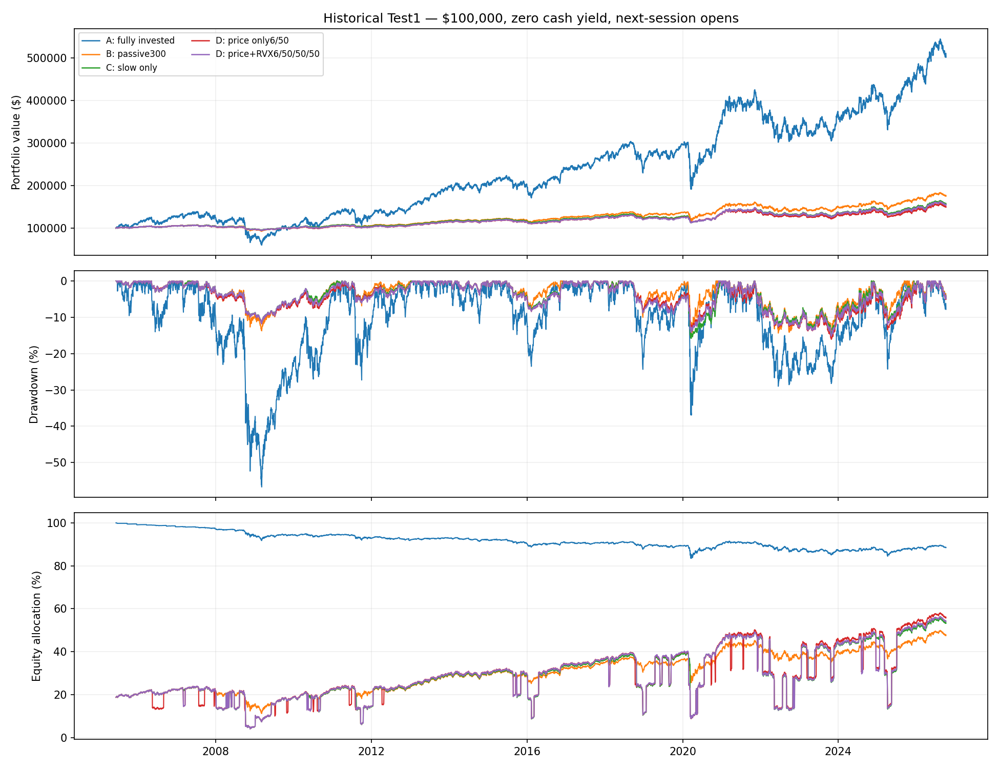
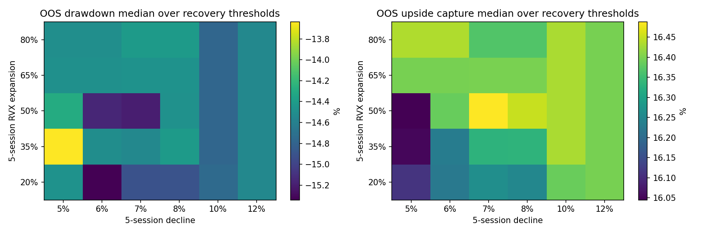
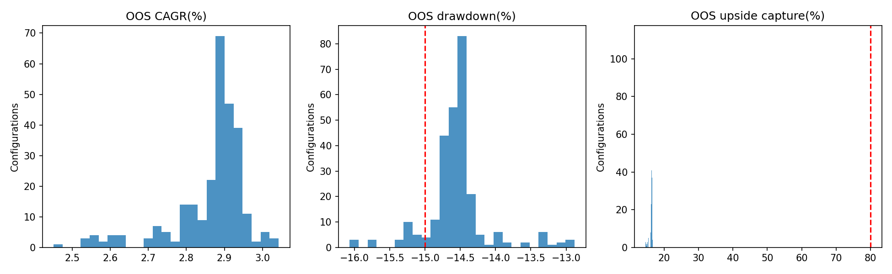
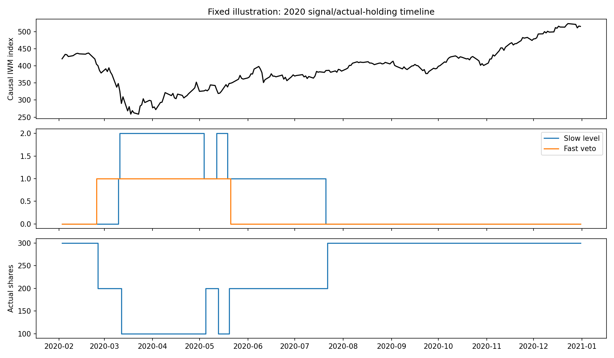

# Test 1 findings — Partial Collar Protected Growth

**Recommendation: FAIL the tested state-machine candidate against its combined protection/growth hypotheses; do not proceed automatically to Test 2.** This is a research disposition, not Principal acceptance or a verdict on every possible partial collar. Options economics are absent; no insurance-cost or guaranteed-loss claim.

## Scope and evidence

Main simulation 2005-06-10–2026-10-07; training ends 2015-12-31, later observations held out chronologically.291 baseline runs: 270 RVX-confirmed, 18 price-only, slow-only, fully invested whole-share benchmark A and passive 300-share benchmark B. Seven predeclared historical windows, 55 matched assumption sensitivities, 11 annual prior-only selections and one continuous walk-forward portfolio. No threshold was changed to favor performance; fixes before the final rerun enforced the predeclared opposite-transition cooldown and one-use Recovery 1 semantics.

Theta terminal authentication succeeded. Accessible downloads contain 841 IWM closes 2023-06-01 onward and 692 RVX closes 2024-01-02 onward. Older stress-date requests returned 403. IWM agrees with Yahoo within 0.0000146 dollars; RVX agrees exactly with FRED on matched dates. The longer main dataset is explicitly Yahoo/FRED/Cboe, not ThetaData. Raw and normalized data are local. Hashes/validation/probes are persisted. Two missing RVX closes remain absent. Data vintages and historical publication latency remain limitations. See [DATA.md](DATA.md).

## Fixed illustration and appropriate controls

The illustration was fixed before results: 6% five-session price decline, 50% five-session RVX expansion, 50% price recovery and 50% spike reversal. Initial 300 shares cost $18, 735 at the historical open, leaving about 81% cash. That allocation, not just detection, is essential to interpreting low portfolio drawdown. Cash earns 0% baseline; all comparators share execution and dividend assumptions.

| Policy | CAGR | Max portfolio DD | Monthly upside capture | Ending NAV |
|---|---:|---:|---:|---:|
|A: fully invested IWM|7.86%|-56.74%|100.00%|$502, 286|
|B: passive 300 shares|2.67%|-15.22%|27.87%|$175, 429|
|C: slow only|2.13%|-15.78%|25.38%|$156, 668|
|D: slow+price-only fast|1.91%|-16.09%|25.11%|$149, 586|
|D: slow+RVX-confirmed fast|2.05%|-15.23%|25.43%|$154, 259|

The illustration ends $21, 170 below matched passive 300-share ownership and $2, 409 below slow-only. It records 37 exits/37 re-entries, 27 opposite-sleeve reversals within 20 sessions (36.49% of tactical transactions), 22.93% of sessions below 300 shares, a longest underinvested spell of 200 sessions, and $529 modeled transaction costs. All finish with 300 shares; fixed 100-share blocks cannot increase inventory beyond 300. This test does not implement a capital-to-extra-share recycling policy.

Capture definition matters: the frozen matrix uses geometric **daily** up/down-session capture; monthly and arithmetic-daily versions are also exported. The illustration has daily upside capture 10.01%, arithmetic-daily 28.56%, monthly 25.43%. These are different statistics. Failure of the 80% hypothesis persists with all three. Monthly capture is displayed in this report to make its conventional horizon explicit.

## Chronology, plateau and walk-forward

Out of 270 confirmed candidates, **0** jointly satisfy held-out drawdown<=15% and daily upside capture>=80%; **0** pass using monthly capture instead. None beats passive 300-share ending NAV. Held-out confirmed-candidate median CAGR is 2.90%; drawdown range-16.07% to-12.88%; monthly upside capture range 30.09% to 33.75%. Neighbor joint-pass fractions are consequently 0. This is a broad failure plateau on the combined target, not a sharp winning configuration. Some candidates meet the drawdown target; near 15% is a preliminary hypothesis, not a certified capital floor.

Annual selection uses only pre-year target-distance and whipsaw scores, never maximum historical return. Separate yearly reset-account folds are not spliced into equity. The actual continuous walk-forward portfolio preserves cash/holdings and defers parameter adoption until both vetoes clear. It too fails the combined targets (see [walkforward_summary.csv](results/walkforward_summary.csv)); 2026 is a partial-year fold. All held-out data was available historically to this researcher, so this is pseudoholdout evidence, not prospective validation.

## Stress findings

| Historical window | Passive 300 DD | Slow-only DD | Confirmed-fast DD | Confirmed-fast return |
|---|---:|---:|---:|---:|
|grinding_2008|-13.75%|-11.71%|-11.76%|-8.26%|
|crash_2020|-15.00%|-12.36%|-10.55%|-6.25%|
|v_recovery_2020|-11.80%|-8.82%|-7.22%|11.18%|
|chop_2014_16|-8.01%|-8.05%|-8.41%|3.42%|
|bull_2017|-2.15%|-2.22%|-2.26%|4.90%|
|grinding_2022|-11.64%|-9.08%|-9.15%|-8.05%|
|bull_2023_24|-7.17%|-7.80%|-7.86%|9.11%|

**Sudden crash:** February 2020 activates fast A on 2020-02-25, executes 2020-02-26, before a slow restriction. Already-incurred five-session decline is-6.70%; next-open price is-6.26% below the precrash raw close. This is loss reduction after a trigger, not protection against the initial gap. The fast engine improves the 2020 crash-window DD over slow-only but cannot guarantee<=15% in arbitrary paths; the synthetic gap test proves a counterexample.

**V recovery:** confirmed-fast 2020 recovery-window return is 11.18%, versus 11.85% passive 300 and 31.16% fully invested. Recovery avoids some downside but still misses upside; five-session velocity/RVX anchoring is not a free exit-and-re-entry advantage. No future bottom/peak is used. The strategy restores 300 shares but does not generate extra shares.

**Grinding bears:**2008 window improves matched passive DD, but gains little terminal-return advantage and incurs 7 exits/7 restorations. 2022 improves DD with five exits/four re-entries and remains underinvested for 92.8% of sessions. A bounce above SMA 50 does not establish secular recovery: Recovery 1 may restore B while still below SMA 200. Fresh rearmed bear conditions can recur; deterministic priority cannot make an inaccurate regime classification accurate.

**Chop/bulls:**2014–16 confirmed-fast DD is worse than matched passive 300 (8.41% versus 8.01%) and return falls to 3.42% versus 6.22%. 2017 creates no tactical transactions and stays at 300 shares, yet cash drag remains. 2023–24 adds four exits/four re-entries and trails passive 3009.11% versus 10.99%. Window returns are measured on continuing portfolios with different incoming NAV; identical share holdings can have different percentage returns because earlier damage changes the denominator. Do not interpret those as matched fresh-account alpha.

## What RVX confirmation adds

Matched comparisons pair each of 270 RVX configurations to its corresponding price threshold/recovery among 18 price-only configurations (many-to-one; not 270 independent controls). Held-out median CAGR difference is+0.124 percentage points; drawdown improvement median+0.045 percentage points, but the range includes material deterioration as well as improvement. Confirmation generally removes exits/whipsaws; it does not create the missing upside-capture plateau. Higher confirmation thresholds sometimes suppress crash detection entirely. Examine [volatility_paired.csv](results/volatility_paired.csv), rather than selecting the one best comparison.

## Assumption and starting-allocation dependence

For the fixed illustration, removing all trading friction raises ending NAV only from $154, 259 to $154, 787, still below passive 300.20 bp adverse slippage lowers it to $152, 750. Persistent-bear priority increases reversals 27->38; one-block Recovery 2 and dividend-payment delays do not change baseline outcomes because those rules do not bind materially here. Fast 1/3-close confirmation changes results modestly. None establishes joint success.

Constant cash yield 2%/4% materially changes results: CAGR 3.24%/4.62%, DD 9.85%/6.75%. Those are assumption sensitivities with equally remunerated comparators, not historical realized yields or tactical-engine profits. Long-term reserve return cannot be ignored.

After seeing the primary result, a **diagnostic**, non-selection starting-cohort check used regular five-year starts 2005/2010/2015/2020/2025 for the fixed illustration and controls. Initial equity varies 18.7%–66.9%; monthly upside capture 25.4%–58.6%, all below 80%. 2020-start DD reaches 18.38%. This shows substantial allocation/start dependence. The 2005 conclusion cannot be transplanted to today's much larger 300-share notional. These additional diagnostics do not authorize changing capital/sleeve sizing or selecting a favorable start.

## Verification and unresolved boundaries

22 focused automated tests pass. Independent executed-trade replay passes across 347 persisted runs, 1, 858, 996 daily states and 22, 265 executed/denied transaction records; maximum NAV discrepancy 0.000880 dollars is CSV rounding. Runtime invariants prohibit negative cash, partial tactical blocks and core liquidation; no historical cash denial occurs, so denial behavior is established by targeted synthetic tests. Prefix perturbation verifies past indicators/states/trades do not change when future prices change. Synthetic tests are mechanics evidence, never historical performance.

Still unresolved: issuer-level historical distribution/payment-date audit, truly point-in-time vintage/timestamp validation, realistic historical cash yield, taxes, split-resizing policy before June 2005, and acceptance of provisional hysteresis/conflict rules. Core put/call economics, approval permissions, call-away restoration, call defense and 1% insurance overhead all belong to later tests and remain unevaluated. No live execution is proposed.

**Decision implication:** do not tune fast thresholds to rescue the observed deficit, and do not run a secondary slow-threshold optimization now. The supplied 300-share policy fails to establish the intended growth/protection combination; allocation/cash treatment and restoration semantics need review at the policy level before more modeling. This does not authorize a replacement strategy or Test 2.

## Artifact links

[Matrix](results/parameter_matrix.csv) · [Historical regimes](results/regime_matrix.csv) · [Sensitivities](results/sensitivities.csv) · [Neighbor robustness](results/neighbor_robustness.csv) · [Starting cohorts](results/start_date_diagnostics.csv) · [Accounting audit](results/accounting_audit.json) · [Frozen method](METHOD.md) · [Reproduction](README.md)

